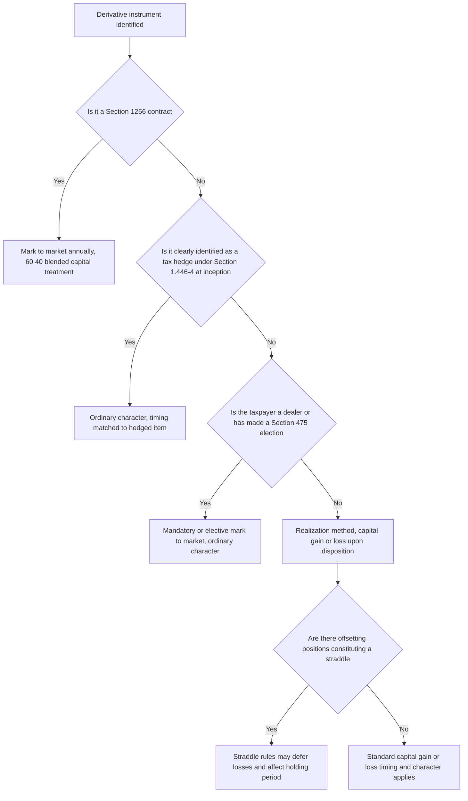

## Tax Treatment of Derivative Instruments

### Overview

The tax treatment of derivative instruments in the United States is governed by a patchwork of statutory provisions, regulations, and case law that often diverges significantly from the financial accounting (GAAP/IFRS) treatment of the same instruments. Key questions include: **when** a gain or loss is recognized (timing), **what character** it takes (ordinary income/loss versus capital gain/loss), and whether special regimes such as **Section 1256 mark-to-market treatment**, the **straddle rules**, or **hedge accounting elections under Section 1221/1.446-4** apply. Because tax character and timing directly affect after-tax returns, derivatives tax treatment is a first-order consideration in structuring, trading, and hedging decisions.

---

### General Timing Principles: Realization vs. Mark-to-Market

**Key Points**

- The **default US tax rule** for most financial instruments (including most OTC derivatives) is the **realization method**: gain or loss is recognized only upon a **taxable event** — typically disposition, termination, expiration, or exercise of the contract — not merely from periodic fair value fluctuations, in contrast to GAAP's mark-to-market financial accounting treatment.
- This creates a structural **book-tax difference**: an entity may recognize substantial fair value gains or losses on its financial statements each period while recognizing no taxable gain or loss until the derivative position is actually closed out.
- Certain categories of instruments are subject to **mandatory mark-to-market tax treatment**, most notably under **Section 1256** of the Internal Revenue Code, which overrides the general realization principle for specified contract types.

---

### Section 1256 Contracts

**Key Points**

- **Section 1256 contracts** include regulated futures contracts, foreign currency contracts (meeting specific criteria), non-equity options, dealer equity options, and dealer securities futures contracts.
- Section 1256 contracts are **marked to market for tax purposes at each year-end**, regardless of whether the position has been closed, meaning unrealized gains and losses are taxed annually even absent an actual sale or termination.
- Gain or loss on Section 1256 contracts receives **60/40 blended capital gain treatment**: 60% is treated as long-term capital gain/loss and 40% as short-term capital gain/loss, **regardless of the actual holding period** — a significant and distinctive tax preference relative to ordinary securities, where long-term treatment normally requires a holding period exceeding one year.
- This blended rate treatment makes Section 1256 contracts (notably exchange-traded futures and broad-based index options) tax-advantaged relative to economically similar OTC or single-stock alternatives for many taxpayers, particularly high-frequency traders who would otherwise generate entirely short-term gains.

---

### The Straddle Rules (Section 1092)

**Key Points**

- The **straddle rules** under Section 1092 apply when a taxpayer holds **offsetting positions** with respect to personal property (which includes most derivatives and the underlying assets they reference), where the positions substantially diminish the risk of loss from holding either position.
- Core purpose: to prevent taxpayers from **selectively recognizing losses** on one leg of an economically hedged position (to accelerate a tax deduction) while **deferring gains** on the offsetting leg (to defer taxable income) — a form of tax-motivated "cherry-picking."
- Key mechanical effects of straddle treatment:
  - **Loss deferral**: a loss on one leg of a straddle is generally **deferred** (not currently deductible) to the extent of unrecognized gain in the offsetting position(s).
  - **Holding period rules**: the holding period of a straddle position can be affected, potentially preventing long-term capital gain treatment that would otherwise apply.
  - **Wash sale-like interaction**: straddle rules interact with, but are distinct from, the separate wash sale rules under Section 1091.
- **Identified straddles** and certain **hedging transactions** (see below) can be exempted from some straddle rule consequences if specific identification and documentation requirements are satisfied at the time the position is established.

---

### Tax Hedging Elections (Section 1.446-4 and Section 1221)

**Key Points**

- A derivative used for genuine risk management can qualify for **tax hedge accounting** under Treasury Regulation Section 1.446-4, which — analogous in spirit to financial accounting hedge accounting, though governed by entirely separate rules — allows the timing of gain/loss recognition on a qualifying hedge to be **matched** with the timing of the item being hedged, rather than following the derivative's own independent timing rules.
- To qualify, a hedging transaction must generally be **clearly identified as a hedge** in the taxpayer's books and records **on or before the date the hedge is entered into** — a strict, contemporaneous identification requirement analogous to (but legally distinct from) financial accounting hedge documentation requirements.
- **Section 1221(a)(7)** defines a "hedging transaction" for tax purposes as a transaction entered into in the normal course of business primarily to manage risk of price changes, currency fluctuations, or interest rate/price changes with respect to ordinary property, borrowings, or ordinary obligations — and importantly, gain or loss from a **properly identified hedging transaction is treated as ordinary**, not capital, income or loss.
- This ordinary-character treatment is significant: without a qualifying hedge identification, gain/loss on a derivative might otherwise be characterized as capital gain/loss (with different rate treatment and loss-utilization limitations, since capital losses are generally only deductible against capital gains, subject to limited exceptions), whereas properly identified hedges avoid this character mismatch with the ordinary-income-generating item being hedged.
- **Failure to timely and properly identify** a hedge for tax purposes generally **cannot be cured retroactively** — a common and consequential practical trap distinct from financial accounting, where late hedge documentation similarly disqualifies hedge accounting but the underlying instrument still typically resides in the same broad character/timing regime either way.

---

### Character of Gain or Loss: Capital vs. Ordinary

**Key Points**

- Absent a qualifying tax hedge identification, whether derivative gain/loss is capital or ordinary depends on the specific instrument type, the taxpayer's status (dealer vs. investor vs. trader), and the nature of the underlying:
  - Most non-Section 1256 derivatives held by **investors** generally produce **capital gain/loss** upon disposition.
  - **Dealers in securities or commodities** (as defined under Section 475) are subject to **mandatory mark-to-market treatment with ordinary character**, a significantly different regime from the realization-based capital treatment applicable to investors.
  - Section 1256 contracts receive the blended 60/40 capital treatment described above, regardless of dealer/investor status distinctions that would otherwise apply.
- **Section 475 mark-to-market elections** are available to certain qualifying traders (not just dealers) who make a timely election, converting what would otherwise be capital gain/loss (with limitations on capital loss utilization) into ordinary gain/loss marked to market annually — a significant, elective departure from the realization method default, requiring careful cost-benefit analysis given its irrevocability absent IRS consent.

---

### Tax Treatment Decision Framework

---

### Additional Complexities: Notional Principal Contracts and Constructive Sales

**Key Points**

- **Notional principal contracts (NPCs)** — a tax-specific category that includes most interest rate swaps and similar instruments — have their own detailed timing rules under Treasury regulations, generally requiring **periodic (often annual) inclusion of net income or deduction of net expense** based on the swap's periodic payments, with a separate framework for "nonperiodic payments" (e.g., an upfront payment on an off-market swap) that must be appropriately allocated over the contract's term rather than recognized entirely at inception.
- The **constructive sale rules (Section 1259)** treat certain derivative or hedging transactions that effectively eliminate substantially all of the risk of loss and opportunity for gain on an appreciated financial position (e.g., a short sale against the box, certain forward contracts, or notional principal contracts referencing the same or substantially identical property) as if the underlying appreciated position had been **sold**, triggering immediate gain recognition — a targeted anti-abuse rule aimed at preventing indefinite deferral of built-in gains via derivative overlay strategies.
- **Wash sale rules (Section 1091)**, while conceptually distinct from the straddle rules, can also interact with derivative positions where an investor sells a security at a loss and, within the 30-day window before or after, acquires a substantially identical position (including via certain derivative instruments), disallowing the loss deduction.

---

### Cross-Border and Withholding Considerations

**Key Points**

- Certain derivative payments to non-US persons can trigger US **withholding tax** obligations, particularly under rules targeting **dividend-equivalent payments** on equity-linked derivatives referencing US equities (Section 871(m)), which extend withholding tax treatment to certain swaps, options, and other instruments that replicate the economics of holding US equity and receiving dividends, specifically to prevent withholding tax avoidance via derivative substitution for direct equity ownership.
- These cross-border withholding rules interact with, but are analytically distinct from, the broader extraterritoriality and cross-border regulatory overlap considerations discussed elsewhere in this course, since tax withholding obligations follow their own statutory and treaty-based framework separate from prudential/market regulation.

---

### Practical Pitfalls

- **Assuming GAAP hedge accounting qualification implies tax hedge qualification**: financial accounting hedge designation under ASC 815 and tax hedge identification under Section 1.446-4 are **entirely separate regimes** with different qualifying criteria, different documentation timing requirements, and different consequences — satisfying one does not automatically satisfy the other, and both should be independently assessed and documented for any hedging transaction.
- **Missing the contemporaneous tax hedge identification deadline**: because tax hedge identification generally cannot be made or perfected after the hedge is entered into, a delay in tax documentation (even by a short period) can permanently forfeit ordinary character/matched-timing treatment for that transaction.
- **Overlooking straddle rule application to seemingly unrelated positions**: because the straddle rules apply based on economic offsetting relationships rather than formal hedge designation, positions that a taxpayer does not consider a "hedge" in business terms can nonetheless trigger straddle rule loss deferral if they substantially reduce risk with respect to another held position.
- **Failing to distinguish Section 1256 eligibility precisely**: the specific contract types qualifying for Section 1256 treatment are statutorily defined and do not automatically extend to economically similar but technically different instruments (e.g., certain OTC-cleared derivatives may or may not qualify depending on precise structuring), making eligibility a fact-specific determination rather than a broad category assumption.

---

**Next Steps**

- Section 1256 Contracts and the 60/40 Blended Capital Gain Rule
- Section 1092 Straddle Rules and Loss Deferral Mechanics
- Tax Hedge Identification Under Section 1.446-4 and Section 1221
- Notional Principal Contract Taxation and Nonperiodic Payment Allocation
- Section 871(m) Dividend-Equivalent Withholding on Equity Derivatives
- Section 475 Mark-to-Market Elections for Traders and Dealers