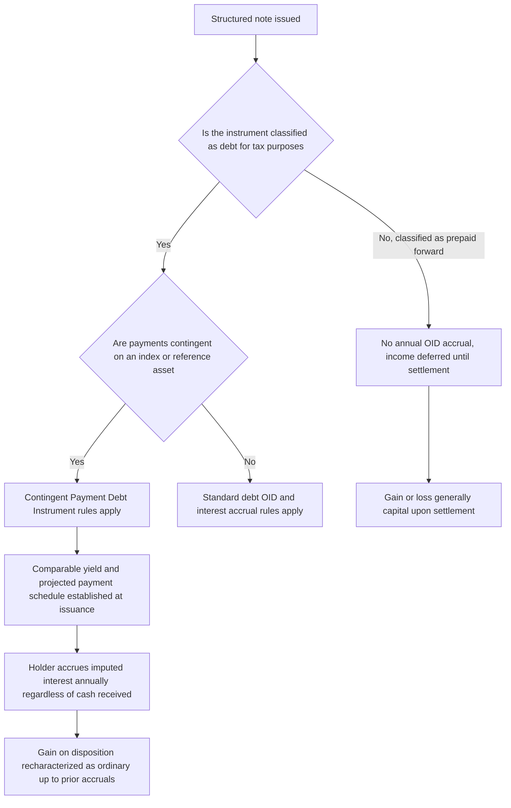

## Structured Product Tax Considerations

### Overview

Structured products — hybrid instruments combining a debt or note wrapper with embedded derivative-linked payoffs (equity, rate, commodity, FX, or credit-linked) — present some of the most complex tax questions in derivatives taxation, because their tax character often does not follow neatly from either pure debt tax rules or pure derivative tax rules. Key structured-product-specific regimes include the **Contingent Payment Debt Instrument (CPDI)** rules, the treatment of **prepaid forward contracts** (notably Prepaid Variable Forwards and structured notes with no periodic coupon), and ongoing IRS scrutiny of structured products designed to convert ordinary income into capital gain or to defer income recognition.

---

### Why Structured Products Raise Distinctive Tax Issues

**Key Points**

- A structured note is a **single legal instrument** for most purposes but combines economically distinct components (a debt-like return of principal, plus a derivative-like contingent payoff) — tax law must characterize the **entire instrument** (unlike financial accounting, which may bifurcate embedded derivatives into separate accounting units; see related topic).
- The central tax questions for any structured note are:
  1. Is the instrument classified as **debt** for tax purposes, or as some other instrument type (a forward contract, a derivative, an ownership interest)?
  2. If classified as debt, does it constitute a **Contingent Payment Debt Instrument (CPDI)**, triggering specific timing and character rules?
  3. What is the **character** (ordinary vs. capital) of gain or loss upon sale, redemption, or maturity?
  4. Is any **original issue discount (OID)** or imputed interest required to be accrued and taxed **currently**, even absent any cash payment to the holder?

---

### Contingent Payment Debt Instruments (CPDI)

**Key Points**

- Many structured notes that are legally structured as debt (with a stated principal amount and a promise to repay, even if the ultimate payment is contingent on an index or reference asset) fall under the **Contingent Payment Debt Instrument regulations** (Treasury Regulation Section 1.1275-4), which apply the **"noncontingent bond method."**
- Under the noncontingent bond method:
  - The issuer establishes a **comparable yield** (the rate at which the issuer could issue a comparable fixed-rate, non-contingent debt instrument) and a **projected payment schedule** for the contingent note at issuance.
  - Holders are required to accrue and include in taxable income **imputed interest based on the comparable yield each year**, regardless of whether any cash is actually paid or received during that year — a critical and often counterintuitive result: **holders may owe tax on phantom income** from a note that pays no current coupon and may ultimately return less than the imputed accrued amount.
  - Upon sale, exchange, or maturity, gain is generally recharacterized: gain **up to the amount of previously accrued but unpaid interest** is treated as **ordinary income**, and only the excess (if any) is treated as capital gain — meaning even a note with an equity-like payoff can produce **ordinary income treatment** on a substantial portion of total gain, contrary to the capital-gain intuition many investors bring to equity-linked products.
  - **Losses** on CPDI-classified instruments are generally treated as **ordinary losses** to the extent of prior interest inclusions, then capital loss for any excess — an asymmetry relative to typical capital asset treatment that can meaningfully affect after-tax outcomes, especially for structures with significant downside exposure.
- This "phantom income" and ordinary-income-on-sale treatment is one of the single most important, and frequently underappreciated, tax features of CPDI-classified structured notes, and is a central driver of after-tax return differences between structured notes and other equity or rate-linked exposures.

---

### Prepaid Forward Contracts and Prepaid Variable Forward-Style Notes

**Key Points**

- Some structured products are designed and documented to be treated **not as debt** but as a **prepaid forward contract** — an instrument where the investor pays an amount upfront in exchange for a promise to deliver a variable amount of property (often shares or cash equivalent to a formula tied to an underlying) at a future date, without any contractual promise of repayment of a stated principal amount.
- If successfully characterized as a prepaid forward rather than debt:
  - There is generally **no annual OID/imputed interest accrual** — income/gain is deferred until the forward settles or is disposed of, in contrast to the CPDI "phantom income" problem.
  - Gain or loss upon settlement is generally treated as **capital gain or loss** (assuming the underlying referenced property would itself generate capital gain/loss in the holder's hands), rather than the ordinary-income-tainted treatment that can arise under CPDI rules.
- This debt-versus-prepaid-forward classification question has been the subject of **significant IRS scrutiny and litigation** over the years, since the choice of legal form (with associated differences in deferral and character) can produce materially different after-tax outcomes for economically similar payoffs — issuers and tax counsel devote considerable attention to structuring documentation to support the intended classification, and the line between the two categories is a fact-intensive, multi-factor analysis rather than a bright-line test. [Inference: because this remains an area of evolving case law and IRS guidance, the specific factors currently given greatest weight by courts and the IRS should be confirmed against the most recent authority for any new issuance.]

---

### Structured Product Tax Classification Framework

---

### Original Issue Discount (OID) on Conventional Structured Debt

**Key Points**

- Even structured notes **not** subject to the full CPDI regime (e.g., notes with a fixed minimum return and a smaller contingent upside component that may not trigger CPDI classification) can still generate **OID** if issued at a discount to their stated redemption price, requiring holders to accrue and recognize OID income over the note's term regardless of cash payment timing — a general debt tax principle that predates and operates alongside the CPDI-specific rules.
- **Market discount and premium** rules can also apply to secondary-market purchasers of structured notes, adding a further layer of holder-specific tax accounting complexity distinct from the issuer's original CPDI/OID analysis at issuance.

---

### Issuer-Side Tax Considerations

**Key Points**

- Issuers of CPDI-classified structured notes generally receive a **corresponding interest deduction** for the imputed comparable-yield interest accrued each year, mirroring the holder's income inclusion — creating a matched, though not necessarily cash-flow-matched, deduction and inclusion pattern.
- Issuers must perform (and disclose to holders, typically via tax reporting statements) the **comparable yield and projected payment schedule** computation at issuance, which requires careful methodology given the significant downstream tax consequences for both issuer deductions and holder inclusions.
- **Hedging the issuer's exposure** to the embedded derivative feature (e.g., via the issuer's trading desk executing an offsetting derivative position) raises its own tax hedge identification considerations (see related topic on tax treatment of derivative instruments), which must be analyzed separately from, though in coordination with, the CPDI classification of the note itself.

---

### Character Conversion Scrutiny

**Key Points**

- Certain structured product designs (particularly those historically involving forward-like or option-like features on baskets of securities) have drawn specific IRS attention where the structure appeared designed primarily to **convert what would otherwise be ordinary income (e.g., dividend income, short-term trading gains) into long-term capital gain**, or to defer income recognition beyond what a direct investment in the underlying would achieve.
- The IRS has issued specific guidance and, in some cases, pursued enforcement action targeting structures viewed as engineered primarily for this purpose, reinforcing that the **economic substance and business purpose** of a structured product's design — not merely its legal form — remains relevant to its ultimate tax treatment, particularly under anti-abuse and substance-over-form doctrines that can override otherwise technically defensible structuring.

---

### Practical Implications for Structuring and Investing

**Key Points**

- **Issuers** designing new structured note programs must decide early whether a given payoff profile is intended to achieve debt/CPDI classification or prepaid-forward classification, since this decision drives fundamentally different tax disclosure, holder reporting (e.g., OID reporting on Form 1099-OID for CPDI notes), and marketing considerations.
- **Investors** evaluating structured notes should specifically look for tax disclosure describing whether the note is treated as a CPDI (with associated phantom income and potential ordinary-income-on-sale treatment) or as a prepaid forward (with deferred, generally capital-character treatment), since this materially affects after-tax return relative to the note's stated or illustrated pre-tax payoff.
- **Tax-exempt and tax-deferred account holders** (e.g., retirement accounts) are less directly affected by the phantom income timing issue (since current-period taxability is generally not a concern within such accounts), which is one reason structured notes with CPDI features are sometimes marketed preferentially toward such account types.

---

### Practical Pitfalls

- **Assuming a note's marketed "equity-like" or "capital gain" payoff automatically receives capital gain tax treatment**: CPDI classification can result in substantial ordinary income treatment on both annual accruals and ultimate gain upon disposition, materially diverging from an investor's initial expectation based on the note's economic payoff description alone.
- **Overlooking phantom income cash flow mismatches**: a CPDI holder can owe current tax on imputed interest income despite receiving no cash distribution during the relevant year, creating a cash-flow planning issue that is easy to overlook without careful review of the note's tax disclosure.
- **Treating debt-versus-prepaid-forward classification as a settled, low-risk determination**: given the fact-intensive nature of this classification question and its history of IRS scrutiny, structuring desks and investors should not assume a favorable classification is free from challenge risk, particularly for more aggressively engineered structures.
- **Neglecting issuer-side hedge documentation coordination**: because the note's CPDI/tax classification and the issuer's internal hedge tax identification are separate analyses, failing to coordinate them can create inconsistent or suboptimal tax outcomes across the issuer's overall structured product program.

---

**Next Steps**

- Contingent Payment Debt Instrument (CPDI) Comparable Yield Methodology
- Prepaid Forward Contracts and the Debt-vs-Forward Classification Analysis
- Original Issue Discount (OID) and Market Discount Rules for Structured Debt
- Tax Treatment of Derivative Instruments (Section 1256, Straddles, Hedge Identification)
- Embedded Derivatives and Bifurcation (Financial Accounting Perspective)
- IRS Anti-Abuse Doctrines and Character Conversion Scrutiny in Structured Finance