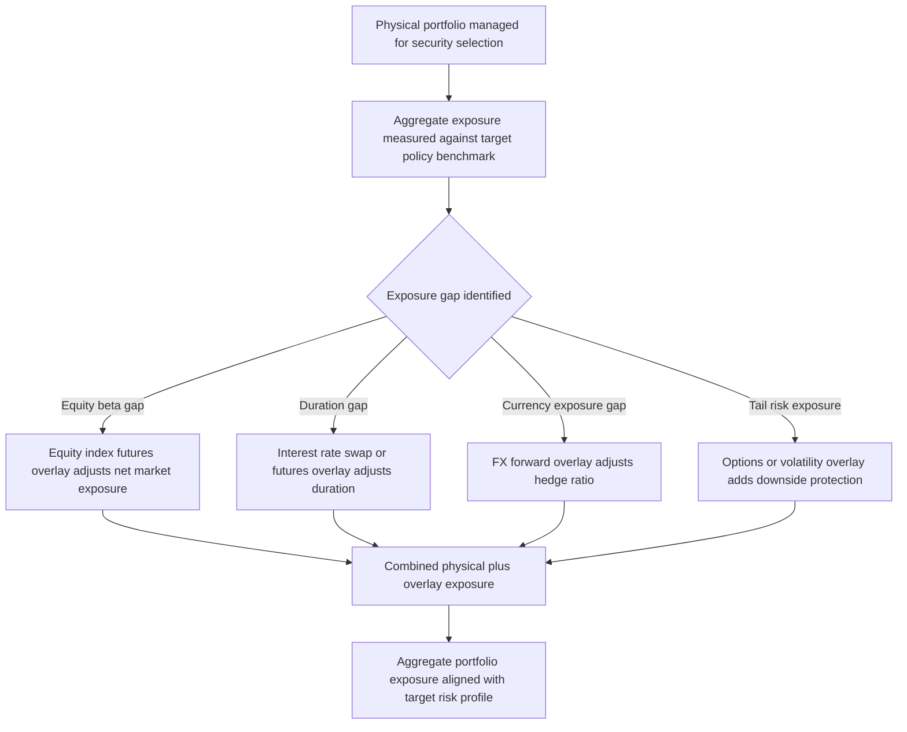

## Portfolio Overlay Strategies

### Overview

A portfolio overlay strategy uses derivatives to adjust a portfolio's risk exposures — market beta, duration, currency, or specific factor tilts — without transacting in the underlying physical assets. The overlay is applied "on top of" an existing physical portfolio, allowing a manager to modify exposures quickly, cost-effectively, and often with less market impact than buying or selling the underlying securities directly. Overlay strategies are widely used by pension funds, insurance companies, and asset managers to manage risk, implement tactical views, or achieve specific mandate objectives (e.g., currency hedging, duration targeting) separately from the underlying security selection process.

---

### Core Rationale for Using Overlays

**Key Points**

- **Separation of alpha and beta/risk management**: overlays allow the underlying physical portfolio (managed for security selection, "alpha") to remain untouched while a separate overlay manager or process adjusts aggregate risk exposures — avoiding the need to disrupt a carefully constructed physical portfolio to achieve a risk management objective.
- **Capital and transaction cost efficiency**: derivatives typically require far less capital outlay (initial margin rather than full notional) than an equivalent physical position, and often carry lower transaction costs and market impact, particularly for large or illiquid underlying exposures.
- **Speed and flexibility**: derivative overlays can be implemented and unwound quickly, which is valuable for tactical, time-sensitive risk adjustments (e.g., temporarily hedging equity beta ahead of an anticipated volatile event) without needing to liquidate physical holdings.
- **Precision**: overlays allow highly targeted exposure adjustments (e.g., hedging only the currency risk of a foreign bond portfolio, leaving the underlying bond selection unchanged) that would be operationally cumbersome to achieve through physical transactions alone.

---

### Common Overlay Strategy Types

#### Equity Beta / Market Exposure Overlays

**Key Points**

- **Equity index futures overlays**: used to adjust a portfolio's overall equity market exposure up or down without trading individual stocks — a manager wanting to reduce equity beta temporarily can sell index futures against the physical equity portfolio, synthetically reducing net exposure while retaining the underlying stock positions (and any associated tax lots, voting rights, or dividend entitlements).
- **Completion overlays**: used by funds with multiple underlying managers or asset classes to correct for aggregate exposure drift — e.g., if the sum of individual managers' actual sector or factor exposures deviates from a target policy benchmark, an overlay manager uses futures or swaps to bring the *aggregate* fund exposure back in line with target, without instructing any individual underlying manager to trade.
- **Cash equitization**: a common overlay application where a fund holds temporary cash balances (from redemptions pending reinvestment, contribution inflows, etc.) and uses equity index futures to synthetically maintain full market exposure on that cash, avoiding "cash drag" relative to the fund's benchmark while physical reinvestment decisions are being made.

#### Duration and Interest Rate Overlays

**Key Points**

- **Interest rate futures or swap overlays**: used by fixed income and liability-driven investment (LDI) portfolios to adjust aggregate portfolio duration without trading individual bonds — particularly valuable for pension funds seeking to manage the duration gap between assets and liabilities.
- **Liability-Driven Investment (LDI) overlays**: pension funds commonly use interest rate swap and swaption overlays to hedge the interest rate (and sometimes inflation) sensitivity of their liabilities, allowing the physical asset portfolio to remain invested according to a return-seeking mandate while the overlay separately manages the asset-liability duration/inflation matching objective.
- **Yield curve overlays**: more targeted strategies using a combination of instruments at different points on the curve to adjust not just overall duration but the portfolio's exposure to specific segments of curve movement (steepening, flattening, parallel shift).

#### Currency Overlays

**Key Points**

- **Passive currency hedging overlays**: systematically hedge some or all of the foreign currency exposure arising from holding foreign-currency-denominated assets, typically using FX forwards rolled periodically, to reduce (though rarely eliminate entirely, given imperfect hedge ratios and NAV fluctuations) currency-driven return volatility.
- **Active/dynamic currency overlays**: adjust hedge ratios tactically based on currency views, valuation signals, or risk-management triggers, rather than maintaining a static hedge ratio — effectively adding an active currency management layer distinct from the underlying asset allocation decisions.
- **Currency overlay mandates are frequently outsourced** to specialist overlay managers, since currency hedging expertise and execution infrastructure (FX forward rolling, NAV-based rebalancing) is a distinct skill set from the underlying asset management mandate.

#### Volatility and Tail Risk Overlays

**Key Points**

- **Protective put/collar overlays**: using purchased put options (or zero-cost collars combining a purchased put with a sold call) on a broad equity index to limit downside risk on a physical equity portfolio while retaining some or most upside participation, at the cost of option premium (or upside cap, in the collar case).
- **VIX or volatility futures overlays**: some funds use volatility index futures or options as a portfolio-level tail-risk hedge, since equity volatility tends to spike sharply during equity market drawdowns, providing a potentially convex hedge against acute equity stress.
- **Systematic/rules-based tail hedging programs**: programmatic approaches that maintain an ongoing (rather than discretionary/tactical) allocation to out-of-the-money put protection or volatility exposure, accepting a persistent cost (often referred to as a hedging "drag" or "premium bleed") in exchange for convex protection during tail events.

---

### Portfolio Overlay Structure

---

### Implementation Considerations

**Key Points**

- **Instrument selection**: exchange-traded futures are typically preferred for liquidity, transparency, and lower counterparty risk in standard beta/duration overlays, while OTC instruments (swaps, forwards, options) are used where more customized notional, maturity, or payoff structuring is required (e.g., matching a specific liability cash flow profile in an LDI overlay).
- **Collateral and margin management**: overlay strategies require active management of margin (initial and variation) for exchange-traded instruments, and collateral posting under CSA terms for OTC instruments — since overlays are explicitly designed to use leverage-like capital efficiency, robust liquidity and collateral management processes are essential to avoid forced unwinds during periods of adverse mark-to-market movement.
- **Basis risk**: the overlay instrument (e.g., a broad equity index future) may not perfectly match the risk characteristics of the underlying physical portfolio (e.g., an actively managed equity portfolio with sector tilts away from the index), creating residual basis risk that the overlay does not fully hedge as intended.
- **Rebalancing frequency and triggers**: overlay programs require clearly defined rebalancing rules (calendar-based, threshold-based, or a combination) to determine when overlay positions are adjusted in response to changes in the physical portfolio, market movements, or drift in hedge ratios.
- **Governance and mandate clarity**: because overlay management is often delegated to a specialist manager or a separate internal team distinct from the underlying asset managers, clear governance around overlay objectives, permitted instruments, risk limits, and reporting is essential to avoid unintended interactions between the overlay and underlying portfolio decisions.

---

### Risk Considerations Specific to Overlays

**Key Points**

- **Leverage and notional exposure risk**: because overlays achieve exposure adjustment with a fraction of the capital of an equivalent physical position, the *notional* exposure being managed can be very large relative to the capital actually posted as margin/collateral, requiring careful monitoring of gross notional exposure and stress-tested liquidity needs, not just posted margin.
- **Counterparty risk (OTC overlays)**: swap and forward-based overlays introduce counterparty credit risk that a purely physical portfolio would not carry, requiring appropriate counterparty diversification, collateralization (CSA terms), and, where applicable, central clearing.
- **Liquidity risk in stressed markets**: overlay positions, particularly those requiring variation margin posting, can generate unexpected liquidity demands precisely during periods of market stress when the overlay is providing its intended protective benefit — a well-documented risk highlighted by episodes such as the UK LDI market stress of 2022, where rapid gilt yield moves generated margin calls on pension fund interest rate overlay positions that some schemes struggled to meet without forced asset sales.
- **Model and hedge ratio risk**: for dynamic or tail-risk overlays relying on model-driven signals (e.g., dynamic currency hedge ratios, systematic volatility triggers), the overlay's effectiveness depends on the underlying model's continued validity, and model risk should be assessed and monitored distinctly from the market risk being hedged.

---

### Practical Pitfalls

- **Underestimating notional exposure relative to posted margin**: because overlays are capital-efficient by design, it is easy to lose sight of the true gross notional risk being managed, particularly when overlay programs grow over time without a corresponding increase in oversight of aggregate notional limits.
- **Ignoring basis risk between overlay instrument and underlying exposure**: assuming a broad market overlay perfectly offsets a differentiated or actively managed physical portfolio's risk can lead to unexpected residual exposure, especially during periods of significant style, sector, or factor dispersion.
- **Inadequate liquidity planning for variation margin calls**: as illustrated by LDI-related stress episodes, overlay programs (particularly leveraged interest rate overlays) can generate large, rapid margin calls in stressed markets; insufficient liquid asset buffers to meet these calls can force disorderly, value-destructive asset sales at the worst possible time.
- **Treating overlay and underlying portfolio management as fully independent silos**: while overlays are designed to operate somewhat independently of underlying security selection, a complete lack of coordination or communication between overlay and underlying managers can result in unintended aggregate exposure outcomes that neither team fully anticipated.

---

**Next Steps**

- Liability-Driven Investment (LDI) and the 2022 UK Gilt Market Stress Episode
- Currency Overlay Management: Passive vs. Dynamic Hedge Ratios
- Tail Risk Hedging and Systematic Options-Based Protection Programs
- Margin and Collateral Management for Derivative Overlay Programs
- Completion Overlays and Multi-Manager Exposure Reconciliation
- Basis Risk in Index-Based Hedging Strategies