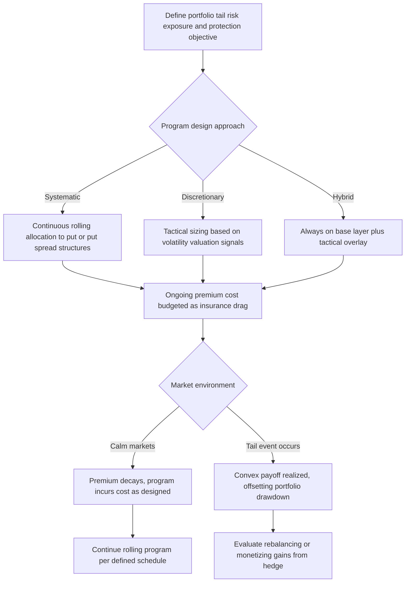

## Tail Risk Hedging Programs

### Overview

A tail risk hedging program is a systematic or discretionary strategy that uses derivatives — primarily options, variance/volatility instruments, and occasionally credit or dispersion-linked structures — to protect a portfolio against large, infrequent market drawdowns ("tail events"). Unlike routine portfolio hedging or overlay strategies aimed at managing everyday volatility, tail risk programs are specifically designed to provide **convex payoffs**: relatively small, controlled costs during normal market conditions in exchange for outsized protective payoffs during severe, low-probability market dislocations.

---

### Why Tail Risk Hedging Is Distinct from Conventional Hedging

**Key Points**

- Conventional portfolio hedging (e.g., a beta overlay reducing equity exposure via futures) provides **linear** protection — losses avoided scale roughly proportionally with the hedge ratio, regardless of the magnitude of the market move.
- Tail risk hedging specifically targets **convexity**: instruments (typically deep out-of-the-money options) that pay off disproportionately more as the magnitude of an adverse move increases, reflecting the empirical observation that asset returns exhibit **fat tails** (a higher frequency of extreme moves than a normal distribution would predict) and that **correlations tend to spike toward 1** during systemic crises, reducing the effectiveness of conventional diversification precisely when protection is needed most.
- The core motivation is that traditional diversification (across asset classes, geographies, or strategies) often **fails during genuine tail events**, when previously uncorrelated assets move together in a "flight to quality" or systemic liquidation dynamic — tail risk hedging is designed to provide protection specifically in the scenarios where diversification is least reliable.

---

### Common Instrument Types Used in Tail Risk Programs

**Key Points**

- **Out-of-the-money put options** on broad equity indices: the most straightforward and widely used tail hedge, providing convex payoff as the index falls below the strike, with cost (premium) that increases with the level of protection (strike proximity to spot) and the volatility skew embedded in the option market.
- **Put spread collars**: combining a purchased put with a sold, further out-of-the-money put (reducing cost but capping the maximum payoff) and/or a sold call (funding some or all of the put premium, at the cost of capping upside participation) — used to manage the often substantial ongoing cost ("premium bleed") of continuous put protection.
- **VIX futures and options**: volatility itself tends to spike sharply during equity drawdowns (the well-documented negative correlation between equity returns and implied volatility), making long volatility exposure a natural tail hedge; however, VIX futures often trade in **contango** (longer-dated futures priced above spot VIX), creating a persistent negative "roll yield" cost for maintaining a rolling long VIX futures position during calm markets.
- **Variance swaps**: pay based on the difference between realized variance and a fixed variance strike over the contract period, providing a relatively pure exposure to realized volatility spikes, though with model and liquidity considerations distinct from listed VIX products.
- **Credit default swap index protection (e.g., CDX, iTraxx)**: buying broad credit index protection can serve as a tail hedge for portfolios with meaningful credit exposure or for equity portfolios during crises where credit spread widening leads (or accompanies) equity market stress.
- **Dispersion and correlation trades**: some more sophisticated tail programs use option structures designed to profit specifically from a **spike in cross-asset correlation** during systemic events (e.g., short dispersion positions that lose in calm, idiosyncratic-driven markets but gain when index-level moves dominate individual stock moves during crises).

---

### Program Design Approaches

**Key Points**

- **Systematic/rules-based programs**: maintain a continuous, programmatic allocation to tail protection (e.g., a fixed percentage of portfolio value rolled into a laddered put option or put spread structure on a defined schedule), removing discretionary market-timing decisions from the hedging process and providing consistent, predictable protection characteristics, at the cost of a persistent, budgeted "insurance premium" drag during calm periods.
- **Discretionary/tactical programs**: apply tail hedges opportunistically based on valuation signals (e.g., when implied volatility or skew appears cheap relative to historical or model-implied fair value), market regime indicators, or specific anticipated risk events (elections, central bank meetings, geopolitical catalysts) — potentially reducing average cost relative to a fully systematic program, but introducing timing/model risk and the possibility of being unhedged when a genuine tail event occurs unexpectedly.
- **Hybrid approaches**: maintain a smaller "always-on" systematic base layer of protection, supplemented by tactically sized additional protection during periods of elevated perceived risk — attempting to balance the reliability of systematic protection against the cost efficiency of tactical sizing.

---

### The Cost/Convexity Trade-off

**Key Points**

- The central design tension in any tail risk program is the trade-off between **protection quality** (how much convex payoff is delivered during a genuine tail event) and **ongoing cost** (the persistent premium/roll-yield drag during the far more common calm and moderately volatile periods).
- **Volatility risk premium**: because implied volatility has historically tended to trade above subsequently realized volatility on average (compensating option sellers for bearing tail risk), continuously buying options for tail protection means paying a **persistent premium** over the program's life — the cost of insurance — which must be weighed against the portfolio-level benefit of avoiding severe drawdowns.
- **Skew and term structure considerations**: deep out-of-the-money puts typically embed a pronounced **volatility skew** (higher implied volatility at lower strikes, reflecting persistent demand for downside protection), making far-out-of-the-money protection disproportionately expensive relative to a flat-volatility assumption — program design must explicitly account for this skew when selecting strikes and structures.
- **Path dependency of realized payoff**: a tail hedge purchased with a specific maturity and strike may or may not be "in the money" or maximally effective at the exact moment a tail event occurs, since the timing, speed, and magnitude of the eventual drawdown relative to the hedge's specific structure and remaining tenor significantly affects realized protection value.

---

### Tail Risk Program Structure and Decision Flow

---

### Measuring and Evaluating Tail Hedge Effectiveness

**Key Points**

- **Cost-adjusted drawdown reduction**: effective evaluation of a tail hedging program requires comparing the **total realized cost** of the program over a full market cycle against the **drawdown reduction actually achieved** during the tail events that occurred within that period, rather than evaluating the program based on any single period in isolation (a program can appear to "underperform" during a long calm stretch while still being a rational, effective piece of overall portfolio construction).
- **Convexity/payoff asymmetry metrics**: quantifying the ratio of protective payoff received during stress scenarios relative to the cumulative premium paid during calm periods (sometimes analyzed via historical or simulated stress scenario backtesting) helps assess whether a given program design is delivering the intended convex risk-reward profile.
- **Correlation to portfolio drawdowns**: assessing how closely the tail hedge's payoff timing and magnitude have historically aligned with the sponsor portfolio's actual drawdown episodes (rather than just broad market indices) helps identify basis risk between the hedge instrument and the specific portfolio being protected.

---

### Governance and Behavioral Considerations

**Key Points**

- **Discipline through drawdown-free periods**: because systematic tail hedging programs incur a persistent cost during the (typically much longer) calm periods between tail events, maintaining governance discipline and stakeholder buy-in to continue the program despite years of apparent "underperformance" from the hedge is a significant organizational and behavioral challenge, not merely a technical design question.
- **Monetization and rebalancing decisions during stress**: when a tail hedge does pay off significantly during an actual drawdown, programs require pre-defined (or at least well-considered) rules for whether and when to monetize the gain (locking in the protective benefit and potentially reinvesting into now-cheaper risk assets) versus maintaining the position for further potential protection if the crisis continues.
- **Communication of program purpose to stakeholders**: because tail risk programs are explicitly designed to "lose" (cost premium) in the great majority of periods, clear communication to investment committees, boards, or clients about the program's intended role (insurance against rare severe events, not a return-generating strategy in its own right) is essential to avoid premature program discontinuation right before it might otherwise prove valuable.

---

### Practical Pitfalls

- **Evaluating the program on short-term realized cost alone**: judging a tail hedging program a "failure" based on cumulative premium paid during a multi-year calm period, without properly weighing the insurance value against the low-probability, high-severity risk being managed, can lead to discontinuing protection precisely when patience would have been rewarded.
- **Underestimating skew-driven cost of far-out-of-the-money protection**: assuming a flat volatility surface when budgeting for deep out-of-the-money put protection systematically underestimates the true cost of the program, given the pronounced skew typically present in equity index options.
- **Ignoring VIX futures roll cost (contango drag)**: programs relying heavily on rolling long VIX futures exposure without accounting for the typically negative roll yield during calm markets can experience persistent cost erosion beyond what a simpler options-based approach might incur.
- **Assuming historical correlation/payoff relationships will hold in future tail events**: since each crisis has distinct characteristics (which asset classes are most affected, how quickly correlations spike, the specific catalysts involved), backtested effectiveness based on past tail events provides useful but not fully reliable guidance for how a given program will perform in a future, potentially quite different, crisis.

---

**Next Steps**

- Volatility Skew and Term Structure in Equity Index Options
- VIX Futures, Contango, and Roll Yield Dynamics
- Variance Swaps and Volatility Derivatives
- Dispersion Trading and Correlation Risk
- Portfolio Overlay Strategies (Beta, Duration, and Currency Overlays)
- Behavioral and Governance Challenges in Systematic Hedging Programs