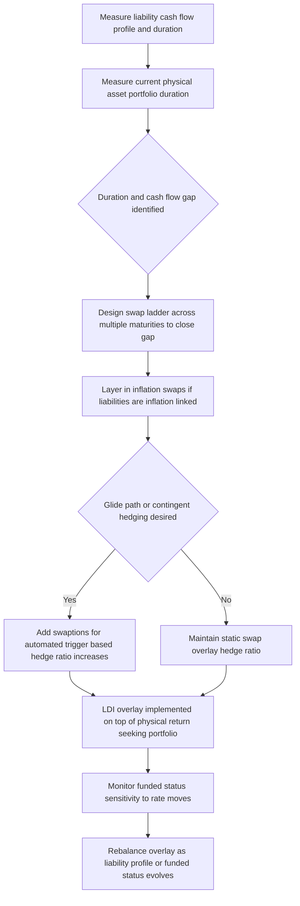

## Liability Driven Investing With Swaps and Swaptions

### Overview

Liability-Driven Investing (LDI) is an investment approach — most commonly associated with defined benefit pension plans and insurance companies — in which portfolio construction and risk management are oriented around matching the sensitivity of assets to the sensitivity of liabilities, rather than pursuing return maximization independent of the liability structure. Because pension and insurance liabilities are long-dated, discount-rate-sensitive, and often illiquid, **interest rate swaps and swaptions** are the primary tools used to hedge liability interest rate (and sometimes inflation) risk without requiring the plan to hold a physical bond portfolio precisely matching the liability cash flow profile.

---

### The Core LDI Problem: Duration and Convexity Mismatch

**Key Points**

- Pension liabilities are typically valued as the present value of future benefit payments, discounted using a **liability discount rate** (often based on high-quality corporate bond yields or, in some jurisdictions, a prescribed regulatory curve) — as interest rates fall, the present value of liabilities **rises** (and vice versa), analogous to a long-duration bond.
- If a pension plan's **asset duration is shorter than its liability duration** (a common historical starting position, since plans often hold significant equity and other growth-seeking allocations with limited direct interest rate sensitivity), a **fall in interest rates increases the liability value more than the asset value**, widening the funding deficit — this duration mismatch is often the single largest driver of funded status volatility for a typical pension plan.
- **LDI seeks to close this duration (and often convexity) gap**, either partially or fully, so that funded status becomes materially less sensitive to interest rate movements, allowing the plan's return-seeking assets to be managed toward growth objectives without that growth allocation being undermined by interest-rate-driven liability volatility.

---

### Why Swaps and Swaptions Rather Than Physical Bonds Alone

**Key Points**

- **Capital efficiency**: an interest rate swap requires only posting margin/collateral (initial and variation margin under standard CSA/clearing arrangements) rather than the full notional required to purchase an equivalent quantity of physical long-duration bonds — this allows a plan to achieve a target liability-matching duration profile while allocating the **majority of its actual capital to return-seeking assets** (equities, credit, alternatives) rather than tying up capital in low-yielding long government/corporate bonds.
- **Precision of duration/cash flow matching**: physical bond markets, particularly at the very long end of the curve (30+ year maturities matching typical pension liability duration), can have limited available supply and liquidity at precisely the maturities needed; swaps can be structured with **customized maturities and notional profiles** to match a plan's specific liability cash flow schedule more precisely than available physical bonds might allow.
- **Speed of implementation and adjustment**: as liability duration changes over time (due to demographic changes, discount rate movements affecting the liability's own convexity, or plan amendments), swap positions can be adjusted (added, unwound, or restructured) more quickly and with less market impact than restructuring a large physical bond portfolio.
- **Overlay structure**: swaps allow the interest rate hedge to be implemented as an **overlay** (see related topic on portfolio overlay strategies) on top of an existing physical asset allocation, rather than requiring wholesale reallocation of the physical portfolio to achieve the desired duration profile.

---

### Using Interest Rate Swaps in LDI

**Key Points**

- The most common structure: the pension plan (or its LDI manager) enters **receive-fixed, pay-floating interest rate swaps**, matched in notional and maturity profile to key points of the liability cash flow schedule.
- As interest rates **fall**, the fixed-rate leg of the swap becomes more valuable (since the plan continues to receive an above-market fixed rate), generating a **swap asset gain that offsets the increase in liability present value** — replicating the economics of holding a long-duration fixed-rate bond without the full capital outlay.
- **Notional and maturity laddering**: rather than a single swap, LDI programs typically use a **ladder of swaps across multiple maturities** (e.g., 10-year, 20-year, 30-year, 40-year tenors) structured to approximate the liability's specific cash flow and duration profile as closely as possible, since pension liabilities are not a single bullet cash flow but a complex, multi-decade payment stream.
- **Real (inflation-linked) swaps**: for liabilities with inflation-linked benefit increases (common in UK defined benefit schemes, for example), **inflation swaps** (see related chapter on inflation derivatives) are used alongside nominal interest rate swaps to hedge both the nominal discount rate sensitivity and the inflation-linked benefit growth sensitivity of the liability.

---

### Using Swaptions in LDI

**Key Points**

- **Swaptions** (options to enter an interest rate swap) are used in LDI programs primarily for two purposes:
  1. **Contingent/glide-path hedging**: a plan pursuing a "**de-risking glide path**" (progressively increasing hedge ratios and reducing return-seeking allocation as funded status improves over time) can use **payer or receiver swaptions** to establish contingent hedges that only activate (or become economically attractive to exercise) if interest rates move to specific trigger levels, allowing the plan to increase its hedge ratio automatically as market conditions evolve, without requiring active/discretionary intervention at each trigger point.
  2. **Convexity management**: because pension liabilities often exhibit **negative convexity** or specific convexity characteristics related to embedded options in the benefit structure (e.g., early retirement subsidies, lump-sum election options), swaptions can help match not just the liability's duration but also its **second-order (convexity) sensitivity** to interest rate movements — a dimension that simple swaps alone cannot fully address.
- **Receiver swaptions** (the right to enter a receive-fixed swap) are typically used to hedge against **falling rates** (protecting against the liability value increase that occurs as rates decline), while **payer swaptions** can be used in glide-path or dynamic de-risking strategies to manage the hedge ratio as rates rise and the plan seeks to lock in improved funded status.
- Swaptions introduce **optionality cost (premium)** that must be weighed against the benefit of contingent, automated hedge ratio adjustment relative to using swaps alone with active/discretionary rebalancing.

---

### LDI Program Structure

---

### Hedge Ratio and Glide Path Design

**Key Points**

- **Hedge ratio** refers to the proportion of the liability's interest rate (and inflation, where relevant) sensitivity that is offset by the LDI overlay — a plan might target, for example, an 80% hedge ratio, deliberately retaining some residual rate sensitivity rather than fully immunizing the liability, often reflecting a view on the cost/benefit trade-off of full hedging or capital constraints on posting collateral for a fully hedged notional.
- **De-risking glide paths** are a common governance framework: as a plan's **funded status improves** (assets relative to liabilities), the plan systematically **increases its LDI hedge ratio and reduces return-seeking allocation**, locking in funded status gains and reducing the plan's residual risk as it approaches full funding — swaptions are particularly useful in this context for building in automated, trigger-based increases to the hedge ratio without requiring constant active decision-making.
- **Leverage considerations**: because swaps require far less capital than physical bonds to achieve equivalent duration exposure, LDI programs are often **implicitly leveraged** relative to a physical-bonds-only approach — this capital efficiency is a feature (freeing capital for return-seeking assets) but also a source of **liquidity risk**, since the notional interest rate exposure being hedged can be very large relative to the actual collateral/margin posted at any point in time.

---

### The 2022 UK LDI Stress Episode — A Cautionary Case Study

**Key Points**

- In September–October 2022, a rapid, large increase in UK gilt yields (following a fiscal policy announcement that triggered a sharp market reaction) caused **swap and gilt-based LDI positions to move sharply against many pension schemes**, generating substantial and rapid **variation margin calls** on their leveraged interest rate hedge positions.
- Many schemes, having allocated the majority of their capital to return-seeking assets specifically **because** LDI overlays allowed capital-efficient hedging, found themselves with **insufficient readily liquid collateral buffers** to meet the scale and speed of margin calls, forcing some schemes and their LDI fund managers to **sell gilts to raise cash**, which — because many schemes faced the same pressure simultaneously — contributed to a further, self-reinforcing spike in gilt yields (a "doom loop" liquidity spiral).
- The **Bank of England intervened with emergency gilt purchases** to stabilize the market and give schemes time to raise additional collateral buffers in an orderly manner, an episode widely cited afterward as a case study in the **liquidity risk inherent in leveraged LDI structures**, even where the underlying hedging strategy was directionally sound and serving its intended risk-reduction purpose.
- Following this episode, UK regulators and industry bodies increased focus on **minimum resilience buffers** (holding sufficient readily liquid collateral to withstand a defined magnitude of adverse yield moves without forced selling) as a standard component of prudent LDI program design, rather than optimizing purely for capital efficiency without adequate liquidity stress-testing.

---

### Practical Considerations for LDI Program Governance

**Key Points**

- **Collateral waterfall and liquidity buffer design**: LDI programs require clearly defined, regularly stress-tested processes for sourcing additional collateral quickly (from other parts of the plan's asset allocation) in the event of adverse rate moves, calibrated to withstand plausible, not just historically observed, stress scenarios.
- **Counterparty diversification**: since swaps are OTC (even where centrally cleared, clearing member/FCM relationships introduce their own considerations), LDI programs typically diversify across multiple swap counterparties/clearing relationships to avoid concentration risk.
- **Regular liability re-measurement**: because liability cash flow profiles and durations evolve (due to demographic experience, discount rate changes affecting liability convexity, and plan amendments), LDI hedge portfolios require periodic re-measurement and rebalancing against the updated liability profile, not a "set and forget" implementation.
- **Basis risk between hedge and actual liability**: swap curves (typically SOFR/OIS-based post-transition) may not move in perfect lock-step with the specific discount curve used for liability valuation (e.g., a high-quality corporate bond curve), creating a residual basis risk that even a notionally "fully hedged" program does not eliminate entirely.

---

### Practical Pitfalls

- **Optimizing purely for capital efficiency without stress-testing liquidity needs**: as the 2022 UK episode illustrated, achieving an efficient hedge ratio via leveraged swap overlays without adequate liquid collateral buffers can create forced-selling risk precisely during the stressed conditions the hedge was designed to protect against.
- **Treating the hedge ratio as static rather than dynamically monitored**: liability duration and convexity change over time; failing to regularly re-measure and rebalance the LDI overlay against an updated liability profile can allow the effective hedge ratio to drift materially from its intended target.
- **Underestimating basis risk between swap curves and liability discount curves**: assuming a swap-based hedge perfectly offsets a liability valued on a different discount curve methodology can lead to unexpected residual funded status volatility even in a nominally well-hedged program.
- **Overlooking swaption premium cost in glide path design**: while swaptions provide valuable contingent/automated hedge ratio adjustment, their premium cost must be explicitly budgeted and weighed against the benefit of avoiding discretionary rebalancing delay, rather than treated as a "free" convexity management tool.

---

**Next Steps**

- Portfolio Overlay Strategies (Beta, Duration, and Currency Overlays)
- Inflation Swaps and Real Rate Hedging for Inflation-Linked Liabilities
- The 2022 UK LDI Market Stress Episode and Regulatory Response
- Pension De-Risking Glide Path Design and Governance
- Collateral and Margin Management for Leveraged Hedging Programs
- Swaption Pricing and the Role of Convexity in Liability Hedging