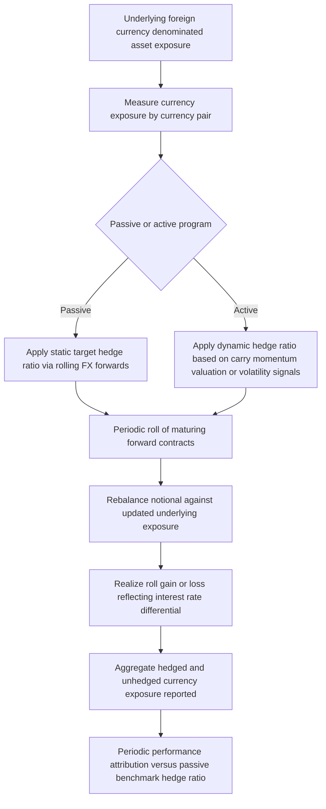

## Currency Overlay and Hedging Programs

### Overview

A currency overlay program is a dedicated, typically separately mandated strategy that manages the foreign exchange exposure arising from a portfolio's holdings of foreign-currency-denominated assets, using FX derivatives (predominantly forwards, but also options and futures) without requiring the sale of the underlying assets themselves. Because currency movements are a distinct and often uncompensated source of return volatility relative to the underlying asset's local-currency return, currency overlay programs allow institutional investors to manage this exposure as a **separate, deliberate decision** rather than accepting it as an incidental byproduct of international asset allocation.

---

### Why Currency Exposure Is Managed Separately

**Key Points**

- When an investor holds a foreign-currency-denominated asset (e.g., a US pension fund holding European equities), the investor's **total return** in base currency (USD) reflects both the **local-currency return of the asset** and the **currency return** (the appreciation or depreciation of the foreign currency against the base currency) — these are two economically distinct sources of return and risk.
- Empirical research and long-standing industry consensus generally support the view that **currency risk, particularly for developed-market currency pairs, has historically not been reliably compensated with a long-run positive risk premium** in the way that equity or credit risk premia are generally understood to be — meaning that unhedged currency exposure is often viewed primarily as a source of **volatility without a correspondingly reliable expected return**, distinct from the underlying asset allocation decision that the investor is actually seeking to be compensated for.
- This has led many institutional investors to treat the currency hedging decision as **separable** from the underlying asset allocation decision — an investor might have strong conviction in European equities as an asset class while having no particular conviction (or an explicit preference for reduced volatility) regarding EUR/USD currency exposure, and a currency overlay allows these two decisions to be managed independently.

---

### Passive (Strategic) Currency Hedging

**Key Points**

- A **passive currency hedging program** systematically hedges a defined, typically static proportion (the "hedge ratio") of the foreign currency exposure arising from the underlying portfolio, most commonly implemented using **rolling FX forward contracts**.
- **Rolling mechanics**: since FX forwards have fixed maturities, a passive program must periodically **roll** the forward position (closing the maturing contract and opening a new one at the then-current forward rate) to maintain continuous hedge coverage as the underlying asset position persists — this rolling process realizes periodic gains or losses reflecting interest rate differentials between the two currencies (**covered interest rate parity**), meaning the hedge has an inherent, largely predictable cost or benefit driven by the relative interest rates of the two currencies, independent of any spot rate view.
- **NAV/exposure-based rebalancing**: because the underlying asset's value (and thus its currency exposure) fluctuates with market movements between rebalancing dates, passive programs require periodic rebalancing of the hedge notional to track the underlying exposure, since a static forward notional set at inception will drift out of alignment with the actual currency exposure as the hedged asset's value changes — commonly managed via calendar-based (e.g., monthly) or threshold-based rebalancing triggers.
- **Common hedge ratio conventions**: 50% and 100% hedge ratios are common strategic defaults, chosen to balance currency volatility reduction against the transaction costs, tracking error, and cash flow timing considerations (particularly "cash flow at risk" from potential negative mark-to-market on forward positions) associated with a fully hedged program.

---

### Active (Dynamic) Currency Overlay

**Key Points**

- An **active currency overlay** adjusts the hedge ratio (or takes directional currency positions beyond simple hedging) based on the manager's views, valuation signals, or systematic models, seeking to add value beyond the risk-reduction benefit of a static passive hedge.
- Common active currency strategies incorporated into overlay programs include:
  - **Carry**: favoring exposure to higher-yielding currencies (or under-hedging exposure to them) and hedging (or shorting) lower-yielding currencies, based on the historical tendency (though not a guarantee) for higher-interest-rate currencies to outperform what pure interest rate differentials alone would predict, over some periods and subject to significant tail risk (carry trades are well known for a "picking up pennies in front of a steamroller" risk profile during sharp risk-off episodes).
  - **Momentum/trend-following**: adjusting hedge ratios or directional exposure based on recent currency trend signals.
  - **Valuation**: adjusting exposure based on measures of currency over/undervaluation (e.g., purchasing power parity-based models), on the view that currencies exhibit some tendency toward long-run mean reversion around fundamental value, albeit with potentially long and uncertain periods of divergence.
  - **Volatility-based/risk-managed hedge ratios**: dynamically adjusting hedge ratios based on realized or implied currency volatility levels, increasing hedging during periods of elevated currency risk.
- Active programs introduce **manager skill risk** (the possibility that active decisions detract from, rather than add to, returns relative to a passive benchmark hedge ratio) alongside the currency risk itself, and are typically evaluated against a specified passive hedge ratio benchmark to isolate the value added (or subtracted) by the active decisions.

---

### Currency Overlay Program Structure

---

### Instrument Choice: Forwards, Options, and Futures

**Key Points**

- **FX forwards** are the dominant instrument for both passive and most active overlay programs, given their liquidity, ease of customization to specific notional and maturity requirements, and the well-established rolling mechanics described above.
- **FX options** are used within overlay programs primarily where **convex, asymmetric protection** is desired — for example, a manager wanting downside currency protection while retaining upside currency appreciation potential (unlike a forward, which locks in a rate symmetrically) might use purchased currency puts (or calls, depending on direction), or zero-cost collar structures, at the cost of option premium (or upside participation cap, in a collar).
- **Currency futures** (exchange-traded) are used less commonly in institutional overlay programs relative to OTC forwards, given standardized contract sizes and expiration dates that are often less precisely tailored to a specific portfolio's exposure and rebalancing schedule than OTC forwards, though they carry the benefit of central clearing and reduced counterparty risk.

---

### Operational and Risk Management Considerations

**Key Points**

- **Cash flow and margin management**: rolling forward positions generate periodic realized gains/losses at each roll date, and can require **cash settlement or margin posting** depending on documentation (CSA terms for OTC forwards, or margin requirements if cleared) — programs must maintain adequate liquidity to meet these cash flow demands, particularly during periods of significant adverse currency movement.
- **Basis and timing risk**: because the underlying asset value fluctuates continuously while hedge notional is typically only rebalanced periodically, a currency overlay is generally never perfectly hedged at every instant — the resulting **hedge slippage** (mismatch between the static forward notional and the continuously fluctuating actual exposure) is an inherent, quantifiable source of residual currency exposure in any periodically rebalanced program.
- **Interest rate differential exposure (roll cost/benefit)**: because forward pricing embeds the interest rate differential between the two currencies (covered interest rate parity), a passive hedging program on a currency pair where the foreign currency's interest rate is **higher** than the base currency's rate will experience a **persistent negative roll cost** from hedging (giving up the higher foreign yield), whereas hedging a currency pair with a **lower** foreign interest rate can generate a **positive roll benefit** — this interest rate differential effect is a structural, largely predictable feature of passive hedging, distinct from any spot currency view.
- **Counterparty diversification**: as with other OTC derivative overlay programs, currency overlay mandates typically diversify FX forward counterparties to manage concentration risk, particularly given the potentially large aggregate notional involved in hedging a substantial international asset allocation.

---

### Performance Measurement and Attribution

**Key Points**

- Currency overlay performance is typically evaluated by decomposing total portfolio currency-related return/risk into:
  - **Passive hedge ratio benchmark return**: the return that would have been achieved by simply applying the strategic, static target hedge ratio without any active decisions.
  - **Active overlay value added/subtracted**: the difference between actual overlay performance and the passive benchmark, isolating the specific contribution of active currency decisions.
  - **Hedge slippage/tracking error**: the residual mismatch between intended and actual hedge coverage due to rebalancing timing and underlying asset value fluctuation between rebalancing dates.
- This decomposition is important for governance purposes, since it allows plan sponsors and investment committees to separately evaluate (1) whether the strategic decision to hedge (and at what ratio) was appropriate given their risk tolerance and currency return expectations, and (2) whether any active overlay manager engaged is actually adding value beyond that passive baseline.

---

### Practical Pitfalls

- **Confusing currency hedging cost with currency hedging "loss"**: a negative roll cost from hedging into a lower-yielding base currency is a structural, expected feature of covered interest rate parity, not necessarily evidence of poor program execution — conflating the two can lead to inappropriate program discontinuation based on a misunderstanding of the underlying mechanics.
- **Underestimating hedge ratio drift between rebalancing dates**: assuming a hedge is fully effective throughout the period between rebalancing dates, without accounting for the underlying asset's value fluctuation, can lead to an overstated sense of currency risk reduction actually being achieved.
- **Evaluating active overlay performance without a clear passive benchmark**: without decomposing performance against a defined passive hedge ratio baseline, it is difficult to determine whether an active currency manager's decisions are genuinely adding value or whether apparent gains/losses simply reflect the passive hedge ratio's structural exposure.
- **Overlooking cash flow/liquidity needs from forward roll settlements**: particularly for large notional programs or during periods of significant currency movement, underestimating the liquidity required to settle periodic forward roll gains/losses can create unexpected cash management pressure.

---

**Next Steps**

- Covered Interest Rate Parity and FX Forward Pricing Mechanics
- Currency Carry Trades and Tail Risk Considerations
- FX Options and Collar Structures for Asymmetric Currency Protection
- Portfolio Overlay Strategies (Beta, Duration, and Currency Overlays)
- Performance Attribution for Overlay and Hedging Programs
- Purchasing Power Parity and Currency Valuation Models