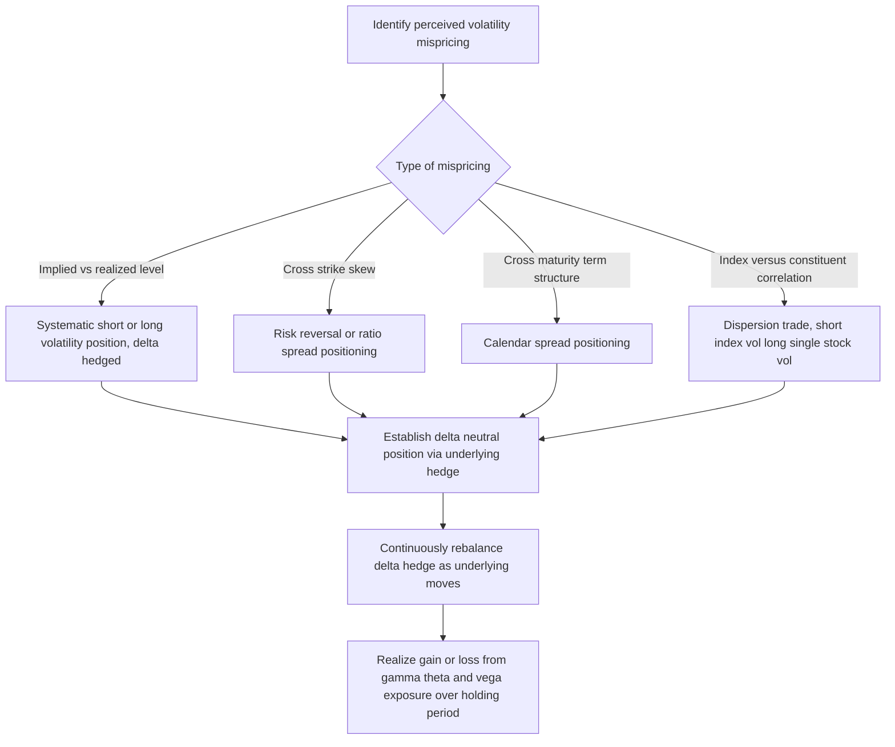

## Volatility Arbitrage and Relative Value Strategies

### Overview

Volatility arbitrage and relative value strategies seek to profit from perceived mispricings in the volatility surface — differences between **implied volatility** (the market's option-implied expectation of future volatility) and **realized volatility** (subsequently observed actual volatility), or differences in relative implied volatility levels **across strikes, maturities, underlyings, or related instruments**. These strategies are typically designed to be **delta-neutral** or close to it, isolating volatility and correlation exposure from directional market exposure, and rely on statistical, model-based, or structural relationships between related volatility instruments rather than a directional view on the underlying asset's price level.

---

### Core Distinction: Volatility Arbitrage vs. Directional Options Trading

**Key Points**

- A directional options trade expresses a view on the **underlying asset's future price direction** (e.g., buying a call because one expects the stock to rise).
- A volatility arbitrage trade expresses a view on **volatility itself** — whether implied volatility is too high or too low relative to expected realized volatility, or whether one volatility instrument is mispriced relative to a related one — and is typically **delta-hedged** (the underlying directional exposure from the option position is offset via an opposing position in the underlying asset, rebalanced dynamically) to isolate the volatility/gamma exposure from price direction risk.
- This delta-hedging requirement means volatility arbitrage strategies are inherently **more operationally intensive** than simple directional options trades, requiring continuous or frequent rebalancing of the hedge as the underlying price moves (gamma-driven rehedging) and as time passes (theta decay).

---

### Implied vs. Realized Volatility (Volatility Risk Premium) Strategies

**Key Points**

- The most fundamental volatility arbitrage strategy exploits the **volatility risk premium**: the well-documented historical tendency for **implied volatility to trade above subsequently realized volatility**, on average, across many equity index and other option markets — compensating option sellers for bearing the risk of large, infrequent adverse moves (a "insurance premium" logic mirroring why insurance is generally priced to be profitable for insurers over time, with the crucial caveat of potentially severe losses during outlier events).
- **Short volatility strategies** (systematically selling options, typically delta-hedged, to collect this premium) seek to harvest this volatility risk premium over time, but carry significant **tail/negative skewness risk** — the strategy typically generates small, consistent gains in normal markets punctuated by the possibility of large, sudden losses during volatility spikes, a well-known risk profile sometimes described as "picking up pennies in front of a steamroller."
- **Long volatility strategies** (systematically buying options, delta-hedged) generally underperform on average over long periods given the volatility risk premium working against the buyer, but provide **convex protection** during volatility spikes — the mirror-image risk/return profile, more commonly used as a tail-hedging or diversification tool (see related topic) than as a standalone return-seeking strategy.
- **Dispersion trading** is a related, more structural strategy: taking a position that **implied correlation** between index constituents is mispriced relative to the sum of implied volatilities of the individual constituents — typically implemented by **selling index volatility while buying volatility on the individual constituent stocks** (a "long dispersion" or "short correlation" position), profiting if realized correlation among constituents ends up **lower** than the correlation implied by the relative pricing of index versus single-stock options at trade inception (since index volatility is mechanically a function of both constituent volatilities and their pairwise correlations).

---

### Volatility Surface Relative Value Strategies

**Key Points**

- **Skew trades**: positioning based on a view that the **volatility skew** (the pattern of implied volatility across different strikes for the same maturity, typically downward-sloping for equity index options, reflecting higher implied volatility for downside puts than upside calls) is too steep or too flat relative to historical norms or model-implied fair value — implemented via risk reversals (long a call, short a put, or vice versa, at different strikes) or ratio spreads.
- **Term structure trades**: positioning based on a view that the **volatility term structure** (implied volatility across different maturities for the same underlying) is mispriced — for example, calendar spreads (buying and selling options with the same strike but different maturities) exploit views that near-term implied volatility is too high or low relative to longer-dated implied volatility, often around known event catalysts (earnings announcements, central bank meetings) that create a temporary "hump" in the term structure.
- **Cross-asset and cross-underlying relative value**: positioning based on relative mispricing between volatility instruments on **related but distinct underlyings** — e.g., relative value between two competitor stocks' implied volatilities, between an index and a closely related sector ETF, or between related currency pairs' implied volatilities (triangular relationships in FX volatility).
- **Variance swap vs. options replication basis**: exploiting small pricing discrepancies between a variance swap's fair value (theoretically replicable via a static portfolio of options across all strikes, weighted appropriately) and its actual quoted price, capturing a structural arbitrage where replication and liquidity frictions create a persistent, small, but potentially exploitable basis.

---

### Volatility Arbitrage Strategy Framework

---

### Key Risk Exposures in Volatility Arbitrage

**Key Points**

- **Vega risk**: sensitivity to changes in the level of implied volatility itself, distinct from the gamma/realized volatility exposure captured through delta-hedging — a position can be delta-neutral but still carry substantial vega exposure to shifts in the implied volatility surface.
- **Gamma/theta trade-off**: a long-options (long gamma) position benefits from large underlying price moves (which generate rehedging gains) but decays in value over time (negative theta) absent sufficient realized movement; a short-options (short gamma) position is the mirror image, earning theta decay as compensation for the risk of adverse gamma exposure during large moves.
- **Correlation risk** (specific to dispersion and multi-underlying relative value trades): realized correlation between constituents can diverge substantially and unpredictably from the correlation implied at trade inception, particularly during systemic stress when correlations tend to spike toward 1 regardless of prior historical patterns.
- **Liquidity and financing risk**: volatility arbitrage strategies, particularly those involving less liquid single-name or OTC volatility instruments, can face significant bid-ask spread and financing cost drag, especially during stressed periods when volatility trading liquidity typically deteriorates most sharply.
- **Model risk**: relative value volatility strategies often rely on specific pricing models (for skew, term structure, or correlation "fair value") whose assumptions may not hold reliably across all market regimes, meaning a position judged "cheap" or "rich" by one model may not converge to fair value as expected, or may diverge further before any eventual convergence.

---

### Portfolio Context and Diversification Role

**Key Points**

- Volatility arbitrage strategies are often allocated to within a broader portfolio specifically for their **historically low correlation to traditional equity and fixed income beta** during normal market conditions, providing a differentiated source of return (or, for long-volatility strategies, a differentiated source of tail protection).
- However, allocators should be aware that many volatility arbitrage strategies (particularly short-volatility and short-correlation/dispersion strategies) tend to exhibit their **worst performance precisely during systemic market stress**, when the correlation benefit an allocator might be seeking is often least available — a form of hidden tail correlation risk that is not always apparent from normal-period return statistics alone.
- This makes volatility arbitrage strategies **complementary to, rather than a substitute for, dedicated tail risk hedging** (see related topic) within an overall portfolio construction, since the two strategy types often have opposite risk exposures to volatility spikes.

---

### Practical Pitfalls

- **Underestimating tail risk in short volatility strategies from historical Sharpe ratios alone**: strategies harvesting the volatility risk premium can exhibit attractive risk-adjusted returns over long calm periods that mask substantial embedded tail risk, a pattern well-documented across historical episodes of sudden, severe volatility spikes.
- **Assuming historical correlation relationships hold for dispersion trades**: realized correlation can diverge sharply from implied correlation assumptions at trade inception, particularly during systemic events, undermining the core thesis of a dispersion position precisely when volatility (and therefore position size/risk) tends to be largest.
- **Underestimating rehedging costs and slippage**: the theoretical P&L of a delta-hedged volatility position assumes continuous, frictionless rehedging; in practice, discrete rehedging intervals, transaction costs, and bid-ask spreads create a meaningful gap between theoretical and realized strategy performance.
- **Conflating model-implied "fair value" mispricing with a genuine, reliably convergent arbitrage**: many volatility relative value opportunities reflect persistent structural features (liquidity premia, risk premia) rather than genuine mispricings expected to converge, and treating them as if they were riskless arbitrage can lead to inappropriate position sizing.

---

**Next Steps**

- Volatility Risk Premium and Systematic Short Volatility Strategies
- Dispersion Trading and Implied Correlation Modeling
- Volatility Skew and Term Structure Trading Strategies
- Variance Swap Replication and the Options Portfolio Static Hedge
- Tail Risk Hedging Programs (Complementary Long Volatility Exposure)
- Delta Hedging Mechanics and Gamma/Theta Trade-offs