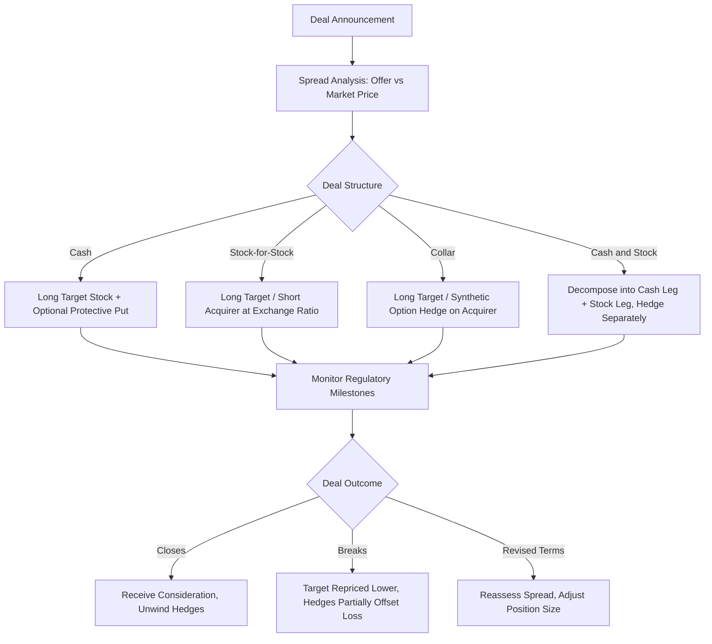

## Merger Arbitrage and Event Driven Derivatives Use

### Overview

Merger arbitrage (risk arbitrage) is an event-driven strategy that seeks to capture the spread between a target company's post-announcement trading price and the price offered by an acquirer in a merger, acquisition, or tender offer. Event-driven derivatives use extends this to a broader set of corporate actions — spinoffs, bankruptcies, restructurings, litigation outcomes, regulatory decisions — where derivatives are used to isolate, hedge, or leverage exposure to a discrete corporate event rather than to general market movement.

**Key Points**

- The strategy monetizes deal-completion risk, not market direction
- Returns are largely uncorrelated with broad equity indices, making the strategy a diversifier
- Derivatives (options, CDS, swaps) are used to hedge financing risk, currency risk, and downside "deal-break" risk
- The primary risk factor is idiosyncratic: deal-break risk, not systematic market risk

### The Merger Arbitrage Spread

When a deal is announced, the target's stock typically jumps toward — but not fully to — the offer price. The residual gap is the arbitrage spread, compensating the arbitrageur for:

- Time value of money until deal close
- Probability of deal failure (regulatory block, financing collapse, shareholder rejection, MAC clause invocation)
- Possibility of a revised (lower) offer

$$\text{Spread} = P_{offer} - P_{market}$$

Annualized expected return, ignoring deal-break risk, is approximated by:

$$r_{ann} = \frac{P_{offer} - P_{market}}{P_{market}} \times \frac{365}{t}$$

where $t$ is the expected number of days to close.

A more complete expected-value framework incorporates deal-break probability $p_b$ and the assumed post-break price $P_{break}$:

$$E[P_T] = p_c \cdot P_{offer} + p_b \cdot P_{break}$$

with $p_c = 1 - p_b$. The arbitrageur's edge exists only if $E[P_T] - P_{market}$, adjusted for time and risk, exceeds a hurdle return.

### Deal Structures and Their Derivative Implications

#### Cash Deals

The target's shareholders receive a fixed cash amount per share. This is the simplest structure: the arbitrageur buys target stock and holds until close, with exposure limited to deal-completion risk. Derivatives are used mainly for tail-risk hedging (put options on the target as insurance against a break) rather than for constructing the position itself.

#### Stock-for-Stock (Fixed Exchange Ratio) Deals

The target shareholder receives $x$ shares of the acquirer per target share. The arbitrageur must isolate the spread from acquirer-price risk:

- **Long target stock, short acquirer stock** at the exchange ratio: for every 100 target shares held, short $100x$ acquirer shares
- This hedge is typically implemented with equity swaps or short sales rather than options, since the goal is to fully neutralize acquirer beta, not merely cap it

#### Collar Deals

Some stock deals include a collar: the exchange ratio floats within a band as the acquirer's price moves, then fixes outside the band. This introduces convexity that resembles an embedded option structure.

- **Fixed-value collar**: exchange ratio adjusts inversely with acquirer price within the collar range, keeping deal value roughly constant — economically equivalent to the target receiving a fixed dollar amount hedged via a costless collar (a long put / short call structure on the acquirer's stock)
- **Fixed-ratio collar** (outside the band): once acquirer price breaches the collar boundaries, the exchange ratio locks, exposing the arbitrageur to acquirer price risk — options on the acquirer (puts to hedge downside beyond the collar) are used to manage this tail

#### Cash-and-Stock (Mixed Consideration) Deals

Combines a cash component and a fixed or floating stock component. The arbitrageur decomposes the position into a cash-deal sub-position and a stock-deal sub-position, hedging each independently — often using a listed or OTC option overlay when the stock leg is small relative to the cash leg, to avoid the transaction costs of a full short-stock hedge.

### Derivatives Used in Merger Arbitrage

#### Listed Options on Target Stock

- **Protective puts**: purchased on the target to cap deal-break downside; cost reflects the market's implied deal-break probability and timing
- **Call spreads / bull call spreads**: used when an arbitrageur wants leveraged upside if a topping bid emerges, while limiting premium outlay
- **Selling upside calls (covered)**: monetizes the view that a competing bid is unlikely, financing some of the put-hedge cost — this recreates a **risk reversal** or collar around the deal spread

#### Options on Acquirer Stock (Stock Deals)

Used to hedge the short-acquirer-stock leg's tail risk, particularly around collar boundaries, and to manage borrow-cost or short-availability constraints on the acquirer name by substituting a synthetic short (long put + short call at the same strike, replicating a short position via put-call parity) for a physical short sale.

$$C - P = S - K e^{-rT}$$

#### Credit Default Swaps (CDS)

Relevant in leveraged buyouts (LBOs) and deals financed with new acquirer debt:

- CDS on the **acquirer** can be bought as a hedge against financing-driven credit deterioration (leverage spike from deal debt)
- CDS on the **target** can be used where the target carries existing debt that may be downgraded, put to the issuer via change-of-control covenants, or refinanced
- In distressed or bankruptcy-adjacent event situations, CDS becomes a primary instrument for expressing a credit-event view directly, often more liquid than the underlying bonds

#### Total Return Swaps (TRS) and Equity Swaps

Institutional arbitrageurs often replace physical stock positions with TRS to:

- Avoid stock-borrow costs and constraints on hard-to-borrow acquirer names
- Achieve synthetic leverage
- Reduce balance-sheet and settlement friction, particularly in cross-border deals

#### Variance and Volatility Instruments

Implied volatility on the target typically collapses post-announcement (the stock trades in a tight range near the offer price) — a phenomenon sometimes called "vol crush." Arbitrageurs may:

- Sell variance swaps or straddles on the target post-announcement, monetizing the expected volatility compression
- Buy variance/volatility exposure pre-announcement in situations with credible takeover speculation ("rumortrage"), anticipating a jump

#### FX Derivatives (Cross-Border Deals)

Where acquirer and target are denominated in different currencies, FX forwards or options hedge the currency exposure embedded in the deal consideration, particularly for cash deals priced in a foreign currency or stock deals involving a foreign-listed acquirer.

### Event-Driven Extensions Beyond Classic M&A

#### Spinoffs and Restructurings

- Pre-spinoff, options can be used to position for the "sum-of-the-parts" re-rating
- Post-spinoff, when-issued (WI) trading and early options markets on the new entity allow arbitrage of pricing dislocations before full liquidity develops

#### Distressed and Bankruptcy Situations

- CDS and distressed debt positions replace equity-based arbitrage once a company enters or approaches Chapter 11
- Capital structure arbitrage — trading equity options against CDS or bond positions — captures mispricing between a firm's debt and equity claims using structural credit models (e.g., Merton-style equity-as-a-call-option framing)

#### Regulatory and Litigation Catalysts

- Binary regulatory outcomes (antitrust approval/denial, FDA decisions in biotech M&A, litigation verdicts) are frequently expressed via **out-of-the-money option strangles or binary-like spreads**, since the payoff resembles a discrete jump rather than continuous price evolution
- Deal-break scenarios are explicitly modeled as jump risk, making these positions closer to volatility/jump trades than delta-one arbitrage

### Risk Factors Specific to the Strategy

- **Deal-break risk**: regulatory rejection (antitrust, CFIUS/national security review, sector-specific regulators), financing failure, shareholder vote failure, MAC clause invocation, or a target board withdrawing support
- **Timing risk**: extended closing timelines erode annualized returns even absent a break
- **Financing risk**: in LBOs, credit market deterioration between signing and closing can jeopardize debt financing, particularly for deals with financing-out conditions
- **Regulatory risk concentration**: cross-border and horizontal-competitor deals face elevated antitrust scrutiny, creating correlated risk across a portfolio of merger-arb positions in similar sectors or jurisdictions
- **Crowding risk**: [Inference] merger arb spreads can compress when the strategy attracts substantial capital, though the magnitude of this effect is not a fixed, quotable parameter and varies by market cycle

### Portfolio Construction Considerations

- **Diversification across deal types and jurisdictions** reduces correlated regulatory-rejection risk
- **Position sizing scaled to deal-break probability**: wider spreads (reflecting market-implied lower completion probability) typically warrant smaller position sizes under a risk-parity or Kelly-adjusted framework
- **Portfolio-level hedges**: index puts or VIX-related instruments are sometimes layered on top of idiosyncratic deal books to hedge against systemic risk-off events that widen spreads across the entire book simultaneously (deal spreads tend to widen in market-wide liquidity crises even without deal-specific news)

### Illustrative Payoff Diagram: Stock Collar Deal

<svg xmlns="http://www.w3.org/2000/svg" viewBox="0 0 700 420" font-family="sans-serif">
<text x="350" y="25" text-anchor="middle" font-size="16" font-weight="bold">Merger Collar: Exchange Ratio vs Acquirer Price (svg_diagram)</text>
<line x1="80" y1="360" x2="650" y2="360" stroke="black" stroke-width="1.5" />
<line x1="80" y1="360" x2="80" y2="60" stroke="black" stroke-width="1.5" />
<text x="365" y="400" text-anchor="middle" font-size="13">Acquirer Stock Price</text>
<text x="30" y="210" text-anchor="middle" font-size="13" transform="rotate(-90 30 210)">Exchange Ratio</text>
<line x1="80" y1="200" x2="220" y2="120" stroke="#2166ac" stroke-width="2.5" />
<line x1="220" y1="120" x2="450" y2="120" stroke="#2166ac" stroke-width="2.5" />
<line x1="450" y1="120" x2="620" y2="220" stroke="#2166ac" stroke-width="2.5" />
<line x1="220" y1="360" x2="220" y2="60" stroke="#888" stroke-dasharray="4,4" />
<line x1="450" y1="360" x2="450" y2="60" stroke="#888" stroke-dasharray="4,4" />
<text x="220" y="378" text-anchor="middle" font-size="11">Lower Collar Bound</text>
<text x="450" y="378" text-anchor="middle" font-size="11">Upper Collar Bound</text>

<text x="140" y="140" font-size="11" fill="`#2166ac`">Fixed-ratio region</text>

<text x="335" y="105" font-size="11" fill="`#2166ac`">Fixed-value region</text>

<text x="540" y="200" font-size="11" fill="`#2166ac`">Fixed-ratio region</text>

<text x="150" y="330" font-size="10" fill="#555">Long put hedge zone</text>

<text x="500" y="330" font-size="10" fill="#555">Short call hedge zone</text>

</svg>

### Illustrative Process Flow: Merger Arb Position Lifecycle

### Worked Example

**Example**

Acquirer offers 0.5 shares of its own stock plus $10 cash for each share of Target, with a fixed exchange ratio (no collar). Target trades at $28 pre-close; Acquirer trades at $40.

- Implied offer value per Target share: $0.5 \times 40 + 10 = 30$
- Gross spread: $30 - 28 = 2$, or roughly 7.1% of the $28 market price
- If expected time to close is 6 months: annualized spread $\approx 14.3\%$ before deal-break adjustment
- Hedge construction: for every 1,000 Target shares purchased ($28,000 notional), short 500 Acquirer shares ($20,000 notional) to neutralize the stock-consideration leg, leaving the $10 cash leg unhedged (pure receivable at close)
- If deal-break probability is assessed at 15% with an assumed post-break Target price of $22: $E[P_T] = 0.85(30) + 0.15(22) = 28.8$, only marginally above the $28 market price — indicating a thin risk-adjusted edge that may not compensate for the risk taken, illustrating why probability-weighted analysis, not the headline spread, drives sizing decisions

### Common Pitfalls

- Treating the headline (unadjusted) spread as the expected return rather than probability-weighting for deal-break scenarios
- Under-hedging the stock leg in stock-for-stock deals, leaving residual acquirer beta exposure
- Ignoring collar boundary risk — assuming a fixed exchange ratio holds throughout the deal timeline when a collar structure introduces acquirer-price sensitivity outside the band
- Overlooking borrow cost and short-availability constraints on the acquirer name, which can erode or eliminate the arbitrage spread
- Assuming CDS and equity option markets move in lockstep during a deal — basis risk between capital structure instruments can be material, especially in distressed situations

### Related Topics

- Capital structure arbitrage and credit-equity basis trades
- Volatility surface dynamics around binary corporate events
- LBO financing structures and their derivative hedges
- Cross-border deal FX and regulatory (CFIUS) risk premia
- Distressed debt and bankruptcy claims trading
- Convertible bond arbitrage as an adjacent event-driven strategy