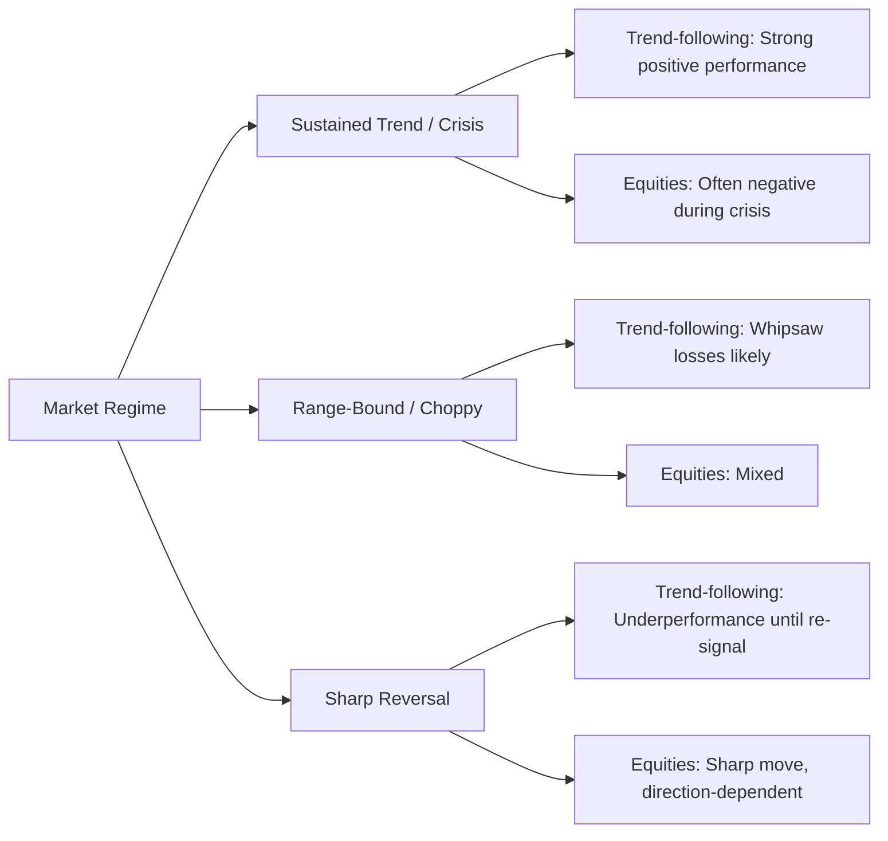

## Managed Futures and Systematic Strategies

### Definition and Scope

Managed futures refers to an investment strategy category in which professional money managers, known as Commodity Trading Advisors (CTAs), trade futures contracts, forwards, and options across global markets including equity indices, fixed income, currencies, and commodities. The term "systematic" distinguishes these strategies from discretionary approaches: systematic strategies rely on quantitative, rules-based models to generate trading signals, size positions, and manage risk, largely removing subjective human judgment from day-to-day decisions.

CTAs are regulated in the United States by the CFTC and registered through the NFA. Their strategies are typically implemented via managed accounts or commingled fund structures, and increasingly through liquid alternative mutual funds and UCITS vehicles in Europe.

### Historical Context and Evolution

The managed futures industry emerged from 1970s and 1980s commodity trading pools, evolving alongside the growth of exchange-traded futures markets. Early CTAs were largely trend-following commodity traders. The industry has since diversified substantially:

- **1970s-1980s**: Origin in commodity pool operators (CPOs), simple trend-following on commodities
- **1990s**: Expansion into financial futures (bonds, equity indices, currencies), growth of systematic trend-following as the dominant style
- **2000s**: Diversification into multi-strategy CTAs blending trend, carry, and relative value
- **Post-2008**: Renewed institutional interest due to strong crisis-period performance
- **2010s-present**: Fee compression, rise of liquid alternatives/UCITS wrappers, machine learning-enhanced signal generation

### Core Strategy Taxonomy

**Trend-Following (Time-Series Momentum)**

The dominant style historically. Positions are taken long or short based on the direction of recent price movement, independent of other assets' behavior. A simplified signal:

$$\text{signal}_t = \text{sign}\left(\frac{P_t - P_{t-n}}{\sigma_{t-n:t}}\right)$$

where $P_t$ is price at time $t$, $n$ is the lookback window, and $\sigma$ is realized volatility used for position scaling. Common lookback windows range from 1-3 months (short-term) to 6-12 months (long-term), and many CTAs blend multiple horizons.

**Carry Strategies**

Positions are established based on the roll yield or interest rate differential embedded in a futures curve or currency pair. In commodities, carry reflects contango/backwardation; in currency futures, it reflects covered interest rate parity deviations.

$$\text{Carry} = \frac{F_{t,T} - S_t}{S_t} \times \frac{365}{T-t}$$

where $F_{t,T}$ is the futures price for maturity $T$ and $S_t$ is the spot price.

**Relative Value / Cross-Sectional Momentum**

Rather than trading the absolute direction of one asset, these strategies rank assets within a universe (e.g., all G10 currencies, or all equity index futures) and go long the top-ranked assets while shorting the bottom-ranked ones, aiming for market-neutral exposure to the systematic factor being harvested.

**Mean Reversion / Counter-Trend**

Shorter-horizon strategies that fade extreme short-term price moves, often used as a diversifying overlay within multi-strategy CTA books since their return profile is frequently negatively correlated with trend-following.

**Volatility and Options-Based Overlays**

Some systematic managers run volatility risk-premium strategies (e.g., systematically selling variance swaps or options) or use options to reshape the return distribution of an underlying systematic book.

### Portfolio Construction Mechanics

**Volatility Targeting / Risk Parity Sizing**

Position sizes are inversely scaled to instrument volatility so that each position contributes roughly equal risk to the portfolio, rather than equal notional exposure:

$$w_i = \frac{k}{\sigma_i}$$

where $w_i$ is the position weight in instrument $i$, $\sigma_i$ is that instrument's volatility estimate, and $k$ is a scalar chosen to hit a target portfolio-level volatility (commonly 10-15% annualized for standalone CTA programs).

**Diversification Across Sectors**

A typical multi-asset CTA trades across:

- Equity index futures (S&P 500, EuroStoxx, Nikkei)
- Government bond futures (US Treasuries, Bunds, JGBs)
- Currency futures/forwards (G10 and select EM)
- Commodity futures (energy, metals, agriculture)
- Short-term interest rate futures (Eurodollar/SOFR, Euribor)

Diversification across dozens to hundreds of instruments is central to the strategy's risk-adjusted return profile, since individual instrument signals are often weak but the aggregate, decorrelated portfolio can produce a more stable Sharpe ratio.

**Signal Blending and Ensemble Construction**

Modern systematic managers combine multiple signal types (trend, carry, mean-reversion) across multiple time horizons into a blended composite signal per instrument, then aggregate into portfolio weights subject to risk and liquidity constraints. [Inference] The precise weighting schemes and proprietary signal combinations vary significantly by manager and are generally not publicly disclosed.

### Return Characteristics and the "Crisis Alpha" Property

A widely cited empirical characteristic of trend-following CTAs is convex, positive skew during sustained market stress periods — sometimes termed "crisis alpha" — because sustained directional moves (e.g., equity market crashes, currency crises) create the persistent trends these strategies are designed to capture. Notable episodes cited in industry research include 2000-2002, 2008, and Q1 2020.

[Inference] This crisis-alpha property is a statistical tendency observed across historical episodes, not a guaranteed payoff structure; trend strategies can and do underperform during choppy, range-bound, or rapidly reversing markets (e.g., 2011-2014 saw a difficult stretch for many trend followers).

### Correlation and Diversification Benefits

Systematic trend-following has historically exhibited low-to-negative correlation with traditional long-only equity and bond portfolios over multi-year windows, which underpins its use as a portfolio diversifier in institutional asset allocation. The correlation is not stable, however — it can shift depending on the macro regime, and short-term correlation spikes (both positive and negative) are common.

### Fee Structures

Traditional CTA fund structures commonly use a "2 and 20" fee model (2% management fee, 20% performance fee, often subject to a high-water mark), though fee compression has pushed many managers toward lower schedules (e.g., 1.5/15 or 1/10), particularly for liquid alternative fund wrappers competing on cost.

### Vehicle Structures

- **Managed accounts**: Individually owned accounts trading under a CTA's program via limited power of attorney; offer transparency and control but require higher minimums
- **Commodity pools / limited partnerships**: Traditional CTA fund structure, pooled capital, subject to CFTC/NFA regulation
- **UCITS funds**: European regulated fund wrapper enabling daily liquidity, leverage limits, and diversification requirements (UCITS eligibility rules constrain use of certain derivatives and leverage levels)
- **'40 Act liquid alternative mutual funds**: US retail-accessible wrapper, daily liquidity, subject to the Investment Company Act's leverage and diversification constraints

### Regulatory Framework

CTAs and CPOs in the US register with the NFA and are subject to CFTC oversight. Key considerations include:

- **Registration**: CTA/CPO registration requirements, disclosure document (Form D-style offering documents) requirements
- **Reporting**: CFTC Commitment of Traders (COT) reports capture aggregate positioning that can reflect CTA/managed money activity in the "Managed Money" category
- **Leverage disclosure**: Disclosure documents typically present historical margin-to-equity ratios as a leverage proxy
- **UCITS constraints**: Global exposure limits (commitment approach or VaR approach), issuer concentration limits, eligible asset rules

### Illustrative Worked Example: Simple Trend Signal Construction

Consider a single-instrument long-only-or-short trend model on crude oil futures:

1. Compute the 100-day moving average of settlement price, $MA_{100}$
2. Compute current price $P_t$
3. Signal: if $P_t > MA_{100}$, go long; if $P_t < MA_{100}$, go short
4. Position size: $\text{Notional} = \frac{\text{Target Risk} \times \text{Capital}}{\sigma_{\text{annualized}} \times \text{Contract Multiplier}}$

**Example**: Suppose target risk contribution is $50,000 of annualized volatility, crude oil's annualized volatility is 35%, and the contract multiplier is $1,000 per point. This yields a position notional of $\frac{\$50,000}{0.35} \approx \$142,857$, translated into a specific number of contracts based on the current futures price.

This is a deliberately simplified pedagogical illustration; production systems incorporate transaction costs, liquidity constraints, correlation-adjusted portfolio risk budgeting, and dynamic volatility estimation (e.g., exponentially weighted moving averages or GARCH-family models) rather than a simple moving-average crossover.

### Diagram: Systematic CTA Signal-to-Portfolio Pipeline (svg_diagram)

<svg xmlns="http://www.w3.org/2000/svg" viewBox="0 0 900 420" font-family="Arial, sans-serif">
<text x="450" y="25" text-anchor="middle" font-size="16" font-weight="bold">Systematic CTA Pipeline (svg_diagram)</text>
<rect x="30" y="60" width="160" height="60" rx="6" fill="#DCE6F5" stroke="#4472C4" />
<text x="110" y="85" text-anchor="middle" font-size="12" font-weight="bold">Market Data</text>
<text x="110" y="102" text-anchor="middle" font-size="10">Prices, curves, FX</text>
<rect x="230" y="60" width="160" height="60" rx="6" fill="#DCE6F5" stroke="#4472C4" />
<text x="310" y="85" text-anchor="middle" font-size="12" font-weight="bold">Signal Models</text>
<text x="310" y="102" text-anchor="middle" font-size="10">Trend / Carry / MR</text>
<rect x="430" y="60" width="160" height="60" rx="6" fill="#DCE6F5" stroke="#4472C4" />
<text x="510" y="85" text-anchor="middle" font-size="12" font-weight="bold">Signal Blending</text>
<text x="510" y="102" text-anchor="middle" font-size="10">Multi-horizon ensemble</text>
<rect x="630" y="60" width="160" height="60" rx="6" fill="#DCE6F5" stroke="#4472C4" />
<text x="710" y="85" text-anchor="middle" font-size="12" font-weight="bold">Volatility Estimate</text>
<text x="710" y="102" text-anchor="middle" font-size="10">EWMA / GARCH</text>
<rect x="230" y="180" width="160" height="60" rx="6" fill="#FCEACD" stroke="#C08A2E" />
<text x="310" y="205" text-anchor="middle" font-size="12" font-weight="bold">Position Sizing</text>
<text x="310" y="222" text-anchor="middle" font-size="10">Risk-parity weights</text>
<rect x="430" y="180" width="160" height="60" rx="6" fill="#FCEACD" stroke="#C08A2E" />
<text x="510" y="205" text-anchor="middle" font-size="12" font-weight="bold">Portfolio Risk Budget</text>
<text x="510" y="222" text-anchor="middle" font-size="10">Target vol / correlations</text>
<rect x="330" y="300" width="240" height="60" rx="6" fill="#DDEBD9" stroke="#548235" />
<text x="450" y="325" text-anchor="middle" font-size="12" font-weight="bold">Execution</text>
<text x="450" y="342" text-anchor="middle" font-size="10">Futures orders, roll management</text>
<line x1="190" y1="90" x2="230" y2="90" stroke="#333" stroke-width="1.5" marker-end="url(#arrow)" />
<line x1="390" y1="90" x2="430" y2="90" stroke="#333" stroke-width="1.5" marker-end="url(#arrow)" />
<line x1="590" y1="90" x2="630" y2="90" stroke="#333" stroke-width="1.5" marker-end="url(#arrow)" />
<line x1="510" y1="120" x2="510" y2="180" stroke="#333" stroke-width="1.5" marker-end="url(#arrow)" />
<line x1="710" y1="120" x2="710" y2="150" stroke="#333" stroke-width="1.5" />
<line x1="710" y1="150" x2="310" y2="150" stroke="#333" stroke-width="1.5" />
<line x1="310" y1="150" x2="310" y2="180" stroke="#333" stroke-width="1.5" marker-end="url(#arrow)" />
<line x1="390" y1="210" x2="430" y2="210" stroke="#333" stroke-width="1.5" marker-end="url(#arrow)" />
<line x1="450" y1="240" x2="450" y2="300" stroke="#333" stroke-width="1.5" marker-end="url(#arrow)" />
</svg>

### Diagram: Trend vs. Equity Behavior Across Market Regimes

### Risk Considerations

- **Whipsaw risk**: Trend models systematically lose money in choppy, mean-reverting, or frequently reversing markets due to repeated false signal entries and exits
- **Crowding**: Because many CTAs use conceptually similar trend and momentum signals, correlated positioning across managers can amplify drawdowns during rapid trend reversals (sometimes cited around events like the 1994 bond market selloff or various "quant unwind" episodes)
- **Liquidity and margin risk**: Sudden volatility spikes increase margin requirements and can force deleveraging at unfavorable prices
- **Model risk**: Overfitting of signals to historical data, regime shifts that invalidate historical parameter estimates
- **Transaction costs**: Frequent rebalancing, especially in shorter-horizon or higher-turnover strategies, is sensitive to slippage and futures roll costs
- **Basis and roll risk**: In commodities and any curve-based carry trade, roll yield can turn negative (contango) and erode returns even absent directional moves

### Performance Measurement and Benchmarks

Common industry benchmarks include the **SG Trend Index**, **SG CTA Index**, **BTOP50 Index**, and the broader **HFRI Macro/CTA indices**, which aggregate performance across a panel of major CTAs to proxy the asset class's returns. Evaluation typically emphasizes:

- Sharpe ratio and Sortino ratio (downside-risk adjusted)
- Maximum drawdown and drawdown duration
- Skewness and kurtosis of return distribution (trend strategies often exhibit positive skew)
- Correlation to equities/bonds across different sub-periods, particularly crisis windows

### Role in Institutional Portfolios

Institutional allocators (pension funds, endowments, sovereign wealth funds) typically incorporate managed futures/systematic macro allocations as a **diversifying sleeve** within a broader alternatives allocation, sized to provide tail-risk mitigation and crisis-period ballast rather than as a standalone return driver. [Inference] Typical strategic allocation sizing in institutional portfolios is generally cited in the low-to-mid single digits as a percentage of total assets, though this varies substantially by institution and risk appetite.

**Related Topics**

- Volatility risk premium and options-based overlay strategies
- Risk parity portfolio construction
- Commitment of Traders (COT) report interpretation
- Futures curve dynamics: contango, backwardation, and roll yield
- Machine learning applications in systematic signal generation
- Liquid alternatives and UCITS regulatory constraints on derivatives use
- Correlation regime analysis and tail-risk hedging strategies
- Portfolio overlay strategies using futures for asset allocation rebalancing