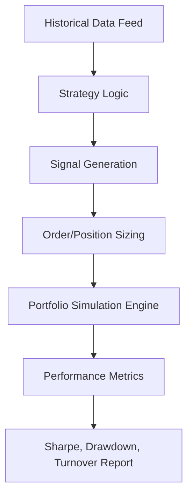
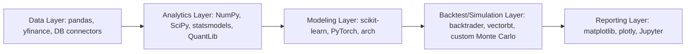

## Python for Quantitative Finance


### Scope and Role in Quantitative Finance

Python has become a dominant language in quantitative finance due to its readable syntax, extensive scientific computing ecosystem, and strong interoperability with C/C++ and compiled numerical libraries. It is used across the full workflow: data acquisition, exploratory analysis, model research, backtesting, pricing, risk management, and increasingly production execution systems (often paired with faster compiled components for latency-sensitive paths).

### Core Numerical Computing Libraries

**NumPy**

Provides the foundational `ndarray` object and vectorized array operations, avoiding slow Python-level loops. Nearly all downstream quant libraries build on NumPy arrays.

```python
import numpy as np

returns = np.array([0.012, -0.008, 0.005, 0.011, -0.002])
mean_return = np.mean(returns)
volatility = np.std(returns, ddof=1)  # sample std, Bessel's correction applied
sharpe = (mean_return / volatility) * np.sqrt(252)
```

**pandas**

The standard tool for labeled, time-indexed tabular data — essential for handling price series, returns, and portfolio holdings.

```python
import pandas as pd

prices = pd.read_csv("prices.csv", index_col="date", parse_dates=True)
returns = prices["close"].pct_change().dropna()
rolling_vol = returns.rolling(window=21).std() * np.sqrt(252)
```

**SciPy**

Supplies optimization routines, statistical distributions, interpolation, and root-finding — commonly used for calibration and implied volatility solving.

```python
from scipy.optimize import brentq
from scipy.stats import norm

def bs_call_price(S, K, T, r, sigma):
    d1 = (np.log(S/K) + (r + 0.5*sigma**2)*T) / (sigma*np.sqrt(T))
    d2 = d1 - sigma*np.sqrt(T)
    return S*norm.cdf(d1) - K*np.exp(-r*T)*norm.cdf(d2)

def implied_vol(market_price, S, K, T, r):
    objective = lambda sigma: bs_call_price(S, K, T, r, sigma) - market_price
    return brentq(objective, 1e-6, 5.0)
```

### Quant-Specific Libraries

**QuantLib (via `QuantLib-Python`)**

An open-source, industry-grade analytics library covering fixed income, derivatives pricing, day-count conventions, calendars, curve construction, and Monte Carlo/finite-difference pricing engines. It is a SWIG-wrapped C++ library, so the Python API mirrors QuantLib's C++ object model closely.

```python
import QuantLib as ql

calendar = ql.UnitedStates(ql.UnitedStates.NYSE)
today = ql.Date(15, 9, 2026)
ql.Settings.instance().evaluationDate = today

spot = ql.SimpleQuote(100.0)
rate = ql.SimpleQuote(0.05)
vol = ql.SimpleQuote(0.20)

process = ql.BlackScholesProcess(
    ql.QuoteHandle(spot),
    ql.YieldTermStructureHandle(ql.FlatForward(today, ql.QuoteHandle(rate), ql.Actual365Fixed())),
    ql.BlackVolTermStructureHandle(ql.BlackConstantVol(today, calendar, ql.QuoteHandle(vol), ql.Actual365Fixed()))
)

payoff = ql.PlainVanillaPayoff(ql.Option.Call, 100.0)
exercise = ql.EuropeanExercise(ql.Date(15, 3, 2027))
option = ql.VanillaOption(payoff, exercise)
option.setPricingEngine(ql.AnalyticEuropeanEngine(process))
print(option.NPV())
```

**statsmodels**

Used for econometric modeling: OLS/GLS regression, time-series models (ARIMA, VAR, GARCH via extensions), hypothesis testing, and cointegration testing (relevant to statistical arbitrage / pairs trading).

**arch**

Specialized package for ARCH/GARCH family volatility models, widely used in volatility forecasting and risk model construction.

```python
from arch import arch_model

model = arch_model(returns * 100, vol="Garch", p=1, q=1, dist="normal")
result = model.fit(disp="off")
forecast = result.forecast(horizon=5)
```

**yfinance / other data connectors**

Used for retrieving historical market data during research (note: rate-limited and intended for research use, not production trading infrastructure).

### Backtesting Frameworks

Common libraries include `backtrader`, `zipline-reloaded`, `vectorbt`, and `bt`. These provide event-driven or vectorized backtesting engines, portfolio accounting, and performance analytics (drawdown, Sharpe, turnover).



A minimal vectorized backtest structure:

```python
import pandas as pd
import numpy as np

signal = (prices["close"] > prices["close"].rolling(50).mean()).astype(int)
strategy_returns = signal.shift(1) * returns
cumulative = (1 + strategy_returns).cumprod()

def max_drawdown(cum_returns):
    running_max = cum_returns.cummax()
    drawdown = (cum_returns - running_max) / running_max
    return drawdown.min()

print("Cumulative return:", cumulative.iloc[-1] - 1)
print("Max drawdown:", max_drawdown(cumulative))
```

### Monte Carlo Simulation

Python is commonly used for Monte Carlo pricing of path-dependent derivatives and risk simulation (e.g., VaR via simulation).

```python
import numpy as np

def monte_carlo_call(S0, K, T, r, sigma, n_paths=100000, n_steps=252, seed=42):
    rng = np.random.default_rng(seed)
    dt = T / n_steps
    Z = rng.standard_normal((n_paths, n_steps))
    log_returns = (r - 0.5*sigma**2)*dt + sigma*np.sqrt(dt)*Z
    log_paths = np.cumsum(log_returns, axis=1)
    S_T = S0 * np.exp(log_paths[:, -1])
    payoff = np.maximum(S_T - K, 0)
    price = np.exp(-r*T) * np.mean(payoff)
    std_error = np.exp(-r*T) * np.std(payoff) / np.sqrt(n_paths)
    return price, std_error

price, se = monte_carlo_call(S0=100, K=105, T=1.0, r=0.03, sigma=0.25)
print(f"Price: {price:.4f} ± {1.96*se:.4f} (95% CI)")
```

Variance reduction techniques commonly implemented include antithetic variates, control variates, and quasi-random (Sobol) sequences via `scipy.stats.qmc`.

### Performance Optimization Strategies

Pure Python loops are slow for large-scale numerical work. Standard mitigation approaches:

- **Vectorization**: Replacing explicit loops with NumPy/pandas array operations
- **Numba**: JIT compilation of numerical Python functions using the `@njit` decorator, often yielding order-of-magnitude speedups for loop-heavy simulation code
- **Cython**: Compiling Python-like code to C extensions for performance-critical inner loops
- **Multiprocessing / joblib**: Parallelizing embarrassingly parallel workloads such as Monte Carlo path batches or parameter sweeps

```python
from numba import njit
import numpy as np

@njit
def simulate_paths(S0, r, sigma, T, n_steps, n_paths, seed):
    np.random.seed(seed)
    dt = T / n_steps
    paths = np.empty((n_paths, n_steps + 1))
    paths[:, 0] = S0
    for i in range(n_paths):
        for t in range(1, n_steps + 1):
            z = np.random.standard_normal()
            paths[i, t] = paths[i, t-1] * np.exp((r - 0.5*sigma**2)*dt + sigma*np.sqrt(dt)*z)
    return paths
```

[Inference] Actual speedup from Numba or Cython varies by workload structure, data size, and hardware; it should be benchmarked per use case rather than assumed universally.

### Risk Analytics Patterns

```python
import numpy as np

def historical_var(returns, confidence=0.95):
    return -np.percentile(returns, (1 - confidence) * 100)

def historical_cvar(returns, confidence=0.95):
    var_threshold = historical_var(returns, confidence)
    tail_losses = returns[returns <= -var_threshold]
    return -tail_losses.mean()
```

### Machine Learning Integration

`scikit-learn`, `PyTorch`, and `TensorFlow` are used in quantitative research for signal generation, regime classification, and volatility forecasting. Common caveats emphasized in practice include the risk of overfitting on limited, non-stationary financial time series and the importance of walk-forward validation rather than standard k-fold cross-validation, since financial data violates the i.i.d. assumption underlying many standard ML validation schemes.

### Environment and Dependency Management

Standard practice involves isolated environments (via `conda`, `venv`, or `poetry`) to pin exact versions of numerical libraries, since results in Monte Carlo simulation and optimization routines can be sensitive to library version differences (e.g., changes in default random number generator algorithms between NumPy versions).



### Typical Project Structure

```plaintext
quant_project/
├── data/
│   ├── raw/
│   └── processed/
├── src/
│   ├── data_loader.py
│   ├── pricing_models.py
│   ├── risk_metrics.py
│   └── backtest_engine.py
├── notebooks/
│   └── research.ipynb
├── tests/
│   └── test_pricing_models.py
├── requirements.txt
└── README.md
```

### Testing and Validation Practices

Unit testing pricing functions against known closed-form benchmarks (e.g., verifying a Monte Carlo European call converges to the Black-Scholes analytic price as path count increases) is standard practice, typically implemented with `pytest`.

```python
def test_monte_carlo_converges_to_bs():
    mc_price, se = monte_carlo_call(S0=100, K=100, T=1.0, r=0.03, sigma=0.2, n_paths=500000)
    bs_price = bs_call_price(100, 100, 1.0, 0.03, 0.2)
    assert abs(mc_price - bs_price) < 3 * se  # within ~3 standard errors
```

**Related Topics**

- QuantLib architecture deep dive: term structures, pricing engines, and calendars
- Numba and Cython for high-performance quant computing
- Backtesting pitfalls: look-ahead bias, survivorship bias, overfitting
- Time-series econometrics for finance (ARIMA, GARCH, cointegration)
- Vectorized vs. event-driven backtesting architecture trade-offs
- Machine learning validation techniques for non-stationary financial data
- Parallel and distributed computing for large-scale Monte Carlo simulation