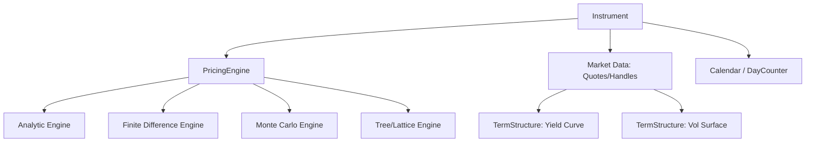
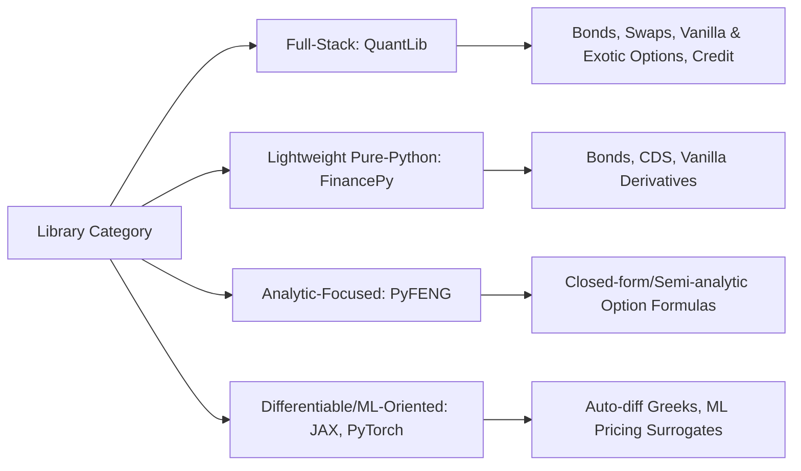

## Open Source Pricing Libraries and Frameworks


### Scope and Purpose

Open source pricing libraries provide reusable, community-maintained implementations of derivative pricing models, term structure construction, calendar/day-count conventions, and numerical methods (Monte Carlo, finite differences, tree methods). They allow practitioners and researchers to avoid re-implementing well-established, error-prone financial mathematics from scratch, while offering transparency into methodology that proprietary vendor systems typically do not expose.

### QuantLib

**Overview**

QuantLib is the most widely used open source quantitative finance library, written in C++ with bindings for Python, Java, C#, R, and other languages via SWIG. It covers a broad surface area: interest rate curve construction, vanilla and exotic option pricing, credit derivatives, inflation instruments, and fixed income analytics.

**Architecture**

QuantLib's design centers on a few key abstractions:

- **Instrument**: Represents a financial instrument (option, bond, swap) with an associated `NPV()` calculation
- **PricingEngine**: Encapsulates the pricing methodology (analytic, tree, finite-difference, Monte Carlo) separately from the instrument definition, allowing the same instrument to be priced with different engines
- **TermStructure**: Yield curves, volatility surfaces, and credit curves, often built via bootstrapping from market instruments
- **Handle**: An observer-pattern wrapper enabling term structures and quotes to be updated and automatically propagate changes to dependent pricing objects
- **Calendar / DayCounter**: Encodes market-specific business day conventions and day-count fractions (Actual/360, Actual/365, 30/360, etc.)



**Example: Bootstrapping a Yield Curve**

```python
import QuantLib as ql

today = ql.Date(15, 9, 2026)
ql.Settings.instance().evaluationDate = today
calendar = ql.TARGET()
day_count = ql.Actual365Fixed()

deposit_rates = [0.031, 0.033]
deposit_tenors = [ql.Period(3, ql.Months), ql.Period(6, ql.Months)]
deposit_helpers = [
    ql.DepositRateHelper(ql.QuoteHandle(ql.SimpleQuote(r)), tenor,
                          2, calendar, ql.ModifiedFollowing, False, day_count)
    for r, tenor in zip(deposit_rates, deposit_tenors)
]

swap_rates = [0.035, 0.038, 0.040]
swap_tenors = [ql.Period(2, ql.Years), ql.Period(5, ql.Years), ql.Period(10, ql.Years)]
swap_helpers = [
    ql.SwapRateHelper(ql.QuoteHandle(ql.SimpleQuote(r)), tenor,
                       calendar, ql.Annual, ql.Unadjusted,
                       ql.Thirty360(ql.Thirty360.BondBasis),
                       ql.Euribor6M())
    for r, tenor in zip(swap_rates, swap_tenors)
]

curve = ql.PiecewiseLogCubicDiscount(today, deposit_helpers + swap_helpers, day_count)
curve_handle = ql.YieldTermStructureHandle(curve)
print(curve.zeroRate(2.0, ql.Continuous).rate())
```

**Language Bindings and Ecosystem**

- `QuantLib-Python`: SWIG-generated bindings, most widely used binding for research and prototyping
- `QuantLib.jl`: Julia port with partial feature coverage
- `RQuantLib`: R bindings, commonly used in academic and actuarial contexts

[Inference] Feature parity across language bindings is not always complete; the C++ core typically receives new features first, with bindings following after a lag.

### Deriscope / Open-Source Excel Integrations

Various open-source and semi-open Excel add-ins (e.g., `QuantLibXL`) expose QuantLib functionality as spreadsheet functions, used in practitioner settings where Excel remains the primary interface for pricing and risk desks.

### PyQL and Alternatives to Raw SWIG Bindings

`PyQL` is a Cython-based alternative binding to QuantLib aiming for more Pythonic ergonomics than the SWIG-generated interface, though it historically has had less complete coverage of the full QuantLib API than the official SWIG bindings. [Unverified] Current maintenance status and feature coverage should be checked against the project repository before adoption in production research code, as community-maintained binding projects can experience variable maintenance activity.

### FINCAD and Vendor-Adjacent Open Components

While major vendor pricing platforms (Bloomberg, FINCAD, Numerix) are proprietary, some vendors publish open reference implementations or whitepapers describing their models, which practitioners use to validate open source implementations, though the production engines themselves remain closed source.

### PyFENG (Python Financial Engineering)

A more recent, narrower-scope Python library focused on analytic and semi-analytic pricing formulas for options under models such as Black-Scholes, Bachelier (normal model), SABR, and CEV, aimed at research and educational use rather than full production trading infrastructure. [Unverified] As with any smaller community project, version stability, test coverage, and long-term maintenance commitment should be verified directly against the current repository before relying on it for production use.

### FinancePy

An open source Python library covering bond pricing, credit derivatives (CDS), equity/FX/rate derivatives, and a full day-count/calendar convention module, positioned as a lighter-weight, pure-Python alternative to QuantLib for many vanilla and semi-exotic instruments.

```python
# Illustrative FinancePy-style usage pattern (API details should be verified
# against the current FinancePy documentation/repository before use)
from financepy.products.equity.equity_vanilla_option import EquityVanillaOption
from financepy.utils.date import Date
from financepy.utils.global_types import OptionTypes

value_date = Date(15, 9, 2026)
expiry_date = Date(15, 3, 2027)
option = EquityVanillaOption(expiry_date, 100.0, OptionTypes.EUROPEAN_CALL)
```

[Unverified] Exact class names, constructor signatures, and module paths in FinancePy change across versions; this example illustrates typical usage patterns rather than a guaranteed-current API surface.

### Open Source Monte Carlo and Numerical Frameworks

Beyond dedicated pricing libraries, general-purpose scientific computing tools are frequently used to build custom pricing engines:

- **QuantLib's Monte Carlo module**: Path generators, random sequence generators (Sobol, Mersenne Twister), and payoff/path-pricer abstractions that can be composed for custom exotic payoffs
- **TensorFlow Probability / PyTorch**: Increasingly used for differentiable pricing (enabling automatic differentiation for Greeks) and neural network-based pricing approximations in research settings
- **JAX**: Used in research contexts for GPU-accelerated, auto-differentiable Monte Carlo simulation, exploiting `jit` compilation and `vmap` for vectorized path simulation



### Comparative Considerations for Library Selection

| Dimension | QuantLib | FinancePy | PyFENG |
| --- | --- | --- | --- |
| Coverage breadth | Very broad (rates, credit, exotics) | Moderate (vanilla to semi-exotic) | Narrow (analytic formulas) |
| Language | C++ core, multi-language bindings | Pure Python | Pure Python |
| Performance | High (compiled core) | Moderate (pure Python, though may leverage NumPy vectorization) | Moderate |
| Maturity/community size | Large, long-established | Smaller, growing | Smaller, research-oriented |
| Best fit | Production-grade or research needing broad instrument coverage | Research/prototyping needing readable pure-Python source | Quick analytic benchmarking |

[Inference] Performance characteristics depend heavily on specific usage patterns (e.g., whether hot loops are vectorized or rely on Python-level iteration) and should be benchmarked for the specific workload rather than assumed from general library category.

### Licensing Considerations

Most major open source quant libraries (QuantLib: BSD-style modified license; FinancePy: MIT-style license, subject to verification against the current repository) permit commercial use, but practitioners should verify exact license terms and any attribution requirements directly from each project's repository before incorporating them into proprietary commercial systems, since license terms can change between versions and are authoritative only from the source repository itself.

### Validation and Model Risk Practice

A standard practitioner pattern is cross-validating an in-house or open source implementation against:

1. Closed-form analytic solutions where available (e.g., Black-Scholes for European vanilla options)
2. An independent open source library's implementation of the same model
3. Known published numerical benchmarks from academic literature

This triangulation approach helps surface implementation bugs, day-count/convention mismatches, and discretization errors before deployment into a production risk or trading system.

**Related Topics**

- QuantLib term structure bootstrapping and interpolation methods
- Day-count conventions and calendar handling across jurisdictions
- Differentiable pricing and automatic differentiation for Greeks computation
- Model validation frameworks and independent price verification (IPV)
- Finite difference vs. Monte Carlo engine trade-offs in QuantLib
- Building custom exotic payoffs using QuantLib's Monte Carlo framework