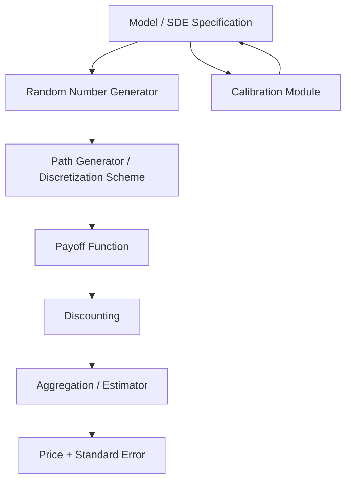

## Building a Monte Carlo Pricing Engine


### Purpose and Applicability

Monte Carlo pricing engines simulate large numbers of random paths for underlying risk factors to estimate the expected discounted payoff of a derivative. They are the method of choice when closed-form solutions do not exist or are impractical — path-dependent payoffs (Asian, barrier, lookback options), multi-asset/multi-factor payoffs (basket options, best-of options), and instruments with early-exercise features combined with high dimensionality (e.g., Bermudan swaptions in multi-factor rate models).

### Core Architectural Components

A production-quality Monte Carlo pricing engine is typically decomposed into distinct, composable modules rather than a single monolithic simulation script:



- **Model specification**: The stochastic differential equation(s) governing the underlying risk factor(s) (e.g., Geometric Brownian Motion, Heston, SABR, Hull-White)
- **Random number generator**: Pseudo-random (Mersenne Twister) or quasi-random (Sobol, Halton) sequence generation
- **Path generator**: Discretization scheme (Euler-Maruyama, Milstein, exact simulation where available) that converts random draws into simulated paths
- **Payoff function**: Maps a simulated path (or terminal value) to a cash flow
- **Discounting**: Converts future cash flows to present value using the appropriate discount curve
- **Aggregation/estimator**: Computes the sample mean (price estimate) and sample standard error across all simulated paths

### Step 1: Model Specification

For a basic Black-Scholes-type single-asset model, the SDE under the risk-neutral measure is:

$$dS_t = r S_t \, dt + \sigma S_t \, dW_t$$

The exact (non-discretized) solution, used when available to avoid discretization bias entirely:

$$S_T = S_0 \exp\left[\left(r - \frac{1}{2}\sigma^2\right)T + \sigma \sqrt{T} Z\right], \quad Z \sim N(0,1)$$

For models without closed-form transition densities (e.g., Heston stochastic volatility), discretization schemes are required.

### Step 2: Random Number Generation

```python
import numpy as np

def generate_normals(n_paths, n_steps, seed=None, antithetic=False):
    rng = np.random.default_rng(seed)
    if antithetic:
        half = n_paths // 2
        Z_half = rng.standard_normal((half, n_steps))
        Z = np.vstack([Z_half, -Z_half])
    else:
        Z = rng.standard_normal((n_paths, n_steps))
    return Z
```

**Antithetic variates** reduce variance by pairing each random draw $Z$ with its mirror $-Z$, exploiting negative correlation between paired paths to reduce estimator variance without increasing the number of independent random draws.

**Quasi-random (low-discrepancy) sequences** such as Sobol sequences improve convergence rate from the standard Monte Carlo $O(N^{-1/2})$ toward $O((\log N)^d / N)$ for suitably smooth payoffs, particularly effective in lower-dimensional problems.

```python
from scipy.stats import qmc

sampler = qmc.Sobol(d=1, scramble=True, seed=42)
n_paths = 2**16  # Sobol sequences are most effective at powers of 2
uniform_samples = sampler.random(n_paths)
normal_samples = qmc.MultivariateNormalQMC(mean=[0], cov=[[1]], seed=42).random(n_paths)
```

### Step 3: Path Generation and Discretization

**Euler-Maruyama scheme** (general-purpose, first-order weak convergence):

$$S_{t+\Delta t} = S_t + r S_t \Delta t + \sigma S_t \sqrt{\Delta t} \, Z$$

```python
def euler_gbm_paths(S0, r, sigma, T, n_steps, n_paths, seed=None):
    rng = np.random.default_rng(seed)
    dt = T / n_steps
    Z = rng.standard_normal((n_paths, n_steps))
    S = np.empty((n_paths, n_steps + 1))
    S[:, 0] = S0
    for t in range(1, n_steps + 1):
        S[:, t] = S[:, t-1] + r * S[:, t-1] * dt + sigma * S[:, t-1] * np.sqrt(dt) * Z[:, t-1]
    return S
```

**Exact log-Euler scheme for GBM** (avoids discretization bias since GBM admits a closed-form transition density):

```python
def exact_gbm_paths(S0, r, sigma, T, n_steps, n_paths, seed=None):
    rng = np.random.default_rng(seed)
    dt = T / n_steps
    Z = rng.standard_normal((n_paths, n_steps))
    increments = (r - 0.5*sigma**2)*dt + sigma*np.sqrt(dt)*Z
    log_paths = np.cumsum(increments, axis=1)
    log_paths = np.hstack([np.zeros((n_paths, 1)), log_paths])
    return S0 * np.exp(log_paths)
```

For GBM specifically, the exact scheme should be preferred over Euler-Maruyama since it eliminates discretization bias entirely at no extra computational cost. Euler-Maruyama becomes necessary for models without closed-form transition densities, such as Heston.

**Milstein scheme** (adds a second-order correction term, improving strong convergence order from $O(\sqrt{\Delta t})$ to $O(\Delta t)$):

$$S_{t+\Delta t} = S_t + r S_t \Delta t + \sigma S_t \sqrt{\Delta t}\, Z + \frac{1}{2}\sigma^2 S_t \Delta t (Z^2 - 1)$$

### Step 4: Payoff Functions

```python
def european_call_payoff(S_terminal, K):
    return np.maximum(S_terminal - K, 0)

def asian_call_payoff(S_paths, K):
    average_price = S_paths[:, 1:].mean(axis=1)  # exclude t=0
    return np.maximum(average_price - K, 0)

def up_and_out_call_payoff(S_paths, K, barrier):
    breached = np.any(S_paths >= barrier, axis=1)
    terminal_payoff = np.maximum(S_paths[:, -1] - K, 0)
    return np.where(breached, 0.0, terminal_payoff)

def lookback_call_payoff(S_paths, K=None):
    max_price = S_paths.max(axis=1)
    return max_price - S_paths[:, -1]  # floating strike variant, illustrative
```

### Step 5: Discounting and Price Estimation

```python
def price_estimate(payoffs, r, T):
    discounted = np.exp(-r * T) * payoffs
    price = discounted.mean()
    std_error = discounted.std(ddof=1) / np.sqrt(len(payoffs))
    return price, std_error
```

The **standard error** shrinks proportionally to $1/\sqrt{N}$, meaning a 4x increase in path count is required to halve the standard error — a key practical constraint motivating variance reduction techniques over brute-force path count increases.

### Full Worked Example: Pricing an Asian Call Option

```python
import numpy as np

def price_asian_call(S0, K, T, r, sigma, n_steps=252, n_paths=100000, seed=42):
    S_paths = exact_gbm_paths(S0, r, sigma, T, n_steps, n_paths, seed)
    payoffs = asian_call_payoff(S_paths, K)
    price, se = price_estimate(payoffs, r, T)
    return price, se

price, se = price_asian_call(S0=100, K=100, T=1.0, r=0.03, sigma=0.25)
print(f"Asian call price: {price:.4f} ± {1.96*se:.4f} (95% CI)")
```

Unlike European options, Asian options generally do not admit a simple closed-form solution under GBM (the arithmetic average of lognormal variables is not itself lognormal), making Monte Carlo (or specialized approximation methods) a standard pricing approach for this payoff type.

### Variance Reduction Techniques

| Technique | Mechanism | Typical Effectiveness |
| --- | --- | --- |
| Antithetic variates | Pairs $Z$ and $-Z$ draws | Moderate; simple to implement |
| Control variates | Uses a correlated instrument with known closed-form price to correct the estimator | High when a well-correlated control exists (e.g., geometric Asian as control for arithmetic Asian) |
| Importance sampling | Shifts sampling distribution toward significant payoff regions | High for deep out-of-the-money / rare-event pricing |
| Stratified sampling | Divides sample space into strata, samples each proportionally | Moderate-to-high, dimension-dependent |
| Quasi-Monte Carlo (Sobol) | Low-discrepancy deterministic sequences | High in low-to-moderate dimensions |

**Control variate example** (geometric Asian as control for arithmetic Asian, which has a closed-form solution under GBM):

```python
def geometric_asian_closed_form(S0, K, T, r, sigma, n_steps):
    # Adjusted volatility and drift for the geometric average closed-form formula
    sigma_G = sigma * np.sqrt((2*n_steps + 1) / (6*(n_steps + 1)))
    r_G = 0.5*(r - 0.5*sigma**2) + 0.5*sigma_G**2
    d1 = (np.log(S0/K) + (r_G + 0.5*sigma_G**2)*T) / (sigma_G*np.sqrt(T))
    d2 = d1 - sigma_G*np.sqrt(T)
    from scipy.stats import norm
    return np.exp(-r*T) * (S0*np.exp(r_G*T)*norm.cdf(d1) - K*norm.cdf(d2))

def price_asian_call_with_control_variate(S0, K, T, r, sigma, n_steps=252, n_paths=100000, seed=42):
    S_paths = exact_gbm_paths(S0, r, sigma, T, n_steps, n_paths, seed)
    arithmetic_payoffs = asian_call_payoff(S_paths, K)
    geo_avg = np.exp(np.log(S_paths[:, 1:]).mean(axis=1))
    geometric_payoffs = np.maximum(geo_avg - K, 0)

    geo_closed_form = geometric_asian_closed_form(S0, K, T, r, sigma, n_steps)
    covariance = np.cov(arithmetic_payoffs, geometric_payoffs)[0, 1]
    beta = covariance / np.var(geometric_payoffs)

    adjusted_payoffs = arithmetic_payoffs - beta * (geometric_payoffs - np.exp(r*T)*geo_closed_form)
    return price_estimate(adjusted_payoffs, r, T)
```

### Greeks via Monte Carlo

**Finite difference (bump-and-reprice)**: Simplest but computationally expensive and requires the same random seed across bumped scenarios to avoid introducing spurious Monte Carlo noise into the Greek estimate.

```python
def delta_bump_and_reprice(price_fn, S0, bump=0.01, seed=42, **kwargs):
    price_up, _ = price_fn(S0=S0*(1+bump), seed=seed, **kwargs)
    price_down, _ = price_fn(S0=S0*(1-bump), seed=seed, **kwargs)
    return (price_up - price_down) / (2 * S0 * bump)
```

**Pathwise differentiation** and **likelihood ratio method** are more efficient analytic alternatives to bump-and-reprice, avoiding the additional simulation noise introduced by finite differencing, though they require payoff-specific derivations (pathwise differentiation requires the payoff to be differentiable almost everywhere, which fails for discontinuous payoffs like digital options without modification).

**Automatic differentiation** (via PyTorch, JAX, or TensorFlow) is an increasingly common modern approach, computing exact pathwise derivatives of the simulation graph without manual derivation.

```python
import torch

def price_asian_call_autodiff(S0, K, T, r, sigma, n_steps=252, n_paths=100000, seed=42):
    torch.manual_seed(seed)
    S0_t = torch.tensor(S0, requires_grad=True)
    dt = T / n_steps
    Z = torch.randn(n_paths, n_steps)
    increments = (r - 0.5*sigma**2)*dt + sigma*torch.sqrt(torch.tensor(dt))*Z
    log_paths = torch.cumsum(increments, dim=1)
    S_paths = S0_t * torch.exp(log_paths)
    avg_price = S_paths.mean(dim=1)
    payoff = torch.clamp(avg_price - K, min=0)
    price = torch.exp(torch.tensor(-r*T)) * payoff.mean()
    price.backward()
    return price.item(), S0_t.grad.item()  # price, delta
```

### Convergence Validation

Standard validation practice compares the Monte Carlo estimate against a known closed-form benchmark on a simplified version of the payoff (e.g., testing the European call path against Black-Scholes before trusting the same engine on a path-dependent variant):

```python
def test_mc_converges_to_black_scholes():
    S_paths = exact_gbm_paths(S0=100, r=0.03, sigma=0.2, T=1.0, n_steps=1, n_paths=1000000, seed=1)
    payoffs = european_call_payoff(S_paths[:, -1], K=100)
    mc_price, se = price_estimate(payoffs, r=0.03, T=1.0)
    bs_price = bs_call_price(100, 100, 1.0, 0.03, 0.2)
    assert abs(mc_price - bs_price) < 3 * se
```

### Performance and Numerical Considerations

- **Vectorization**: NumPy array-based path generation (as shown above) is substantially faster than Python-level loops over paths; the loop-based Euler example is retained above for pedagogical clarity but a production implementation would vectorize the time-stepping loop where the discretization scheme allows
- **Memory**: Storing full path histories (`n_paths × n_steps` arrays) can be memory-intensive for high path counts and fine time granularity; streaming/chunked simulation is used when memory becomes a constraint
- **GPU acceleration**: Libraries like PyTorch, JAX, and CuPy can offload path simulation to GPU for substantial speedups on large-scale simulations, particularly valuable for multi-factor models or extensive Greek/sensitivity calculations
- **Random seed management**: Reproducibility in testing and Greek calculation via bump-and-reprice requires careful, explicit seed control across simulation runs

[Inference] The relative benefit of GPU acceleration versus optimized CPU vectorization depends on problem dimensionality, path/step counts, and hardware; it should be benchmarked for the specific pricing problem rather than assumed as a universal improvement.

### Common Implementation Pitfalls

- Using Euler discretization for models with closed-form exact solutions (introduces unnecessary discretization bias)
- Reusing random seeds inconsistently across bump-and-reprice Greek calculations, contaminating the sensitivity estimate with simulation noise
- Insufficient path count for tail-sensitive payoffs (e.g., deep out-of-the-money options, barrier options near the barrier), leading to high relative standard error despite an acceptable absolute price
- Failing to validate a discretization scheme's convergence rate empirically for the actual payoff being priced, rather than for the underlying asset alone

**Related Topics**

- Variance reduction techniques in depth: importance sampling and stratified sampling
- Multi-asset and multi-factor Monte Carlo (correlated Brownian motion simulation, Cholesky decomposition)
- Longstaff-Schwartz least-squares Monte Carlo for American/Bermudan option pricing
- GPU-accelerated simulation frameworks (CuPy, JAX, PyTorch)
- Automatic differentiation for Greeks (adjoint algorithmic differentiation / AAD)
- Heston and SABR stochastic volatility model simulation schemes