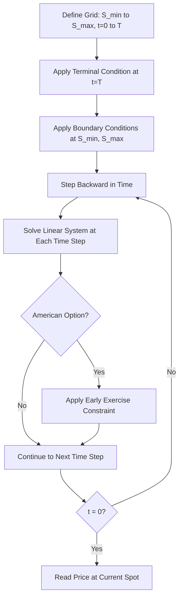
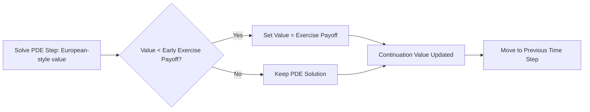

## Building a Finite Difference Solver


### Purpose and Applicability

Finite difference (FD) methods solve the partial differential equations (PDEs) governing derivative prices by discretizing both the underlying asset price (or state variable) space and time into a grid, then approximating derivatives with algebraic difference equations. FD methods are the standard alternative to Monte Carlo for problems involving early exercise (American options) and low-dimensional state spaces (typically one to three factors), where grid-based methods remain computationally tractable and naturally handle early-exercise boundaries without the additional complexity Monte Carlo requires (e.g., Longstaff-Schwartz regression).

### The Black-Scholes PDE

The governing PDE for a derivative $V(S,t)$ under Black-Scholes dynamics:

$$\frac{\partial V}{\partial t} + \frac{1}{2}\sigma^2 S^2 \frac{\partial^2 V}{\partial S^2} + rS\frac{\partial V}{\partial S} - rV = 0$$

subject to a terminal condition at maturity $V(S,T) = \text{payoff}(S)$ and boundary conditions as $S \to 0$ and $S \to \infty$. Since the terminal condition is known and the solution is computed backward in time toward $t=0$, this is solved as a backward-in-time problem, typically after a change of variable $\tau = T - t$ to convert it into a forward-in-time heat-equation-like form.

### Grid Discretization

The $(S, t)$ domain is discretized into a grid with $S$-steps $\Delta S$ and time-steps $\Delta t$:



Central difference approximations for the spatial derivatives at grid point $(i,n)$:

$$\frac{\partial V}{\partial S} \approx \frac{V_{i+1}^n - V_{i-1}^n}{2\Delta S}, \qquad \frac{\partial^2 V}{\partial S^2} \approx \frac{V_{i+1}^n - 2V_i^n + V_{i-1}^n}{(\Delta S)^2}$$

### Explicit Finite Difference Scheme

The explicit scheme evaluates spatial derivatives at the known time level and solves directly for the next (earlier) time level without solving a linear system:

$$V_i^{n-1} = a_i V_{i-1}^n + b_i V_i^n + c_i V_{i+1}^n$$

where the coefficients derive from the discretized PDE. This is computationally simple but is only **conditionally stable** — the time step must satisfy a stability constraint (analogous to the CFL condition), roughly $\Delta t \leq \frac{(\Delta S)^2}{\sigma^2 S_{max}^2}$, which can force impractically small time steps for fine spatial grids.

```python
import numpy as np

def explicit_fd_european_call(S_max, K, T, r, sigma, M, N):
    """
    M: number of asset price steps, N: number of time steps
    """
    dS = S_max / M
    dt = T / N
    S = np.linspace(0, S_max, M + 1)
    V = np.maximum(S - K, 0)  # terminal payoff

    for n in range(N, 0, -1):
        V_new = np.zeros(M + 1)
        for i in range(1, M):
            a = 0.5 * dt * (sigma**2 * i**2 - r * i)
            b = 1 - dt * (sigma**2 * i**2 + r)
            c = 0.5 * dt * (sigma**2 * i**2 + r * i)
            V_new[i] = a * V[i-1] + b * V[i] + c * V[i+1]
        V_new[0] = 0.0
        V_new[M] = S_max - K * np.exp(-r * dt * (N - n + 1))
        V = V_new

    return S, V
```

### Implicit Finite Difference Scheme

The implicit scheme evaluates spatial derivatives at the unknown (new) time level, requiring the solution of a tridiagonal linear system at every time step, but is **unconditionally stable** regardless of the time step size chosen:

$$-a_i V_{i-1}^{n-1} + (1-b_i) V_i^{n-1} - c_i V_{i+1}^{n-1} = V_i^n$$

```python
from scipy.linalg import solve_banded

def implicit_fd_european_call(S_max, K, T, r, sigma, M, N):
    dS = S_max / M
    dt = T / N
    S = np.linspace(0, S_max, M + 1)
    V = np.maximum(S - K, 0)

    ab = np.zeros((3, M - 1))
    for i in range(1, M):
        a = 0.5 * dt * (sigma**2 * i**2 - r * i)
        b = 1 + dt * (sigma**2 * i**2 + r)
        c = 0.5 * dt * (sigma**2 * i**2 + r * i)
        if i > 1:
            ab[0, i-2] = -c
        ab[1, i-1] = b
        if i < M - 1:
            ab[2, i] = -a

    for n in range(N, 0, -1):
        rhs = V[1:M].copy()
        rhs[0] += 0  # boundary contribution at S=0 (typically zero for a call)
        rhs[-1] += 0.5 * dt * (sigma**2 * (M-1)**2 + r * (M-1)) * (S_max - K * np.exp(-r * dt * (N - n + 1)))
        V_inner = solve_banded((1, 1), ab, rhs)
        V[1:M] = V_inner
        V[0] = 0.0
        V[M] = S_max - K * np.exp(-r * dt * (N - n + 1))

    return S, V
```

### Crank-Nicolson Scheme

Crank-Nicolson averages the explicit and implicit schemes, achieving second-order accuracy in both space and time (compared to first-order accuracy in time for pure explicit/implicit schemes) while remaining unconditionally stable:

$$V_i^{n-1} - V_i^n = \frac{1}{2}\left[\mathcal{L}(V^{n-1}) + \mathcal{L}(V^n)\right]\Delta t$$

where $\mathcal{L}$ represents the spatial differential operator. Crank-Nicolson is widely regarded as the standard choice for smooth payoffs due to its superior convergence order, though it can produce spurious oscillations near discontinuous payoffs (e.g., digital options) unless damped with an initial Rannacher smoothing step (a few fully implicit steps at the start before switching to Crank-Nicolson).

```python
def crank_nicolson_fd_european_call(S_max, K, T, r, sigma, M, N):
    dS = S_max / M
    dt = T / N
    S = np.linspace(0, S_max, M + 1)
    V = np.maximum(S - K, 0)

    A = np.zeros((3, M - 1))  # implicit side matrix
    B_diag = np.zeros(M - 1)  # explicit side coefficients (a, b, c stored separately)
    a_arr, b_arr, c_arr = np.zeros(M-1), np.zeros(M-1), np.zeros(M-1)

    for idx, i in enumerate(range(1, M)):
        a = 0.25 * dt * (sigma**2 * i**2 - r * i)
        b = 0.5 * dt * (sigma**2 * i**2 + r)
        c = 0.25 * dt * (sigma**2 * i**2 + r * i)
        a_arr[idx], b_arr[idx], c_arr[idx] = a, b, c
        if idx > 0:
            A[0, idx-1] = -c
        A[1, idx] = 1 + b
        if idx < M - 2:
            A[2, idx+1] = -a

    for n in range(N, 0, -1):
        rhs = np.zeros(M - 1)
        for idx, i in enumerate(range(1, M)):
            left = V[i-1] if i > 1 else 0.0
            right = V[i+1] if i < M - 1 else (S_max - K * np.exp(-r * dt * (N - n)))
            rhs[idx] = a_arr[idx]*left + (1 - b_arr[idx])*V[i] + c_arr[idx]*right
        V_inner = solve_banded((1, 1), A, rhs)
        V[1:M] = V_inner
        V[0] = 0.0
        V[M] = S_max - K * np.exp(-r * dt * (N - n))

    return S, V
```

### Boundary Conditions

Correct boundary condition specification is essential for accuracy near the grid edges:

- **European call**: $V(0,t) = 0$; $V(S_{max}, t) \approx S_{max} - Ke^{-r(T-t)}$ as $S_{max} \to \infty$
- **European put**: $V(0,t) = Ke^{-r(T-t)}$; $V(S_{max}, t) \approx 0$
- **Barrier options**: The barrier level itself often defines a natural grid boundary, with $V=0$ (knock-out) or the rebate value imposed directly at that boundary
- $S_{max}$ is typically chosen as a multiple (commonly 3-5x) of the strike or current spot to keep the artificial boundary far enough from the region of interest that its approximation error does not materially affect the price near the current spot

### Handling American Options: The Free Boundary Problem

American options introduce an early-exercise constraint, transforming the PDE into a **linear complementarity problem (LCP)**. At each time step, after solving the PDE step, the solution must be projected onto the exercise region:

$$V_i^{n-1} = \max\left(V_i^{n-1,\text{PDE}}, \, \text{payoff}(S_i)\right)$$

This is commonly implemented via the **Projected SOR (Successive Over-Relaxation)** method or the **PSOR/Brennan-Schwartz algorithm** for tridiagonal systems, which enforces the constraint directly within the iterative linear solve rather than as a separate post-processing step.

```python
def brennan_schwartz_step(a, b, c, rhs, payoff, omega=1.2, tol=1e-8, max_iter=10000):
    """
    Simplified PSOR solve for one time step of an American option LCP.
    a, b, c: sub/diag/super-diagonal coefficients (arrays)
    rhs: right-hand side vector from the explicit/CN portion
    payoff: early exercise value at each grid point (constraint floor)
    """
    n = len(rhs)
    V = payoff.copy()
    for _ in range(max_iter):
        V_old = V.copy()
        for i in range(n):
            left = V[i-1] if i > 0 else 0.0
            right = V[i+1] if i < n-1 else 0.0
            gs_update = (rhs[i] - a[i]*left - c[i]*right) / b[i]
            V[i] = max(payoff[i], V[i] + omega * (gs_update - V[i]))
        if np.max(np.abs(V - V_old)) < tol:
            break
    return V
```



### Multi-Dimensional Extensions

For two-factor problems (e.g., stochastic volatility models like Heston, or two correlated underlyings in a spread option), the grid becomes 2D, and the linear system at each time step is no longer simply tridiagonal. Standard approaches include:

- **ADI (Alternating Direction Implicit) schemes**: Splits the 2D problem into a sequence of 1D implicit solves along each dimension alternately, preserving the efficiency of tridiagonal solvers
- **Douglas, Craig-Sneyd, and Hundsdorfer-Verwer schemes**: Specific ADI variants commonly used for Heston-type PDEs, differing in how they handle the cross-derivative (mixed partial) term arising from correlation between factors

[Inference] Beyond two to three state variables, finite difference methods generally become computationally impractical due to the curse of dimensionality (grid size grows exponentially with dimension count), which is precisely the regime where Monte Carlo methods become comparatively more efficient.

### Computing Greeks from the Grid

A major practical advantage of finite difference pricing is that Delta and Gamma are obtained essentially for free from the existing grid, without any additional simulation or repricing:

```python
def greeks_from_grid(S, V, spot):
    idx = np.searchsorted(S, spot)
    dS = S[1] - S[0]
    delta = (V[idx+1] - V[idx-1]) / (2 * dS)
    gamma = (V[idx+1] - 2*V[idx] + V[idx-1]) / (dS**2)
    return delta, gamma
```

Theta can similarly be extracted by comparing grid values across adjacent time steps rather than requiring a separate repricing exercise.

### Convergence Testing

Standard validation compares the FD price against the closed-form Black-Scholes price for a vanilla European option before extending the same solver to American or exotic variants:

```python
def test_fd_converges_to_black_scholes():
    S_grid, V_grid = crank_nicolson_fd_european_call(
        S_max=300, K=100, T=1.0, r=0.03, sigma=0.2, M=200, N=200
    )
    idx = np.searchsorted(S_grid, 100)
    fd_price = V_grid[idx]
    bs_price = bs_call_price(100, 100, 1.0, 0.03, 0.2)
    assert abs(fd_price - bs_price) < 0.01  # tolerance depends on grid resolution
```

Convergence should also be checked by successively refining the grid ($M, N \to \infty$) and confirming the price stabilizes rather than drifting, which would indicate a scheme-order or implementation issue rather than genuine numerical convergence.

### Comparison: Explicit vs. Implicit vs. Crank-Nicolson

| Scheme | Stability | Time Accuracy | Computational Cost per Step | Handles Discontinuous Payoffs |
| --- | --- | --- | --- | --- |
| Explicit | Conditional (restrictive $\Delta t$) | First-order | Low (no linear solve) | Reasonably well |
| Implicit | Unconditional | First-order | Moderate (tridiagonal solve) | Well |
| Crank-Nicolson | Unconditional | Second-order | Moderate (tridiagonal solve) | Can oscillate without Rannacher smoothing |

### Common Implementation Pitfalls

- Choosing $S_{max}$ too close to the region of interest, introducing boundary-condition approximation error into the price near current spot
- Applying Crank-Nicolson directly to payoffs with kinks or discontinuities (digital options, barrier options at the barrier) without Rannacher smoothing, producing spurious oscillations in the price and especially in Gamma
- Using the explicit scheme with a time step that violates the stability condition, causing the solution to diverge or oscillate unboundedly
- Failing to correctly re-derive boundary conditions for the specific payoff being priced (boundary conditions for a call differ materially from a put or a barrier option)
- Neglecting to validate against a closed-form benchmark before trusting the solver on exotic or early-exercise payoffs where no independent check is otherwise available

**Related Topics**

- Linear complementarity problems and PSOR for American option pricing
- ADI schemes for multi-factor PDEs (Heston, two-asset spread options)
- Rannacher time-stepping for damping Crank-Nicolson oscillations
- Finite difference methods for interest rate models (Hull-White, Black-Karasinski trees vs. grids)
- Grid non-uniformity and adaptive mesh refinement near strike/barrier levels
- Comparing finite difference and Monte Carlo pricing engine trade-offs