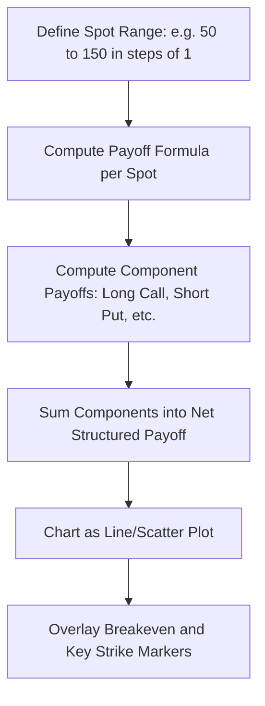
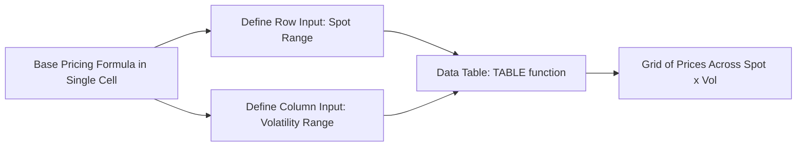

## Spreadsheet Based Structuring Tools


### Scope and Role in Practice

Spreadsheet-based structuring tools remain widely used across trading desks, structuring groups, and sales/marketing functions for rapid prototyping, client-facing illustration, and payoff visualization of structured products and derivatives, despite the growth of Python- and compiled-language-based production pricing systems. Excel's ubiquity, ease of ad-hoc modification, and immediate visual feedback make it a common medium for term sheet generation, scenario analysis, and payoff diagram construction, particularly in structuring and sales contexts where a trading desk's core pricing risk still runs on a dedicated production system.

### Core Excel Functions for Derivatives Structuring

**Native Financial Functions**

Excel provides built-in functions covering basic time-value-of-money and bond mathematics, though these generally do not extend to derivatives pricing beyond the simplest cases:

```plaintext
=NPV(rate, cashflow_range)
=XNPV(rate, cashflows, dates)
=YIELD(settlement, maturity, coupon_rate, price, redemption, frequency)
=PRICE(settlement, maturity, coupon_rate, yield, redemption, frequency)
=NORM.S.DIST(z, cumulative)
=NORM.S.INV(probability)
```

**Black-Scholes Implementation in Native Excel**

A vanilla European option can be implemented directly with native functions, without add-ins:

```plaintext
d1 = (LN(S/K) + (r + 0.5*sigma^2)*T) / (sigma*SQRT(T))
d2 = d1 - sigma*SQRT(T)
Call Price = S*NORM.S.DIST(d1,TRUE) - K*EXP(-r*T)*NORM.S.DIST(d2,TRUE)
Put Price  = K*EXP(-r*T)*NORM.S.DIST(-d2,TRUE) - S*NORM.S.DIST(-d1,TRUE)
```

### Payoff Diagram Construction

A standard structuring workflow builds a payoff table across a range of underlying spot values at maturity, then charts the result:



**Example: Bull Call Spread Payoff Table**

| Spot | Long Call (K=100) | Short Call (K=110) | Net Payoff |
| --- | --- | --- | --- |
| 80 | 0 | 0 | 0 |
| 100 | 0 | 0 | 0 |
| 105 | 5 | 0 | 5 |
| 110 | 10 | 0 | 10 |
| 120 | 20 | -10 | 10 |

Spreadsheet formula for a single row (assuming spot in cell `A2`, strikes in named cells `K1`, `K2`):

```plaintext
=MAX(A2-K1,0) - MAX(A2-K2,0)
```

**Example: Autocallable / Reverse Convertible Illustrative Payoff Logic**

Structured note payoffs with barrier and coupon conditions are commonly built using nested conditional logic:

```plaintext
=IF(Spot_at_Observation >= Autocall_Barrier,
    Notional*(1+Coupon_Rate),
    IF(Final_Spot >= Knock_In_Barrier,
        Notional,
        Notional*(Final_Spot/Initial_Spot)))
```

[Inference] This is a simplified illustrative structure; actual autocallable term sheets typically involve multiple observation dates, memory coupon features, and precise barrier/knock-in conventions that must be modeled with dedicated per-observation-date logic rather than a single nested formula.

### Add-In Ecosystems

**QuantLibXL**

An open source Excel add-in exposing much of the QuantLib C++ library as spreadsheet functions, enabling access to production-grade term structure construction, vanilla/exotic option pricing engines, and day-count/calendar conventions directly from cell formulas rather than requiring a separate coding environment.

```plaintext
=qlBlackScholesMertonProcess(...)
=qlVanillaOption(...)
=qlAnalyticEuropeanEngine(...)
```

[Unverified] Exact function signatures and current maintenance status should be verified against the QuantLibXL project repository, since open source Excel add-in projects can have variable release cadence relative to the core QuantLib C++ library.

**Vendor Add-Ins**

Commercial platforms (Bloomberg's Excel API via `BDP`/`BDH`/`BDS` functions, FINCAD's Excel functions, Numerix) provide production-grade pricing directly within spreadsheet cells, pulling live market data and applying vendor-validated models. These are proprietary and require the relevant license/terminal access.

**Python-Excel Bridges**

Modern workflows increasingly bridge Excel's interface layer with Python's computational backend, keeping Excel as the familiar front-end while offloading heavier numerical work:

- **xlwings**: Enables calling Python functions from Excel cells (via user-defined functions, UDFs) and writing Python scripts that read/write Excel ranges programmatically
- **PyXLL**: Commercial alternative providing similar Python-Excel integration with additional enterprise features (Ribbon customization, async functions)

```python
import xlwings as xw

@xw.func
def bs_call_price_udf(S, K, T, r, sigma):
    d1 = (np.log(S/K) + (r + 0.5*sigma**2)*T) / (sigma*np.sqrt(T))
    d2 = d1 - sigma*np.sqrt(T)
    from scipy.stats import norm
    return S*norm.cdf(d1) - K*np.exp(-r*T)*norm.cdf(d2)
```

Once registered, this Python function can be called directly as a cell formula (`=bs_call_price_udf(A1,B1,C1,D1,E1)`), combining Excel's presentation layer with Python's numerical libraries.

### Scenario and Sensitivity Analysis

**Data Tables**

Excel's built-in Data Table feature (What-If Analysis) is commonly used to generate two-dimensional sensitivity grids (e.g., option price across a grid of spot and volatility values) without manually copying formulas.



**Goal Seek and Solver**

`Goal Seek` is commonly used for simple single-variable calibration tasks (e.g., solving for implied volatility given a market price, by iterating volatility until model price matches target). The `Solver` add-in extends this to multi-variable constrained optimization (e.g., calibrating multiple SABR parameters to fit a full volatility smile simultaneously).

### Structured Product Term Sheet Modeling Patterns

A typical structuring spreadsheet separates:

1. **Input/parameter block**: Notional, strikes, barriers, coupon rates, observation dates, day-count conventions
2. **Market data block**: Spot, discount curve points, volatility inputs (often linked to a live data feed or manually updated)
3. **Payoff/scenario engine**: Formulas computing payoff across scenario spot paths or terminal values
4. **Pricing/valuation block**: Either native Black-Scholes-type formulas, add-in function calls, or Monte Carlo simulation built via `RAND()`/`NORM.S.INV(RAND())` combined with data tables or VBA looping
5. **Output/visualization block**: Payoff diagrams, sensitivity tables, indicative term sheet summary

### Monte Carlo Simulation Within Excel

Basic Monte Carlo simulation can be implemented natively using `RAND()` combined with the inverse normal CDF, though this approach is significantly slower than compiled or vectorized alternatives and is generally suitable only for illustrative or small-scale simulation:

```plaintext
Z = NORM.S.INV(RAND())
S_T = S0 * EXP((r - 0.5*sigma^2)*T + sigma*SQRT(T)*Z)
Payoff = MAX(S_T - K, 0)
```

Repeated across thousands of rows (or via a VBA loop storing results to an array), the mean discounted payoff across rows approximates the option price. [Inference] Native Excel Monte Carlo implementations are generally impractical for production use given RAND()'s recalculation behavior on every worksheet change and the comparative slowness versus vectorized array-based approaches in Python or compiled languages; they remain useful primarily for teaching and small-scale illustrative work.

### VBA for Structuring Automation

VBA (Visual Basic for Applications) remains used for automating repetitive structuring tasks: generating term sheets across multiple strike/barrier combinations, running batch scenario analyses, and building custom payoff functions not easily expressed in native cell formulas.

```vba
Function BlackScholesCall(S As Double, K As Double, T As Double, r As Double, sigma As Double) As Double
    Dim d1 As Double, d2 As Double
    d1 = (Log(S / K) + (r + 0.5 * sigma ^ 2) * T) / (sigma * Sqr(T))
    d2 = d1 - sigma * Sqr(T)
    BlackScholesCall = S * Application.WorksheetFunction.NormSDist(d1) - _
                        K * Exp(-r * T) * Application.WorksheetFunction.NormSDist(d2)
End Function
```

### Limitations and Model Risk Considerations

- **Auditability**: Complex nested formulas and hidden helper cells can obscure calculation logic, complicating independent model validation and increasing operational/model risk
- **Version control**: Spreadsheets lack native version control comparable to source-code repositories, making change tracking and rollback more error-prone without disciplined naming/archiving conventions or external version control layered on top
- **Performance**: Large Monte Carlo simulations or fine-grained finite difference grids are computationally impractical in native Excel compared to vectorized Python or compiled implementations
- **Reconciliation risk**: Structuring desk illustrative spreadsheets and the trading desk's official production pricing system can diverge if not rigorously reconciled, a recognized operational risk in structured product sales processes
- **Formula errors**: Copy-paste formula errors, incorrect absolute/relative cell referencing, and silent circular reference issues are well-documented sources of spreadsheet model risk in financial contexts more broadly

[Inference] Given these limitations, spreadsheet tools are generally positioned in practice as prototyping, illustration, and sales-support tools rather than as the definitive risk-managing pricing system for a trading book, with the latter typically implemented in compiled or Python-based production infrastructure subject to more rigorous model validation and version control processes.

**Related Topics**

- Model validation and independent price verification (IPV) processes for spreadsheet models
- xlwings and PyXLL architecture for Python-Excel integration
- VBA automation patterns for structured product term sheet generation
- QuantLibXL setup and function reference
- Spreadsheet risk management and operational controls in financial modeling
- Transitioning structuring prototypes from Excel to production Python/QuantLib systems