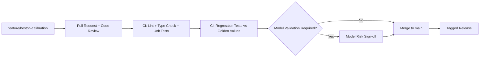
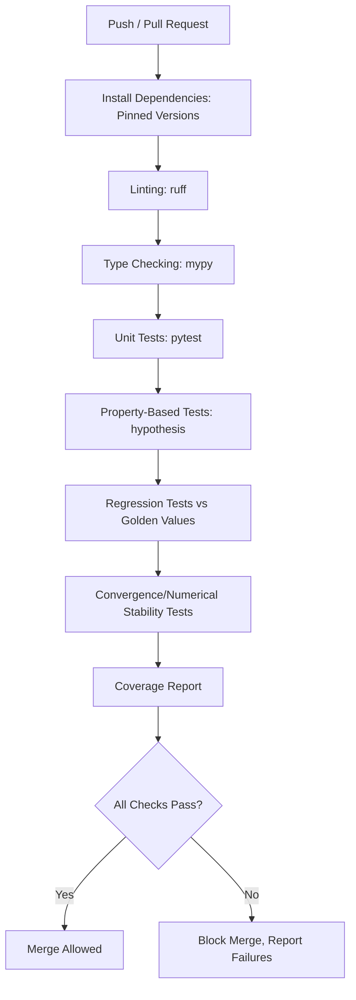

## Code Quality and Version Control for Quant Libraries


### Scope and Motivation

Quantitative finance code carries unusual stakes relative to typical software: a subtle bug in a pricing model or risk calculation can lead directly to mispriced trades, incorrect P&L attribution, or regulatory reporting errors. Code quality and version control practices for quant libraries therefore emphasize reproducibility, auditability, and rigorous testing to a degree that goes beyond general software engineering norms, while still drawing on the same underlying toolchain (Git, CI/CD, linters, type checkers).

### Version Control Practices with Git

**Repository Structure for Quant Libraries**

```plaintext
quant-library/
├── src/
│   └── quantlib_wrapper/
│       ├── __init__.py
│       ├── pricing/
│       │   ├── black_scholes.py
│       │   ├── monte_carlo.py
│       │   └── finite_difference.py
│       ├── curves/
│       └── risk/
├── tests/
│   ├── unit/
│   ├── integration/
│   └── regression/
├── docs/
├── .github/workflows/
├── pyproject.toml
├── CHANGELOG.md
└── README.md
```

**Branching Strategy**

Quant teams commonly adopt a trunk-based or Git-flow-adjacent strategy, with particular emphasis on protecting the main/production branch:

- **main/master**: Reflects the currently validated, production-deployed state of pricing logic
- **feature branches**: Isolated development of new models or model changes, merged via pull/merge request with mandatory review
- **release branches**: Used when a formal model validation sign-off process must occur before a version is promoted, common in regulated trading environments



**Commit Discipline**

Atomic commits (one logical change per commit) with descriptive messages are particularly valuable in quant codebases for `git bisect`-based root-cause analysis when a pricing discrepancy is later discovered — being able to isolate the exact commit that changed a model's numerical output is often central to post-incident investigation.

```plaintext
git bisect start
git bisect bad HEAD
git bisect good v2.3.1
# Git checks out a midpoint commit; run pricing regression test at each step
git bisect run pytest tests/regression/test_pricing_golden_values.py
```

**Tagging and Release Versioning**

Semantic versioning (`MAJOR.MINOR.PATCH`) is standard, with particular discipline around what constitutes a "breaking" change in a quant library context — a change that alters numerical output for existing inputs (e.g., a bug fix that changes a previously-wrong price) is often treated as a major or carefully-flagged change, since it can silently affect downstream risk numbers if not clearly communicated.

```plaintext
git tag -a v3.2.0 -m "Add Heston stochastic volatility calibration module"
git push origin v3.2.0
```

### Code Quality Tooling

**Static Analysis and Linting**

```plaintext
# pyproject.toml excerpt
[tool.ruff]
line-length = 100
select = ["E", "F", "W", "I", "N", "UP"]

[tool.mypy]
strict = true
disallow_untyped_defs = true
warn_return_any = true
```

Type checking (via `mypy` or `pyright`) is particularly valued in quant codebases because numerical functions frequently accept arrays, scalars, or pandas Series interchangeably, and type errors in this context (e.g., accidentally broadcasting a scalar where a per-path array was expected) can silently produce incorrect results rather than raising an obvious runtime error.

```python
from typing import Union
import numpy as np
import numpy.typing as npt

def black_scholes_call(
    S: Union[float, npt.NDArray[np.float64]],
    K: float,
    T: float,
    r: float,
    sigma: float,
) -> Union[float, npt.NDArray[np.float64]]:
    ...
```

**Pre-commit Hooks**

```plaintext
# .pre-commit-config.yaml
repos:
  - repo: https://github.com/astral-sh/ruff-pre-commit
    rev: v0.6.0
    hooks:
      - id: ruff
  - repo: https://github.com/pre-commit/mirrors-mypy
    rev: v1.11.0
    hooks:
      - id: mypy
```

### Testing Strategy for Quant Libraries

**Unit Tests: Closed-Form Validation**

Every pricing function should be tested against known closed-form or independently-verified benchmarks wherever they exist, rather than only testing code paths for execution without error.

```python
import pytest
import numpy as np

class TestBlackScholes:
    def test_call_price_known_value(self):
        # Benchmark value from a standard reference textbook/source
        price = black_scholes_call(S=100, K=100, T=1.0, r=0.05, sigma=0.2)
        assert price == pytest.approx(10.4506, abs=1e-4)

    def test_put_call_parity(self):
        S, K, T, r, sigma = 100, 105, 0.5, 0.03, 0.25
        call = black_scholes_call(S, K, T, r, sigma)
        put = black_scholes_put(S, K, T, r, sigma)
        assert (call - put) == pytest.approx(S - K * np.exp(-r * T), abs=1e-8)

    def test_deep_itm_call_converges_to_intrinsic(self):
        price = black_scholes_call(S=1000, K=100, T=0.01, r=0.03, sigma=0.2)
        assert price == pytest.approx(1000 - 100 * np.exp(-0.03 * 0.01), abs=0.5)
```

**Property-Based Testing**

Property-based testing (via `hypothesis`) validates invariants across randomly generated inputs rather than only fixed test cases, which is particularly effective for catching edge-case failures in numerical code:

```python
from hypothesis import given, strategies as st

@given(
    S=st.floats(min_value=1, max_value=1000),
    K=st.floats(min_value=1, max_value=1000),
    T=st.floats(min_value=0.01, max_value=5),
    r=st.floats(min_value=-0.05, max_value=0.15),
    sigma=st.floats(min_value=0.01, max_value=2.0),
)
def test_call_price_always_nonnegative(S, K, T, r, sigma):
    price = black_scholes_call(S, K, T, r, sigma)
    assert price >= 0

@given(S=st.floats(min_value=1, max_value=1000), K=st.floats(min_value=1, max_value=1000))
def test_call_price_monotonic_in_spot(S, K):
    price_low = black_scholes_call(S, K, 1.0, 0.03, 0.2)
    price_high = black_scholes_call(S * 1.01, K, 1.0, 0.03, 0.2)
    assert price_high >= price_low
```

**Regression Tests Against Golden Values**

A "golden value" or "golden master" regression test suite stores previously validated outputs for a fixed set of inputs and fails if any code change alters those outputs unexpectedly, serving as a safety net against unintentional behavior changes in refactoring:

```python
import json
import pytest

@pytest.fixture
def golden_values():
    with open("tests/regression/golden_values.json") as f:
        return json.load(f)

def test_monte_carlo_matches_golden_values(golden_values):
    for case in golden_values["asian_call_cases"]:
        price, _ = price_asian_call(**case["inputs"], seed=42)
        assert price == pytest.approx(case["expected_price"], rel=1e-6)
```

**Convergence Tests**

Numerical methods (Monte Carlo, finite difference) require dedicated convergence tests verifying the method approaches the correct answer as discretization is refined, distinct from single-point value checks:

```python
def test_fd_grid_convergence():
    prices = []
    for M in [50, 100, 200, 400]:
        _, V = crank_nicolson_fd_european_call(300, 100, 1.0, 0.03, 0.2, M, M)
        idx = np.searchsorted(np.linspace(0, 300, M+1), 100)
        prices.append(V[idx])
    errors = [abs(p - bs_call_price(100,100,1.0,0.03,0.2)) for p in prices]
    # Errors should shrink as grid is refined (approximately monotonically for CN scheme)
    assert errors[-1] < errors[0]
```

**Random Seed Determinism**

Monte Carlo-based tests must fix random seeds explicitly to ensure deterministic, reproducible CI results; without this, intermittent test failures ("flaky tests") arise purely from random sampling variance rather than genuine code defects.

### Continuous Integration Pipeline Design



```plaintext
# .github/workflows/ci.yml (illustrative structure)
name: CI
on: [push, pull_request]
jobs:
  test:
    runs-on: ubuntu-latest
    steps:
      - uses: actions/checkout@v4
      - uses: actions/setup-python@v5
        with:
          python-version: "3.11"
      - run: pip install -e ".[dev]"
      - run: ruff check .
      - run: mypy src/
      - run: pytest --cov=src --cov-report=xml tests/
```

### Dependency and Environment Reproducibility

Pinning exact dependency versions (via `pyproject.toml`/`poetry.lock`, `requirements.txt` with hashes, or `conda-lock`) is critical in quant libraries because numerical results from Monte Carlo simulation, optimization routines, and even floating-point summation order can shift subtly between library versions (e.g., changes to NumPy's default random number generator algorithm across major versions, or changes to SciPy's optimizer default tolerances).

```plaintext
# poetry.lock ensures byte-for-byte reproducible dependency resolution
[tool.poetry.dependencies]
python = "^3.11"
numpy = "1.26.4"
scipy = "1.13.1"
QuantLib = "1.34"
```

[Inference] The practical significance of version pinning strictness scales with how sensitive a given model's output is to underlying library internals; simple closed-form pricing formulas are generally more version-stable than Monte Carlo simulations or numerical optimization-heavy calibration routines.

### Code Review Practices Specific to Quant Code

- **Mathematical derivation review**: Reviewers with quantitative finance background verify that the implemented formula correctly matches the intended mathematical model, not merely that the code executes without error
- **Numerical stability review**: Checking for catastrophic cancellation, division by near-zero values (e.g., very short time-to-maturity in Black-Scholes formulas), and appropriate handling of edge cases (zero volatility, zero time)
- **Units and convention consistency**: Verifying consistent treatment of annualized vs. period rates, continuous vs. discrete compounding, and day-count conventions across a codebase, which are common sources of subtle pricing discrepancies
- **Benchmark comparison requirement**: Many quant teams require new pricing functionality to include a comparison against an independent reference (published academic values, an alternative open source library, or a vendor system) as part of the pull request itself

### Documentation Standards

```python
def heston_call_price(
    S0: float, K: float, T: float, r: float,
    v0: float, kappa: float, theta: float, sigma_v: float, rho: float,
) -> float:
    """
    Price a European call option under the Heston stochastic volatility model
    using the semi-analytic characteristic function approach.

    Parameters
    ----------
    S0 : float
        Initial spot price of the underlying.
    K : float
        Strike price.
    T : float
        Time to maturity, in years.
    r : float
        Continuously compounded risk-free rate.
    v0 : float
        Initial variance.
    kappa : float
        Mean reversion speed of variance.
    theta : float
        Long-run mean variance.
    sigma_v : float
        Volatility of variance (vol-of-vol).
    rho : float
        Correlation between asset and variance Brownian motions.

    Returns
    -------
    float
        European call option price.

    Notes
    -----
    Requires the Feller condition (2*kappa*theta > sigma_v**2) for the
    variance process to remain strictly positive in continuous time;
    violation does not invalidate the pricing formula but indicates the
    variance process can theoretically reach zero.

    References
    ----------
    Heston, S. L. (1993). A Closed-Form Solution for Options with Stochastic
    Volatility with Applications to Bond and Currency Options.
    """
```

Docstrings referencing the specific mathematical model, required parameter constraints (e.g., the Feller condition above), and academic source are considered standard practice, since quant code documentation must communicate the underlying model assumptions, not merely the software interface.

### Model Risk and Change Management Integration

In regulated institutional settings, code changes to pricing models are often subject to **model risk management (MRM)** governance layered on top of standard software version control: a formal model validation and sign-off process, independent of the development team, before a materially changed pricing model reaches production. Version control tooling (tagged releases, protected branches, mandatory approval gates in CI/CD) is frequently used as the technical enforcement mechanism for this governance requirement, linking a specific validated model version tag to its corresponding sign-off documentation.

**Related Topics**

- Model risk management (MRM) governance frameworks (e.g., SR 11-7-style guidance)
- Property-based testing with hypothesis for numerical code
- Reproducible environments with poetry, conda-lock, and Docker for quant research
- Golden master / regression testing patterns for numerical libraries
- Numerical stability and floating-point precision pitfalls in derivatives pricing code
- Independent price verification (IPV) as an organizational complement to code-level testing