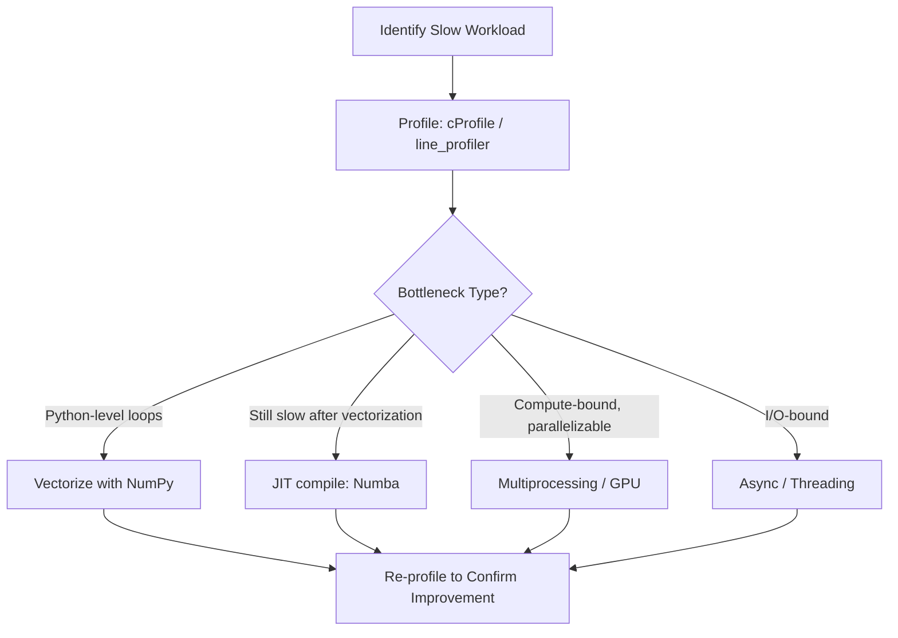
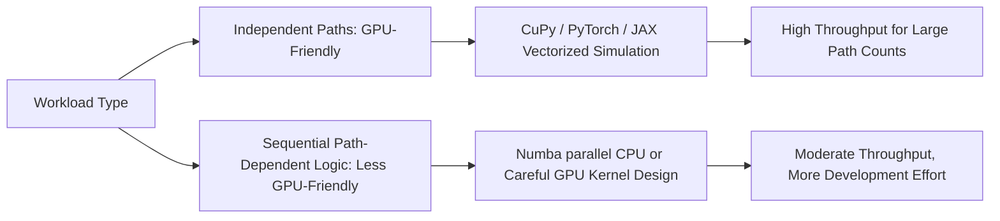

## Performance Optimization and Parallel Computing


### Scope and Motivation

Derivatives pricing and risk workloads are frequently computationally intensive: Monte Carlo simulations require large path counts for acceptable statistical precision, finite difference grids scale poorly with dimensionality, and end-of-day risk calculations (full portfolio Greeks, VaR, XVA) require repricing thousands of instruments under many scenarios within tight batch windows. Performance optimization and parallel computing techniques allow these workloads to complete within practical time and cost budgets.

### Profiling Before Optimizing

Standard practice is to profile before optimizing, since intuition about bottleneck location is frequently wrong, particularly in vectorized numerical Python code where the bottleneck may be memory allocation, data conversion, or Python-level overhead rather than the core arithmetic itself.

```python
import cProfile
import pstats

profiler = cProfile.Profile()
profiler.enable()
price_asian_call_with_control_variate(S0=100, K=100, T=1.0, r=0.03, sigma=0.25, n_paths=500000)
profiler.disable()

stats = pstats.Stats(profiler).sort_stats("cumulative")
stats.print_stats(10)
```

Line-level profiling (`line_profiler`) and memory profiling (`memory_profiler`) are used for finer-grained diagnosis once a function-level bottleneck has been identified.



### Vectorization as the First Optimization

Replacing explicit Python loops with array operations is typically the single highest-impact optimization for numerical Python code, often yielding order-of-magnitude improvements before any parallelism is introduced.

```python
import numpy as np

# Loop-based (slow)
def slow_payoff(S_paths, K):
    n_paths = S_paths.shape[0]
    payoffs = np.zeros(n_paths)
    for i in range(n_paths):
        payoffs[i] = max(S_paths[i, -1] - K, 0)
    return payoffs

# Vectorized (fast)
def fast_payoff(S_paths, K):
    return np.maximum(S_paths[:, -1] - K, 0)
```

[Inference] The actual speedup from vectorization varies with array size and operation complexity; for very small arrays, Python-level loop overhead may be negligible relative to other costs, so the benefit is most pronounced at scale.

### Numba: Just-In-Time Compilation

Numba compiles a subset of Python/NumPy code to machine code via LLVM, allowing loop-heavy numerical code (which does not vectorize cleanly, such as path-dependent Monte Carlo with early-exit conditions) to approach compiled-language performance while retaining Python syntax.

```python
from numba import njit, prange
import numpy as np

@njit(parallel=True)
def simulate_barrier_paths(S0, r, sigma, T, barrier, n_steps, n_paths):
    dt = T / n_steps
    payoffs = np.zeros(n_paths)
    for i in prange(n_paths):  # prange enables parallel execution across paths
        S = S0
        breached = False
        for t in range(n_steps):
            z = np.random.standard_normal()
            S = S * np.exp((r - 0.5*sigma**2)*dt + sigma*np.sqrt(dt)*z)
            if S >= barrier:
                breached = True
                break
        payoffs[i] = 0.0 if breached else max(S - S0, 0)  # illustrative payoff
    return payoffs
```

Key Numba considerations:

- `@njit` (no-Python mode) compiles the function to run without the Python interpreter, but only supports a subset of Python and NumPy features — unsupported operations cause compilation to fail or silently fall back to slower object mode unless `nopython=True` is explicitly enforced
- `parallel=True` combined with `prange` enables automatic multi-threaded execution across independent loop iterations (such as independent Monte Carlo paths), exploiting multiple CPU cores without explicit thread management
- First-call compilation overhead ("warm-up") means Numba functions are best suited to workloads called many times or with large inputs, where the one-time compilation cost is amortized

### Cython: Compiled Extensions

Cython compiles Python-like code (with optional static type annotations) to C, offering fine-grained control over performance-critical inner loops, particularly useful when close integration with existing C/C++ libraries is required.

```plaintext
# barrier_pricer.pyx
import numpy as np
cimport numpy as cnp

def simulate_barrier_paths_cy(double S0, double r, double sigma, double T,
                                double barrier, int n_steps, int n_paths):
    cdef double dt = T / n_steps
    cdef cnp.ndarray[double, ndim=1] payoffs = np.zeros(n_paths)
    cdef int i, t
    cdef double S, z
    cdef bint breached

    for i in range(n_paths):
        S = S0
        breached = False
        for t in range(n_steps):
            z = np.random.standard_normal()
            S = S * np.exp((r - 0.5*sigma*sigma)*dt + sigma*(dt**0.5)*z)
            if S >= barrier:
                breached = True
                break
        payoffs[i] = 0.0 if breached else max(S - S0, 0.0)
    return payoffs
```

[Inference] Numba is generally preferred for pure numerical Python/NumPy code due to its lower development friction (no separate build step, JIT at call time), while Cython is more commonly reached for when tighter C-level control, integration with existing C/C++ codebases, or building distributable compiled extension modules is required; the appropriate choice depends on the specific codebase and deployment constraints.

### Multiprocessing: CPU-Bound Parallelism

Python's Global Interpreter Lock (GIL) prevents true multi-threaded parallelism for pure Python CPU-bound code (though NumPy/Numba operations can release the GIL internally). The `multiprocessing` module and `joblib` provide process-based parallelism, appropriate for embarrassingly parallel workloads such as independent Monte Carlo batches or parameter sweeps across a grid of scenarios.

```python
from joblib import Parallel, delayed
import numpy as np

def price_single_scenario(sigma, S0=100, K=100, T=1.0, r=0.03, n_paths=100000):
    S_paths = exact_gbm_paths(S0, r, sigma, T, 252, n_paths, seed=None)
    payoffs = np.maximum(S_paths[:, -1] - K, 0)
    return sigma, np.exp(-r*T) * payoffs.mean()

vol_scenarios = np.linspace(0.10, 0.50, 20)
results = Parallel(n_jobs=-1)(
    delayed(price_single_scenario)(sigma) for sigma in vol_scenarios
)
```

**Considerations for process-based parallelism:**

- Each process has independent memory, so large shared datasets (e.g., a full market data snapshot) incur serialization/deserialization overhead when passed to worker processes — shared memory arrays (`multiprocessing.shared_memory` or `numpy` memory-mapped files) can mitigate this for large arrays
- Random seed management requires explicit per-process seeding to avoid correlated random streams across workers producing spuriously correlated Monte Carlo results
- Process startup overhead makes this approach best suited to coarse-grained parallelism (many independent, moderately-sized tasks) rather than very fine-grained parallel work

### GPU Acceleration

GPUs offer substantial parallelism for problems with many independent, similar computations — a natural fit for Monte Carlo path simulation, where thousands of paths can be simulated simultaneously across GPU cores.

```python
import cupy as cp

def gpu_monte_carlo_call(S0, K, T, r, sigma, n_paths=1_000_000, n_steps=252, seed=42):
    cp.random.seed(seed)
    dt = T / n_steps
    Z = cp.random.standard_normal((n_paths, n_steps))
    increments = (r - 0.5*sigma**2)*dt + sigma*cp.sqrt(dt)*Z
    log_paths = cp.cumsum(increments, axis=1)
    S_T = S0 * cp.exp(log_paths[:, -1])
    payoff = cp.maximum(S_T - K, 0)
    price = cp.exp(-r*T) * cp.mean(payoff)
    return float(price)
```

`CuPy` mirrors the NumPy API closely, allowing many existing vectorized NumPy pricing functions to run on GPU with minimal code changes. `PyTorch` and `JAX` provide similar GPU-accelerated array operations, with the added benefit of automatic differentiation for Greeks computation.



[Inference] GPU acceleration's benefit is most pronounced for large-scale, highly parallel, arithmetically simple workloads; problems with heavy branching logic (e.g., early-exit barrier checks per path) or small problem sizes may see reduced or negative benefit relative to CPU due to GPU kernel launch overhead and reduced parallel efficiency from divergent execution paths across threads.

### Distributed Computing for Large-Scale Risk Calculations

End-of-day portfolio risk calculations (full revaluation VaR, XVA sensitivities across thousands of netting sets) often exceed single-machine capacity and are distributed across compute clusters:

- **Dask**: Provides distributed, parallel NumPy/pandas-like APIs, enabling existing vectorized code to scale across a cluster with comparatively modest code changes
- **Ray**: General-purpose distributed computing framework, commonly used for distributing independent scenario/instrument-level pricing tasks across a cluster
- **Apache Spark**: Used in some large institutional risk infrastructure for distributed batch processing, particularly where integration with existing big-data pipelines is required

```python
import dask.array as da

# Distributed Monte Carlo across a Dask cluster (illustrative)
Z = da.random.standard_normal((10_000_000, 252), chunks=(100_000, 252))
dt = 1.0/252
increments = (0.03 - 0.5*0.2**2)*dt + 0.2*np.sqrt(dt)*Z
log_paths = da.cumsum(increments, axis=1)
S_T = 100 * da.exp(log_paths[:, -1])
payoff = da.maximum(S_T - 100, 0)
price = (np.exp(-0.03*1.0) * payoff.mean()).compute()
```

### Grid Computing in Traditional Bank Risk Infrastructure

[Inference] Larger institutions historically built (and in many cases continue to operate) dedicated internal grid computing infrastructure for overnight risk batch runs, distributing full portfolio revaluation across thousands of compute nodes; specific vendor/architecture details vary substantially by institution and are generally not public information, so this is described here only at the conceptual level rather than with institution-specific specifics.

### Algorithmic Optimization Beyond Raw Compute

Not all performance gains come from parallelism or compiled code — algorithmic improvements often dominate:

- **Variance reduction** (antithetic variates, control variates, importance sampling) reduces the path count needed for a target standard error, which is often more impactful than simply parallelizing a brute-force path count
- **Analytic approximations** (e.g., using a closed-form or semi-analytic approximation as a fast pre-screen, reserving full Monte Carlo/finite difference for final validated pricing) can dramatically reduce compute for screening or intraday indicative pricing use cases
- **Caching and memoization** of expensive intermediate calculations (e.g., discount factors, repeated volatility surface interpolation) avoids redundant recomputation across a large batch of similar pricing requests
- **Sparse grid / adaptive mesh techniques** in finite difference methods concentrate computational effort where the solution changes rapidly (near strikes, barriers), rather than using a uniform fine grid everywhere

```python
from functools import lru_cache

@lru_cache(maxsize=10000)
def discount_factor(curve_id: str, tenor: float) -> float:
    # Expensive curve interpolation, cached for repeated calls with same inputs
    ...
```

### Benchmarking Methodology

Rigorous before/after benchmarking is essential to confirm an optimization actually helps for the target workload, since compiler/JIT warm-up costs, memory allocation patterns, and hardware-specific behavior can produce counterintuitive results:

```python
import time
import numpy as np

def benchmark(fn, *args, n_runs=10, **kwargs):
    times = []
    for _ in range(n_runs):
        start = time.perf_counter()
        fn(*args, **kwargs)
        times.append(time.perf_counter() - start)
    return np.mean(times), np.std(times)

mean_t, std_t = benchmark(simulate_barrier_paths, 100, 0.03, 0.25, 1.0, 120, 100000)
print(f"Mean: {mean_t*1000:.2f}ms ± {std_t*1000:.2f}ms")
```

[Inference] Benchmark results are hardware- and workload-specific; a technique that yields a large speedup on one machine/problem size combination may yield a smaller or negligible improvement on another, so results should be validated in the actual target deployment environment rather than assumed to generalize.

### Decision Framework for Choosing an Optimization Approach

| Situation | Recommended First Approach |
| --- | --- |
| Python loop over NumPy arrays | Vectorize with NumPy first |
| Vectorization not possible (complex path-dependent logic, early exit) | Numba `@njit` |
| Need C-level control or existing C/C++ integration | Cython |
| Many independent, coarse-grained tasks (parameter sweeps, scenario grids) | `multiprocessing` / `joblib` |
| Massive independent path counts, simple per-path arithmetic | GPU (CuPy/PyTorch/JAX) |
| Cluster-scale batch risk calculation | Dask / Ray / Spark |
| Repeated identical expensive calculations | Caching / memoization |
| High standard error relative to path count | Variance reduction before adding more raw compute |

### Common Pitfalls

- Parallelizing before vectorizing, missing the larger and simpler vectorization gain
- Introducing race conditions or non-reproducible results when parallel workers share mutable state or use correlated/identical random seeds across workers
- Assuming GPU acceleration is universally beneficial without accounting for kernel launch overhead, data transfer costs between host and device memory, and reduced efficiency from branch-divergent code
- Over-engineering distributed infrastructure for a problem that a single well-vectorized/JIT-compiled process could handle within acceptable time, adding unnecessary operational complexity
- Neglecting to re-validate numerical correctness after introducing parallelism or GPU execution, since floating-point summation order (and therefore exact numerical results, though not their statistical validity) can differ subtly across execution strategies

**Related Topics**

- Variance reduction techniques for Monte Carlo (control variates, importance sampling)
- Numba deep dive: nopython mode constraints and common compilation failures
- Dask and Ray architecture for distributed quantitative computing
- GPU kernel design considerations for path-dependent derivative pricing
- Caching strategies for curve and volatility surface interpolation in production pricing systems
- Reproducibility and seed management in parallel/distributed Monte Carlo simulation