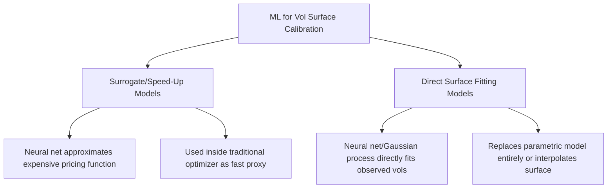
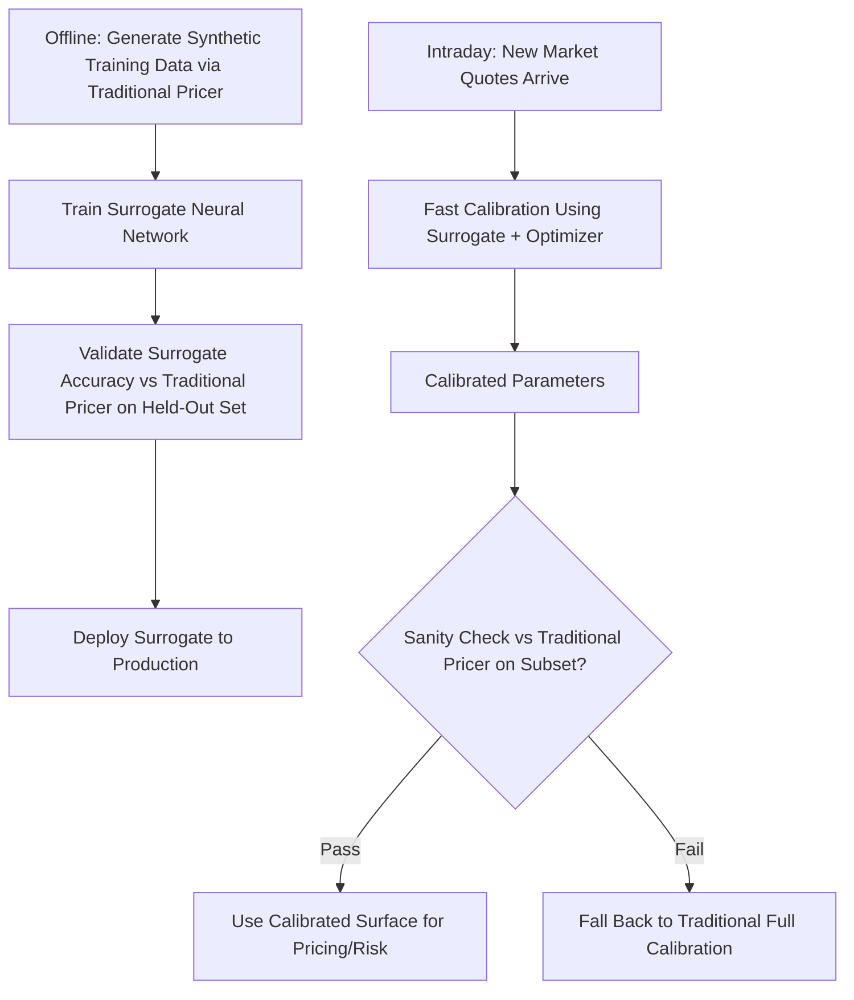

## Machine Learning for Volatility Surface Calibration


### Motivation and Problem Framing

Volatility surface calibration involves finding model parameters (e.g., SABR, Heston, or local volatility surface points) that best reproduce a set of observed market option prices or implied volatilities across strikes and maturities. Traditional calibration relies on iterative numerical optimization (Levenberg-Marquardt, differential evolution) run fresh for each new market snapshot, which can be computationally expensive when repeated intraday across many underlyings or when a full surface re-calibration is needed rapidly after a market move. Machine learning approaches aim to either accelerate this process or directly learn the mapping from market observables to calibrated parameters or surface values.

### Two Distinct ML Use Cases in This Domain



**Surrogate models** replace a computationally expensive step (e.g., repeated Heston or SABR pricing calls within an optimization loop) with a fast neural network approximation, dramatically accelerating the outer calibration loop while still calibrating to a traditional parametric model.

**Direct surface-fitting models** use flexible function approximators (neural networks, Gaussian processes, splines with learned regularization) to fit the implied volatility surface directly from market quotes, either as a replacement for or complement to parametric models like SABR.

### Neural Network Surrogates for Pricing Functions

A common architecture trains a feedforward neural network to approximate the mapping from model parameters and contract terms to option price or implied volatility, replacing repeated calls to a slow closed-form or semi-analytic pricing function (such as the Heston characteristic function integral) during calibration.

```python
import torch
import torch.nn as nn

class HestonSurrogate(nn.Module):
    def __init__(self, input_dim=8, hidden_dim=128):
        super().__init__()
        self.net = nn.Sequential(
            nn.Linear(input_dim, hidden_dim),
            nn.SiLU(),
            nn.Linear(hidden_dim, hidden_dim),
            nn.SiLU(),
            nn.Linear(hidden_dim, hidden_dim),
            nn.SiLU(),
            nn.Linear(hidden_dim, 1),
        )

    def forward(self, x):
        # x: [moneyness, maturity, v0, kappa, theta, sigma_v, rho, r]
        return self.net(x)
```

**Training data generation**: The surrogate is trained on a large synthetic dataset generated by running the traditional (slow) pricer across a wide, representative range of parameter combinations and contract terms, effectively pre-computing the expensive mapping offline so that inference at calibration time is a fast forward pass through the trained network rather than a fresh numerical integration.

```python
import numpy as np

def generate_training_data(n_samples=500000):
    moneyness = np.random.uniform(0.7, 1.3, n_samples)
    maturity = np.random.uniform(0.05, 3.0, n_samples)
    v0 = np.random.uniform(0.01, 0.5, n_samples)
    kappa = np.random.uniform(0.5, 5.0, n_samples)
    theta = np.random.uniform(0.01, 0.5, n_samples)
    sigma_v = np.random.uniform(0.05, 1.0, n_samples)
    rho = np.random.uniform(-0.95, 0.0, n_samples)
    r = np.random.uniform(-0.01, 0.08, n_samples)

    inputs = np.column_stack([moneyness, maturity, v0, kappa, theta, sigma_v, rho, r])
    targets = np.array([
        heston_call_price(1.0, m, T, ri, v0i, ki, ti, sv, rh)
        for m, T, v0i, ki, ti, sv, rh, ri in inputs
    ])
    return inputs, targets
```

Once trained, the surrogate replaces the slow pricer inside a standard gradient-based or gradient-free optimizer, since evaluating the neural network is typically orders of magnitude faster than the original semi-analytic integral, and the network is differentiable, enabling gradient-based calibration even for models whose native pricing formula is not conveniently differentiable in closed form.

```python
from scipy.optimize import minimize

def calibration_objective(params, market_data, surrogate_model):
    kappa, theta, sigma_v, rho, v0 = params
    model_prices = []
    for row in market_data:
        moneyness, maturity, r = row["moneyness"], row["maturity"], row["r"]
        x = torch.tensor([[moneyness, maturity, v0, kappa, theta, sigma_v, rho, r]], dtype=torch.float32)
        model_prices.append(surrogate_model(x).item())
    model_prices = np.array(model_prices)
    market_prices = np.array([row["price"] for row in market_data])
    return np.sum((model_prices - market_prices)**2)

result = minimize(
    calibration_objective, x0=[2.0, 0.04, 0.3, -0.6, 0.04],
    args=(market_option_data, trained_surrogate),
    method="L-BFGS-B",
)
```

### Direct Implied Volatility Surface Fitting

**Gaussian Process Regression**

Gaussian processes provide a natural framework for volatility surface interpolation, offering not only a fitted surface but also a principled uncertainty estimate at each point, which can be valuable for identifying regions (e.g., far out-of-the-money strikes with sparse quotes) where the fit is less reliable.

```python
from sklearn.gaussian_process import GaussianProcessRegressor
from sklearn.gaussian_process.kernels import RBF, WhiteKernel, ConstantKernel

kernel = ConstantKernel(1.0) * RBF(length_scale=[0.1, 0.5]) + WhiteKernel(noise_level=1e-4)
gp = GaussianProcessRegressor(kernel=kernel, n_restarts_optimizer=5)

X_train = np.column_stack([log_moneyness_observed, maturity_observed])
y_train = implied_vol_observed
gp.fit(X_train, y_train)

X_grid = np.column_stack([log_moneyness_grid.ravel(), maturity_grid.ravel()])
vol_pred, vol_std = gp.predict(X_grid, return_std=True)
```

**Neural Network Surface Fitting with No-Arbitrage Constraints**

A direct neural network fit to observed implied volatilities risks producing a surface that admits static arbitrage (calendar spread arbitrage, butterfly arbitrage) if fitted purely to minimize pointwise error without structural constraints. Research and practitioner approaches commonly incorporate soft or hard constraints during training to discourage arbitrage violations:

```python
def arbitrage_penalty(model, log_moneyness_grid, maturity_grid):
    """
    Illustrative soft penalty discouraging calendar-spread arbitrage:
    total implied variance should be non-decreasing in maturity at fixed
    log-moneyness, a standard necessary (though not sufficient on its own)
    condition for absence of calendar arbitrage under commonly-used
    parameterizations of the total variance surface.
    """
    total_var = model(log_moneyness_grid, maturity_grid) ** 2 * maturity_grid
    d_total_var_dT = torch.autograd.grad(
        total_var.sum(), maturity_grid, create_graph=True
    )[0]
    violation = torch.clamp(-d_total_var_dT, min=0)
    return (violation ** 2).mean()

def training_loss(model, market_data, log_moneyness_grid, maturity_grid, lambda_arb=10.0):
    fit_loss = pointwise_fitting_loss(model, market_data)
    arb_loss = arbitrage_penalty(model, log_moneyness_grid, maturity_grid)
    return fit_loss + lambda_arb * arb_loss
```

[Inference] The specific arbitrage conditions enforced, and the exact mathematical formulation of the penalty, vary across published research approaches; the example above illustrates the general pattern (penalizing violations of a known no-arbitrage condition during training) rather than a single standardized industry method.

### SVI (Stochastic Volatility Inspired) Parameterization with ML-Assisted Fitting

The SVI parameterization is a widely used practitioner approach for fitting a single maturity slice of the implied total variance smile with a small number of interpretable parameters:

$$w(k) = a + b\left(\rho(k-m) + \sqrt{(k-m)^2 + \sigma^2}\right)$$

where $w(k)$ is total implied variance at log-moneyness $k$, and $(a, b, \rho, m, \sigma)$ are the five SVI parameters per maturity slice. Machine learning approaches in this space are commonly applied to:

- Learning a fast initial-guess generator for the SVI optimization (a neural network predicting good starting parameters from raw market quotes, reducing the risk of the subsequent local optimizer converging to a poor local minimum)
- Learning cross-maturity parameter relationships to enforce a smooth, arbitrage-consistent full surface (as opposed to independently fitting each maturity slice, which can otherwise introduce calendar arbitrage across slices)

### Practical Architecture for a Production ML-Assisted Calibration Pipeline



A production deployment pattern typically retains the traditional numerical calibration pipeline as a fallback and periodic validation check, using the ML surrogate primarily for speed in the common case while guarding against surrogate approximation error or distributional shift (market conditions moving outside the range covered by the offline training data).

### Model Validation Considerations Specific to This Application

- **Out-of-distribution risk**: A surrogate trained on a historically representative parameter range may perform poorly if market conditions shift the true parameter region outside that training range (e.g., an unprecedented volatility spike pushing $v_0$ or $\sigma_v$ beyond the training data's coverage) — this is a materially different failure mode from a traditional numerical optimizer, which does not have a "training distribution" to fall outside of
- **Surrogate approximation error propagation**: Error introduced by the surrogate model itself compounds with the traditional model-vs-market fitting error; validation should separately quantify surrogate approximation error (surrogate output vs. true pricer output on held-out parameter combinations) from overall calibration quality
- **Differentiability and gradient sanity**: When using automatic differentiation through the surrogate for gradient-based calibration, gradients should be validated against finite-difference approximations to confirm the network has learned a smooth, well-behaved approximation rather than one with spurious local gradient noise
- **Periodic retraining**: Surrogates typically require periodic retraining as market regimes evolve, particularly if calibrated parameter ranges observed in production begin approaching the edges of the original training data distribution

### Comparison: Traditional vs. ML-Assisted Calibration

| Dimension | Traditional Numerical Calibration | ML Surrogate-Accelerated | Direct ML Surface Fit |
| --- | --- | --- | --- |
| Speed per calibration | Slower (many pricer calls) | Fast (single/few network passes per iteration) | Fast (single fit or forward pass) |
| Interpretability | High (standard model parameters) | High (still calibrates same parametric model) | Lower (depends on architecture; SVI-based remains interpretable) |
| Arbitrage-free guarantee | Depends on chosen parametric model's known properties | Same as underlying parametric model | Requires explicit constraints; not automatic |
| Out-of-sample robustness | Not applicable (no training distribution) | Requires monitoring; can degrade outside training range | Requires monitoring; can degrade outside training range |
| Development complexity | Lower (standard optimization libraries) | Higher (requires training pipeline, validation infrastructure) | Higher |

### Illustrative End-to-End Workflow Example

```python
# 1. Generate offline training data (once, periodically refreshed)
X_train, y_train = generate_training_data(n_samples=1_000_000)

# 2. Train surrogate
surrogate = HestonSurrogate()
optimizer = torch.optim.Adam(surrogate.parameters(), lr=1e-3)
X_tensor = torch.tensor(X_train, dtype=torch.float32)
y_tensor = torch.tensor(y_train, dtype=torch.float32).unsqueeze(1)

for epoch in range(200):
    optimizer.zero_grad()
    pred = surrogate(X_tensor)
    loss = nn.functional.mse_loss(pred, y_tensor)
    loss.backward()
    optimizer.step()

# 3. Validate against held-out traditional pricer calls
X_val, y_val = generate_training_data(n_samples=5000)
with torch.no_grad():
    val_pred = surrogate(torch.tensor(X_val, dtype=torch.float32)).numpy().flatten()
val_error = np.abs(val_pred - y_val)
print(f"Max surrogate error: {val_error.max():.6f}, Mean: {val_error.mean():.6f}")

# 4. Use surrogate inside fast intraday calibration
calibrated_params = minimize(
    calibration_objective, x0=[2.0, 0.04, 0.3, -0.6, 0.04],
    args=(todays_market_quotes, surrogate), method="L-BFGS-B"
)
```

### Limitations and Open Practical Concerns

- [Inference] Published academic results on ML-accelerated calibration generally report substantial speed-ups (often several orders of magnitude) relative to full numerical calibration, but exact figures are architecture-, model-, and hardware-dependent and should not be assumed to transfer directly across different implementations or underlying models
- Neural network surrogates introduce a model risk layer of their own (the surrogate's approximation error) on top of the traditional model risk (how well the parametric model, e.g., Heston, fits real market behavior), requiring validation practices for both layers rather than only the traditional one
- Regulatory and internal model risk management frameworks in many institutions require explicit documentation and validation of any ML component used in a pricing or risk pipeline, which can add governance overhead not present with purely traditional numerical methods
- Direct surface-fitting approaches without careful arbitrage constraints can produce surfaces that look reasonable pointwise but imply arbitrage opportunities under certain trading strategies (calendar spreads, butterflies), making arbitrage validation a mandatory post-fit check rather than an optional one

**Related Topics**

- SABR and Heston model calibration via traditional numerical optimization
- No-arbitrage conditions for implied volatility surfaces (Roper's conditions, Gatheral's SVI arbitrage constraints)
- Gaussian process regression fundamentals and kernel selection
- Model risk management frameworks for machine learning components in pricing systems
- Automatic differentiation for gradient-based calibration
- Physics-informed neural networks (PINNs) applied to option pricing PDEs