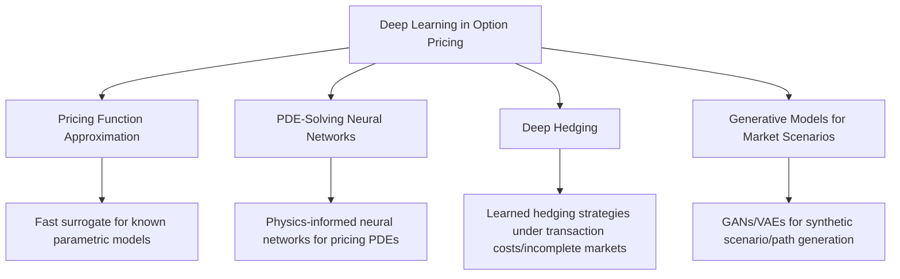
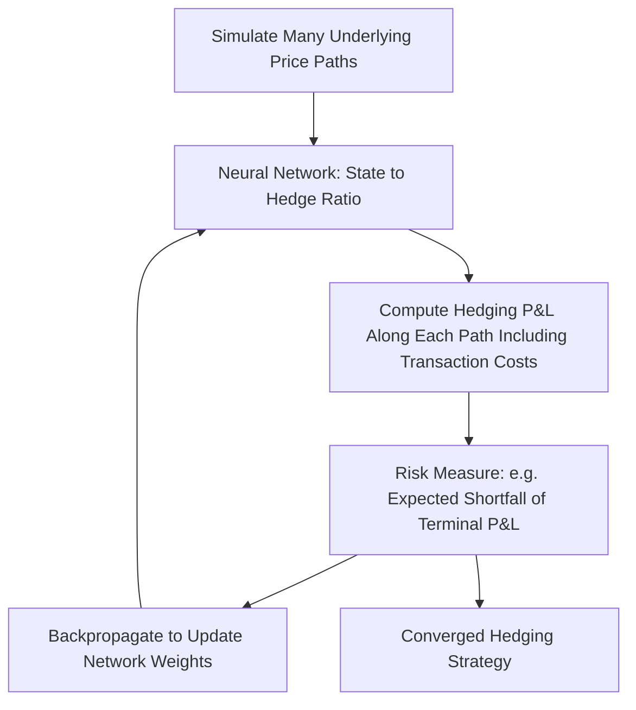
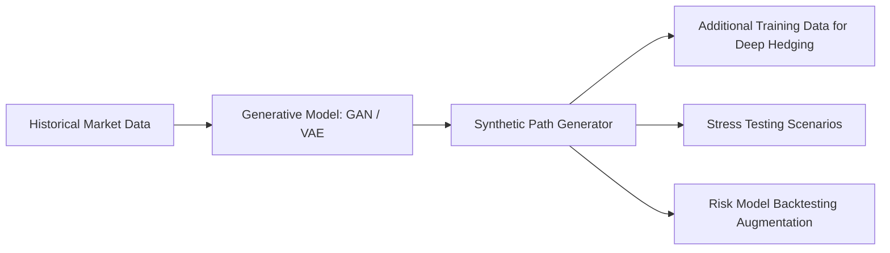

## Deep Learning Approaches to Option Pricing


### Motivation and Problem Landscape

Deep learning has been applied to option pricing along several distinct axes: accelerating expensive traditional pricing computations, directly learning pricing functions from data, solving the governing pricing PDEs via neural network function approximation, and hedging derivatives in incomplete markets using learned strategies rather than model-derived Greeks. These represent meaningfully different use cases with different validation requirements, and conflating them is a common source of confusion in this literature.



### Pricing Function Approximation

The most direct application trains a neural network to map contract and market parameters to price, either mimicking an existing parametric model (as a speed-up, discussed in depth under volatility surface calibration) or learning directly from observed market prices as a flexible non-parametric pricing function.

```python
import torch
import torch.nn as nn

class OptionPricingNet(nn.Module):
    def __init__(self, input_dim=5, hidden_dim=64, n_layers=4):
        super().__init__()
        layers = [nn.Linear(input_dim, hidden_dim), nn.ReLU()]
        for _ in range(n_layers - 1):
            layers += [nn.Linear(hidden_dim, hidden_dim), nn.ReLU()]
        layers.append(nn.Linear(hidden_dim, 1))
        self.net = nn.Sequential(*layers)

    def forward(self, x):
        # x: [moneyness, time_to_maturity, rate, dividend_yield, implied_vol]
        return self.net(x)
```

A key architectural consideration when learning directly from market prices (rather than as a surrogate for a known closed-form model) is enforcing basic no-arbitrage shape constraints — monotonicity in moneyness, convexity in strike — since an unconstrained network fit purely to minimize price error can otherwise produce a fitted pricing function that admits arbitrage.

```python
def monotonicity_penalty(model, S_grid, K_fixed, T_fixed, r_fixed, sigma_fixed):
    """
    Illustrative penalty enforcing that call price is non-increasing in strike
    (holding other inputs fixed) -- one of several standard no-arbitrage
    shape constraints for call option prices.
    """
    S_grid.requires_grad_(True)
    inputs = torch.stack([S_grid, T_fixed*torch.ones_like(S_grid),
                           r_fixed*torch.ones_like(S_grid),
                           torch.zeros_like(S_grid), sigma_fixed*torch.ones_like(S_grid)], dim=1)
    prices = model(inputs)
    d_price_dS = torch.autograd.grad(prices.sum(), S_grid, create_graph=True)[0]
    violation = torch.clamp(-d_price_dS, min=0)  # penalize negative delta for calls
    return (violation**2).mean()
```

### Physics-Informed Neural Networks (PINNs) for Pricing PDEs

PINNs solve the Black-Scholes (or more general) pricing PDE directly by training a neural network to satisfy the PDE, boundary conditions, and terminal condition simultaneously, using automatic differentiation to compute the required partial derivatives with respect to network inputs rather than finite difference approximation on a grid.

The Black-Scholes PDE residual used as a training loss term:

$$\mathcal{R}(S,t) = \frac{\partial V}{\partial t} + \frac{1}{2}\sigma^2 S^2 \frac{\partial^2 V}{\partial S^2} + rS\frac{\partial V}{\partial S} - rV$$

A properly trained network should have $\mathcal{R}(S,t) \approx 0$ across the domain, in addition to matching the terminal payoff condition and boundary conditions.

```python
class PricingPINN(nn.Module):
    def __init__(self, hidden_dim=64):
        super().__init__()
        self.net = nn.Sequential(
            nn.Linear(2, hidden_dim), nn.Tanh(),
            nn.Linear(hidden_dim, hidden_dim), nn.Tanh(),
            nn.Linear(hidden_dim, hidden_dim), nn.Tanh(),
            nn.Linear(hidden_dim, 1),
        )

    def forward(self, S, t):
        x = torch.cat([S, t], dim=1)
        return self.net(x)

def pde_residual_loss(model, S, t, r, sigma):
    S.requires_grad_(True)
    t.requires_grad_(True)
    V = model(S, t)

    dV_dt = torch.autograd.grad(V.sum(), t, create_graph=True)[0]
    dV_dS = torch.autograd.grad(V.sum(), S, create_graph=True)[0]
    d2V_dS2 = torch.autograd.grad(dV_dS.sum(), S, create_graph=True)[0]

    residual = dV_dt + 0.5*sigma**2*S**2*d2V_dS2 + r*S*dV_dS - r*V
    return (residual**2).mean()

def terminal_condition_loss(model, S_terminal, K):
    T_tensor = torch.ones_like(S_terminal)
    V_pred = model(S_terminal, T_tensor)
    V_true = torch.clamp(S_terminal - K, min=0).unsqueeze(1)
    return ((V_pred - V_true)**2).mean()

def total_loss(model, S_interior, t_interior, S_terminal, S_boundary_low, S_boundary_high,
               t_boundary, K, r, sigma, T):
    pde_loss = pde_residual_loss(model, S_interior, t_interior, r, sigma)
    terminal_loss = terminal_condition_loss(model, S_terminal, K)
    boundary_loss_low = (model(S_boundary_low, t_boundary)**2).mean()
    boundary_loss_high = ((model(S_boundary_high, t_boundary) -
                            (S_boundary_high - K*torch.exp(-r*(T-t_boundary))))**2).mean()
    return pde_loss + terminal_loss + boundary_loss_low + boundary_loss_high
```

**Advantages of the PINN approach for pricing:**

- Naturally extends to higher-dimensional problems (multiple underlyings, multiple stochastic factors) where traditional finite difference grids suffer from the curse of dimensionality, since the neural network does not require an explicit discretized grid over the full state space
- Mesh-free: no need to specify a discretization grid in advance, and the same trained network can be queried at arbitrary $(S,t)$ points

**Limitations and validation requirements:**

- Training PINNs can be numerically delicate — balancing the relative weighting between PDE residual loss, boundary condition loss, and terminal condition loss is a known practical challenge, and poor weighting can lead to a network that satisfies one loss term well while badly violating another
- [Inference] Convergence behavior and required network architecture/training time are considerably less standardized than for traditional finite difference methods, which have well-established convergence order theory; PINN-based pricing should be validated carefully against closed-form or traditional numerical benchmarks before being trusted for cases without an independent check
- Training time for a single PINN model can exceed the time required to solve the same problem via traditional finite differences for simple, low-dimensional cases (e.g., vanilla Black-Scholes), meaning the PINN approach's comparative advantage is most relevant for genuinely high-dimensional problems where traditional grid methods become impractical, rather than as a general replacement for low-dimensional finite difference solvers

### Deep Hedging

Deep hedging, introduced in the quantitative finance literature by Buehler et al., reframes the hedging problem as training a neural network to output a hedging strategy that directly minimizes a chosen risk measure (e.g., expected shortfall of hedging P&L) over simulated paths, rather than deriving the hedge analytically from a pricing model's Greeks. This is particularly relevant in markets with frictions (transaction costs, discrete rebalancing, liquidity constraints) where the classical Black-Scholes continuous-hedging assumption breaks down and the theoretically "correct" Greek-based hedge is no longer provably optimal.



```python
class DeepHedgingNet(nn.Module):
    def __init__(self, hidden_dim=32):
        super().__init__()
        self.net = nn.Sequential(
            nn.Linear(3, hidden_dim), nn.ReLU(),  # [S_t, t, prev_hedge_position]
            nn.Linear(hidden_dim, hidden_dim), nn.ReLU(),
            nn.Linear(hidden_dim, 1), nn.Tanh(),  # bounded hedge ratio output
        )

    def forward(self, S_t, t, prev_position):
        x = torch.stack([S_t, t, prev_position], dim=1)
        return self.net(x).squeeze(1)

def simulate_hedging_pnl(model, S_paths, K, transaction_cost_bps=5):
    n_paths, n_steps = S_paths.shape
    position = torch.zeros(n_paths)
    cash = torch.zeros(n_paths)

    for step in range(n_steps - 1):
        t_normalized = torch.full((n_paths,), step / (n_steps - 1))
        new_position = model(S_paths[:, step], t_normalized, position)
        trade = new_position - position
        transaction_cost = torch.abs(trade) * S_paths[:, step] * (transaction_cost_bps / 10000)
        cash = cash - trade * S_paths[:, step] - transaction_cost
        position = new_position

    terminal_payoff = torch.clamp(S_paths[:, -1] - K, min=0)
    final_pnl = cash + position * S_paths[:, -1] - terminal_payoff
    return final_pnl

def expected_shortfall_loss(pnl, alpha=0.95):
    var = torch.quantile(pnl, 1 - alpha)
    tail_losses = pnl[pnl <= var]
    return -tail_losses.mean()  # negative since we minimize a loss = negative P&L in the tail
```

Deep hedging's key conceptual departure from classical Delta hedging is that it does not require an assumed pricing model at all — the network learns a hedging strategy directly from simulated (or historical) price paths and a specified cost/risk structure, making it naturally applicable to markets or instruments where a clean closed-form Greek is unavailable or where market frictions materially invalidate the classical continuous-hedging assumptions underlying Black-Scholes Delta hedging.

[Inference] The realized quality of a deep-hedging strategy depends heavily on how representative the training path distribution (whether simulated from an assumed model or drawn from historical data) is of actual future market behavior; like any data-driven method, performance in genuinely novel market regimes not represented in training data is a material open risk that requires ongoing monitoring rather than a one-time validation.

### Generative Models for Scenario Generation

Generative Adversarial Networks (GANs) and Variational Autoencoders (VAEs) have been explored in the literature for generating synthetic realistic market scenarios or price paths, motivated by the limited length of available historical data for rare/tail events and the desire to generate additional realistic synthetic paths for stress testing, risk model backtesting, or deep hedging training data augmentation.



[Unverified] The use of GAN/VAE-generated synthetic financial time series is an active area of academic and some practitioner research; the degree to which such synthetic data reliably preserves the statistical properties (fat tails, volatility clustering, extreme co-movements) most relevant for risk management purposes, as opposed to superficial visual realism, is a genuinely contested question in the literature and should not be assumed settled.

### Recurrent and Sequence Models for Path-Dependent Features

LSTM (Long Short-Term Memory) and Transformer-based architectures have been applied to path-dependent option pricing and to extracting features from historical price sequences for use in pricing or hedging models, given their natural suitability for variable-length sequential input.

```python
class LSTMPathEncoder(nn.Module):
    def __init__(self, input_dim=1, hidden_dim=64, n_layers=2):
        super().__init__()
        self.lstm = nn.LSTM(input_dim, hidden_dim, n_layers, batch_first=True)
        self.output_head = nn.Linear(hidden_dim, 1)

    def forward(self, price_sequence):
        # price_sequence: [batch, seq_len, 1]
        _, (hidden, _) = self.lstm(price_sequence)
        final_hidden = hidden[-1]
        return self.output_head(final_hidden)
```

### Validation Framework for Deep Learning Pricing Models

Given the higher model risk profile of deep learning approaches relative to traditional analytic or numerical methods, a rigorous validation framework typically includes:

1. **Closed-form benchmark comparison**: Wherever a closed-form or traditional numerical solution exists (e.g., vanilla European options under GBM), the deep learning model's output must be checked against it before trusting the model on cases without an independent check
2. **Out-of-distribution testing**: Explicit testing of model behavior on inputs outside the training data's range, since neural networks can produce arbitrary and potentially unstable extrapolated outputs beyond their training distribution
3. **Arbitrage/shape constraint verification**: Post-hoc checking (or, better, training-time enforcement) that learned pricing functions satisfy basic no-arbitrage properties (monotonicity, convexity, calendar consistency)
4. **Sensitivity/Greek stability**: Checking that derivatives of the learned pricing function (computed via automatic differentiation) are smooth and well-behaved, not merely that the price itself is accurate, since Greeks computed from a poorly-regularized network can be noisy even when the price fit looks visually acceptable
5. **Stress and regime-shift testing**: Explicit evaluation of model degradation under market conditions materially different from the training distribution (e.g., a volatility spike far beyond historically observed levels)

### Comparison of Deep Learning Approaches

| Approach | Primary Use Case | Requires Assumed Pricing Model? | Key Validation Focus |
| --- | --- | --- | --- |
| Pricing function approximation | Speed-up or flexible market-data fit | Optional (can mimic existing model or fit market directly) | Accuracy vs. benchmark, arbitrage shape constraints |
| PINN | High-dimensional PDE solving | Yes (PDE structure assumed) | PDE residual convergence, boundary condition satisfaction |
| Deep hedging | Learned hedging strategy under frictions | No (data/simulation-driven) | Out-of-sample hedging performance, regime robustness |
| Generative scenario models | Synthetic data augmentation, stress testing | No | Statistical property preservation (tails, clustering) |
| Sequence models (LSTM/Transformer) | Path-dependent feature extraction | Varies by application | Same general concerns as above, applied to sequential inputs |

### Practical Adoption Considerations

[Inference] As of the most recent developments reflected in the available literature, deep learning approaches to option pricing remain more prevalent in academic research and exploratory practitioner work than as the primary, sole pricing engine for vanilla exchange-traded derivatives at most institutions, where traditional closed-form and numerical methods remain standard due to their stronger theoretical guarantees and more mature validation tooling. Adoption has been comparatively more visible in areas where traditional methods face genuine limitations: high-dimensional XVA/CVA calculations, deep hedging research for exotic or illiquid instruments, and calibration acceleration (covered separately). This is a rapidly evolving area, and current institutional adoption levels should be verified against recent industry surveys or vendor announcements if precise current adoption figures are needed.

**Related Topics**

- Physics-informed neural networks: loss weighting strategies and training stability
- Deep hedging under transaction costs and market impact (Buehler et al. framework)
- No-arbitrage constraints for neural network pricing functions
- XVA and CVA calculation acceleration via deep learning for high-dimensional problems
- GAN/VAE architectures for synthetic financial time series generation
- Model risk management frameworks specific to deep learning components in pricing infrastructure