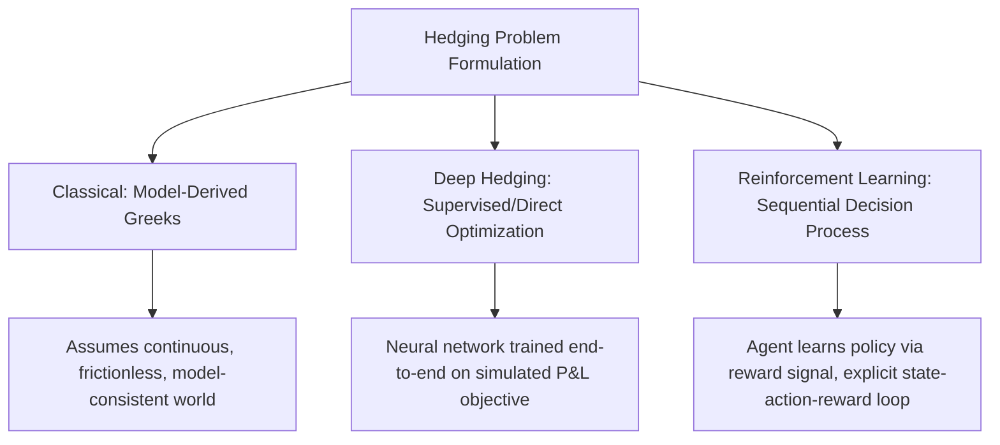
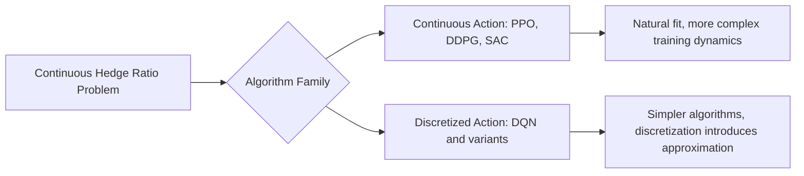
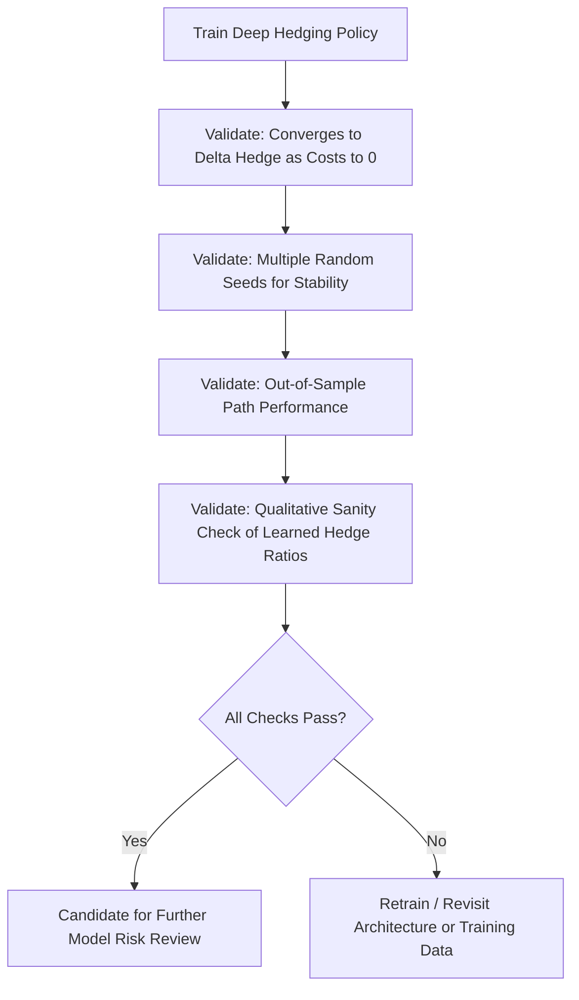

## Deep Hedging and Reinforcement Learning


### Conceptual Foundation

Deep hedging reframes derivative hedging as a sequential decision-making problem solved through machine learning rather than through model-derived analytic Greeks. Where classical Delta hedging assumes a pricing model (e.g., Black-Scholes) and continuous, frictionless rebalancing, deep hedging directly optimizes a hedging policy against a specified risk measure over simulated or historical paths, explicitly accounting for realistic market frictions such as transaction costs, discrete rebalancing intervals, and liquidity constraints. The approach was formalized in the quantitative finance literature notably by Buehler, Gonon, Teichmann, and Wood, and has since been extended along several directions, including explicit reinforcement learning (RL) formulations.



### Deep Hedging vs. Reinforcement Learning: Distinguishing the Two Framings

Although closely related and often discussed together, deep hedging and RL-based hedging represent two related but distinct formulations:

- **Deep hedging (as originally formulated)**: Trains a neural network end-to-end via direct gradient descent/backpropagation through a differentiable simulation of the hedging P&L, treating the entire path as a single differentiable computational graph and optimizing a chosen risk measure (e.g., expected shortfall) directly
- **Reinforcement learning formulation**: Frames the problem explicitly as a Markov Decision Process (MDP) with states, actions, rewards, and a policy or value function, solved using standard RL algorithms (policy gradient methods, Q-learning variants, actor-critic methods) that do not necessarily require the environment/reward function to be differentiable

[Inference] The choice between the two framings in practice often depends on whether the hedging environment (transaction cost structure, market impact model) is conveniently differentiable — deep hedging's direct backpropagation approach is generally more sample-efficient when differentiability holds, while RL formulations offer more flexibility for non-differentiable reward structures or environments better modeled as discrete-action problems, though this is a general tendency rather than a strict rule observed uniformly across the literature.

### MDP Formulation for Hedging

A hedging problem cast as a Markov Decision Process:

- **State** $s_t$: Typically includes current underlying price, time to maturity, current hedge position, and potentially additional features (realized/implied volatility, recent price history)
- **Action** $a_t$: The hedge ratio or trade size to execute at time $t$
- **Reward** $r_t$: Often the negative of transaction costs incurred plus the mark-to-market P&L change of the hedge portfolio at that step, with a terminal reward capturing the final hedging error against the option payoff
- **Policy** $\pi(a_t | s_t)$: The learned mapping from state to action (hedge decision)

$$\text{Objective: } \max_{\pi} \, \mathbb{E}\left[-\rho\left(\text{Final Hedging P\&L under } \pi\right)\right]$$

where $\rho$ is a chosen convex risk measure (e.g., CVaR/expected shortfall, or a simpler quadratic hedging error penalty).

### Deep Hedging Implementation Pattern

```python
import torch
import torch.nn as nn

class DeepHedgingPolicy(nn.Module):
    def __init__(self, state_dim=4, hidden_dim=32):
        super().__init__()
        self.net = nn.Sequential(
            nn.Linear(state_dim, hidden_dim), nn.ReLU(),
            nn.Linear(hidden_dim, hidden_dim), nn.ReLU(),
            nn.Linear(hidden_dim, 1), nn.Tanh(),  # bounded hedge ratio in [-1, 1]
        )

    def forward(self, state):
        return self.net(state).squeeze(-1)

def simulate_hedging_episode(policy, S_paths, K, r, transaction_cost_bps=5, dt=1/252):
    n_paths, n_steps = S_paths.shape
    position = torch.zeros(n_paths)
    cash = torch.zeros(n_paths)

    for step in range(n_steps - 1):
        time_to_maturity = torch.full((n_paths,), (n_steps - 1 - step) * dt)
        state = torch.stack([S_paths[:, step], time_to_maturity, position,
                              torch.full((n_paths,), r)], dim=1)
        new_position = policy(state)

        trade_size = new_position - position
        transaction_cost = torch.abs(trade_size) * S_paths[:, step] * (transaction_cost_bps / 10000)
        cash = cash * (1 + r * dt) - trade_size * S_paths[:, step] - transaction_cost
        position = new_position

    terminal_payoff = torch.clamp(S_paths[:, -1] - K, min=0)
    final_pnl = cash + position * S_paths[:, -1] - terminal_payoff
    return final_pnl

def cvar_loss(pnl, alpha=0.95):
    var_threshold = torch.quantile(pnl, 1 - alpha)
    tail = pnl[pnl <= var_threshold]
    return -tail.mean()  # minimizing this maximizes the tail (worst-case) P&L

def train_deep_hedge(policy, optimizer, S_path_generator, K, r, n_epochs=1000, batch_size=4096):
    for epoch in range(n_epochs):
        S_paths = S_path_generator(batch_size)
        pnl = simulate_hedging_episode(policy, S_paths, K, r)
        loss = cvar_loss(pnl, alpha=0.95)

        optimizer.zero_grad()
        loss.backward()
        optimizer.step()

        if epoch % 100 == 0:
            print(f"Epoch {epoch}: CVaR loss = {loss.item():.4f}, Mean P&L = {pnl.mean().item():.4f}")
```

### Choice of Risk Measure / Loss Function

| Risk Measure | Characteristics | Typical Use Case |
| --- | --- | --- |
| Mean squared hedging error | Simple, symmetric penalty on deviation from perfect replication | Baseline/simplest formulation, comparable to classical quadratic hedging |
| Expected shortfall / CVaR | Focuses training on tail (worst-case) outcomes, asymmetric | More risk-averse, aligns with typical risk management objectives |
| Entropic risk measure | Exponential utility-based, smooth and convex | Theoretically grounded in utility theory, used in some academic formulations |
| Quantile-based (VaR-style) | Targets a specific loss quantile | Aligning training objective directly with a regulatory-style risk metric |

[Inference] The choice of risk measure materially shapes the learned hedging behavior — a CVaR-based objective will generally produce a policy that trades more aggressively to avoid tail losses compared to a simple mean-squared-error objective, though the precise behavioral difference depends on the specific market simulation and cost structure used in training.

### Reinforcement Learning Algorithms Applied to Hedging

**Policy Gradient / Actor-Critic Methods**

Proximal Policy Optimization (PPO) and Deep Deterministic Policy Gradient (DDPG) are commonly cited in the RL-for-hedging literature, suited to the continuous action space (hedge ratio is a continuous quantity) characteristic of this problem.

```python
class ActorCriticHedger(nn.Module):
    def __init__(self, state_dim=4, hidden_dim=64):
        super().__init__()
        self.shared = nn.Sequential(
            nn.Linear(state_dim, hidden_dim), nn.ReLU(),
            nn.Linear(hidden_dim, hidden_dim), nn.ReLU(),
        )
        self.actor_mean = nn.Linear(hidden_dim, 1)
        self.actor_log_std = nn.Parameter(torch.zeros(1))
        self.critic = nn.Linear(hidden_dim, 1)

    def forward(self, state):
        features = self.shared(state)
        action_mean = torch.tanh(self.actor_mean(features))
        action_std = torch.exp(self.actor_log_std)
        value = self.critic(features)
        return action_mean, action_std, value
```

**Q-Learning Variants**

Discretized-action Q-learning approaches (treating hedge ratio adjustments as a finite set of discrete actions, e.g., "increase hedge by 0.1", "hold", "decrease hedge by 0.1") have also been explored, trading off the natural continuity of the hedge ratio for compatibility with simpler, well-established discrete-action RL algorithms (DQN and variants).



### Market Simulation for Training

Training data for deep hedging/RL hedging comes from one of two general sources, each with distinct trade-offs:

- **Model-simulated paths**: Paths generated from an assumed stochastic model (GBM, Heston, jump-diffusion), offering unlimited training data and controllable stress scenarios, but subject to model risk — the learned policy's quality is bounded by how well the assumed simulation model reflects real market dynamics
- **Historical/empirical paths**: Bootstrapped or resampled from actual historical price data, better reflecting real market statistical properties (fat tails, volatility clustering) but limited in quantity, particularly for rare/tail scenarios, and subject to the specific historical period's characteristics not generalizing to future regimes

[Inference] A common practical approach blends both sources — training primarily on model-simulated data for volume and stress-scenario coverage, while validating (and potentially fine-tuning) against historical or held-out empirical data to check the policy's real-world robustness — though the specific blending methodology varies across implementations and is not standardized industry-wide.

### Incorporating Market Frictions

A central motivation for deep hedging over classical Delta hedging is the natural incorporation of realistic frictions that break the clean analytic structure of Black-Scholes hedging:

```python
def transaction_cost_model(trade_size, price, cost_type="proportional", **params):
    if cost_type == "proportional":
        return torch.abs(trade_size) * price * params.get("bps", 5) / 10000
    elif cost_type == "fixed_plus_proportional":
        fixed = params.get("fixed_cost", 1.0)
        prop = torch.abs(trade_size) * price * params.get("bps", 5) / 10000
        return torch.where(torch.abs(trade_size) > 0, fixed + prop, torch.zeros_like(trade_size))
    elif cost_type == "market_impact":
        # Illustrative square-root market impact model
        return params.get("impact_coef", 0.1) * torch.sqrt(torch.abs(trade_size)) * price
```

Discrete rebalancing intervals (as opposed to the theoretical continuous rebalancing assumed in Black-Scholes) are handled naturally since the simulation is inherently discrete-time by construction, requiring no special adaptation beyond choosing the rebalancing frequency in the simulated environment.

### Comparison: Deep Hedging vs. Classical Delta Hedging

| Dimension | Classical Delta Hedging | Deep Hedging / RL Hedging |
| --- | --- | --- |
| Requires pricing model | Yes (Greeks derived from model) | Optional (can be model-free, data-driven) |
| Handles transaction costs | Not naturally (requires ad hoc modification, e.g., Leland's adjusted volatility) | Naturally incorporated in training objective |
| Handles discrete rebalancing | Approximation error grows as rebalancing frequency decreases | Naturally incorporated (training simulation is inherently discrete) |
| Theoretical guarantees | Strong, under stated model assumptions | Weaker; empirical/statistical guarantees only, dependent on training data quality |
| Interpretability | High (direct link to model Greeks) | Lower (learned policy is a black box, though feature attribution methods can partially help) |
| Computational cost | Low (closed-form or simple numerical Greeks) | High (substantial training compute required) |

### Validation and Model Risk Considerations

- **Benchmark against classical hedging in the frictionless limit**: A properly trained deep hedging policy should converge toward the classical Delta hedge as transaction costs are reduced toward zero in the training environment, providing a sanity check against known theory
- **Out-of-sample and regime robustness testing**: Testing the learned policy against market paths/regimes not represented in training data, given the absence of the theoretical guarantees that back classical hedging under its stated assumptions
- **Sensitivity to training hyperparameters**: RL training is known in the broader machine learning literature to be sensitive to random seed, reward scaling, and hyperparameter choices, potentially producing meaningfully different learned policies across nominally identical training runs — multiple training runs with different seeds are commonly used to assess policy stability
- **Explainability tooling**: Given the reduced interpretability relative to classical Greeks, some practitioner and research approaches apply post-hoc explainability techniques (e.g., examining learned hedge ratios across a grid of states to check they behave sensibly relative to known qualitative intuition, such as increasing hedge ratio as an option moves in-the-money)



### Extensions: Multi-Asset and Path-Dependent Payoffs

The deep hedging/RL framework extends naturally to multi-asset portfolios and path-dependent payoffs (barrier options, Asian options) by expanding the state representation to include multiple underlying prices and relevant path-dependent statistics (running average, running maximum), whereas classical hedging of such payoffs often requires bespoke, payoff-specific analytic or numerical Greek derivations.

```python
class MultiAssetHedgingPolicy(nn.Module):
    def __init__(self, n_assets=3, hidden_dim=64):
        super().__init__()
        state_dim = n_assets * 2 + 2  # prices + positions per asset + time + running avg feature
        self.net = nn.Sequential(
            nn.Linear(state_dim, hidden_dim), nn.ReLU(),
            nn.Linear(hidden_dim, hidden_dim), nn.ReLU(),
            nn.Linear(hidden_dim, n_assets), nn.Tanh(),
        )

    def forward(self, state):
        return self.net(state)
```

### Current State of Adoption and Open Research Questions

[Inference] As reflected in the available literature, deep hedging and RL-based hedging approaches are most actively explored in academic research and in institutional research/innovation groups, particularly for exotic, illiquid, or high-dimensional portfolio hedging problems where classical analytic Greeks are unavailable or impractical, rather than as a wholesale replacement for classical Delta hedging of liquid vanilla instruments where established methods remain standard. Open research questions in this area include robust methods for validating RL policies under genuine market regime shifts, formal risk-measure choices best aligned with regulatory capital frameworks, and integrating explicit model risk governance processes suited to the reduced interpretability of learned policies relative to classical Greek-based hedging. Given the pace of publication in this area, current adoption levels and state-of-the-art methods should be checked against recent academic literature or industry commentary if precise up-to-date specifics are required.

**Related Topics**

- Buehler et al. deep hedging framework: original formulation and extensions
- CVaR and expected shortfall as training objectives for risk-averse policies
- Leland's adjusted volatility approach to transaction-cost hedging (classical alternative)
- Proximal Policy Optimization (PPO) and actor-critic methods for continuous control
- Model risk management for reinforcement learning components in trading/hedging systems
- Multi-asset and path-dependent payoff extensions of deep hedging frameworks