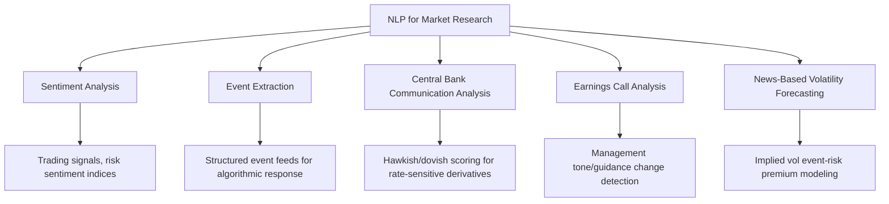
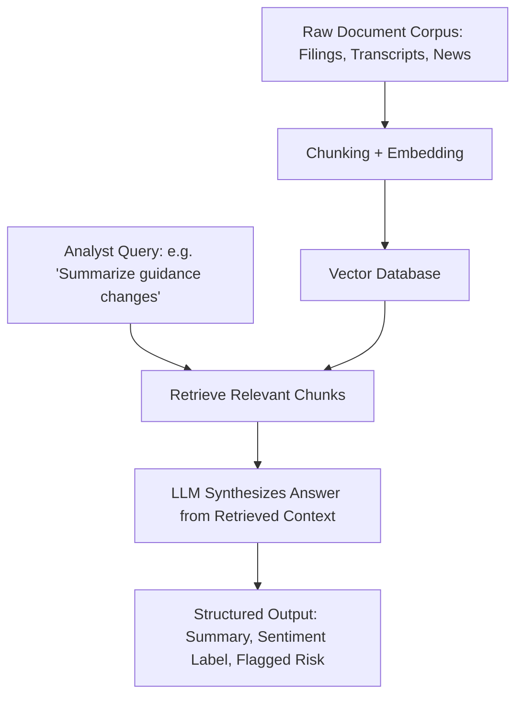

## Natural Language Processing for Market Research


### Scope and Application in Derivatives Markets

Natural language processing (NLP) applications in market research encompass extracting structured, quantitative signals from unstructured text sources — news articles, earnings call transcripts, central bank communications, regulatory filings, analyst reports, and social media — for use in trading signal generation, risk monitoring, and derivatives-specific applications such as implied volatility forecasting around scheduled information events (earnings, central bank meetings).



### Sentiment Analysis Fundamentals

**Lexicon-Based Approaches**

Early and still-used approaches score text using domain-specific sentiment dictionaries, most notably the **Loughran-McDonald financial sentiment word lists**, developed specifically because general-purpose sentiment lexicons (designed for product reviews or general text) systematically misclassify financial and legal terminology — words like "liability," "tax," or "cost" carry negative connotations in general English but are often neutral or routine in financial disclosure contexts.

```python
def loughran_mcdonald_sentiment(text, positive_words, negative_words):
    tokens = text.lower().split()
    pos_count = sum(1 for w in tokens if w in positive_words)
    neg_count = sum(1 for w in tokens if w in negative_words)
    total_words = len(tokens)
    net_sentiment = (pos_count - neg_count) / total_words if total_words > 0 else 0
    return {"positive_count": pos_count, "negative_count": neg_count, "net_sentiment": net_sentiment}
```

**Transformer-Based Sentiment Models**

Modern approaches predominantly use transformer-based language models fine-tuned on financial text corpora, capturing contextual nuance that lexicon-based bag-of-words methods miss (e.g., negation, sarcasm, and domain-specific phrase-level meaning).

```python
from transformers import AutoTokenizer, AutoModelForSequenceClassification
import torch

tokenizer = AutoTokenizer.from_pretrained("ProsusAI/finbert")
model = AutoModelForSequenceClassification.from_pretrained("ProsusAI/finbert")

def finbert_sentiment(text):
    inputs = tokenizer(text, return_tensors="pt", truncation=True, max_length=512)
    with torch.no_grad():
        outputs = model(**inputs)
    probs = torch.softmax(outputs.logits, dim=1).squeeze()
    labels = ["positive", "negative", "neutral"]
    return dict(zip(labels, probs.tolist()))
```

FinBERT and similar domain-adapted models (typically BERT-family architectures further pre-trained or fine-tuned on financial news, earnings calls, or SEC filings) are widely used starting points in practitioner and academic financial NLP work, given the cost and data requirements of training a comparable model from scratch.

### Central Bank Communication Analysis

Central bank statements, meeting minutes, and press conference transcripts are closely monitored for hawkish/dovish tone shifts, which directly influence interest rate derivative pricing (swaption volatility, rate futures) and broader risk asset volatility.

```python
def hawkish_dovish_score(text, hawkish_terms, dovish_terms):
    """
    Illustrative simplified scoring; production systems typically use
    fine-tuned classifiers trained on labeled historical central bank
    communications rather than a static keyword list, since tone shifts
    are often conveyed through subtle phrasing changes rather than
    presence/absence of specific keywords.
    """
    tokens = text.lower().split()
    hawkish_count = sum(1 for w in tokens if w in hawkish_terms)
    dovish_count = sum(1 for w in tokens if w in dovish_terms)
    return (hawkish_count - dovish_count) / max(len(tokens), 1)
```

**Comparative document analysis**: A common technique compares the current statement/minutes against the prior release using text similarity metrics (cosine similarity of document embeddings, edit distance on key paragraphs) to quantify the magnitude of tone or language change, which practitioner research has related to subsequent market volatility around the release.

```python
from sklearn.metrics.pairwise import cosine_similarity
import numpy as np

def document_change_score(embedding_current, embedding_previous):
    similarity = cosine_similarity(
        embedding_current.reshape(1, -1), embedding_previous.reshape(1, -1)
    )[0, 0]
    return 1 - similarity  # higher score = greater change from prior statement
```

[Inference] The empirical relationship between measured textual change in central bank communications and subsequent realized or implied volatility has been explored in academic research; the strength and stability of this relationship varies across studies, sample periods, and specific measurement methodologies, and should not be assumed to be a fixed, universally reliable predictive signal.

### Earnings Call Transcript Analysis

Earnings call transcripts are analyzed for both explicit content (guidance language, forward-looking statement changes) and paralinguistic/behavioral signals that have been explored in academic literature as potentially informative:

- **Management tone and word choice shifts**: Comparing sentiment and specific language patterns (hedging language such as "may," "could," "uncertain") across consecutive quarters for the same company
- **Question-and-answer session analysis**: Analyzing analyst question sentiment and complexity, and management response evasiveness or directness, as features distinct from the prepared remarks section
- **Linguistic markers of deception/uncertainty**: Some academic research has examined linguistic markers (e.g., reduced word count, increased hedging language, pronoun usage patterns) as potential signals correlated with subsequent negative earnings surprises or restatements; [Unverified] the robustness and out-of-sample predictive power of such linguistic-marker-based signals varies considerably across studies and should be treated as an active research area rather than an established, reliably predictive practitioner tool.

```python
def extract_hedging_language_ratio(transcript_text, hedging_phrases):
    sentences = transcript_text.split(".")
    hedged_sentences = sum(
        1 for s in sentences if any(phrase in s.lower() for phrase in hedging_phrases)
    )
    return hedged_sentences / max(len(sentences), 1)

hedging_phrases = ["may", "could", "uncertain", "believe", "expect", "somewhat", "potentially"]
```

### Event Extraction and Structured Signal Generation

Beyond sentiment scoring, NLP pipelines extract structured events from news flow (mergers, credit rating changes, regulatory actions, guidance revisions) for downstream algorithmic consumption:


```python
import spacy

nlp = spacy.load("en_core_web_sm")

def extract_entities_and_events(text):
    doc = nlp(text)
    entities = [(ent.text, ent.label_) for ent in doc.ents]
    organizations = [ent.text for ent in doc.ents if ent.label_ == "ORG"]
    money_mentions = [ent.text for ent in doc.ents if ent.label_ == "MONEY"]
    return {"entities": entities, "organizations": organizations, "monetary_amounts": money_mentions}
```

[Unverified] Production-grade financial event extraction systems typically require domain-specific fine-tuning well beyond generic named entity recognition models (which are trained on general-purpose text corpora), since financial event extraction requires recognizing domain-specific event types and entity roles (e.g., distinguishing an acquirer from a target company, or a rating agency from the entity being rated) that general NER models are not inherently trained to disambiguate.

### News-Based Volatility Forecasting

A specific derivatives-relevant application uses NLP-derived features (news volume, sentiment dispersion across sources, novel/surprising content detection) as inputs to short-horizon realized or implied volatility forecasting models, particularly around scheduled corporate or macro events.

```python
def news_volume_surprise(current_period_count, historical_baseline_counts):
    """
    Simple z-score style surprise measure: unusually high news volume
    relative to a company's or asset's historical baseline can precede
    elevated realized volatility.
    """
    mean_baseline = np.mean(historical_baseline_counts)
    std_baseline = np.std(historical_baseline_counts)
    return (current_period_count - mean_baseline) / std_baseline if std_baseline > 0 else 0
```

These features are typically combined with traditional volatility model inputs (historical realized volatility, implied volatility term structure, upcoming scheduled event calendar) rather than used as standalone predictors, given the well-documented noisiness of any single text-derived signal in isolation.

### Topic Modeling for Macro Theme Tracking

Unsupervised topic modeling (Latent Dirichlet Allocation, or more recent embedding-based clustering approaches) is used to track the relative prominence of macro themes (inflation concern, geopolitical risk, monetary policy tightening) across a large corpus of news or research reports over time, providing a quantitative proxy for shifting market narrative focus.

```python
from sklearn.decomposition import LatentDirichletAllocation
from sklearn.feature_extraction.text import CountVectorizer

vectorizer = CountVectorizer(max_features=5000, stop_words="english")
doc_term_matrix = vectorizer.fit_transform(news_corpus)

lda = LatentDirichletAllocation(n_components=15, random_state=42)
topic_distributions = lda.fit_transform(doc_term_matrix)
```

### Large Language Model (LLM)-Based Approaches

More recent practitioner and research approaches use general-purpose large language models (via prompting, retrieval-augmented generation, or fine-tuning) for tasks previously requiring bespoke pipelines: summarizing lengthy filings, answering specific questions against a corpus of documents, and generating structured sentiment/event labels from raw text with substantially less task-specific engineering than earlier bag-of-words or classical ML pipelines required.



[Inference] While LLM-based approaches have substantially lowered the engineering barrier for many financial NLP tasks, they introduce their own validation concerns distinct from earlier classical ML pipelines — notably hallucination risk (generating plausible-sounding but factually incorrect summaries or extracted figures) and sensitivity to prompt phrasing — which practitioner adoption in production trading/research contexts has generally addressed through careful human-in-the-loop review and retrieval-grounding (constraining generation to verified source text) rather than fully autonomous deployment, though specific institutional practices vary and are generally not public.

### Data Sources Commonly Used

- **News wire services**: Reuters, Bloomberg, Dow Jones newswires (typically licensed, machine-readable feeds designed for algorithmic consumption)
- **Regulatory filings**: SEC EDGAR (10-K, 10-Q, 8-K filings), company press releases
- **Earnings call transcripts**: Available through specialized data vendors given the value of structured, timestamped transcript data with speaker attribution
- **Central bank publications**: FOMC statements/minutes, ECB press conferences, other central bank communications (typically directly scraped or accessed via official publication channels, given their public nature)
- **Social media/alternative data**: Twitter/X, Reddit (particularly relevant to certain retail-driven volatility episodes), though these sources carry substantially higher noise-to-signal ratios and data quality/representativeness concerns than curated news or filing sources

### Validation and Model Risk Considerations Specific to Financial NLP

- **Look-ahead bias**: A pervasive and well-documented risk in backtesting NLP-derived trading signals — care must be taken that sentiment/event labels are timestamped to reflect only information genuinely available at that historical moment, not information incorporating later revisions, corrections, or hindsight-informed labeling
- **Domain shift and vocabulary drift**: Financial language evolves (new terminology around emerging themes, e.g., specific new regulatory or technology terms), meaning models trained on older corpora can degrade in relevance over time without periodic retraining or fine-tuning
- **Source reliability and bias**: Different news sources and social media platforms carry different inherent biases and reliability profiles; aggregating signal across multiple sources with appropriate weighting is standard practice rather than relying on a single source
- **Signal decay and crowding**: [Inference] As with many quantitative signals, publicly known or easily replicable NLP-derived trading signals are subject to potential decay in predictive power over time as more market participants incorporate similar signals, though the specific decay dynamics for any given signal are empirical questions requiring ongoing monitoring rather than a fixed, generally assumable rate

### Comparative Overview of Methodological Approaches

| Approach | Strengths | Limitations |
| --- | --- | --- |
| Lexicon-based (Loughran-McDonald) | Fast, fully interpretable, no training data required | Misses context, negation, and phrase-level nuance |
| Fine-tuned transformer (FinBERT-style) | Captures contextual nuance, domain-adapted | Requires labeled training data, less directly interpretable |
| Topic modeling (LDA) | Unsupervised, good for theme tracking over time | Topics require manual interpretation/labeling, less precise than supervised classification |
| LLM-based (prompting/RAG) | Flexible, low engineering overhead, handles novel task framing well | Hallucination risk, prompt sensitivity, requires careful grounding/validation |

**Related Topics**

- FinBERT and other domain-adapted financial language models
- Retrieval-augmented generation (RAG) architectures for financial document Q&A
- Look-ahead bias and point-in-time data discipline in NLP signal backtesting
- Loughran-McDonald financial sentiment dictionaries and their construction methodology
- Alternative data sourcing and vendor due diligence for text-based signals
- LLM hallucination risk mitigation in production financial research applications