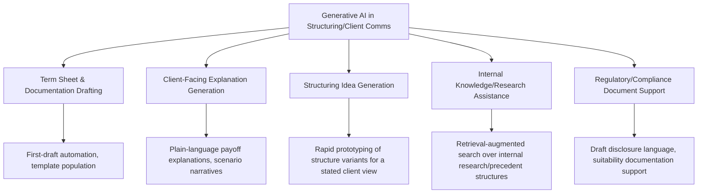
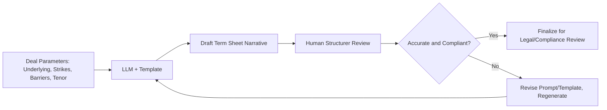
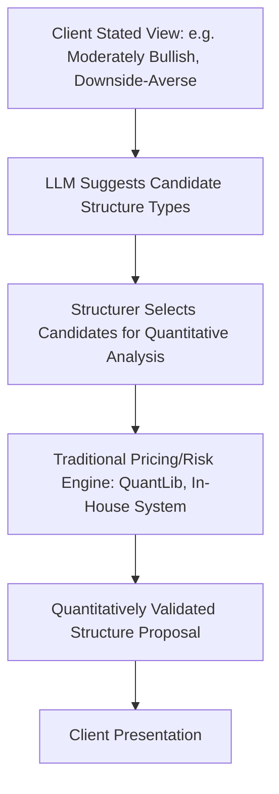
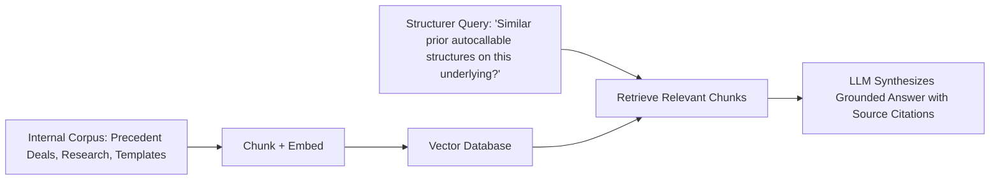

## Generative AI in Structuring and Client Communication


### Scope and Application Areas

Generative AI, particularly large language models (LLMs), has been increasingly applied within derivatives structuring and client-facing workflows to accelerate document drafting, support term sheet generation, assist in explaining complex payoffs to clients, and augment research/idea generation for structured product design. This differs materially from the pricing- and hedging-focused applications of deep learning covered elsewhere: the primary value proposition here is workflow acceleration and communication quality rather than direct numerical pricing or risk calculation.



### Term Sheet and Documentation Drafting

LLMs can accelerate the first-draft generation of structured product term sheets and marketing materials by populating standardized templates with deal-specific parameters (underlying, strikes, barriers, coupon structure, observation dates) and generating draft narrative descriptions of the payoff mechanics.



A typical prompting pattern separates the structured deal parameters (passed as explicit, verified data) from the generative narrative task, reducing the risk of the model inventing or miscalculating numerical terms:

```python
def draft_termsheet_narrative(llm_client, deal_params: dict) -> str:
    """
    Illustrative pattern: numerical parameters are supplied explicitly and
    verified independently; the LLM is used only to generate the
    surrounding descriptive narrative, not to compute or invent figures.
    """
    prompt = f"""
    Draft a plain-language description of the following structured note payoff
    for inclusion in a term sheet. Do not alter or recalculate any figures;
    use exactly the values provided.

    Underlying: {deal_params['underlying']}
    Notional: {deal_params['notional']}
    Tenor: {deal_params['tenor']}
    Autocall barrier: {deal_params['autocall_barrier']}% of initial level
    Coupon rate: {deal_params['coupon_rate']}% per observation period if autocalled
    Knock-in barrier: {deal_params['knock_in_barrier']}% of initial level

    Write two paragraphs: one describing the autocall mechanism, one
    describing the downside scenario at maturity if not autocalled.
    """
    return llm_client.generate(prompt)
```

**Critical validation requirement**: Because LLMs can generate fluent but numerically or logically incorrect text (a well-documented failure mode sometimes termed hallucination), any generated term sheet narrative requires mandatory human review against the source deal parameters before external distribution, and many institutional deployments constrain the model to describing pre-verified figures rather than performing any calculation within the generation step itself, as illustrated above.

### Client-Facing Explanation Generation

LLMs are used to generate multiple explanatory framings of the same structured payoff at different levels of technical sophistication — a simplified narrative explanation for a less quantitatively sophisticated client audience, versus a more technical description referencing the underlying option components for a derivatives-savvy institutional client.

```python
def generate_tiered_explanation(llm_client, payoff_description: str, audience_level: str) -> str:
    audience_prompts = {
        "retail": "Explain this in plain language avoiding technical jargon, using an analogy where helpful.",
        "institutional": "Explain this with precise technical terminology, referencing the underlying option components.",
        "sales_summary": "Summarize the key risk/return trade-off in 2-3 bullet points."
    }
    prompt = f"{payoff_description}\n\n{audience_prompts[audience_level]}"
    return llm_client.generate(prompt)
```

**Scenario narrative generation**: A common structuring workflow uses generative models to produce narrative walkthroughs of specific market scenarios (e.g., "what happens if the underlying falls 30% by year two") to complement quantitative payoff tables, making complex conditional payoff logic more accessible to clients evaluating the product.

[Inference] The appropriate degree of simplification for a "retail" versus "institutional" framing, and the specific regulatory disclosure requirements attached to each audience tier, are governed by applicable securities regulation and firm-specific compliance policy in the relevant jurisdiction, which generative tooling itself does not determine and must be layered on top of via firm-specific compliance review rather than left to model discretion.

### Structuring Idea Generation and Research Assistance

Generative models can assist structurers in rapidly exploring variations on a payoff structure given a stated client market view (e.g., "moderately bullish with limited downside tolerance"), suggesting candidate structure types (capped participation notes, barrier reverse convertibles, autocallables with varying barrier/coupon trade-offs) as a starting point for further quantitative analysis, rather than as a final recommendation.



This application positions generative AI explicitly as an ideation and drafting accelerant feeding into, rather than replacing, the traditional quantitative pricing and risk validation pipeline — the generative step suggests candidate structures or explanatory framings, while all numerical pricing, Greeks, and risk figures continue to flow through validated traditional pricing engines (QuantLib, in-house systems, vendor platforms) as covered elsewhere in this curriculum.

### Retrieval-Augmented Generation for Internal Knowledge Access

A common architecture pattern grounds LLM responses in a firm's own internal document corpus (prior deal precedents, internal research notes, approved product templates, compliance guidance) via retrieval-augmented generation (RAG), reducing hallucination risk relative to relying purely on the model's general training data for firm-specific or precedent-specific questions.



```python
def rag_query_internal_precedents(query, vector_store, llm_client, top_k=5):
    relevant_chunks = vector_store.similarity_search(query, k=top_k)
    context = "\n\n".join([f"[Source: {c.metadata['doc_id']}] {c.text}" for c in relevant_chunks])
    prompt = f"""
    Using only the information in the provided context, answer the query.
    Cite the source document for each claim. If the context does not contain
    sufficient information, state that explicitly rather than inferring.

    Context:
    {context}

    Query: {query}
    """
    return llm_client.generate(prompt)
```

Requiring explicit source citation and instructing the model to state when context is insufficient (rather than filling gaps from general training knowledge) are standard mitigations for hallucination risk in this application, though [Inference] neither fully eliminates the risk, and human verification against cited sources remains standard practice before relying on retrieved answers for client-facing or decision-relevant purposes.

### Regulatory and Compliance Document Support

Generative models can assist in drafting initial disclosure language, suitability assessment narratives, and risk warning boilerplate consistent with a firm's approved templates and applicable regulatory requirements (e.g., MiFID II product governance documentation in the EU, or SEC/FINRA-relevant disclosure requirements in the US), though such use is typically constrained to first-draft generation with mandatory legal/compliance review, given the regulatory and legal consequences of inaccurate or incomplete disclosure language.

[Inference] The degree to which regulators and internal compliance functions permit generative AI involvement in compliance-sensitive document drafting varies by jurisdiction, institution, and document type, and is an evolving area of regulatory guidance; current firm-specific and jurisdiction-specific policy should be verified directly rather than assumed from general principles.

### Governance and Model Risk Considerations Specific to This Application

- **Numerical accuracy separation**: A recurring architectural pattern across the examples above is separating verified numerical/quantitative content (computed by traditional validated pricing/risk systems) from the generative narrative layer (which describes, but should not independently calculate, those figures), specifically to contain hallucination risk to the lower-stakes narrative/explanatory layer rather than the numerical substance of a deal
- **Human-in-the-loop review requirements**: Institutional deployments in this space typically mandate human review of any generated content before external client distribution or regulatory submission, given the potential legal, reputational, and regulatory consequences of an inaccurate client-facing document
- **Auditability and version tracking**: Maintaining a record of which content in a client-facing document was generative-AI-assisted, what source data or prompts were used, and what human review/edits were applied is an emerging governance practice in institutions adopting these tools, relevant both for internal quality control and potential regulatory inquiry
- **Consistency across client tiers**: Ensuring that simplified retail-facing explanations remain materially consistent with (not contradictory to) more technical institutional-facing descriptions of the same underlying product is a specific quality-control concern when using generative tooling to produce multiple audience-tiered explanations of the same structure
- **Data confidentiality**: Use of external/third-party LLM APIs for drafting involving non-public deal terms or client-specific information raises data confidentiality considerations that institutions typically address through private/on-premises model deployment, contractual data-handling agreements with the model provider, or restricting generative tooling to non-confidential drafting tasks only

### Comparative Positioning: Generative AI vs. Traditional Structuring Workflow Components

| Workflow Stage | Traditional Approach | Generative AI Role |
| --- | --- | --- |
| Payoff pricing and Greeks | QuantLib, in-house pricing engine, Monte Carlo/FD | Not replaced; generative AI does not perform this calculation |
| Term sheet narrative drafting | Manual drafting from templates | First-draft acceleration, subject to human review |
| Client explanation tailoring | Manual adaptation per client sophistication | Rapid multi-tier explanation drafting |
| Structuring idea generation | Structurer expertise and precedent recall | Idea/precedent surfacing to prompt further quantitative analysis |
| Compliance/disclosure drafting | Legal/compliance manual drafting | First-draft support, subject to mandatory compliance review |
| Internal precedent research | Manual search of prior deals/research | RAG-based retrieval and synthesis across internal corpus |

### Practical Adoption Considerations

[Inference] As reflected in available industry commentary, adoption of generative AI in structuring and client communication workflows has progressed further in lower-stakes, internally-reviewed drafting-assistance roles (first-draft term sheet narratives, internal research synthesis) than in fully autonomous client-facing deployment, given the human-in-the-loop review practices described above and the regulatory sensitivity of client-facing financial product communications. This is a rapidly evolving area with active vendor and in-house tooling development; specific institutional adoption levels, vendor offerings, and regulatory guidance should be verified against current sources if precise up-to-date detail is required.

**Related Topics**

- Retrieval-augmented generation (RAG) architecture for financial document corpora
- Hallucination risk mitigation strategies in LLM-assisted financial drafting
- MiFID II and other jurisdiction-specific structured product disclosure requirements
- Model risk governance frameworks extended to generative AI/LLM components
- Data confidentiality considerations for third-party LLM API usage with client data
- Human-in-the-loop review workflow design for AI-assisted regulated communications