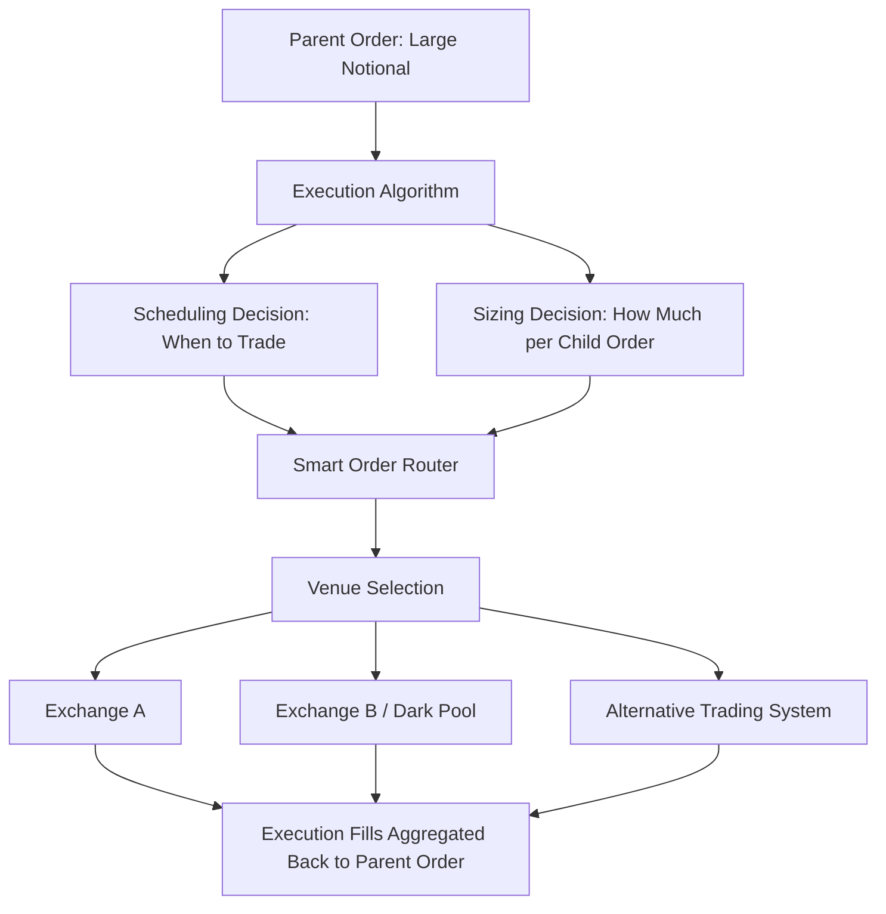
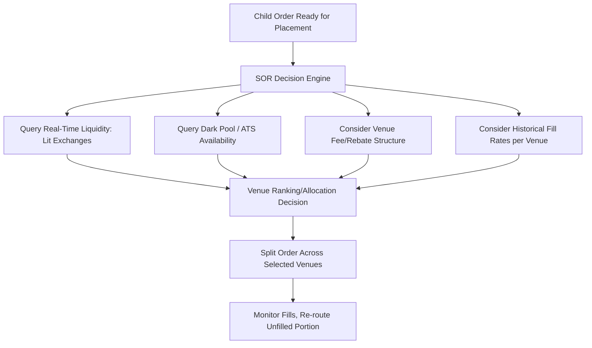
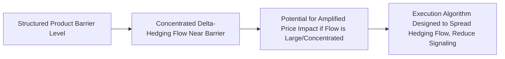

## Algorithmic Execution and Smart Order Routing


### Scope and Objectives

Algorithmic execution encompasses systematic strategies for breaking large orders into smaller child orders and timing their placement to minimize transaction costs — primarily market impact and opportunity cost — while smart order routing (SOR) addresses the complementary problem of determining where (which venue, exchange, or liquidity pool) each child order should be sent given fragmented market structure across multiple trading venues. Both are relevant to derivatives markets, particularly listed futures and options where liquidity can be fragmented across exchanges, and to the hedging/rebalancing flows generated by systematic and structured product desks.



### The Transaction Cost Framework

Execution algorithms are designed against an implicit or explicit transaction cost model, typically decomposed into:

$$\text{Total Cost} = \text{Market Impact} + \text{Timing Risk (Opportunity Cost)} + \text{Spread Cost} + \text{Explicit Fees}$$

- **Market impact**: The adverse price movement caused by the order's own trading activity, generally increasing with order size relative to available liquidity and with the speed of execution
- **Timing risk**: The risk that the price moves adversely while an order is spread out over time, waiting to reduce market impact — this creates a fundamental trade-off, since minimizing market impact (trading slowly) increases timing risk exposure, and vice versa
- **Spread cost**: The cost of crossing the bid-ask spread, particularly relevant for aggressive/marketable order types
- **Explicit fees**: Exchange fees, clearing fees, and maker/taker fee structures that vary by venue and order type

### Classical Scheduling Algorithms

**TWAP (Time-Weighted Average Price)**

Splits the parent order into equal-sized child orders executed at regular time intervals across the execution horizon, without reference to volume patterns.

```python
def twap_schedule(total_quantity, n_intervals):
    child_size = total_quantity / n_intervals
    return [child_size] * n_intervals
```

TWAP is simple and predictable but ignores intraday volume patterns, potentially trading disproportionately during illiquid periods relative to a volume-aware alternative.

**VWAP (Volume-Weighted Average Price)**

Schedules child order sizes proportionally to a historical or predicted intraday volume profile, aiming to match (and be benchmarked against) the market's volume-weighted average price over the execution window.

```python
import numpy as np

def vwap_schedule(total_quantity, historical_volume_profile):
    """
    historical_volume_profile: array of expected volume fractions per interval,
    typically derived from historical intraday volume curves (e.g., the
    well-documented U-shaped intraday volume pattern with higher volume
    near market open and close).
    """
    normalized_profile = historical_volume_profile / historical_volume_profile.sum()
    return total_quantity * normalized_profile
```

Most listed markets exhibit a characteristic U-shaped intraday volume curve (elevated volume near the open and close, relatively quieter midday), which VWAP scheduling algorithms typically incorporate via historical volume profile estimation.

**POV (Percentage of Volume)**

Rather than following a pre-determined schedule, POV algorithms dynamically size child orders as a target percentage of observed real-time market volume, adapting to actual (rather than predicted) volume as it occurs.

```python
def pov_child_order_size(target_participation_rate, observed_market_volume_this_interval):
    return target_participation_rate * observed_market_volume_this_interval
```

**Implementation Shortfall (Almgren-Chriss Framework)**

The Almgren-Chriss model formalizes the market-impact-versus-timing-risk trade-off explicitly, optimizing an execution trajectory that minimizes expected cost subject to a risk-aversion-weighted penalty on execution variance:

$$\min_{x(t)} \, \mathbb{E}[\text{Implementation Shortfall}] + \lambda \cdot \text{Var}[\text{Implementation Shortfall}]$$

where $\lambda$ is a risk-aversion parameter controlling the trade-off between minimizing expected cost (favoring slower execution to reduce impact) and minimizing variance/timing risk (favoring faster execution). The resulting optimal trajectory in the basic Almgren-Chriss formulation is a smooth, front-loaded or back-loaded curve depending on the relative magnitude of temporary versus permanent impact and the chosen risk aversion.

```python
def almgren_chriss_trajectory(total_quantity, n_intervals, risk_aversion, temp_impact, perm_impact, volatility):
    """
    Simplified illustrative implementation of the Almgren-Chriss optimal
    execution trajectory; the actual closed-form solution involves
    hyperbolic sine/cosine functions of a parameter combining risk
    aversion, volatility, and impact parameters.
    """
    kappa = np.sqrt(risk_aversion * volatility**2 / temp_impact)
    tau = np.linspace(0, n_intervals, n_intervals + 1)
    remaining = total_quantity * np.sinh(kappa * (n_intervals - tau)) / np.sinh(kappa * n_intervals)
    trade_sizes = -np.diff(remaining)
    return trade_sizes
```

[Inference] The exact closed-form Almgren-Chriss trajectory depends on the specific functional forms assumed for temporary and permanent market impact (commonly linear in the basic model, though nonlinear extensions exist in the broader literature); the illustrative implementation above captures the general shape and trade-off logic rather than reproducing every variant's exact formula.

### Reinforcement Learning for Execution

Reinforcement learning has been applied to execution scheduling as an alternative to the closed-form Almgren-Chriss framework, framing the problem as a sequential decision process where an agent observes market state (order book depth, recent price/volume, remaining time and quantity) and decides child order size/aggressiveness at each step, optimizing directly against a chosen cost objective via simulation or historical replay training.

```python
import torch
import torch.nn as nn

class ExecutionRLAgent(nn.Module):
    def __init__(self, state_dim=8, hidden_dim=64):
        super().__init__()
        self.net = nn.Sequential(
            nn.Linear(state_dim, hidden_dim), nn.ReLU(),
            nn.Linear(hidden_dim, hidden_dim), nn.ReLU(),
            nn.Linear(hidden_dim, 1), nn.Sigmoid(),  # fraction of remaining quantity to trade this step
        )

    def forward(self, state):
        # state: [remaining_qty_frac, remaining_time_frac, spread, volatility,
        #         order_book_imbalance, recent_volume, current_participation_rate, urgency]
        return self.net(state)
```

[Inference] RL-based execution approaches are an active area of both academic research and proprietary institutional development; published academic results generally report improvements over classical benchmark algorithms (VWAP, TWAP, basic Almgren-Chriss) under the specific simulated or backtested conditions studied, but the degree to which these improvements are realized consistently in live production trading, across different market regimes, is less uniformly documented in public literature and is often treated as proprietary institutional intellectual property.

### Order Book Dynamics and Microstructure Signals

More sophisticated execution algorithms incorporate real-time limit order book features to adapt aggressiveness dynamically:

```python
def order_book_imbalance(bid_volume, ask_volume):
    return (bid_volume - ask_volume) / (bid_volume + ask_volume)

def adaptive_aggressiveness(base_participation_rate, imbalance, spread_bps, volatility_signal):
    """
    Illustrative adjustment: increase aggressiveness when order flow
    imbalance favors the trader's direction and spread is tight;
    reduce aggressiveness during high volatility or unfavorable imbalance.
    """
    imbalance_adjustment = 1 + 0.3 * imbalance
    spread_adjustment = 1 / (1 + spread_bps / 10)
    volatility_adjustment = 1 / (1 + volatility_signal)
    return base_participation_rate * imbalance_adjustment * spread_adjustment * volatility_adjustment
```

### Smart Order Routing Architecture



**Venue selection considerations for SOR:**

- **Displayed (lit) liquidity vs. dark pools**: Lit venues display order book depth publicly, aiding price discovery but potentially signaling trading intent; dark pools do not display resting orders pre-trade, reducing information leakage for large orders at the cost of execution certainty
- **Fee/rebate structures**: Maker-taker fee models (rebates for adding liquidity, fees for removing it) vary across venues and influence optimal routing decisions, particularly for smaller, more price-sensitive child orders
- **Historical fill rate and latency data**: SOR systems typically maintain venue-specific historical statistics (fill probability, average latency, adverse selection characteristics) informing dynamic venue ranking
- **Regulatory considerations**: Best execution obligations (e.g., under MiFID II in the EU, or Reg NMS-related considerations in the US equity market structure context) impose requirements on routing decisions and their documentation, which SOR systems must be designed to satisfy and audit against

[Inference] Specific regulatory best-execution requirements vary materially by jurisdiction and asset class (equities, listed derivatives, OTC derivatives each have distinct regulatory frameworks), so applicable requirements should be verified against current regulation for the specific market and instrument type in question rather than assumed to generalize across jurisdictions.

### Application to Derivatives-Specific Execution Contexts

**Futures and Listed Options Execution**

Listed futures and options markets, while more centralized than equities in many jurisdictions, still present execution algorithm design considerations around managing market impact for large directional or hedging flows, and around the specific microstructure of options markets (wider relative spreads, lower liquidity at away-from-the-money strikes, and the interaction between an option's liquidity and its underlying's liquidity).

**Hedging Flow Execution**

Systematic and structured product desks generate substantial hedging flow (Delta-hedging rebalancing, autocallable barrier-related hedging activity) that itself requires careful execution algorithm design to avoid excessive market impact, particularly for large or concentrated structured product books where hedging flow can itself become a market-moving factor around key barrier levels — a dynamic sometimes discussed in the context of "gamma-driven" market impact around large concentrations of barrier or expiry-related hedging activity.



[Inference] The magnitude and market relevance of such gamma/barrier-driven hedging flow effects depends on the specific concentration of outstanding structured product notional relative to underlying liquidity for the relevant asset, which varies substantially by underlying and market and is generally not precisely quantifiable from public information alone.

### Post-Trade Transaction Cost Analysis (TCA)

Execution quality is measured post-trade against standard benchmarks to evaluate algorithm performance and inform future algorithm/venue selection:

```python
def implementation_shortfall(decision_price, average_execution_price, side="buy"):
    if side == "buy":
        return (average_execution_price - decision_price) / decision_price
    else:
        return (decision_price - average_execution_price) / decision_price

def vwap_slippage(average_execution_price, market_vwap_over_execution_window, side="buy"):
    if side == "buy":
        return (average_execution_price - market_vwap_over_execution_window) / market_vwap_over_execution_window
    else:
        return (market_vwap_over_execution_window - average_execution_price) / market_vwap_over_execution_window
```

Standard TCA benchmarks include **implementation shortfall** (versus the price at the decision/order-arrival time), **VWAP slippage** (versus the market's realized VWAP over the execution window), and **arrival price** benchmarks, each capturing a somewhat different aspect of execution quality and each subject to its own well-documented interpretive caveats (e.g., VWAP benchmarking can be gamed by algorithms that simply track volume rather than genuinely minimizing cost).

### Comparative Overview of Execution Algorithm Types

| Algorithm Type | Scheduling Logic | Best Suited For |
| --- | --- | --- |
| TWAP | Equal size per time interval | Simple, low-signal-risk execution when volume profile is uncertain |
| VWAP | Proportional to predicted volume profile | Benchmark-matching execution, minimizing VWAP slippage |
| POV | Dynamic, proportional to real-time observed volume | Adapting to unpredictable intraday volume/liquidity shifts |
| Implementation Shortfall (Almgren-Chriss) | Optimized trade-off of impact vs. timing risk | Explicit cost-minimization with a stated risk-aversion preference |
| RL-based adaptive | Learned policy from state features | Capturing complex, nonlinear microstructure patterns beyond closed-form models |

### Governance and Risk Management Considerations

- **Algorithm behavior in stressed/illiquid conditions**: Execution algorithms require explicit testing and often circuit-breaker-style safeguards for behavior during abnormal market conditions (rapid price moves, liquidity evaporation), given documented historical instances of algorithmic execution behavior contributing to or exacerbating flash-crash-style episodes in various markets
- **Kill switches and pre-trade risk controls**: Standard practice includes maximum order size limits, maximum participation rate caps, and price collar checks (rejecting child orders priced too far from a reference price) as safeguards against algorithm malfunction or erroneous parent order input
- **Best execution documentation**: Regulatory best-execution obligations generally require firms to demonstrate a reasonable process for achieving favorable execution outcomes, which in practice requires maintaining auditable records of algorithm choice rationale, venue routing decisions, and post-trade TCA results

**Related Topics**

- Almgren-Chriss optimal execution model: full derivation and extensions
- Market microstructure and limit order book dynamics
- MiFID II and Reg NMS best execution regulatory frameworks
- Dark pool mechanics and information leakage considerations
- Transaction cost analysis (TCA) methodology and benchmark selection
- Reinforcement learning architectures for adaptive execution algorithms