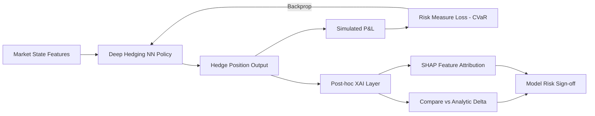
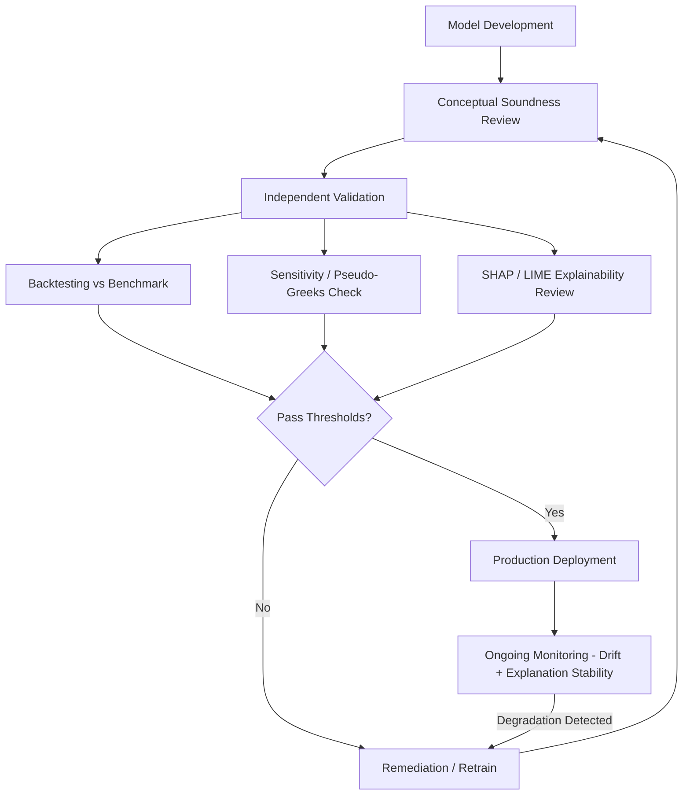

## Model Risk and Explainability for AI Models

### Overview

Model risk in the context of AI-driven derivatives pricing, hedging, and risk management refers to the potential for adverse outcomes (financial loss, mispricing, regulatory breach, reputational damage) arising from errors in model design, implementation, or usage — errors that are amplified when the model is a machine learning (ML) or deep learning system rather than a traditional parametric model (e.g., Black-Scholes, Hull-White). Explainability (XAI) is the discipline of making the internal logic of these models interpretable to humans — quants, risk managers, auditors, and regulators — so that model risk can be identified, quantified, and mitigated.

Traditional derivatives models (closed-form or PDE-based) are inherently interpretable: every parameter has a financial meaning (volatility, drift, correlation), and sensitivities (the Greeks) are analytically derivable. ML models — gradient-boosted trees, neural networks, Gaussian processes used for pricing surfaces, hedging policies, or XVA calculation acceleration — trade this transparency for flexibility and speed, creating a **governance gap** that model risk management (MRM) frameworks must close.

### Regulatory Foundations for Model Risk

**Key Points**

- **SR 11-7** (Federal Reserve/OCC, 2011): The foundational U.S. supervisory guidance on model risk management. Defines a model as "a quantitative method, system, or approach that applies statistical, economic, financial, or mathematical theories, techniques, and assumptions to process input data into quantitative estimates." SR 11-7 mandates three pillars: robust development/implementation, independent validation, and governance/controls.
- **PRA SS1/23** (UK Prudential Regulation Authority, 2023): Updated model risk principles explicitly extending SR 11-7-style governance to encompass ML and AI models, with heightened emphasis on explainability commensurate with model complexity and materiality.
- **EU AI Act** (2024): Classifies certain financial AI use cases (e.g., creditworthiness assessment) as "high-risk," imposing transparency, human oversight, and documentation obligations; while derivatives pricing models are not always explicitly enumerated, supervisory expectation is that similar rigor applies to material trading models.
- **FRTB Internal Models Approach (IMA)**: Requires P&L attribution testing and backtesting that implicitly penalizes opaque models whose risk factor sensitivities cannot be cleanly decomposed.

[Inference] Supervisory bodies have not issued a single unified global standard specifically for ML explainability in derivatives; institutions largely map ML governance onto existing SR 11-7 / SS1/23 style frameworks, adapting validation techniques to account for non-parametric model classes.

### Sources of Model Risk Specific to AI Models

#### 1. Data Risk

- **Training-serving skew**: Model trained on historical market regimes (e.g., pre-2022 low-rate environment) may fail silently in regime shifts.
- **Survivorship/selection bias**: Training data drawn only from liquid, exchange-traded derivatives may not generalize to OTC or exotic structures.
- **Label leakage**: Using future information (e.g., realized volatility) to predict a quantity that should only depend on information available at trade time.

#### 2. Specification Risk

- **Overfitting**: High-capacity models (deep neural networks) memorize noise in historical option surfaces rather than learning genuine risk-neutral dynamics, producing arbitrage-violating prices out-of-sample.
- **Extrapolation failure**: ML pricers trained on observed strikes/tenors extrapolate poorly to far out-of-the-money or long-dated instruments — precisely where hedging errors are costliest.
- **No-arbitrage violations**: Unconstrained regressors can produce implied volatility surfaces with butterfly or calendar-spread arbitrage, since standard loss functions (MSE) do not encode these constraints.

#### 3. Implementation Risk

- Floating-point and numerical instability in gradient computation for Greeks approximated via automatic differentiation (AD) rather than analytic formulas.
- Version drift between training environment (e.g., a specific `scikit-learn` or `PyTorch` build) and production inference environment.

#### 4. Usage Risk

- Model applied outside its validated domain (e.g., an equity vol-surface model repurposed for FX without revalidation).
- Human over-reliance ("automation bias") on model output without sanity-checking against benchmark models.

### Explainability Taxonomy

**Key Points**

- **Intrinsic (ante-hoc) interpretability**: The model's own structure is understandable — linear regression, shallow decision trees, generalized additive models (GAMs), monotonic gradient-boosted trees.
- **Post-hoc explainability**: A separate technique explains a black-box model after training — SHAP, LIME, partial dependence plots (PDPs), Integrated Gradients, saliency maps.
- **Global explainability**: Describes overall model behavior across the entire input space (e.g., "the model's price is monotonically increasing in implied volatility").
- **Local explainability**: Describes behavior for a single prediction (e.g., "for this specific option, 60% of the predicted price deviation from Black-Scholes is attributable to skew term").

#### SHAP (SHapley Additive exPlanations)

SHAP is the dominant post-hoc technique in quantitative finance due to its grounding in cooperative game theory (Shapley values), which guarantees a unique, consistent attribution satisfying efficiency, symmetry, and additivity axioms.

For a model $f$ and input features $x = (x_1, \ldots, x_n)$, the Shapley value for feature $i$ is:

$$\phi_i = \sum_{S \subseteq N \setminus \{i\}} \frac{|S|!(n-|S|-1)!}{n!} \left[ f(S \cup \{i\}) - f(S) \right]$$

where $N$ is the full feature set and $S$ ranges over all subsets excluding feature $i$. This represents the average marginal contribution of feature $i$ across all possible feature coalitions.

**Example**: For a neural-network-based option pricer, SHAP can decompose a predicted price deviation into contributions from moneyness, time-to-expiry, implied volatility level, skew, and interest rate — analogous to a Greeks-style breakdown but for an otherwise opaque model.

```python
import shap
import xgboost as xgb

# model: trained gradient-boosted tree pricer for exotic option premiums
explainer = shap.TreeExplainer(model)
shap_values = explainer.shap_values(X_test)

# Global feature importance
shap.summary_plot(shap_values, X_test, feature_names=[
    "moneyness", "time_to_expiry", "atm_vol", "skew", "rate", "correlation"
])

# Local explanation for a single trade
shap.force_plot(explainer.expected_value, shap_values[0], X_test.iloc[0])
```

[Inference] Exact TreeSHAP (used for tree ensembles like XGBoost/LightGBM) is computationally efficient — polynomial rather than exponential in feature count — but KernelSHAP (used for arbitrary black-box models, including neural networks) is an approximation and its stability should be checked via repeated sampling with different background datasets before being relied upon for model validation sign-off.

#### LIME (Local Interpretable Model-agnostic Explanations)

LIME approximates the decision boundary of a black-box model in the local neighborhood of a specific prediction with an interpretable surrogate (typically sparse linear regression):

$$\xi(x) = \arg\min_{g \in G} \mathcal{L}(f, g, \pi_x) + \Omega(g)$$

where $\mathcal{L}$ measures how unfaithful surrogate $g$ is to $f$ in the neighborhood weighted by proximity measure $\pi_x$, and $\Omega(g)$ penalizes surrogate complexity.

[Inference] LIME's locality is defined by a perturbation-sampling procedure whose kernel width is a hyperparameter; in high-dimensional derivatives feature spaces (e.g., full vol-surface grids as input), LIME explanations can be unstable across repeated runs unless perturbation sampling is carefully tuned — this is a known practical limitation rather than a universally documented guarantee of failure.

#### Integrated Gradients (for Deep Learning Models)

For neural-network-based pricers (e.g., deep hedging models), Integrated Gradients attributes a prediction to input features by integrating gradients along a path from a baseline $x'$ (e.g., an at-the-money, zero-skew reference state) to the actual input $x$:

$$IG_i(x) = (x_i - x_i') \times \int_0^1 \frac{\partial f(x' + \alpha(x - x'))}{\partial x_i} \, d\alpha$$

This satisfies the *completeness axiom*: the sum of attributions equals $f(x) - f(x')$, giving a clean reconciliation between the explanation and the model output — useful for XVA and deep-hedging P&L attribution.

### Model-Agnostic vs. Model-Specific Techniques

| Technique | Type | Model Class | Computational Cost | Typical DerivProducts Use |
| --- | --- | --- | --- | --- |
| TreeSHAP | Exact, model-specific | Tree ensembles | Low (polynomial) | Credit/counterparty risk scoring, XVA proxy models |
| KernelSHAP | Approximate, model-agnostic | Any | High | Neural pricing surrogates |
| Integrated Gradients | Exact (gradient-based) | Differentiable (NN) | Moderate | Deep hedging, RL hedging policies |
| Partial Dependence Plots | Global, model-agnostic | Any | Moderate | Sanity-checking monotonicity vs. Greeks |
| Surrogate models (GAMs, shallow trees) | Global approximation | Any | Low | Regulator-facing model summaries |
| Attention weight visualization | Model-specific | Transformer-based | Low | Sequence models for term-structure forecasting |

### Explainability in Specific Derivatives AI Applications

#### 1. ML-Accelerated XVA (CVA/FVA/KVA) Calculation

Nested Monte Carlo for XVA is computationally prohibitive; regression-based or neural network proxies (e.g., Least-Squares Monte Carlo extensions, deep XVA) approximate exposure profiles. Model risk arises because these proxies must be validated against the "true" nested simulation on a representative sample, and SHAP/PDP techniques are used to confirm the proxy's sensitivity to netting set composition, collateral thresholds, and counterparty credit spread aligns with known XVA drivers.

#### 2. Deep Hedging

Deep hedging (Buehler et al.) trains a neural network hedging policy end-to-end by minimizing a risk measure (e.g., CVaR of hedged P&L) over simulated paths, rather than deriving a hedge ratio analytically. Model risk here is acute because:

- The learned policy is a black box mapping market state to hedge position.
- Explainability techniques (e.g., comparing learned hedge ratios to Black-Scholes delta via saliency analysis across moneyness/tenor) are essential to confirm the network has not learned a spurious, regime-specific strategy that fails to generalize.



#### 3. Implied Volatility Surface Fitting / Arbitrage-Free ML Surfaces

Neural SDE and Gaussian Process approaches fit vol surfaces with soft or hard no-arbitrage constraints baked into the loss function (e.g., penalizing negative butterfly spreads). Explainability here focuses on verifying via PDPs that the fitted surface remains monotonic in strike/maturity in the expected directions, since a black-box surface that "looks good" on RMSE can still embed local arbitrage.

#### 4. Reinforcement Learning for Market Making / Execution

RL agents optimizing bid-ask quoting or execution schedules are among the hardest to explain, since the policy is a function of a learned value function or policy network over a high-dimensional state (order book depth, inventory, volatility regime). Explainability approaches include:

- **Policy distillation**: Training an interpretable surrogate (decision tree) to mimic the RL policy's action distribution.
- **Counterfactual analysis**: "What would the agent have done if inventory were zero?" to isolate inventory-risk-driven behavior from alpha-driven behavior.

### Model Validation Framework for AI Derivatives Models

**Key Points**

1. **Conceptual soundness review**: Does the model architecture make theoretical sense for the problem (e.g., is a no-arbitrage constraint architecturally enforced or only statistically likely)?
2. **Outcomes analysis / backtesting**: Compare model outputs against realized market outcomes and against benchmark models (e.g., ML pricer vs. calibrated local-vol model) over multiple regimes.
3. **Sensitivity analysis**: Perturb inputs and confirm output sensitivities (pseudo-Greeks via AD or finite differences) are directionally consistent with financial intuition — e.g., $\frac{\partial \text{Price}}{\partial \sigma} > 0$ for a long option position.
4. **Explainability sign-off**: SHAP/LIME/IG outputs reviewed by independent validators to confirm the model is not relying on spurious or non-causal features (e.g., a day-of-week feature dominating a rates derivative price would be a red flag).
5. **Ongoing monitoring**: Drift detection on both input distributions (covariate shift) and explanation stability (SHAP value drift over time) as an early warning signal that the model may need retraining.
6. **Challenger models**: Maintain a simpler, interpretable benchmark model in parallel; large, unexplained divergence between challenger and champion model output triggers escalation.



### Governance and Documentation Requirements

- **Model inventory**: Every AI model used in derivatives pricing/risk must be catalogued with owner, purpose, materiality tier, and validation status.
- **Model risk tiering**: Higher-materiality models (those affecting P&L recognition, regulatory capital, or client-facing pricing) require deeper explainability documentation than internal research models.
- **Explainability report as a deliverable**: A formal document accompanying model validation, typically including global SHAP summary plots, local explanations for edge-case trades, PDP monotonicity checks, and a narrative reconciling ML behavior with financial theory.
- **Human-in-the-loop controls**: For high-materiality decisions (e.g., large notional exotic trade pricing), many institutions require human quant review of the AI-generated price alongside the explainability output before trade booking.

### Common Pitfalls

- Treating a high $R^2$ or low RMSE as sufficient validation without checking for arbitrage violations or extrapolation failure.
- Using SHAP/LIME outputs directly as hedge ratios — these are *statistical attribution* measures, not the same as risk-neutral analytic Greeks, and [Inference] conflating the two can lead to hedging errors if not explicitly validated against a benchmark analytic model.
- Explainability theater: generating SHAP plots for regulatory box-checking without operationalizing them into actual monitoring or escalation workflows.
- Ignoring explanation instability: if SHAP attributions for economically similar trades vary wildly, this itself is a model risk signal, not just an XAI artifact to be smoothed over.

### Illustrative Attribution Diagram (SVG)

<svg xmlns="http://www.w3.org/2000/svg" viewBox="0 0 700 340">
<text x="350" y="25" text-anchor="middle" font-size="16" font-weight="bold" fill="#222">SHAP Local Attribution — Exotic Option Price Deviation (svg_diagram)</text>
<line x1="100" y1="60" x2="100" y2="300" stroke="#888" stroke-width="1" />
<text x="100" y="315" text-anchor="middle" font-size="12" fill="#555">Base Value</text>
<rect x="100" y="80" width="90" height="30" fill="#4C78A8" />
<text x="145" y="100" text-anchor="middle" font-size="11" fill="white">+Skew: +0.42</text>
<rect x="190" y="80" width="60" height="30" fill="#72B7B2" />
<text x="220" y="100" text-anchor="middle" font-size="11" fill="white">+Vol: +0.28</text>
<rect x="250" y="80" width="-40" height="30" fill="#E45756" transform="translate(-40,0)" />
<rect x="210" y="80" width="40" height="30" fill="#E45756" />
<text x="230" y="100" text-anchor="middle" font-size="10" fill="white">-Rate</text>
<rect x="250" y="80" width="80" height="30" fill="#F58518" />
<text x="290" y="100" text-anchor="middle" font-size="11" fill="white">+TTE: +0.19</text>
<rect x="330" y="80" width="50" height="30" fill="#54A24B" />
<text x="355" y="100" text-anchor="middle" font-size="10" fill="white">+Corr</text>
<line x1="380" y1="80" x2="380" y2="110" stroke="#222" stroke-width="2" />
<text x="450" y="100" font-size="12" fill="#222">Model Prediction</text>

<text x="100" y="150" font-size="12" fill="#333">Feature contributions sum to predicted deviation from analytic benchmark price</text>

<text x="100" y="175" font-size="12" fill="#333">(Completeness/Efficiency axiom: sum of φ_i = f(x) − E[f(x)])</text>

<rect x="100" y="200" width="500" height="1" fill="#ccc" />
<text x="100" y="230" font-size="12" font-weight="bold" fill="#222">Global Feature Importance (mean |SHAP value|)</text>
<rect x="100" y="245" width="220" height="14" fill="#4C78A8" />
<text x="330" y="257" font-size="10" fill="#333">Skew term</text>
<rect x="100" y="265" width="150" height="14" fill="#72B7B2" />
<text x="260" y="277" font-size="10" fill="#333">ATM Vol</text>
<rect x="100" y="285" width="90" height="14" fill="#F58518" />
<text x="200" y="297" font-size="10" fill="#333">Time to Expiry</text>
</svg>

### Related Topics

- **Arbitrage-Free Neural SDE Models for Volatility Surface Calibration**
- **Deep Hedging: Theory, CVaR Loss Functions, and Transaction Cost Modeling**
- **XVA (CVA/FVA/KVA) Computation Acceleration via Machine Learning Proxies**
- **Reinforcement Learning for Optimal Execution and Market Making**
- **SR 11-7 / SS1/23 Model Risk Management Frameworks in Quantitative Finance**
- **Adversarial Robustness and Stress Testing of ML-Based Pricing Models**
- **Federated Learning and Privacy-Preserving ML in Multi-Bank Derivatives Data**
- **Conformal Prediction for Uncertainty Quantification in Derivatives Pricing**
- **Gaussian Process Regression for Implied Volatility Surface Modeling**
- **Monotonic and Constrained Gradient Boosting for No-Arbitrage Pricing**