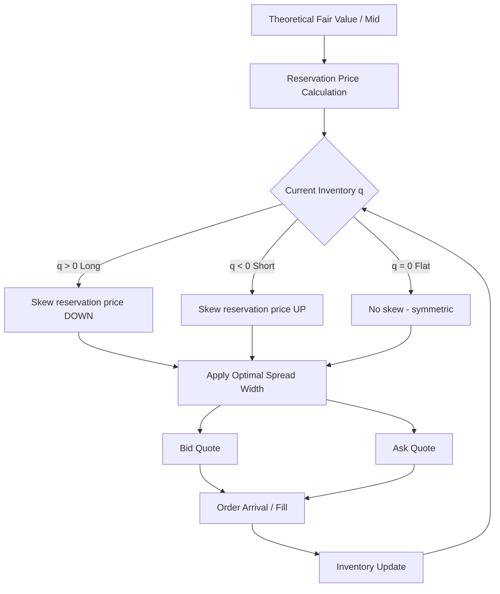
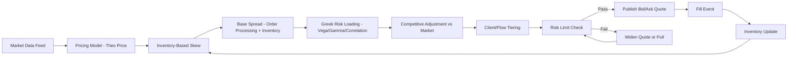
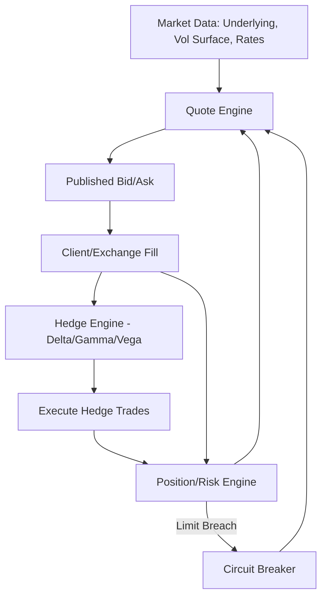

## Market Making and Bid Ask Spread Setting

### Overview

Market making in derivatives is the continuous provision of two-sided liquidity — simultaneous bid (buy) and ask/offer (sell) quotes — by a dealer or electronic liquidity provider, compensated by capturing the bid-ask spread while managing the inventory, adverse selection, and hedging risks that arise from being obligated (contractually or competitively) to trade. Spread setting is the quantitative process of determining how wide that bid-ask gap should be, balancing the trade-off between competitiveness (tighter spreads win order flow) and profitability/risk coverage (wider spreads compensate for risk).

Unlike cash equities market making, derivatives market making must additionally price in the cost of dynamically hedging the underlying Greeks (delta, gamma, vega) of the position being warehoused, making spread-setting inseparable from the desk's hedging infrastructure.

### Core Economic Components of a Bid-Ask Spread

**Key Points**

- **Order processing cost**: Fixed cost of executing and clearing a trade (exchange fees, clearing/margin costs, operational overhead). Largely constant per trade, so it matters more for small tickets.
- **Inventory risk cost**: Compensation for holding a position (and its associated Greek exposures) that the market maker did not want and must hedge or unwind, incurring price risk and hedging transaction costs in the interim.
- **Adverse selection cost**: Compensation for the risk of trading with a better-informed counterparty (e.g., someone trading ahead of a known catalyst), captured in market microstructure theory as the "information cost" component of the spread.

The classical microstructure decomposition (Glosten-Milgrom framework, extended to inventory models by Stoll, Ho-Stoll) expresses the observed spread as approximately:

$$\text{Spread} = \text{Order Processing Cost} + \text{Inventory Risk Cost} + \text{Adverse Selection Cost}$$

### Foundational Market Making Models

#### 1. Garman (1976) — Inventory Model Foundations

The earliest formal model treating a market maker as an inventory manager subject to stochastic order arrival, establishing that the dealer sets prices to control the probability of running out of inventory (in either direction) within a finite horizon.

#### 2. Ho & Stoll (1981) — Dynamic Inventory Control

Extends Garman by modeling the market maker as a utility-maximizing agent who continuously adjusts bid and ask prices as a function of current inventory position, risk aversion, and time horizon. The key result: the market maker's **quoted midpoint should skew away from the theoretical fair value** in the direction that encourages inventory-reducing trades — if long inventory, skew both bid and ask downward to attract sellers... actually to attract buyers on the ask and discourage further buying on the bid.

#### 3. Avellaneda & Stoikov (2008) — Optimal Market Making with Inventory and Risk Aversion

The dominant modern quantitative framework, widely implemented in electronic and derivatives market making. The model derives a **reservation price** $r(s,q,t)$ — the price at which the market maker is indifferent to holding vs. not holding inventory $q$ — as a function of the mid-price $s$, current inventory $q$, risk aversion $\gamma$, and time remaining $T-t$:

$$r(s, q, t) = s - q \gamma \sigma^2 (T-t)$$

The **optimal spread** around this reservation price is:

$$\delta_a + \delta_b = \gamma \sigma^2 (T - t) + \frac{2}{\gamma} \ln\left(1 + \frac{\gamma}{k}\right)$$

where:

- $\sigma^2$ is the variance of the underlying's price process
- $\gamma$ is the market maker's risk aversion coefficient
- $k$ is a parameter of the order arrival intensity function (how quickly the market maker's fill probability decays as it moves its quote away from the mid)
- $T - t$ is the time remaining in the trading horizon

**Example**: A market maker with high inventory risk aversion ($\gamma$ large) or facing high underlying volatility ($\sigma^2$ large) will widen both the reservation-price skew and the total spread — even before considering any informational edge, purely as compensation for the inventory risk of being unable to instantaneously offload the position.

Order arrival intensity is typically modeled with an exponential decay in distance from mid-price:

$$\lambda(\delta) = A e^{-k\delta}$$

where $\delta$ is the distance of the quote from the mid, $A$ is the base arrival rate at the touch, and $k$ controls how quickly fill probability decays as the market maker quotes further from fair value.

### Derivatives-Specific Spread Components

For options and other derivatives (as opposed to a simple cash instrument), spread setting must additionally account for:

#### 1. Volatility Risk Premium / Vega Cost

The bid-ask spread on an option's implied volatility (the "vol spread") compensates the market maker for the cost of dynamically hedging vega exposure, which cannot be perfectly hedged with the underlying alone. Vol spreads widen for:

- Longer-dated options (harder to hedge realized vs. implied vol drift over a longer horizon)
- Options with less liquid hedging instruments (e.g., single-name equity options with no listed VIX-like proxy)

#### 2. Gamma/Convexity Cost

Since delta-hedging an option is imperfect between rebalancing intervals, the market maker bears **gamma risk** proportional to $\frac{1}{2}\Gamma \sigma^2 S^2 dt$ in expectation. Market makers widen spreads for high-gamma instruments (near-the-money, near-expiry options) because the cost of discrete-time delta hedging (hedging slippage) rises with gamma.

$$\text{Expected Hedging P\&L} \approx \frac{1}{2}\Gamma S^2 \left( \sigma_{\text{realized}}^2 - \sigma_{\text{implied}}^2 \right) dt$$

This identity underlies why market makers price the bid/ask around their view of **realized vs. implied volatility** — if a market maker believes realized vol will exceed the level implied by the mid price, they will lean toward being a net buyer of vega (tighter offer, wider bid) to capture this differential through the hedging process.

#### 3. Correlation and Cross-Greek Costs (for Multi-Asset/Exotic Derivatives)

For basket options, spread options, or other multi-underlying structures, the spread must price in correlation risk — the cost of hedging cross-asset exposure that itself requires a liquid correlation hedge (often unavailable, forcing the desk to run naked correlation risk and charge accordingly).

#### 4. Skew and Term-Structure Risk

For options desks running a full vol surface, spreads on any single strike/tenor must be consistent with — and wide enough to protect against — the risk of the entire surface moving (parallel shifts, skew steepening/flattening, term-structure twists) that cannot be hedged by a single vanilla instrument.

### Quote Construction Workflow

**Key Points**

1. **Theoretical/model price**: Compute the base fair value using the desk's pricing model (Black-Scholes, local vol, stochastic vol, or an ML-based pricer) calibrated to current market data.
2. **Reservation price adjustment**: Skew the fair value based on current inventory position (per Avellaneda-Stoikov or the desk's proprietary inventory model).
3. **Base spread application**: Apply the minimum spread required to cover order processing + baseline inventory/adverse-selection costs.
4. **Volatility/Greek risk loading**: Widen further based on vega, gamma, and correlation exposure specific to the instrument.
5. **Competitive/market context adjustment**: Tighten toward the observable market (if quoting alongside competitors on an RFQ or exchange) subject to a minimum acceptable spread floor.
6. **Client/flow tiering**: Adjust spread based on counterparty classification — tighter for flow believed to be uninformed/hedging-driven, wider for flow historically associated with adverse selection (e.g., certain hedge fund clients in RFQ platforms).
7. **Real-time risk limit check**: Confirm the resulting quote, if filled, would not breach position, Greek, or VaR limits; if it would, widen the relevant side or pull the quote.

### Adverse Selection Management

**Key Points**

- **Quote fading/skewing on toxic flow detection**: Real-time flow toxicity metrics (e.g., VPIN — Volume-Synchronized Probability of Informed Trading) can trigger automatic spread widening or quote withdrawal when order flow appears informationally toxic.
- **Last look** (common in FX and some OTC derivatives markets): A brief window after a client hits a quote during which the market maker can reject the trade if the market has moved — a controversial practice balancing latency risk against fair dealing concerns, [Unverified] subject to varying regulatory scrutiny and venue-specific rules across jurisdictions.
- **Quote size limits**: Displaying full risk appetite only at the touch, with size increasing at wider price levels (a "quote ladder" or "depth of book" structure), so that large informed orders pay a size-dependent premium.

### RFQ (Request-for-Quote) Spread Setting vs. Continuous Quoting

Derivatives markets — especially OTC and exchange-listed but less liquid options — frequently use RFQ protocols rather than continuous two-sided streaming quotes.

| Dimension | Continuous/Streaming Quotes | RFQ-Based Quoting |
| --- | --- | --- |
| Spread exposure | Public, always live | Private, per-request |
| Adverse selection defense | Quote skew, size limits, last look | Client tiering, request frequency monitoring, "won/lost" analysis |
| Typical instruments | Listed options, futures, liquid FX | Exotic options, large blocks, swaps, structured notes |
| Latency sensitivity | High (HFT competition) | Lower, but response-time SLA still matters |
| Spread determinants | Primarily inventory + micro-adverse-selection | Heavily influenced by client relationship, deal size, competitive win-rate modeling |

In RFQ markets, desks often build a **win-rate model**: a statistical model estimating the probability of winning a given trade as a function of quoted spread, historical hit ratios with that client, instrument liquidity, and competitor presence — then optimizing the quoted spread to maximize expected risk-adjusted P&L rather than simply minimizing spread to win every trade.

$$\mathbb{E}[\text{P\&L}] = P(\text{win} \mid \delta) \times \left( \delta - \text{Expected Hedging Cost} \right)$$

where $P(\text{win} \mid \delta)$ is typically modeled as a decreasing function of quoted spread $\delta$ (e.g., logistic regression or gradient-boosted classifier on historical RFQ outcomes).

### Electronic Market Making Infrastructure

**Key Points**

- **Quote engine**: Low-latency system recalculating theoretical price and spread on every relevant market data tick (underlying price move, implied vol change, rate change).
- **Risk engine**: Real-time position and Greek aggregation feeding back into the quote engine's skew/widening logic.
- **Hedge engine**: Automated delta-hedging (and in more sophisticated setups, partial gamma/vega hedging) executed against the position accumulated from filled quotes.
- **Circuit breakers**: Automatic quote withdrawal on stale market data, excessive fill rates (potential "being run over" scenario), or breach of risk limits.

### Practical Spread-Setting Example (Vanilla Option)

**Example**

Consider a market maker quoting a 1-month at-the-money call option on an underlying at $100, theoretical implied vol of 20%, with the desk's Avellaneda-Stoikov parameters calibrated as $\gamma = 0.1$, $\sigma = 0.20$, $k = 1.5$, and $T - t = 1/12$ (one month):

1. **Reservation price skew**: If the desk is currently long 500 contracts of delta-equivalent exposure in this name, the reservation price shifts below the $100 mid by $q \gamma \sigma^2 (T-t)$, encouraging offsetting sell-side flow.
2. **Base optimal spread**: $\gamma \sigma^2 (T-t) + \frac{2}{\gamma}\ln(1 + \gamma/k)$ evaluated with the above parameters yields a baseline spread width in price terms, converted to vol-points via vega.
3. **Gamma loading**: Since this is a near-the-money, near-dated option (high gamma), an additional vol-spread loading (e.g., +0.5 vol points on each side) is applied to compensate for discrete hedging slippage.
4. **Competitive check**: If the visible exchange market is quoting 19.5% / 20.5% implied vol, and the desk's model-derived spread is wider, the desk may tighten toward the competitive market only if internal risk limits and minimum profitability thresholds are still satisfied.

### Common Pitfalls

- **Static spread tables**: Using a fixed spread-by-instrument-type table without real-time adjustment for realized volatility spikes, leading to being picked off during fast markets.
- **Ignoring correlation between quoted instruments**: Treating each option strike/tenor's spread independently when the underlying portfolio Greek risk is actually correlated across the surface, understating true inventory risk.
- **Overfitting win-rate models to a stable regime**: An RFQ win-rate model trained during low-volatility periods can systematically underprice risk when volatility regimes shift, since $P(\text{win} \mid \delta)$ and true hedging costs are jointly regime-dependent.
- **Neglecting operational/clearing cost changes**: Failing to update the order-processing-cost component of the spread when exchange fees, clearing margin requirements, or capital costs (e.g., under FRTB or SA-CCR) change.
- [Inference] Because $k$ (order arrival sensitivity) and $\gamma$ (risk aversion) in the Avellaneda-Stoikov framework are typically estimated or calibrated rather than directly observed, poor calibration of these parameters — rather than a flaw in the model's structure — is a common practical source of suboptimal spread setting in production implementations.

### Related Topics

- **Delta Hedging and Dynamic Hedging Strategies for Options Desks**
- **Volatility Surface Construction and Skew/Smile Dynamics**
- **VPIN and Flow Toxicity Detection in Market Microstructure**
- **RFQ Protocol Design and Win-Rate Modeling in OTC Derivatives**
- **Gamma Scalping and P&L Attribution for Options Market Makers**
- **Inventory Risk Management and Position Limits on Trading Desks**
- **High-Frequency Market Making in Listed Futures and Options**
- **Last Look Practices and Best Execution Regulation in FX/Derivatives**
- **Capital and Margin Cost Allocation (SA-CCR, FRTB) in Spread Pricing**
- **Algorithmic Quote Engines: Latency, Circuit Breakers, and Risk Controls**