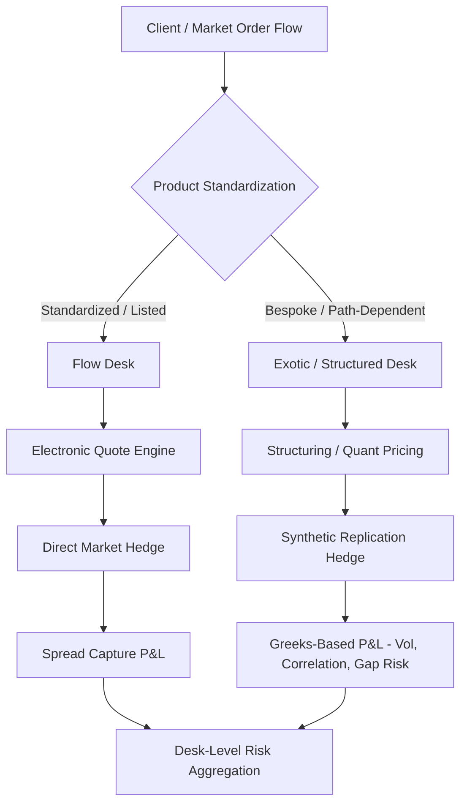
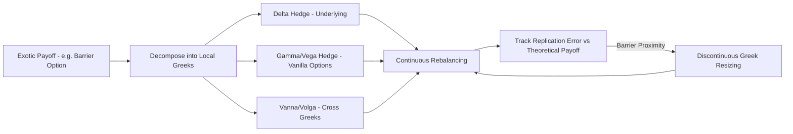
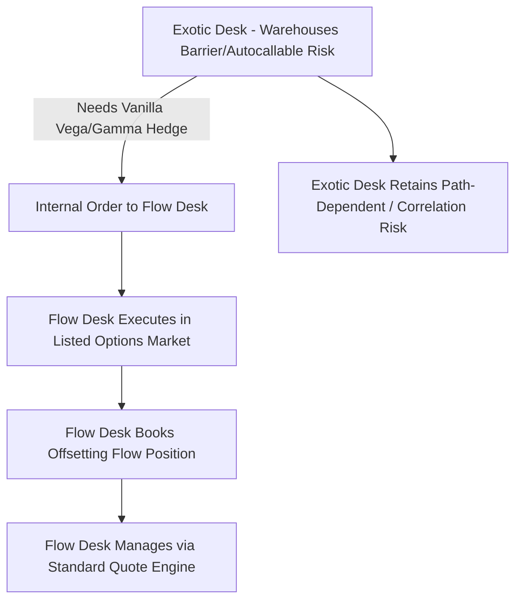

## Flow Versus Exotic and Structured Desks

### Overview

Derivatives trading businesses are commonly organized into distinct desks segmented by product standardization, complexity, and risk profile — most fundamentally the split between **flow desks** (trading liquid, standardized, vanilla instruments in high volume) and **exotic/structured desks** (trading bespoke, complex, low-volume instruments tailored to specific client needs). This organizational split reflects fundamentally different risk management approaches, pricing infrastructure, staffing models, and capital treatment, even though both desks may trade derivatives on the same underlying asset class.

Understanding this distinction is foundational to desk operations because it determines everything downstream: how risk is hedged, how P&L is attributed, how models are validated, how capital is allocated, and how the desk is organizationally structured and compensated.

### Defining Characteristics: Flow Desks

**Key Points**

- **Product standardization**: Trade listed or standardized OTC instruments — vanilla options, futures, interest rate swaps on standard tenors, FX forwards/swaps, single-name and index CDS — with terms conforming to market convention (ISDA definitions, exchange contract specs).
- **High volume, low margin per trade**: Profitability comes from bid-ask spread capture across large transaction volume, not from any single trade's structuring complexity.
- **Continuous or near-continuous pricing**: Quotes are streamed or generated algorithmically (see market making spread-setting), often via electronic quote engines with minimal manual intervention.
- **Liquid, observable hedges**: The underlying, and often the exact instrument or close proxies, trade in liquid markets, enabling near-continuous delta/vega hedging with tight tracking error.
- **Commoditized risk management**: Greeks are aggregated at the book or desk level and hedged systematically rather than trade-by-trade.

**Examples**: Vanilla equity index options market making, on-the-run interest rate swap trading, G10 FX spot/forward trading, listed futures market making, single-name investment-grade CDS.

### Defining Characteristics: Exotic/Structured Desks

**Key Points**

- **Bespoke payoffs**: Instruments with non-standard payout structures — barrier options, autocallables, basket/rainbow options, variance swaps, range accruals, callable/putable structured notes, hybrid multi-asset products.
- **Client-driven origination**: Trades often originate from a specific client need (yield enhancement, capital protection, hedging a bespoke exposure) rather than being warehoused as continuous market-making inventory.
- **Illiquid or absent direct hedges**: The exact instrument rarely trades elsewhere; hedging is synthetic — decomposing the exotic payoff into a portfolio of vanilla instruments and dynamically rebalancing (dynamic replication), which introduces model risk and hedging slippage that flow desks largely avoid.
- **Model-dependent pricing**: Requires sophisticated pricing models (local volatility, stochastic volatility, stochastic-local vol hybrids, Monte Carlo simulation for path-dependent payoffs) rather than closed-form or directly observable market pricing.
- **Longer holding periods and lumpier P&L**: Positions may be held for the life of the structured product (months to years), with P&L driven by realized vs. implied volatility, correlation, and skew/smile dynamics rather than high-frequency spread capture.

**Examples**: Autocallable equity structured notes, cross-currency basket options, variance and correlation swaps, callable range accrual notes, quanto options, worst-of/best-of basket structures.

### Structural Comparison

| Dimension | Flow Desk | Exotic/Structured Desk |
| --- | --- | --- |
| Product type | Vanilla, standardized | Bespoke, path-dependent, multi-asset |
| Pricing method | Market-observable / closed-form | Model-based (Monte Carlo, PDE, local/stochastic vol) |
| Hedging | Direct or near-direct instrument hedge | Synthetic replication via vanilla Greeks |
| Trade frequency | High | Low to moderate |
| Holding period | Short (minutes to days, often intraday-flat) | Long (weeks to years) |
| Primary risk driver | Bid-ask spread capture, inventory turnover | Volatility surface risk, correlation, gap/jump risk |
| Model risk | Low (prices are largely market-observable) | High (see Model Risk & Explainability) |
| Capital treatment | Standardized Approach or IMA with well-tested risk factors | Often higher capital charges due to non-modellable risk factors (NMRFs) under FRTB |
| Staffing | Traders + quant support, algo-heavy | Structurers + exotic derivatives quants + risk managers, more manual oversight |
| P&L attribution | Spread capture, netted across high volume | Greeks P&L (delta, gamma, vega, theta) decomposed per trade or book |

### Risk Warehousing Philosophy

**Key Points**

- **Flow desks** generally aim to remain approximately flat (delta-neutral, low net Greek exposure) at all times, turning over inventory rapidly; risk-taking is a byproduct of market-making obligations, not a deliberate directional or volatility view.
- **Exotic/structured desks** deliberately warehouse specific risk exposures for extended periods (e.g., long correlation, short gamma near a barrier) because these exposures cannot be immediately or cheaply offset in the market — the desk is compensated (via the structuring margin charged to the client) for bearing this risk over time.
- This difference drives fundamentally different **risk limit frameworks**: flow desks are typically constrained by tight intraday VaR and position limits with rapid escalation triggers; exotic desks operate under longer-horizon Greek limits (vega, gamma, correlation, cross-gamma) with more tolerance for temporary limit breaches pending hedge execution in illiquid instruments.

### Hedging Approach: Direct vs. Synthetic Replication

For a flow desk trading, e.g., a listed equity index future, the hedge is direct: buy/sell the future itself or a closely correlated liquid proxy.

For an exotic desk pricing a barrier option or autocallable, no such direct instrument exists. The desk relies on **dynamic replication**: decomposing the exotic payoff's risk into vanilla Greeks (delta, gamma, vega, vanna, volga) at each point in the underlying's price/vol space, and continuously rebalancing a portfolio of the underlying and vanilla options to replicate the exotic's risk profile.

$$V_{\text{exotic}}(S, \sigma, t) \approx \Delta \cdot S + \Gamma \cdot \frac{1}{2}(dS)^2 + \mathcal{V} \cdot d\sigma + \text{higher-order cross-terms (vanna, volga)}$$

**Example**: An up-and-out barrier call option has a delta that can change discontinuously as the underlying approaches the barrier (in the limit, delta can jump toward negative infinity just below a near-expiry barrier due to the option's near-certain knockout). The exotic desk must dynamically resize its hedge as the underlying approaches the barrier — a hedging challenge with no analog on a flow desk, since no vanilla flow instrument exhibits this discontinuous Greek behavior.

### Organizational and Staffing Differences

**Key Points**

- **Flow desks**: Traders focus on execution quality, spread capture, and managing algo/quote-engine parameters; quant support is centered on calibration and market-making model tuning rather than bespoke structuring.
- **Exotic/structured desks**: Combine **structurers** (who design payoffs to meet client objectives and negotiate terms), **exotic derivatives traders/risk managers** (who own the warehoused Greek risk), and **dedicated quant teams** (who build and validate the path-dependent pricing models, often requiring Monte Carlo or PDE numerical methods).
- **Sales-structuring interface**: Structured desks typically sit closer to sales/origination, since the product is frequently reverse-engineered from a specific client requirement (e.g., "principal-protected note with equity upside capped at X%") rather than made available off-the-shelf.

### P&L Attribution Differences

Flow desk P&L is typically attributed primarily to:

- Bid-ask spread capture (the dominant driver)
- Small residual Greek P&L from imperfect intraday hedging

Exotic desk P&L attribution is materially more granular, typically decomposed via a full Greeks-based waterfall:

$$\Delta P\&L \approx \theta \, dt + \Delta \, dS + \frac{1}{2}\Gamma (dS)^2 + \mathcal{V} \, d\sigma + \text{Vanna} \cdot dS \, d\sigma + \text{Volga} \cdot (d\sigma)^2 + \text{unexplained residual}$$

The **unexplained residual** (the portion of daily P&L not attributable to any modeled Greek) is a key model risk metric on exotic desks — persistently large residuals signal that the pricing/hedging model is missing a risk factor (e.g., unmodeled correlation risk in a multi-asset structure) and typically triggers model validation review.

### Capital and Regulatory Treatment

**Key Points**

- Under **FRTB** (Fundamental Review of the Trading Book), risk factors used in exotic/structured desk pricing models are more likely to be classified as **Non-Modellable Risk Factors (NMRFs)** — those lacking sufficient real, observable transaction data — which attract punitive capital add-ons (stressed capital charges) relative to modellable risk factors typical of flow desk instruments.
- This capital asymmetry is a direct economic driver of why structured products carry wider embedded margins: part of the margin compensates for the elevated regulatory capital cost of warehousing the associated risk.
- [Inference] Because NMRF classification depends on the observability of real transactions in a given risk factor bucket (e.g., long-dated correlation, single-stock long-dated skew), desks have an operational incentive to increase transaction evidence where feasible (e.g., through interdealer broker activity) to keep risk factors modellable and reduce capital charges — though this is a strategic/operational consideration rather than a guaranteed outcome, since NMRF status is ultimately determined by regulatory data-sufficiency tests.

### Convergence and Hybrid Structures

**Key Points**

- The line between flow and exotic is not always sharp: some instruments once considered exotic (e.g., variance swaps, certain barrier structures) have become sufficiently standardized and liquid in some markets to be traded on a quasi-flow basis with tighter, more systematic pricing.
- **Semi-liquid or "flow exotics"**: Products like single-barrier options on major indices or standard-tenor variance swaps may sit on a hybrid desk or be handled with flow-like electronic pricing infrastructure while retaining exotic-style model dependency for hedging.
- Cross-desk risk transfer: An exotic desk's vanilla-option hedging needs (e.g., buying/selling listed options to hedge a barrier's local Greeks) are frequently executed directly with the flow desk, creating an internal client relationship between the two desk types within the same institution.

### Common Pitfalls

- **Misapplying flow-desk risk limits to exotic books**: Tight intraday VaR limits designed for high-turnover flow inventory can be poorly suited to exotic positions that are deliberately warehoused over longer horizons, leading to forced unwinds at unfavorable prices.
- **Underestimating replication error as a cost center**: Treating dynamic replication as a "free" hedge without properly costing the expected slippage from discrete rebalancing, especially near barriers or at autocallable observation dates.
- **Siloed model validation**: Applying flow-desk-style light-touch model review to exotic pricing models that require the full rigor of independent quantitative validation (see Model Risk & Explainability), given the much higher reliance on model assumptions rather than observable prices.
- **Ignoring cross-desk risk concentration**: Multiple exotic structures referencing the same underlying or correlation pair can create hidden aggregate risk concentration across nominally separate trades/desks that is only visible at the firm-wide risk aggregation level.

### Related Topics

- **Model Risk and Explainability for AI Models** *(pricing model validation applies with particular force to exotic desks)*
- **Market Making and Bid Ask Spread Setting** *(flow desk spread mechanics)*
- **Dynamic Replication and Hedging of Path-Dependent Payoffs**
- **Barrier Options: Pricing, Greeks, and Discontinuity Risk**
- **Autocallable Structured Notes: Payoff Mechanics and Risk Management**
- **Variance and Correlation Swaps: Structuring and Hedging**
- **FRTB Non-Modellable Risk Factors and Capital Treatment**
- **P&L Attribution and Greeks-Based Explain for Derivatives Books**
- **Structuring Desk Workflow: From Client Requirement to Term Sheet**
- **Vanna-Volga Pricing and Cross-Greek Risk Management**