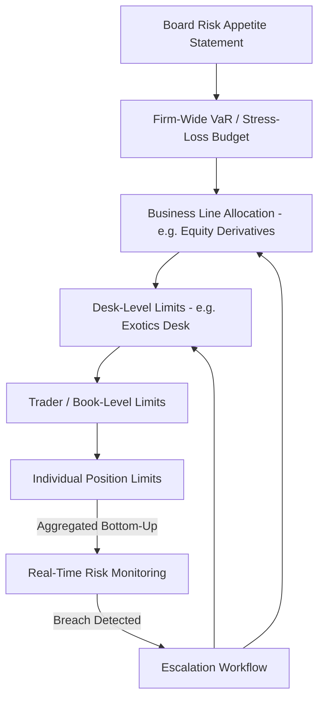
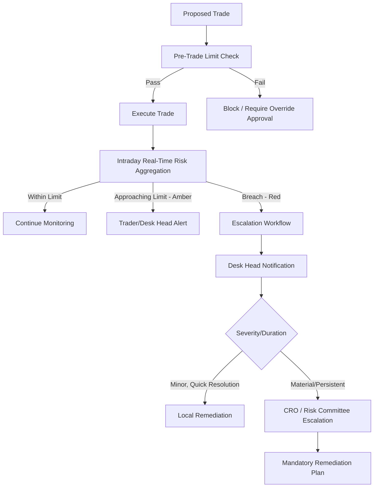

## Position and Risk Limit Management

### Overview

Position and risk limit management is the framework of quantitative controls, governance processes, and monitoring infrastructure that constrains the size and nature of risk a trading desk, trader, or business unit may take on. Limits exist to translate a firm's aggregate risk appetite — set at the board and senior management level — into granular, enforceable boundaries at the desk and trader level, ensuring that no single position, book, or individual can expose the institution to losses beyond what capital, liquidity, and governance structures can absorb.

For derivatives desks specifically, limit management is materially more complex than for cash instruments because risk is multidimensional: a single derivatives book carries simultaneous exposure to price (delta), convexity (gamma), volatility (vega), time decay (theta), correlation, and higher-order cross-Greeks (vanna, volga), each of which can be limited independently and must be aggregated coherently across products, desks, and the firm as a whole.

### The Limit Hierarchy

**Key Points**

- **Board / Firm-wide risk appetite**: The highest-level statement of aggregate risk tolerance, typically expressed via firm-wide VaR, stress-loss, and capital-at-risk thresholds, set and reviewed by the board risk committee.
- **Business-line / Division limits**: Risk appetite allocated down to major business lines (e.g., equities derivatives, rates, credit, commodities), typically as a sub-allocation of the firm-wide budget.
- **Desk-level limits**: Limits allocated to individual trading desks (e.g., equity exotics desk, IRS flow desk), the primary operational layer where day-to-day risk-taking occurs.
- **Trader/Book-level limits**: The most granular layer, allocated to individual traders or sub-books, enabling accountability and early detection of limit breaches before they aggregate into desk-level issues.

### Categories of Limits

#### 1. Notional and Position Limits

The simplest control: a cap on gross or net notional exposure in a given instrument, underlying, or product category. Notional limits are blunt but easy to monitor in real time and act as a backstop even when more sophisticated Greek-based limits are also in place.

$$\text{Gross Notional} = \sum_i |N_i|, \quad \text{Net Notional} = \sum_i N_i$$

where $N_i$ is the signed notional of position $i$. Gross notional captures total activity/turnover risk; net notional captures directional exposure.

#### 2. Greek-Based Limits

For options and other nonlinear derivatives, notional alone is insufficient — a deeply out-of-the-money option and an at-the-money option of identical notional carry very different risk. Greek limits address this directly:

- **Delta limits**: Cap net directional exposure to the underlying, typically expressed in underlying-equivalent units or currency terms.
- **Gamma limits**: Cap convexity exposure — critical because gamma risk is what drives hedging costs and P&L volatility between rebalancing intervals, and because gamma exposure can change rapidly as the underlying moves (especially near-the-money, near-expiry).
- **Vega limits**: Cap exposure to implied volatility changes, typically bucketed by tenor (short-dated vega vs. long-dated vega) since the vol surface does not move in a perfectly parallel fashion.
- **Theta limits**: Less commonly hard-limited (theta is often a byproduct of the gamma/vega position taken) but monitored to understand time-decay P&L drag or carry.
- **Cross-Greek limits (vanna, volga)**: Cap second-order sensitivities to combined underlying-and-vol moves, particularly relevant on exotic desks running skew and convexity-of-volatility risk.

**Example**: A vega limit might be structured as a term-structure bucket table:

| Tenor Bucket | Vega Limit ($/vol point) |
| --- | --- |
| 0–3 months | $50,000 |
| 3–12 months | $75,000 |
| 1–5 years | $100,000 |
| 5+ years | $40,000 |

This structure prevents a desk from "hiding" large aggregate vega exposure by concentrating it in a single tenor while appearing within an aggregate limit.

#### 3. Value-at-Risk (VaR) and Expected Shortfall (ES) Limits

Statistical measures aggregating multidimensional risk into a single figure representing potential loss over a given horizon at a given confidence level.

$$\text{VaR}_\alpha = \inf \{ l \in \mathbb{R} : P(L > l) \leq 1 - \alpha \}$$

where $L$ is the loss distribution and $\alpha$ is the confidence level (commonly 99% for regulatory purposes, 95% for internal desk-level monitoring).

Expected Shortfall (Conditional VaR), the FRTB-mandated successor risk measure for internal models, captures the average loss beyond the VaR threshold:

$$\text{ES}_\alpha = \mathbb{E}[L \mid L > \text{VaR}_\alpha]$$

[Inference] ES is generally considered a more coherent risk measure than VaR because it satisfies subadditivity (the risk of a combined portfolio should not exceed the sum of individual risks) in cases where VaR can fail to do so, which is part of why regulators shifted the FRTB internal models framework from VaR to ES — though the practical calibration and backtesting challenges of ES remain an active area of methodological development.

#### 4. Stress Testing and Scenario Limits

Complementary to VaR/ES (which are typically calibrated to historical or normal-market conditions), stress limits cap the potential loss under predefined extreme scenarios — historical (e.g., 2008 crisis, 2020 COVID shock) or hypothetical (e.g., a 30% underlying gap combined with a 10-vol-point implied volatility spike).

**Example**: An exotic desk running short-correlation basket option risk may have negligible VaR under normal market conditions but a severe stress loss under a scenario where correlations spike toward 1 simultaneously with an underlying selloff — precisely the tail scenario stress limits are designed to catch that VaR-based limits alone would miss.

#### 5. Concentration and Liquidity-Adjusted Limits

Limits that scale down permitted position size as instrument liquidity decreases, since a large position in an illiquid instrument carries materially higher unwind risk than the same notional in a liquid one.

$$\text{Liquidity-Adjusted Limit} = \text{Base Limit} \times f(\text{ADV}, \text{bid-ask spread}, \text{market depth})$$

where $f(\cdot)$ is a scaling function that typically reduces the effective limit as average daily volume (ADV) falls or as bid-ask spreads widen.

### Limit Setting Methodology

**Key Points**

1. **Top-down capital allocation**: Firm-wide risk appetite is allocated to business lines based on strategic priorities, historical risk-adjusted return, and capital efficiency.
2. **Bottom-up desk justification**: Desks propose limit requests based on client flow needs, market-making obligations, and historical utilization, subject to independent risk management review.
3. **Historical utilization analysis**: Limits are periodically recalibrated based on actual historical usage — persistently low utilization may indicate over-allocation (capital inefficiency); persistent near-breach utilization signals the limit may be too tight for legitimate business needs.
4. **Stress and back-testing validation**: Proposed limits are validated against historical stress scenarios to confirm that even at full utilization, potential losses remain within the firm's risk appetite.
5. **Governance sign-off**: Limits above certain materiality thresholds require sign-off from the risk committee, CRO function, or board-level risk committee, with periodic (typically annual) formal review.

```mermaid
flowchart LR
    A[Firm Risk Appetite] --> B[Top-Down Allocation to Business Lines]
    C[Desk Business Need / Flow Analysis] --> D[Bottom-Up Limit Request]
    B --> E[Limit Reconciliation]
    D --> E
    E --> F[Stress Scenario Validation]
    F --> G[Risk Committee / CRO Sign-off]
    G --> H[Approved Limit Set]
    H --> I[Ongoing Utilization Monitoring]
    I -->|Persistent Under/Over-Utilization| J[Recalibration Review]
    J --> C
```

### Real-Time Monitoring and Breach Escalation

**Key Points**

- **Pre-trade limit checks**: Order/quote management systems validate that a prospective trade, if filled, would not breach applicable limits before allowing execution — critical for electronic/algorithmic flow desks where trades occur faster than manual review is feasible.
- **Intraday real-time monitoring**: Risk aggregation engines recompute Greeks, VaR, and notional exposures continuously (or at high frequency) as market data updates and new trades are booked, flagging approaches toward limit thresholds (e.g., an 80% utilization amber alert) before an actual breach.
- **End-of-day formal reconciliation**: A definitive, fully reconciled risk calculation (incorporating all bookings, corrections, and official closing market data) run at day-end, which is the authoritative record for limit compliance reporting even if intraday estimates differed slightly.
- **Breach escalation protocol**: A tiered response depending on breach severity and duration — from trader/desk-head notification for minor, quickly-resolved breaches, up to CRO and board-level escalation for material or persistent breaches, typically with mandatory remediation timelines (e.g., "reduce to within limit within one trading session").

### Aggregation Challenges Specific to Derivatives

**Key Points**

- **Non-additivity of nonlinear risk**: Unlike linear cash positions, Greeks from different instruments do not always aggregate in an intuitive way — delta from a deep ITM option behaves very differently under a large underlying move than delta from an ATM option, even though both contribute to the same aggregate "delta" limit figure at current market levels.
- **Cross-asset and cross-desk netting**: A firm-wide risk view must correctly net offsetting exposures held on different desks (e.g., an exotic desk's vanilla hedge executed through the flow desk) without either double-counting or incorrectly netting risks that are only superficially offsetting (e.g., different underlyings within the same sector that are correlated but not identical).
- **Model consistency across books**: Aggregating VaR or Greeks computed using different pricing models or vol surface conventions across desks can produce misleading aggregate figures unless models are harmonized or aggregation explicitly accounts for model basis risk.
- [Inference] Because true risk aggregation across a large multi-asset derivatives portfolio is computationally and conceptually complex, many institutions rely on a combination of full repricing (theoretically most accurate but computationally expensive) and Greek-based sensitivity approximation (faster but less accurate for large market moves) for different monitoring frequencies — full revaluation typically reserved for end-of-day/stress runs, with sensitivity-based approximation used intraday.

### Limit Breach Root Causes and Remediation

**Key Points**

Common causes of limit breaches on derivatives desks:

- **Market-driven Greek drift**: A large underlying move or vol spike can push existing (previously compliant) positions into breach purely through market movement, without any new trading activity — requiring immediate hedge execution rather than a "trading decision" remediation.
- **New trade booking errors**: Incorrect notional, strike, or trade direction entry causing an unintended limit breach, typically caught by post-trade reconciliation and requiring booking correction plus process review.
- **Model recalibration impact**: A change in the desk's pricing/risk model (e.g., a new vol surface calibration methodology) can retroactively change the computed Greeks of existing positions, causing an apparent breach without any change in the actual economic position — requiring careful communication to distinguish "real" from "model-driven" breaches.
- **Limit allocation lag**: Business growth or new product approval outpacing the periodic limit review cycle, resulting in legitimate business needs bumping against stale limits — addressed through the recalibration review process above rather than ad hoc overrides.

### Governance and Independent Risk Oversight

**Key Points**

- **First line of defense**: The trading desk itself, responsible for managing within limits day-to-day.
- **Second line of defense**: Independent risk management function, responsible for setting limit methodology, monitoring compliance, and escalating breaches — organizationally and reporting-line separate from the trading desk to preserve independence.
- **Third line of defense**: Internal audit, periodically reviewing the adequacy and operation of the limit framework itself (not individual trading decisions), confirming controls are designed and operating effectively.
- **Limit override governance**: Any temporary limit increase or breach override requires documented, time-bound approval from an authority level commensurate with the size/duration of the override — never at the discretion of the trader or desk generating the risk.

### Common Pitfalls

- **Static limits in dynamic markets**: Setting fixed notional/Greek limits without periodic recalibration to changing market volatility regimes, liquidity conditions, or business strategy, leading to limits that are either needlessly restrictive or dangerously loose relative to current risk.
- **Limit gaming**: Structuring trades or bucketing risk specifically to stay just under a limit threshold rather than reflecting genuine risk-reducing intent — a governance red flag typically addressed through limit design (e.g., avoiding overly granular buckets that create gaming incentives) and behavioral monitoring.
- **Over-reliance on VaR alone**: Using VaR as the sole risk gate without complementary stress and concentration limits, missing tail risks that VaR — calibrated to normal historical distributions — systematically underestimates, particularly for short-volatility or short-correlation exotic positions.
- **Siloed limit monitoring across systems**: Running position/Greek limits in one system and VaR/stress limits in another without reconciled, unified reporting, creating blind spots where a position could be compliant in one system's view while breaching in another's.
- **Treating pre-trade checks as sufficient**: Relying solely on pre-trade blocking without robust intraday monitoring, missing breaches caused by market movement on existing (not newly traded) positions.

### Related Topics

- **Value-at-Risk and Expected Shortfall Methodologies (Historical, Parametric, Monte Carlo)**
- **FRTB Internal Models Approach and Standardized Approach**
- **Flow Versus Exotic and Structured Desks** *(differing limit frameworks by desk type)*
- **Stress Testing and Scenario Analysis for Derivatives Portfolios**
- **Greeks Aggregation and Cross-Asset Risk Netting**
- **Three Lines of Defense Risk Governance Model**
- **Liquidity Risk and Concentration Limits in Trading Books**
- **P&L Attribution and Greeks-Based Explain for Derivatives Books**
- **Model Risk and Explainability for AI Models** *(model-driven limit breach considerations)*
- **Pre-Trade and Intraday Risk Monitoring System Architecture**