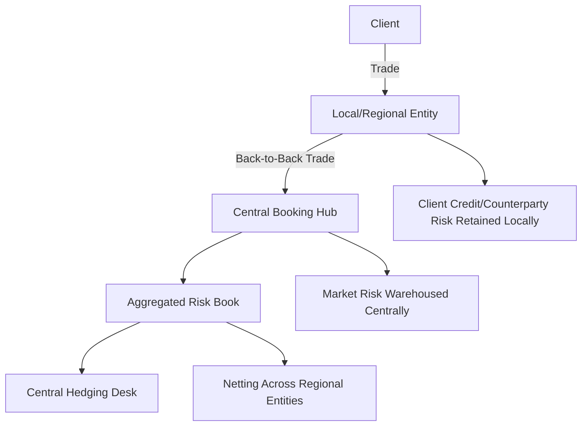
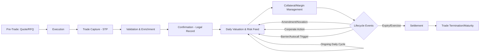
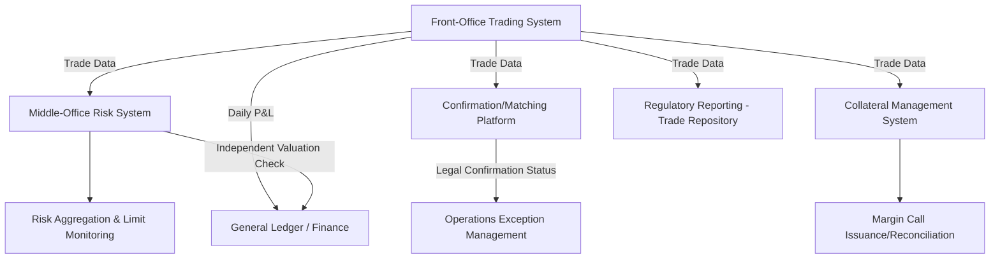

## Booking Models and Trade Lifecycle Systems

### Overview

Booking models and trade lifecycle systems constitute the operational and technological backbone that captures a derivatives trade from execution through to final settlement, expiry, or termination. A **booking model** defines *how* and *where* a trade is legally and economically recorded within an institution's organizational and entity structure (which legal entity, which book, which risk-bearing desk), while **trade lifecycle systems** are the software infrastructure managing the trade's state transitions — capture, validation, confirmation, valuation, risk feed, collateral/margin, settlement, and eventual maturity or termination — across its entire life.

For derivatives desks, this infrastructure is foundational rather than peripheral: incorrect booking undermines every downstream function — risk aggregation, capital calculation, regulatory reporting, and P&L attribution all inherit errors from a flawed or inconsistent booking model.

### Booking Model Fundamentals

**Key Points**

- **Legal entity booking**: Every trade must be booked into a specific legal entity (e.g., a bank's broker-dealer subsidiary, an offshore booking hub, a specific regional entity) determined by regulatory, tax, and client-facing considerations — this is a legal/contractual decision, not merely an internal accounting convenience.
- **Back-to-back booking**: A common structure where a client-facing entity (e.g., a local subsidiary with the client relationship) books a trade with the client, then immediately books an offsetting "back-to-back" trade with a central booking/risk-warehousing entity (often a major trading hub like London, New York, or Singapore) that actually manages the market risk.
- **Booking hubs**: Centralized entities within a global institution where risk from multiple regional client-facing entities is aggregated and centrally hedged, achieving netting benefits and specialized risk management expertise that a purely regional booking model could not.
- **Risk-transfer vs. risk-retention booking**: Some booking structures transfer full market risk to the hub (the local entity retains only credit/counterparty risk to the client), while others retain partial risk locally for tax, regulatory capital, or client-relationship reasons.

### Regulatory Considerations in Booking Model Design

**Key Points**

- **BCBS "Corporate and Booking Practices" principles** (2014 supervisory guidance following major booking-model-related losses, e.g., cross-entity mismatches revealed in prior incidents): Establishes supervisory expectations that booking arrangements reflect genuine economic risk transfer, are properly documented, and are not primarily designed for regulatory or tax arbitrage without corresponding operational substance.
- **Substance requirements**: Regulators increasingly require that booking hubs demonstrate genuine risk management substance (qualified staff, actual risk decision-making capability) in the jurisdiction where risk is booked, rather than being a purely nominal booking location — a response to post-financial-crisis concerns about "letterbox" booking entities.
- **Ring-fencing and resolution planning**: Post-crisis resolution and recovery planning requirements (e.g., under Dodd-Frank Title I/II, UK ring-fencing rules) require booking models to support clean legal entity separability in a resolution scenario, influencing how derivatives books are structured across entities.
- [Inference] Because booking model design sits at the intersection of tax, regulatory capital, resolution planning, and operational risk management, changes to booking structures typically require sign-off from multiple control functions (legal, tax, regulatory affairs, risk) rather than being a purely front-office or technology decision — though the specific governance process varies by institution and jurisdiction.

### Trade Lifecycle: Stages and State Transitions

#### 1. Pre-Trade

- **Price discovery / quoting**: RFQ response, streaming quote, or voice negotiation (see Market Making and Bid-Ask Spread Setting).
- **Pre-trade compliance and limit checks**: Validation against position limits, suitability rules (for client-facing structured products), and KYC/AML status before execution is permitted.

#### 2. Trade Capture and Execution

- **Execution**: Trade agreed via electronic platform (exchange, swap execution facility/SEF, multilateral trading facility/MTF), voice, or RFQ platform.
- **Trade capture**: The economic terms (notional, strike, underlying, maturity, counterparty, booking entity) are entered into the front-office trading system, either automatically (electronic execution) or manually (voice trades, requiring careful economic-terms verification).
- **STP (Straight-Through Processing)**: The industry-standard goal of trade details flowing automatically from execution to downstream systems (risk, confirmation, settlement) without manual re-keying, minimizing operational risk from transcription errors.

#### 3. Validation and Enrichment

- **Static data enrichment**: The trade is enriched with reference data — counterparty legal entity identifiers (LEI), netting agreement references (ISDA Master Agreement, CSA terms), product taxonomy classifications (e.g., ISDA's Common Domain Model taxonomies, UPI — Unique Product Identifier).
- **Economic validation**: Automated checks confirming the trade's economic terms are internally consistent (e.g., strike within reasonable bounds, valid day-count convention, valid holiday calendar for the underlying).

#### 4. Confirmation

- **Legal confirmation**: The formal legal process (often electronic, via platforms like MarkitSERV/IHS Markit or DTCC) confirming both counterparties agree on the trade's economic terms, creating the legally binding record — critical because discrepancies between counterparties' understanding of trade terms are a major source of operational and legal risk.
- **Affirmation vs. confirmation**: Affirmation (a lighter-weight same-day acknowledgment, common for cleared/electronically executed trades) versus full legal confirmation (more detailed, traditionally required for complex OTC/exotic trades).

#### 5. Valuation and Risk Feed

- **Daily mark-to-market**: The trade is revalued (typically daily, but intraday for actively risk-managed books) using the desk's pricing models and current market data.
- **Risk system feed**: Greeks, VaR contributions, and other risk metrics are computed and fed into the firm's risk aggregation infrastructure (see Position and Risk Limit Management) — this feed must be timely and accurate, since stale or incorrect risk feeds undermine real-time limit monitoring.

#### 6. Collateral and Margin Management

- **Variation margin (VM)**: Daily exchange of collateral reflecting the mark-to-market change in the trade's value, per CSA terms (bilateral OTC) or CCP rules (cleared trades).
- **Initial margin (IM)**: Upfront collateral (for cleared trades via CCP margin models like SPAN or CCP-specific VaR models, or for bilateral uncleared trades under the Uncleared Margin Rules/UMR using the ISDA SIMM methodology) covering potential future exposure over a close-out period.

#### 7. Lifecycle Events

- **Amendments**: Novations (transfer of the trade to a new counterparty), partial terminations, notional step-ups/downs (common in amortizing swaps), and other mid-life economic changes.
- **Corporate actions**: For equity derivatives, dividend adjustments, stock splits, and merger events requiring systematic adjustment of strike/notional per ISDA equity derivatives definitions.
- **Barrier/autocallable event monitoring**: For exotic structures, systematic monitoring of barrier touches, autocall observation dates, and other path-dependent triggers requiring automated event detection against live/historical market data.
- **Exercise and expiry**: For options, exercise decision processing (automatic exercise for in-the-money options per standard conventions, or manual exercise instruction) at expiry.

#### 8. Settlement and Close-Out

- **Cash or physical settlement**: Final payment exchange (cash-settled) or delivery of the underlying (physically-settled), per the trade's settlement terms.
- **Trade termination/maturity**: The trade is closed out of the book, with final P&L realized and reconciled.

### Trade Lifecycle System Architecture

**Key Points**

- **Front-office trading system**: The primary trade capture and pricing platform (e.g., Murex, Calypso, Summit, FIS Front Arena, or proprietary in-house systems), where traders execute, book, and manage positions, and where the desk's pricing models are typically integrated.
- **Middle-office risk and control systems**: Consume trade data from the front office to compute independent valuations, risk metrics, and P&L attribution, often using separate model implementations from the front office as an independent validation check (a "gold copy" or shadow valuation).
- **Confirmation and matching platforms**: Third-party or industry-utility platforms (DTCC, MarkitSERV/IHS Markit, electronic confirmation matching) handling the legal confirmation workflow.
- **Collateral management systems**: Platforms (e.g., AcadiaSoft, TriOptima, in-house systems) calculating margin requirements, managing collateral calls, and reconciling collateral balances against counterparties.
- **Regulatory reporting systems**: Feed trade data to trade repositories (per EMIR, Dodd-Frank, and other jurisdictional swap data reporting requirements) and generate capital/liquidity regulatory returns.
- **General ledger / finance systems**: Ultimate downstream consumer reconciling trading P&L and balance sheet positions against the firm's official books and records.

### Independent Price Verification (IPV)

**Key Points**

- A middle-office/finance control function that independently verifies the front-office's marked prices/valuations, typically monthly or more frequently for volatile/illiquid positions, using independent market data sources and, where necessary, independent model implementations.
- Discrepancies beyond defined tolerance thresholds trigger investigation and potential valuation adjustment (a "price testing" reserve or adjustment), a critical control against front-office mismarking (whether erroneous or intentional).
- Particularly important for exotic/structured desks (see Flow Versus Exotic and Structured Desks) where model-dependent valuations are more susceptible to divergence between front-office and independent marks than flow-desk instruments with directly observable market prices.

### Straight-Through Processing (STP) and Operational Risk

**Key Points**

- **STP rate** (the percentage of trades flowing through the full lifecycle without manual intervention) is a key operational efficiency and risk metric — manual touchpoints are a primary source of operational errors (mis-booked notionals, incorrect counterparty selection, wrong booking entity).
- **Break management**: Trades failing automated validation (a "break") require manual investigation and resolution; break aging (how long unresolved breaks persist) is a standard operational risk KPI, since aged breaks compound risk (e.g., unconfirmed trades with disputed economic terms accumulating market risk exposure without legal certainty).
- **Golden source data governance**: Establishing a single authoritative source for static/reference data (counterparty details, product definitions, holiday calendars) that all downstream systems consume, preventing the data inconsistency that arises when multiple systems maintain independent, potentially divergent copies of the same reference data.

### Common Industry Booking Model Failure Patterns

**Key Points**

[Inference] While specific incidents vary by institution and are often not fully public, industry post-mortems and regulatory guidance (e.g., BCBS booking practices principles) commonly point to the following recurring failure patterns:

- **Mismatched back-to-back trades**: The client-facing leg and the hub-facing leg of a back-to-back booking structure diverge (due to a booking error, unhedged residual, or a "phantom" trade existing on one side but not the other), creating unintended, often undetected risk.
- **Booking entity mismatch with risk management location**: Risk nominally booked in one entity but actually managed/hedged by traders physically located in a different entity/jurisdiction, creating regulatory substance concerns and potential resolution-planning complications.
- **Stale or duplicate trade records**: Amendments or novations not properly propagated across all downstream systems, leaving risk, collateral, or P&L systems working from outdated trade economics.

### Common Pitfalls

- **Treating booking as a purely operational/back-office concern**: Booking model design has direct front-office implications (capital cost, netting benefit, client relationship structure) and should involve front-office input, not be delegated entirely to operations/technology.
- **Underinvesting in STP for exotic/structured trades**: Because exotic trades are lower-volume, institutions sometimes tolerate manual booking processes that would be unacceptable for flow desks — but the complexity of exotic payoffs makes manual entry errors both more likely and more consequential.
- **Inconsistent model implementations across front and middle office**: If the middle-office risk system's pricing model differs materially from the front office's without a well-understood and monitored basis, independent risk figures may not actually provide meaningful independent validation.
- **Neglecting lifecycle event automation**: Manual monitoring of barrier touches, autocall triggers, or corporate action adjustments introduces timing risk (missing a trigger event) that automated, systematic monitoring is specifically designed to eliminate.
- **Underestimating confirmation backlog risk**: Allowing legal confirmation backlogs to grow (common historically in the OTC derivatives market prior to post-2008 reforms) leaves the institution exposed to disputes over trade economics precisely when market stress makes such disputes most costly to resolve.

### Related Topics

- **Flow Versus Exotic and Structured Desks** *(differing booking/lifecycle complexity by desk type)*
- **Position and Risk Limit Management** *(risk feed dependency on accurate trade booking)*
- **ISDA Master Agreements, CSAs, and Netting Documentation**
- **Central Clearing (CCP) Infrastructure and Margin Methodologies (SPAN, SIMM)**
- **Regulatory Trade Reporting: EMIR, Dodd-Frank, and Trade Repositories**
- **Independent Price Verification and Valuation Control Frameworks**
- **Corporate Actions and Equity Derivatives Adjustment Mechanics**
- **Uncleared Margin Rules (UMR) and Initial Margin Calculation**
- **Booking Model Governance: BCBS Principles and Regulatory Substance Requirements**
- **Operational Risk Management in Derivatives Trade Processing**