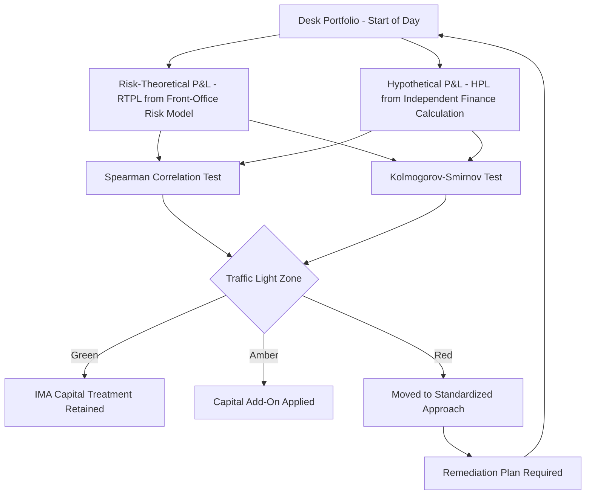
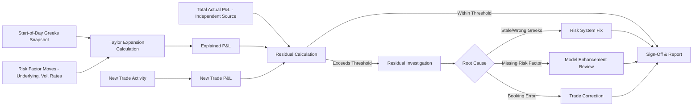

## Profit and Loss Explain and Attribution

### Overview

Profit and Loss (P&L) Explain — often called "P&L attribution" or simply "the explain" — is the process of decomposing a trading book's day-over-day change in mark-to-market value into a set of attributable risk factor moves (delta, gamma, vega, theta, rates, and others) plus new trading activity, such that every dollar of P&L can be traced to an identifiable cause. It is one of the most operationally critical daily processes on any derivatives desk: it validates that the risk management framework (Greeks, VaR) genuinely explains realized P&L, and any unexplained residual is a direct signal of model risk, booking errors, or missing risk factors.

P&L Explain sits at the intersection of front-office risk management, model validation, and regulatory capital eligibility — under frameworks like FRTB, a desk's ability to produce a clean P&L attribution test (PLAT) is a precondition for being permitted to use internal models for regulatory capital rather than the more punitive standardized approach.

### The Core Decomposition

**Key Points**

The fundamental P&L Explain identity decomposes total daily P&L into risk-factor-attributable components plus a residual:

$$\Delta P\&L_{\text{total}} = \Delta P\&L_{\text{explained}} + \Delta P\&L_{\text{new trades}} + \Delta P\&L_{\text{unexplained}}$$

The explained component is further decomposed via a Taylor expansion of the position's value function around the prior day's market state, using the Greeks computed at the start of the period:

$$\Delta V \approx \theta \, dt + \Delta \, dS + \frac{1}{2}\Gamma \, (dS)^2 + \mathcal{V} \, d\sigma + \rho \, dr + \text{Vanna} \cdot dS\,d\sigma + \text{Volga} \cdot (d\sigma)^2 + \ldots$$

where:

- $\theta \, dt$ — time decay P&L (carry)
- $\Delta \, dS$ — first-order P&L from underlying price movement
- $\frac{1}{2}\Gamma (dS)^2$ — second-order (convexity) P&L from underlying movement
- $\mathcal{V} \, d\sigma$ — P&L from implied volatility changes
- $\rho \, dr$ — P&L from interest rate changes
- Vanna and Volga terms — cross-sensitivity P&L (delta's sensitivity to vol changes, and vega's sensitivity to vol-of-vol)

**Example**: A desk holding a long straddle position observes the underlying move +2% and implied vol drop -1 point on a given day. The explain would attribute: theta decay (negative, since the straddle loses time value daily), a small delta P&L (near-zero if the straddle started delta-neutral), a positive gamma P&L (from the 2% underlying move, since gamma is long), and a negative vega P&L (from the vol drop, since the position is long vega) — with the sum of these components expected to closely match the total observed change in the position's mark-to-market value.

### Explained vs. Unexplained P&L

**Key Points**

- **Explained P&L**: The portion attributable to first- and second-order sensitivities (Greeks) to observed risk factor moves — this is the "expected" component given the position's known risk profile and the day's market moves.
- **New trade P&L**: P&L attributable to trades booked during the period (both the bid-ask spread captured on new client trades and any immediate mark-to-market on hedges executed), kept separate from explain so that the risk-factor-based decomposition isn't contaminated by activity unrelated to holding existing positions.
- **Unexplained P&L (the "residual" or "P&L break")**: The portion of total P&L not accounted for by the modeled Greeks and observed risk factor moves. This is the single most scrutinized number in daily desk risk reporting.

$$\text{Unexplained \%} = \frac{|\Delta P\&L_{\text{unexplained}}|}{|\Delta P\&L_{\text{total}}|} \times 100$$

Persistently large or growing unexplained P&L is a primary early-warning indicator of:

- **Missing risk factors** in the model (e.g., an unmodeled correlation sensitivity on a multi-asset structure)
- **Stale or incorrect Greeks** feeding the explain calculation (e.g., a risk system running on delayed market data)
- **Model misspecification** (e.g., a local volatility model failing to capture genuine stochastic-vol dynamics in a fast-moving market)
- **Booking or data errors** (e.g., a trade with an incorrect strike or notional in the risk system)

### FRTB P&L Attribution Test (PLAT)

**Key Points**

- Under the Basel Committee's Fundamental Review of the Trading Book, desks seeking to use the Internal Models Approach (IMA) for regulatory capital must pass a formal **P&L Attribution Test**, comparing the **Risk-Theoretical P&L (RTPL)** — the P&L implied by the desk's full risk model — against the **Hypothetical P&L (HPL)** — the actual P&L that would occur if the portfolio were held constant with no new trading, computed independently (often by finance/product control) from front-office systems.
- The test uses two statistical metrics applied over a rolling window (typically 12 months of daily observations):

$$\text{Spearman Correlation Test}: \quad \rho_S(\text{RTPL}, \text{HPL})$$

$$\text{Kolmogorov-Smirnov (KS) Test}: \quad \sup_x |F_{\text{RTPL}}(x) - F_{\text{HPL}}(x)|$$

- Desks are classified into a traffic-light system (green/amber/red zones) based on test results: **green zone** desks retain IMA eligibility with standard capital treatment; **amber zone** desks face capital add-ons; **red zone** desks are moved to the standardized approach (SA) for capital purposes until remediated — a materially more punitive capital outcome.

### RTPL vs. HPL: Sources of Divergence

**Key Points**

- **RTPL** is generated using the desk's full risk model — the same risk factors and sensitivities feeding VaR/ES calculations — applied to the actual observed market moves over the period.
- **HPL** is computed by revaluing the actual, unchanged end-of-prior-day portfolio using the desk's official front-office pricing system and end-of-current-day market data (i.e., what the P&L would have been with zero trading activity), reconciled independently by product control.
- Divergence between RTPL and HPL typically stems from **risk factor granularity gaps**: the risk model used for RTPL may use a coarser or different set of risk factors (e.g., fewer vol surface grid points, simplified correlation assumptions) than the full front-office pricing model used for HPL — the PLAT test is specifically designed to detect when this gap becomes material enough to undermine the risk model's reliability for capital purposes.

### P&L Explain Workflow (Desk-Level Daily Process)

**Key Points**

1. **Capture start-of-day Greeks and positions**: Snapshot of all sensitivities (delta, gamma, vega, theta, rho, cross-Greeks) computed as of prior day's close.
2. **Capture risk factor moves**: Observed changes in underlying prices, implied volatility surfaces, interest rates, and other relevant market factors over the period.
3. **Compute Taylor-expansion-based explained P&L**: Apply the Greeks to the observed moves per the decomposition formula above.
4. **Isolate new trade P&L**: Separately compute the mark-to-market and spread-capture impact of trades booked during the period.
5. **Compute total actual P&L**: Independently sourced from the official position revaluation (front-office system, reconciled against finance/product control books).
6. **Calculate residual**: Total P&L minus (explained + new trade P&L).
7. **Residual investigation**: If the residual exceeds a predefined materiality threshold (absolute dollar amount or percentage of total P&L), trigger investigation — checking for stale Greeks, missing risk factors, booking errors, or genuine second-order effects not captured by the standard Taylor expansion (e.g., third-order "speed" or "color" Greeks for highly convex positions).
8. **Sign-off and reporting**: Daily P&L explain report reviewed and signed off by desk head and independent product control, feeding into both internal risk management and (for IMA desks) regulatory PLAT metrics.

### Higher-Order and Cross-Greek Attribution

**Key Points**

For books with significant nonlinearity or multi-factor exposure, the standard first/second-order Taylor decomposition may leave a systematically nonzero residual even absent any genuine error, simply because higher-order terms are material:

- **Speed** ($\frac{\partial \Gamma}{\partial S}$, third derivative of price w.r.t. underlying): Relevant for books with large gamma near expiry/barriers, where gamma itself changes materially over the observed underlying move.
- **Color** ($\frac{\partial \Gamma}{\partial t}$): Captures how gamma decays over time, relevant for accurate multi-day attribution.
- **Cross-gamma** (for multi-underlying books): Second-order sensitivity to joint moves of two different underlyings, essential for basket/rainbow option attribution where single-asset Greeks alone cannot capture correlation-driven P&L.

[Inference] Desks running highly convex or multi-asset exotic books often extend the standard explain framework with these higher-order and cross terms specifically to keep the unexplained residual within acceptable tolerance, since omitting materially-sized higher-order effects would otherwise generate a persistent, structural (rather than error-driven) residual that could be mistakenly investigated as a data or booking issue.

### Attribution Reporting Structures

| Report Level | Purpose | Typical Audience |
| --- | --- | --- |
| Trader/book-level daily explain | Granular Greek-by-Greek breakdown for a single trader's book | Trader, desk head |
| Desk-level aggregated explain | Rolled-up view across all books on a desk | Desk head, business management |
| Business-line explain | Aggregated across multiple desks within a product area | Divisional risk management |
| Regulatory PLAT reporting | RTPL vs. HPL statistical test results | Regulatory reporting, CRO function |
| Month-end finance P&L reconciliation | Reconciles trading P&L explain against official general ledger P&L | Product control, finance |

### Common Sources of Persistent Unexplained P&L

**Key Points**

- **Stale market data**: Risk factor snapshots used for Greeks that don't align precisely in timing with the market data used for actual revaluation (e.g., Greeks computed at 4pm close but actual P&L reflecting a 4:15pm final settlement price).
- **Model basis between risk and finance systems**: If the risk system computing Greeks uses a different (even if closely related) pricing model or calibration than the official front-office valuation system, systematic small residuals can accumulate.
- **Illiquid/stale vol surface points**: For exotic or less liquid instruments, vega attributed to a specific vol surface node may not perfectly capture how the desk's model actually revalues the position when that node is illiquid and infrequently updated.
- **Dividend, funding, and repo curve moves**: Often under-modeled risk factors (relative to delta/gamma/vega) that can generate small but persistent unexplained residuals if not explicitly included in the explain decomposition, particularly for equity derivatives with material dividend sensitivity.
- **Corporate actions and lifecycle event processing lag**: A dividend adjustment, stock split, or barrier event processed with a timing mismatch between the risk system and official books can create a one-off but potentially large unexplained spike.

### Common Pitfalls

- **Treating the residual as purely noise**: A small residual is expected and acceptable, but treating a consistently sign-biased or growing residual as routine "noise" rather than investigating it risks missing genuine model or booking issues until they become large.
- **Inconsistent Greek timing**: Computing start-of-day Greeks and end-of-day risk factor moves using misaligned data snapshots (e.g., different close times across time zones for a global multi-asset book), introducing artificial explain error unrelated to any real model deficiency.
- **Omitting new-trade P&L isolation**: Failing to cleanly separate new trade activity from the risk-factor-based explain can mask whether unexplained P&L stems from existing positions (a risk model issue) or new trading (a booking/pricing issue) — these require very different remediation.
- **Underestimating cross-Greek terms on multi-asset books**: Applying a single-asset Taylor expansion framework to basket, rainbow, or correlation-sensitive structures without cross-gamma terms will systematically misattribute P&L that is actually correlation-driven.
- **Weak governance on residual investigation thresholds**: Setting materiality thresholds too loosely (missing genuine issues) or too tightly (generating investigation fatigue from routine, immaterial residuals), undermining the practical effectiveness of the control.

### Related Topics

- **Position and Risk Limit Management** *(Greeks feeding explain are the same feeding limit monitoring)*
- **FRTB Internal Models Approach and Standardized Approach**
- **Flow Versus Exotic and Structured Desks** *(differing explain complexity by desk type)*
- **Booking Models and Trade Lifecycle Systems** *(data integrity underlying accurate explain)*
- **Independent Price Verification and Valuation Control Frameworks**
- **Value-at-Risk and Expected Shortfall Methodologies**
- **Volatility Surface Construction and Skew/Smile Dynamics**
- **Vanna-Volga Pricing and Cross-Greek Risk Management**
- **Model Risk and Explainability for AI Models** *(explainability parallels between ML XAI and traditional P&L explain)*
- **Product Control and Finance Reconciliation Processes**