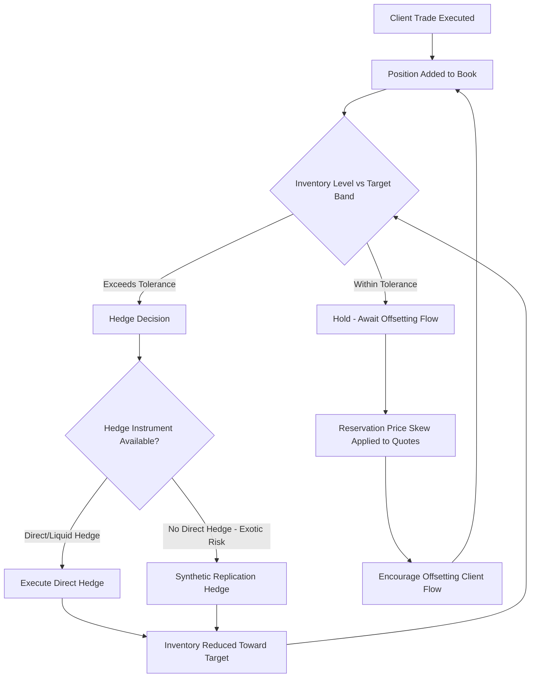
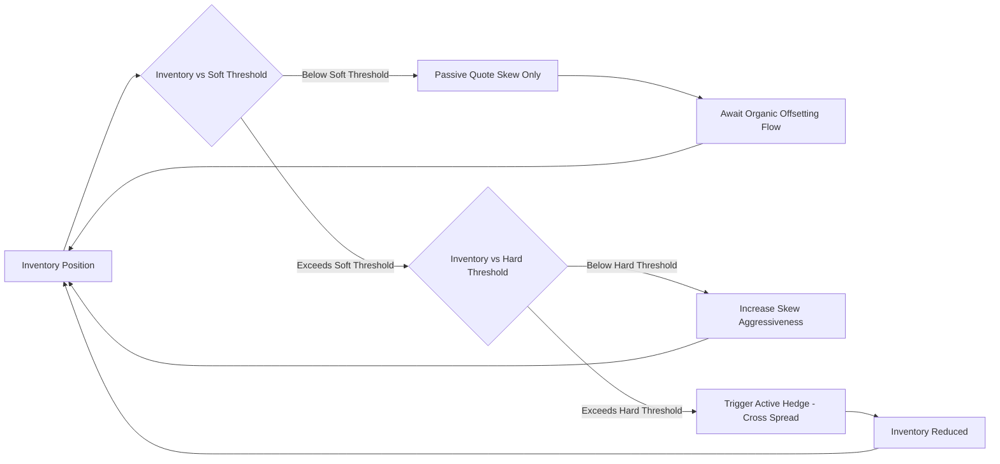

## Inventory Management and Risk Warehousing

### Overview

Inventory management and risk warehousing describe the practice of trading desks deliberately holding — rather than immediately hedging away — positions and their associated risk exposures, and the disciplined framework governing how much risk to hold, for how long, and under what economic rationale. Every market-making or structured desk faces a fundamental tension: hedging every unit of risk instantly would eliminate the natural inventory that allows the desk to internalize offsetting client flow (reducing hedging transaction costs), but holding risk too long or in excessive size exposes the desk to adverse market moves the hedge would otherwise have avoided.

This topic sits conceptually between market making (which generates the inventory) and risk limit management (which bounds it), and forms the operational discipline that determines whether a desk's risk-taking is a deliberate, compensated business decision or an unmanaged accumulation of unwanted exposure.

### Why Desks Warehouse Risk at All

**Key Points**

- **Natural flow netting**: If a desk receives offsetting client orders (one client buying, another selling similar risk) within a short window, warehousing the first order briefly rather than instantly hedging in the market allows the second order to net against it internally, saving the bid-ask spread and market impact cost of two separate external hedges.
- **Hedging cost avoidance**: Continuous, instantaneous hedging of every micro-exposure incurs transaction costs (spread, market impact, exchange fees) that compound over high trading volumes; warehousing small residual risk within defined limits and hedging in batches or at optimal execution windows reduces this cost.
- **Compensated risk-taking**: On exotic/structured desks in particular (see Flow Versus Exotic and Structured Desks), warehousing risk that cannot be cheaply hedged (correlation, long-dated vega, gap risk near barriers) is the deliberate economic basis of the business — the desk is compensated via structuring margin precisely for bearing this risk over time.
- **Market-making obligations**: Exchange-designated market makers or desks with client-facing quoting obligations must, by design, accept some inventory risk as the necessary cost of continuously providing liquidity, rather than being able to refuse trades that would create an unwanted position.

### Inventory Risk vs. Directional Risk-Taking

**Key Points**

A critical distinction in risk warehousing governance:

- **Inventory risk**: Risk accumulated as an incidental byproduct of client flow and market-making activity, generally intended to be temporary and hedged down toward flat over a defined horizon.
- **Proprietary/directional risk-taking**: Risk deliberately initiated based on a market view (e.g., a desk choosing to remain long gamma because it expects realized volatility to exceed implied), which is a distinct and typically separately governed activity from pure market-making inventory management.

[Inference] The regulatory and internal governance distinction between these two categories matters significantly — post-financial-crisis regulation (e.g., the Volcker Rule in the U.S.) restricts proprietary trading by certain banking entities while permitting legitimate market-making-related hedging and inventory management, making the ability to demonstrate that a given position is genuine market-making inventory (rather than disguised proprietary risk-taking) an important compliance consideration for regulated banking entities, though the precise boundary and required documentation vary by jurisdiction and entity type.

### The Inventory Management Decision Framework

**Key Points**

For any given position accumulated from client flow or market-making activity, the desk (often via automated logic in electronic market making, or trader judgment in voice/RFQ-driven businesses) must decide:

1. **Hold or hedge now?**: Is the current inventory level within a tolerance band where holding is preferable (awaiting potential offsetting flow) to immediately paying away the spread/impact cost of an external hedge?
2. **Full or partial hedge?**: If hedging, should the entire position be hedged, or only enough to bring inventory back within a target band (leaving some residual risk warehoused)?
3. **Hedge instrument selection**: What is the most cost-effective hedge — the exact instrument, a closely correlated proxy, or a portfolio of vanilla instruments replicating the relevant Greeks (for exotic risk)?
4. **Timing**: Hedge immediately, or wait for more favorable execution conditions (e.g., better liquidity, anticipated mean-reversion in a temporary price dislocation) — trading off execution cost against the risk of adverse market movement while waiting?

This closely parallels the Avellaneda-Stoikov optimal market-making framework (see Market Making and Bid-Ask Spread Setting), where the reservation price skew mechanism is itself a form of continuous, price-based inventory management — rather than a binary hedge/don't-hedge decision, the desk's quotes are continuously adjusted to organically encourage inventory-reducing trades.

### Warehousing Horizons by Desk Type

| Desk Type | Typical Warehousing Horizon | Primary Rationale |
| --- | --- | --- |
| High-frequency flow market making | Seconds to minutes | Pure inventory turnover, minimal directional view |
| Traditional flow desk (vanilla options, swaps) | Intraday to a few days | Batch hedging efficiency, netting client flow |
| Exotic/structured desk | Weeks to years (life of trade) | Genuine risk cannot be cheaply offloaded; compensated via margin |
| Correlation/basket risk books | Life of trade (often long-dated) | No liquid direct correlation hedge exists |
| Proprietary volatility positioning | Days to months | Deliberate market view, distinct governance from pure inventory |

### Risk Warehousing Costs

**Key Points**

Holding warehoused risk is not free even when deliberate; the desk incurs several categories of cost that must be weighed against the compensation received:

- **Capital cost**: Regulatory capital (market risk RWA under FRTB, counterparty credit risk capital) must be held against warehoused positions, representing an opportunity cost of the capital that could otherwise be deployed elsewhere.
- **Funding cost**: Warehoused positions, particularly those requiring collateral posting or funding of the underlying hedge instruments, incur funding costs reflected in FVA (Funding Valuation Adjustment) for derivatives.
- **Hedging slippage cost**: For positions requiring dynamic replication (exotic risk), the cost of discrete-time rebalancing versus theoretical continuous hedging (see gamma cost in Market Making and Bid-Ask Spread Setting).
- **Opportunity cost of risk limit usage**: Warehousing one position consumes risk limit capacity (see Position and Risk Limit Management) that could otherwise be allocated to other potentially more profitable opportunities.

$$\text{Net Warehousing P\&L} = \text{Structuring/Spread Margin} - \text{Capital Cost} - \text{Funding Cost} - \text{Expected Hedging Slippage}$$

### Inventory Skew and Quote Management

**Key Points**

On electronic market-making desks, inventory management is often implemented algorithmically through continuous quote skewing rather than discrete hedge decisions:

- As inventory grows in one direction, bid and ask quotes are both skewed to make the inventory-reducing side more attractive (e.g., a desk long the underlying tightens its offer/ask and widens its bid, encouraging sells and discouraging further buys).
- **Inventory decay targets**: Many electronic market-making systems define an explicit target half-life for inventory — the expected time over which a given position should organically reduce toward zero via quote skew alone, before an active/aggressive hedge is triggered.
- **Aggressive hedge triggers**: When inventory exceeds a hard threshold (beyond what passive quote skewing is expected to resolve within an acceptable time/risk budget), the system triggers an active hedge — crossing the spread in the hedge instrument rather than waiting for organic flow.

### Exotic Desk Risk Warehousing: A Closer Look

**Key Points**

For structured/exotic desks, risk warehousing is not merely tolerated but is the core business model — the desk exists specifically to hold risk that clients wish to transfer away and that cannot be efficiently distributed to the broader market instantaneously.

- **Vega book management**: Long-dated vega exposure from structured notes (e.g., 10-year autocallable structures) is warehoused because no liquid market exists to instantly offload 10-year implied volatility risk; the desk manages this via a combination of partial hedging in the vanilla options market (where liquidity permits, typically shorter tenors) and accepting genuine long-dated model/basis risk.
- **Correlation book management**: Multi-asset structured products (worst-of/best-of baskets) generate correlation exposure that has essentially no direct hedge instrument; desks typically run a centralized "correlation book" that aggregates correlation risk across many individual structured trades, managing the net exposure at the book level rather than attempting to hedge each trade's correlation risk individually.
- **Barrier/gap risk aggregation**: Multiple structured trades referencing barriers at similar levels on the same or correlated underlyings can create concentrated gap risk (the risk of the underlying jumping past a barrier without the desk being able to rebalance its hedge) that is only visible when aggregated across the full warehoused book — a key reason structured desks maintain centralized risk aggregation distinct from individual trade-level tracking.

### Governance of Warehoused Risk

**Key Points**

- **Explicit warehousing mandate**: Desks warehousing risk deliberately (as opposed to purely incidental inventory) typically operate under an explicit, risk-committee-approved mandate defining the type, size, and duration of risk permitted to be warehoused, distinguishing this from unauthorized or excessive risk accumulation.
- **Periodic review of warehoused positions**: Positions held beyond expected horizons (e.g., inventory that should have organically cleared via quote skew within days but persists for weeks) trigger review to determine if the position reflects a genuine ongoing business rationale or has become an unmanaged risk accumulation requiring active reduction.
- **Stress testing warehoused books**: Given that warehoused exotic/structured risk often carries tail exposure not well captured by standard VaR (see Position and Risk Limit Management), regular stress testing specific to the warehoused book's risk profile (e.g., correlation spike scenarios, gap risk scenarios) is a standard governance requirement.

### Common Pitfalls

- **Conflating incidental inventory with deliberate risk-taking**: Failing to clearly distinguish and separately govern market-making-incidental inventory from deliberate directional/volatility positioning can create both regulatory compliance issues (e.g., Volcker Rule considerations) and unclear accountability for P&L outcomes.
- **Static inventory targets in changing liquidity regimes**: Using fixed inventory decay/threshold parameters without adjusting for changing market liquidity conditions (e.g., a threshold calibrated for normal market liquidity becoming inappropriate during a liquidity-stressed period).
- **Underpricing the true cost of long-horizon warehousing**: Failing to fully load capital, funding, and expected hedging slippage costs into the margin charged for structured trades that require long-term risk warehousing, eroding the economic rationale for holding the risk in the first place.
- **Aggregation blind spots across warehoused books**: Managing individual structured trades' warehoused risk in isolation without book-level aggregation can mask concentrated correlation or gap risk that only becomes apparent when multiple trades' exposures compound.
- **Treating warehousing horizon as purely a risk decision**: Ignoring the P&L/carry implications of warehousing duration (theta decay, funding cost accrual) when deciding how long to hold risk, rather than treating the hold/hedge decision as a joint risk-and-economics optimization.

### Related Topics

- **Market Making and Bid Ask Spread Setting** *(Avellaneda-Stoikov inventory skew mechanics)*
- **Flow Versus Exotic and Structured Desks** *(structural basis for why exotic desks warehouse risk deliberately)*
- **Position and Risk Limit Management** *(limits bounding warehoused risk exposure)*
- **Profit and Loss Explain and Attribution** *(carry/theta P&L from warehousing decisions)*
- **Volcker Rule and Proprietary Trading Restrictions**
- **Funding Valuation Adjustment (FVA) and XVA Framework**
- **Correlation Risk Management and Correlation Book Aggregation**
- **Gap Risk and Barrier Option Hedging Near Discontinuities**
- **Algorithmic Quote Skewing and Electronic Market-Making Infrastructure**
- **Stress Testing and Scenario Analysis for Derivatives Portfolios**