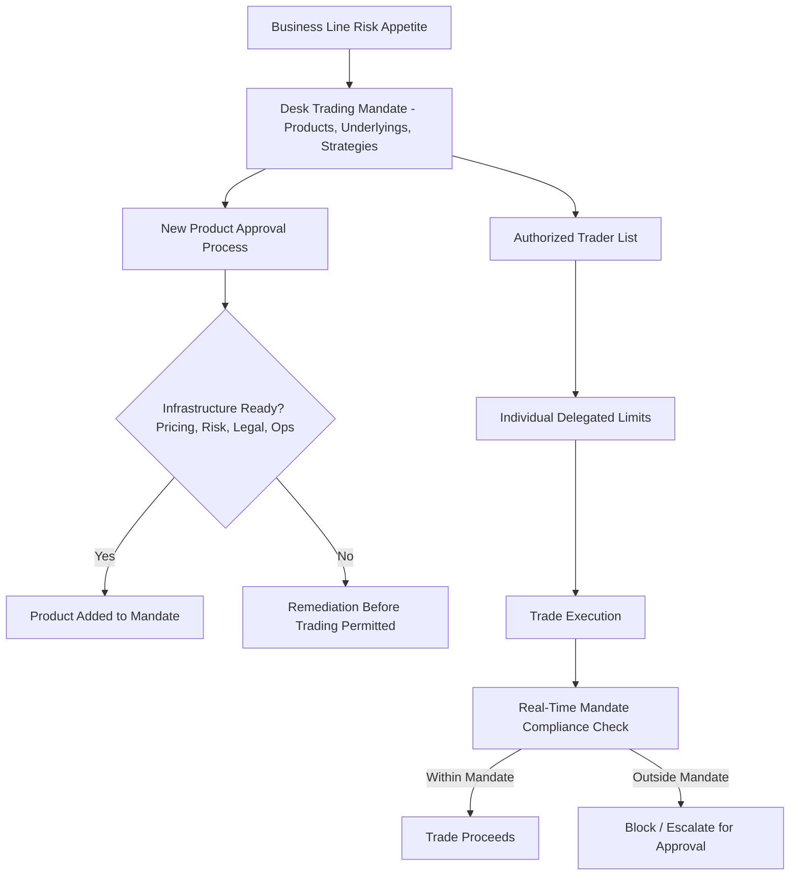
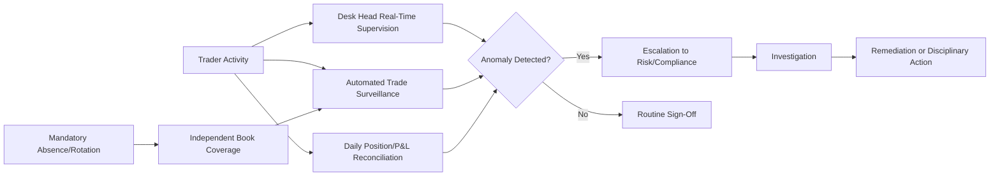
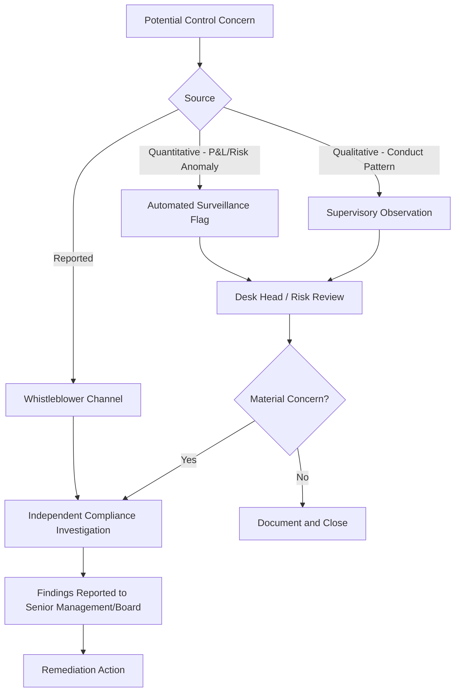
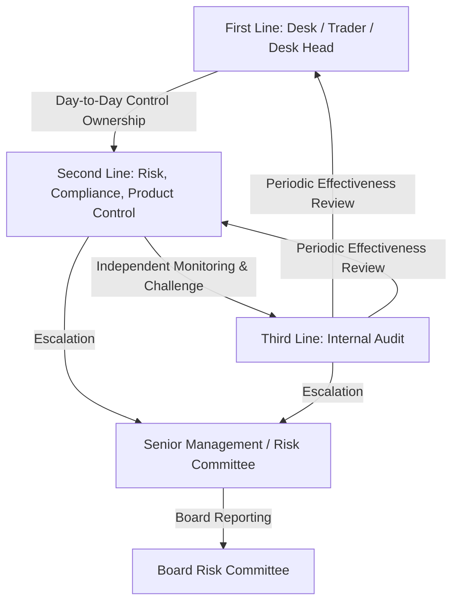

## Desk Level Governance and Controls

### Overview

Desk level governance and controls comprise the organizational structures, policies, and operational safeguards embedded directly within a trading desk — as distinct from firm-wide risk management functions — that ensure trading activity remains within authorized mandates, is properly supervised, and is subject to checks that reduce the risk of unauthorized trading, fraud, and control failures. Where firm-wide risk management (Position and Risk Limit Management) sets and monitors quantitative boundaries, desk-level governance addresses the *people, process, and authority* dimensions: who is authorized to trade what, how trading activity is supervised in real time, and what controls exist to catch errors or misconduct before they compound into major losses.

This area has been shaped substantially by high-profile rogue trading and control failure incidents across the industry, which repeatedly demonstrated that even robust quantitative risk limits are insufficient without corresponding governance over trader authority, segregation of duties, and independent oversight.

### Trading Mandates and Authorization

**Key Points**

- **Trading mandate**: A formal, documented statement defining what a specific desk or trader is authorized to trade — permitted products, underlyings, markets, counterparties, and strategies — approved by desk management and, for material mandates, by the business-line risk committee.
- **New product approval process**: Before a desk can trade a new instrument type or strategy not covered by its existing mandate, a formal governance process (typically involving risk, legal, compliance, operations, and finance sign-off) must confirm the firm has the infrastructure (pricing models, risk systems, legal documentation, operational capability) to properly manage the new product.
- **Authorized trader lists**: Explicit, systematically enforced lists of which individuals are permitted to execute trades on behalf of a given book, preventing unauthorized personnel (even within the same desk) from booking trades outside their designated role.
- **Delegated authority limits**: Individual traders typically operate under position/notional limits that are a sub-allocation of the desk's overall mandate, with escalating approval requirements for larger or more complex trades.

### Segregation of Duties

**Key Points**

The foundational control principle underlying most desk governance frameworks: no single individual should control an entire process end-to-end in a way that allows errors or misconduct to go undetected.

- **Front office vs. middle/back office separation**: Traders (front office) who initiate and manage risk must be organizationally and reporting-line separate from those who confirm trades, compute independent valuations, and manage collateral (middle/back office) — preventing a trader from concealing or misrepresenting positions through control over their own confirmation or valuation.
- **Trading vs. risk management separation**: The desk's risk manager function (where distinct from the trader/desk head) should have independent reporting lines to firm-wide risk management, not solely to the desk head whose P&L that risk manager is overseeing.
- **Booking vs. execution separation**: Particularly relevant where manual trade entry is required (voice trades, complex structured deals) — the individual entering economic terms into the booking system should be subject to independent verification, ideally by someone other than the trade's originator.
- **Model development vs. model validation separation**: Quants who build pricing models should not be the sole party responsible for validating those models' correctness (see Model Risk and Explainability for AI Models) — independent model validation functions provide a check against both errors and, in worst cases, deliberate model manipulation to mask losses.

### Real-Time and Periodic Supervision

**Key Points**

- **Desk head supervisory review**: Direct, ongoing oversight by the desk head of trader activity, positions, and P&L — including informal but disciplined daily review of significant trades, unusual position changes, or P&L that appears inconsistent with market moves.
- **Trade surveillance systems**: Automated systems flagging patterns associated with potential misconduct — unusual trade timing (e.g., trades booked just before market close or over weekends when oversight is reduced), trades with counterparties outside normal patterns, or repeated late/backdated trade amendments.
- **Position and P&L reconciliation cadence**: Regular (daily, at minimum) reconciliation between front-office reported positions/P&L and independently sourced figures from middle office and finance, specifically designed to catch discrepancies before they compound.
- **Mandatory absence/rotation policies**: Requiring traders to take extended, uninterrupted leave periodically (during which their book is managed by someone else), a classic control designed to surface concealed positions or unauthorized trading that depends on the original trader's continuous presence to maintain.

### Booking and Documentation Controls

**Key Points**

- **Four-eyes principle**: Significant trades (particularly complex structured trades or those exceeding a size/materiality threshold) require independent second-person review/approval before or shortly after booking, reducing single-point-of-failure risk from data entry errors or unauthorized activity.
- **Cancel-and-correct monitoring**: Trade cancellations and amendments are inherently higher-risk operationally (both for genuine error correction and as a potential vector for concealing unauthorized trades); institutions typically apply heightened scrutiny and independent review to cancel/correct activity, tracking metrics like cancel-and-correct frequency by trader as a supervisory KPI.
- **Off-market trade monitoring**: Trades booked at prices significantly away from observable market levels (which can be legitimate — e.g., internal transfers, specific negotiated terms — but can also indicate error or misconduct) are flagged for independent review and justification documentation.
- **Voice trade recording and verification**: Regulatory requirements (e.g., MiFID II in the EU, Dodd-Frank in the U.S.) mandate recording of voice-negotiated trades, with periodic reconciliation between recorded conversations and booked trade economics.

### Escalation Frameworks

**Key Points**

Beyond the quantitative risk-limit-breach escalation covered under Position and Risk Limit Management, desk-level governance encompasses broader escalation triggers:

- **Unusual P&L patterns**: P&L significantly exceeding what would be expected given the desk's risk profile and market moves (even if not technically breaching a stated limit) warrants review — an unusually large, hard-to-explain profit can be as much a red flag as an unusually large loss.
- **Conduct and behavioral flags**: Patterns such as reluctance to take mandated leave, unusual insistence on personally handling specific trade confirmations, or resistance to standard control processes are qualitative but well-established indicators warranting closer supervisory attention.
- **Whistleblower and speak-up channels**: Formal, protected channels for staff to report suspected control breaches or misconduct without fear of retaliation, recognized industry-wide as an important complement to systematic surveillance (since surveillance systems cannot catch every pattern of concealment, particularly novel methods).

### Model and Pricing Controls at the Desk Level

**Key Points**

- **Independent Price Verification (IPV)**: As covered in Booking Models and Trade Lifecycle Systems, periodic independent verification of front-office marks is a critical desk-level control, particularly for exotic/structured desks where model-dependent pricing creates more scope for both error and manipulation.
- **Model change control**: Any change to a desk's pricing model — recalibration methodology, new model implementation, parameter changes — should follow a documented change control process with appropriate approval, since model changes can materially affect reported P&L and risk in ways that might otherwise obscure underlying position issues.
- **Reserve and adjustment governance**: Valuation reserves (e.g., for bid-offer, model uncertainty, or close-out costs) should be calculated per a consistent, independently reviewed methodology — desk discretion over reserve levels, if uncontrolled, can be used to smooth or manipulate reported P&L.

### Three Lines of Defense Applied at Desk Level

**Key Points**

- **First line**: The desk itself — traders and desk head — bears primary responsibility for adhering to mandate, limits, and internal controls in day-to-day activity.
- **Second line**: Independent risk management, compliance, and (for pricing/valuation matters) product control/finance functions, providing oversight, challenge, and monitoring independent of the desk's own reporting line.
- **Third line**: Internal audit, periodically assessing whether desk-level controls are appropriately designed and operating effectively — including targeted reviews following any identified control weakness or industry-wide lesson-learned event.

### Lessons from Historical Control Failures

**Key Points**

[Inference] While the specifics of individual historical rogue trading and control failure incidents in derivatives markets are well documented in industry post-mortems and regulatory findings, common structural themes identified across such cases (rather than any single specific incident) generally include:

- Insufficient segregation between trade execution and trade confirmation/verification, allowing a single individual to control both sides of the process.
- Inadequate scrutiny of large or unusual cancel-and-correct activity used to temporarily conceal unauthorized positions.
- Over-reliance on a single trader's explanations for unusual P&L or position patterns without independent verification.
- Insufficient enforcement of mandatory leave/rotation policies, allowing concealment schemes dependent on continuous personal oversight to persist undetected.

These themes are the primary rationale behind the specific controls described above (four-eyes booking review, cancel-and-correct monitoring, mandatory absence policies, and strict front/middle-office segregation).

### Common Pitfalls

- **Governance as documentation exercise**: Treating mandate documents, control policies, and escalation frameworks as static paperwork rather than actively enforced, monitored processes — controls that exist only on paper provide no actual protection.
- **Desk head conflict of interest**: Structuring supervisory responsibility such that the desk head's own compensation is tied to the P&L they are meant to independently scrutinize, without sufficient independent second-line challenge to counterbalance this incentive.
- **Surveillance alert fatigue**: Poorly calibrated automated surveillance generating excessive false-positive alerts, leading to genuine concerns being lost among routine noise — a parallel failure mode to the risk-limit "investigation fatigue" issue discussed in Position and Risk Limit Management.
- **Inconsistent enforcement of mandatory leave**: Allowing "business necessity" exceptions to erode mandatory absence policies for consistently high-performing traders, undermining one of the most historically effective concealment-detection controls.
- **Underinvesting in second-line technical capability**: Independent risk/compliance functions lacking sufficient quantitative/technical expertise to meaningfully challenge complex exotic desk pricing or risk methodologies, reducing second-line oversight to a formality rather than genuine independent challenge.

### Related Topics

- **Position and Risk Limit Management** *(quantitative limit framework complementing qualitative governance)*
- **Booking Models and Trade Lifecycle Systems** *(operational infrastructure underlying booking controls)*
- **Profit and Loss Explain and Attribution** *(P&L anomalies as a governance escalation trigger)*
- **Model Risk and Explainability for AI Models** *(model change control and validation independence)*
- **Three Lines of Defense Risk Governance Model**
- **Flow Versus Exotic and Structured Desks** *(differing control intensity by product complexity)*
- **MiFID II and Dodd-Frank Trade Recording Requirements**
- **Independent Price Verification and Valuation Control Frameworks**
- **Operational Risk Management in Derivatives Trade Processing**
- **Conduct Risk and Whistleblower Protection Frameworks in Financial Services**