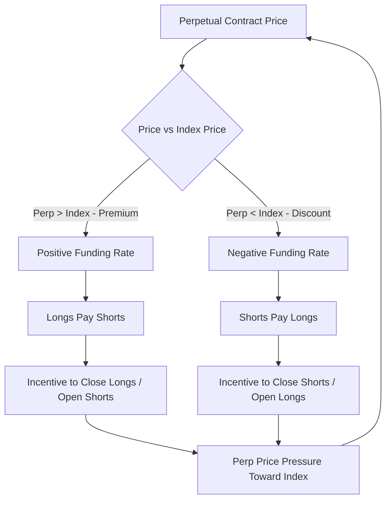
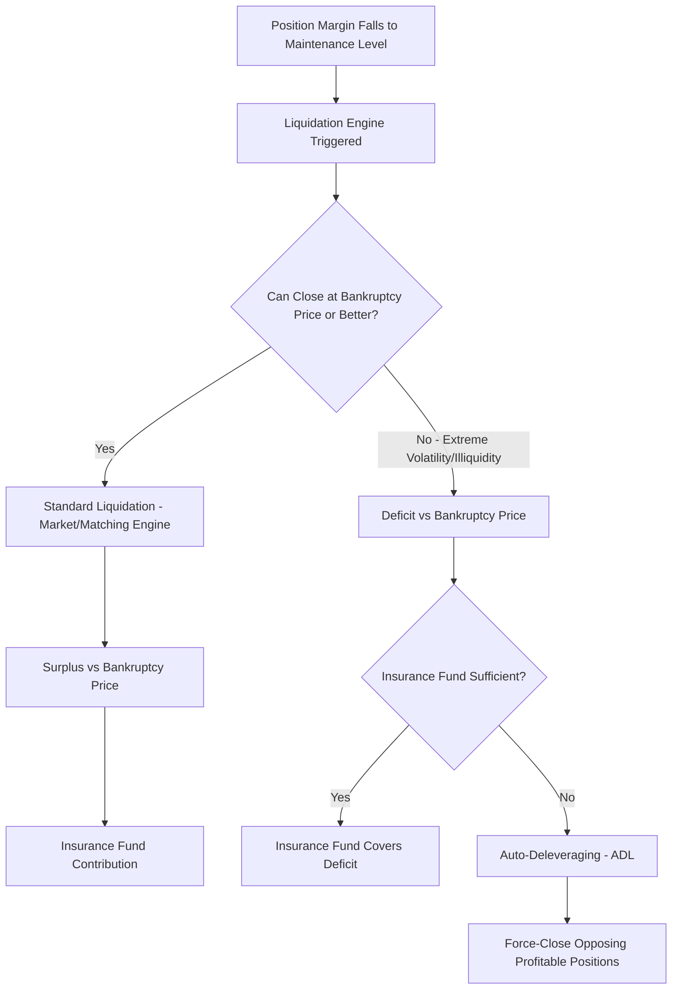

## Crypto Futures and Perpetual Swaps

### Overview

Crypto futures and perpetual swaps are derivative instruments that provide leveraged, cash-settled (or in some cases physically-settled) exposure to cryptocurrency prices without requiring direct ownership of the underlying digital asset. Traditional dated futures follow conventional futures mechanics adapted to crypto market structure, while **perpetual swaps** (or "perpetuals"/"perps") are a crypto-native innovation with no expiry date, using a periodic **funding rate** mechanism to tether the contract's price to the underlying spot price indefinitely — a structure with no direct precedent in traditional derivatives markets and now the dominant instrument by trading volume in crypto derivatives markets.

These instruments trade predominantly on crypto-native exchanges (Binance, OKX, Bybit, Deribit) alongside a growing regulated presence (CME, and various CFTC/regulated venues), and their market structure differs meaningfully from traditional futures markets in margining, settlement, and venue risk characteristics.

### Dated Crypto Futures

**Key Points**

- **Contract structure**: Standard futures with a fixed expiry date (typically quarterly or bi-quarterly on major venues), converging to the spot price at expiry through the same theoretical no-arbitrage mechanism as traditional futures.
- **Settlement**: Predominantly cash-settled against a reference index price (an aggregated spot price across multiple exchanges, designed to resist single-venue manipulation), though some venues offer physically-settled contracts.
- **Basis**: The difference between the futures price and spot price, typically positive (contango) in crypto markets reflecting the cost of carry plus a risk premium for leveraged long demand:

$$\text{Basis} = F_T - S_0$$

$$\text{Annualized Basis} = \left( \frac{F_T}{S_0} - 1 \right) \times \frac{365}{T}$$

where $F_T$ is the futures price for expiry $T$ (in years) and $S_0$ is the current spot price.

**Example**: If Bitcoin spot trades at $60,000 and the 3-month quarterly future trades at $61,500, the annualized basis is approximately $(61,500/60,000 - 1) \times 4 = 10\%$, reflecting the market's aggregate cost of leveraged long exposure and financing conditions.

- **Basis trading**: A widely used crypto-native strategy ("cash-and-carry") involving buying spot and simultaneously selling the future to capture the basis as a relatively low-risk yield, closing both legs at expiry when the future converges to spot.

### Perpetual Swap Mechanics

**Key Points**

Perpetual swaps have no expiry date and instead rely on a **funding rate** mechanism to keep the contract price anchored to the underlying spot/index price. Without this mechanism, an instrument with no expiry and no convergence force would have no reason for its price to track spot at all.

The funding rate is a periodic payment (commonly every 1 or 8 hours, varying by exchange) exchanged directly between long and short position holders — not paid to or by the exchange — based on the deviation between the perpetual contract's price and the underlying index price:

$$\text{Funding Rate} = \text{Premium Index} + \text{clamp}(\text{Interest Rate} - \text{Premium Index}, -0.05\%, 0.05\%)$$

$$\text{Premium Index} = \frac{\max(0, \text{Impact Bid} - \text{Index}) - \max(0, \text{Index} - \text{Impact Ask})}{\text{Index}}$$

[Unverified] The precise funding rate formula, clamp bounds, and calculation frequency vary meaningfully by exchange — the structure above (used by several major venues) illustrates the general mechanism, but an exact implementation should always be verified against the specific venue's current documentation before being relied upon operationally.

- **If perpetual price > index price** (positive funding): Longs pay shorts, creating an economic incentive for traders to close long positions or open short positions, pushing the perpetual price back down toward the index.
- **If perpetual price < index price** (negative funding): Shorts pay longs, incentivizing the opposite rebalancing.

**Example**: If the funding rate is +0.01% (paid every 8 hours) and a trader holds a $100,000 long position through a funding interval, they pay $10 to short position holders at that funding timestamp — regardless of whether they closed the position immediately after, as long as they held it at the funding snapshot moment.

### Margining and Leverage

**Key Points**

- **Initial margin**: The collateral required to open a leveraged position, typically expressed as a percentage of notional (e.g., 1% initial margin permits up to 100x leverage, though most venues impose tiered maximum leverage limits that decrease with position size).
- **Maintenance margin**: The minimum collateral level required to keep a position open; falling below this threshold triggers liquidation.
- **Cross margin vs. isolated margin**: Cross margin uses the trader's entire account balance as collateral across all positions (higher capital efficiency, but a loss on one position can affect margin available for others); isolated margin segregates collateral per position (limiting loss on any single position to the isolated collateral allocated, at the cost of capital efficiency).
- **Tiered margin/leverage schedules**: Most major venues reduce maximum permitted leverage as position notional increases, reducing the exchange's liquidation and insurance fund risk from very large leveraged positions.

$$\text{Liquidation Price (Long, Isolated)} \approx \text{Entry Price} \times \left(1 - \frac{1}{\text{Leverage}} + \text{Maintenance Margin Rate}\right)$$

[Inference] The precise liquidation price formula varies by exchange and includes additional adjustments (funding accrued, fees, and specific maintenance margin tier schedules), so the formula above should be treated as an illustrative approximation rather than an exact, universally applicable calculation.

### Liquidation Mechanics and the Insurance Fund

**Key Points**

- **Liquidation engine**: When a position's margin falls to the maintenance threshold, the exchange's liquidation engine automatically closes (or partially closes, on venues supporting partial liquidation) the position, typically via a forced market order or an internal liquidation matching mechanism.
- **Auto-deleveraging (ADL)**: On some venues, if a liquidated position cannot be closed in the market at a price that avoids further loss (e.g., during extreme volatility with insufficient liquidity), the exchange forcibly closes opposing profitable positions (typically the highest-leverage, most-profitable counterparties) against the liquidated position — a mechanism largely unique to crypto derivatives venues with no direct traditional-market analog.
- **Insurance fund**: A pooled reserve, funded by liquidations that close at a better price than the bankruptcy price (the price at which the position's margin is fully exhausted), used to cover liquidations that close at a worse price than bankruptcy, protecting the exchange and other traders from socialized losses — though when the insurance fund is depleted, ADL or socialized loss mechanisms are typically invoked as a backstop.

### Index Price and Mark Price Construction

**Key Points**

- **Index price**: A composite reference price aggregated from multiple spot exchanges (weighted by liquidity/volume), designed to resist manipulation on any single venue and serve as the anchor for funding rate calculation and liquidation triggers.
- **Mark price** (distinct from last traded price): A smoothed, typically index-plus-basis-adjusted price used specifically for calculating unrealized P&L and triggering liquidations, deliberately designed to be more resistant to short-term price manipulation or "stop hunting" (deliberately pushing the last-traded price to trigger cascading liquidations) than using raw last-traded price directly.

$$\text{Mark Price} = \text{Index Price} \times (1 + \text{Funding Basis Adjustment})$$

[Inference] The specific mark price smoothing methodology (e.g., moving average windows, basis decay functions) varies significantly across exchanges and is generally proprietary to each venue's risk engine design, making exact replication of a specific exchange's mark price from public documentation alone often impractical without direct reference to that venue's technical specification.

### Comparison: Dated Futures vs. Perpetual Swaps

| Dimension | Dated Futures | Perpetual Swaps |
| --- | --- | --- |
| Expiry | Fixed date | None |
| Convergence mechanism | Natural convergence to spot at expiry | Funding rate mechanism |
| Cost of carry expression | Embedded in futures price (basis) | Paid/received periodically via funding |
| Dominant use case | Basis trading, calendar spreads, regulated venue access | Primary leveraged directional/hedging instrument |
| Typical trading volume | Lower than perpetuals on most crypto-native venues | Dominant share of total crypto derivatives volume |
| Regulatory status | Increasingly available on regulated venues (e.g., CME) | Largely absent from major regulated U.S. venues as of [Unverified — regulatory status subject to ongoing change] |

### Basis and Funding Rate as Market Signals

**Key Points**

- **Persistently positive funding**: Indicates aggregate market positioning skewed long (more longs paying shorts), often associated with bullish sentiment or excessive leveraged long speculation — sometimes used as a contrarian sentiment indicator.
- **Funding rate arbitrage / cash-and-carry**: A market-neutral strategy holding spot (or a dated future) against an offsetting perpetual position to harvest funding payments, analogous to basis trading in dated futures but capturing funding cash flows directly rather than price convergence.
- **Cross-exchange funding rate divergence**: Because funding rates are set independently by each exchange based on that venue's own order book premium, meaningful divergence across exchanges can create cross-venue arbitrage opportunities, subject to the operational complexity and counterparty risk of managing positions across multiple venues.

### Market Structure and Venue Risk Considerations

**Key Points**

- **Exchange counterparty risk**: Unlike centrally cleared traditional futures (where a regulated CCP interposes itself and mutualizes default risk), most crypto perpetual/futures trading occurs on centralized exchanges acting as the direct counterparty, concentrating counterparty risk on the exchange's own solvency and risk management — a structurally different risk profile from CCP-cleared traditional derivatives.
- **Self-custody vs. exchange custody of collateral**: Margin collateral is typically held directly by the exchange (rather than segregated with an independent custodian in the manner more common in traditional regulated markets), which [Inference] has historically been identified as a material risk factor in several exchange failure events, though specific custody practices and regulatory requirements vary by venue and jurisdiction and have evolved considerably over time.
- **24/7 continuous trading**: Unlike traditional futures markets with defined trading hours and circuit breakers, crypto derivatives trade continuously, meaning liquidation cascades and volatility events can occur at any time without the natural cooling-off provided by market closures — a structural difference relevant to risk management timing and monitoring infrastructure design.

### Common Pitfalls

- **Ignoring funding cost in position sizing**: Treating perpetual swaps as a "free" leveraged directional bet without accounting for cumulative funding payments, which can meaningfully erode returns on a held position over an extended period, particularly during sustained positive-funding regimes for long positions.
- **Confusing mark price and last price for risk purposes**: Assuming liquidation will occur at the last traded price rather than the (typically smoothed) mark price, leading to miscalculated liquidation risk expectations.
- **Underestimating cross-margin contagion**: In cross-margined accounts, a large loss on one position can trigger liquidation cascades across otherwise unrelated positions sharing the same margin pool, a risk not present in isolated margin structures.
- **Overlooking auto-deleveraging risk on profitable positions**: Assuming a profitable position is immune to forced closure, when ADL mechanisms can forcibly close even correctly-directioned, profitable positions during extreme liquidation events on the opposing side.
- **Treating crypto perpetual venues as equivalent to CCP-cleared traditional futures**: Applying traditional futures counterparty risk assumptions (implicit CCP backstop) to bilateral-exchange-as-counterparty crypto venues without properly accounting for the structurally different default/insolvency risk profile.

### Related Topics

- **Tokenization of Traditional Financial Assets and On-Chain Derivatives**
- **Decentralized Finance (DeFi) Derivatives Protocols and AMM-Based Perpetuals**
- **Cash-and-Carry Basis Trading Strategies in Crypto Markets**
- **Crypto Options Markets and Implied Volatility (Deribit and Beyond)**
- **Digital Asset Custody and Counterparty Risk Frameworks**
- **CME and Regulated Crypto Derivatives Market Development**
- **Stablecoins and Their Role in Crypto Derivatives Margining**
- **Market Making and Bid Ask Spread Setting** *(applied to crypto-native liquidity provision)*
- **Position and Risk Limit Management** *(adapted for 24/7 leveraged crypto markets)*
- **On-Chain Data and Blockchain Analytics for Derivatives Risk Monitoring**