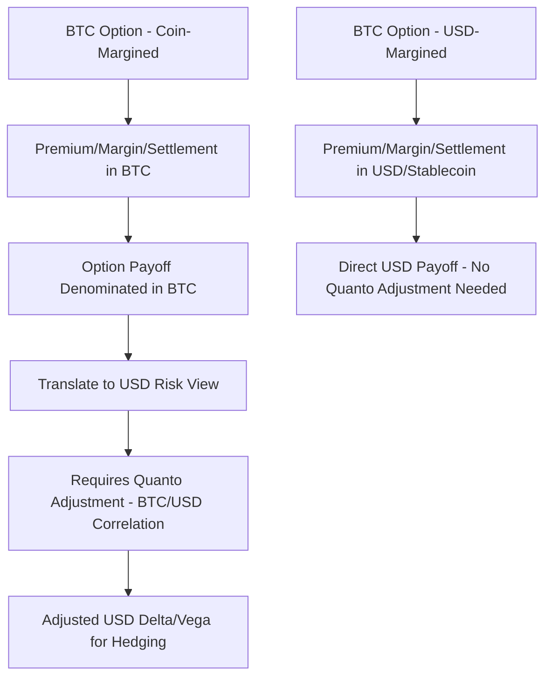
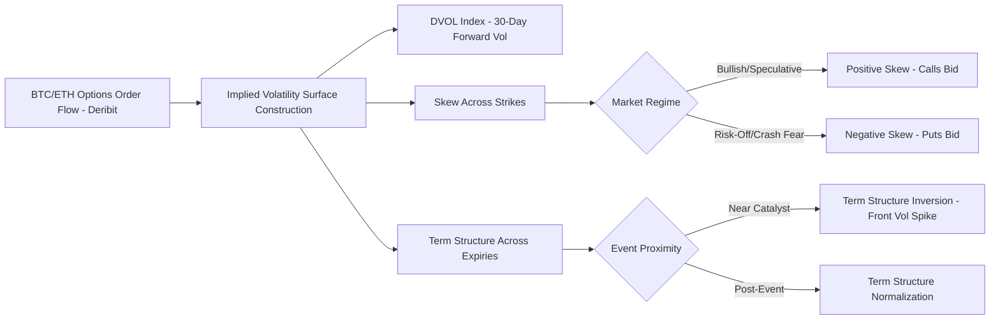

## Bitcoin and Ether Options Markets

### Overview

Bitcoin (BTC) and Ether (ETH) options markets provide the primary venue for trading volatility, skew, and directional convexity exposure on the two largest cryptocurrencies by market capitalization. Unlike crypto perpetual swaps and futures (which dominate crypto derivatives volume), the options market is structurally smaller but has matured substantially, developing many of the same analytical frameworks (implied volatility surfaces, skew, term structure) familiar from traditional equity and FX options markets — while retaining crypto-specific market structure features around settlement conventions, venue concentration, and extreme volatility regimes.

The market is dominated by a small number of specialized crypto-native venues, with Deribit historically holding the large majority of open interest and volume, alongside a growing but still comparatively smaller presence on regulated venues (CME) and emerging on-chain/DeFi options protocols.

### Market Structure and Venues

**Key Points**

- **Deribit**: The dominant crypto options venue historically, offering European-style, cash-settled BTC and ETH options with a wide range of strikes and expiries (daily, weekly, monthly, and quarterly), and the primary source of market-standard implied volatility indices for crypto.
- **CME**: Offers regulated, USD-margined BTC and ETH options on futures, attracting institutional participants requiring regulated-venue access, though with materially lower open interest and volume than Deribit as of [Unverified — relative market share shifts over time and should be verified against current data].
- **OKX, Bybit, and other crypto-native exchanges**: Offer competing options products, generally with lower liquidity than Deribit but growing in relevance, particularly for altcoin options beyond BTC/ETH.
- **On-chain/DeFi options protocols**: Decentralized alternatives (e.g., automated market maker-based options protocols, options vaults) offering non-custodial options exposure, generally with lower liquidity and different risk characteristics (smart contract risk, oracle risk) than centralized venues.

### Contract Conventions

**Key Points**

- **Style**: Predominantly European-style (exercisable only at expiry), matching Deribit's dominant convention, simplifying pricing relative to American-style options and avoiding early-exercise complexity.
- **Settlement**: Cash-settled in the quote currency (historically often settled in the underlying crypto itself on Deribit — i.e., BTC options settle in BTC, ETH options settle in ETH — a convention sometimes called "inverse" or "coin-margined" settlement), a structurally distinct convention from typical traditional equity/index options settled in fiat currency.
- **Strike and expiry grid**: Standardized strikes at regular intervals and standardized expiry dates (typically Fridays, with monthly and quarterly expiries following broader derivatives market convention of last-Friday-of-month), providing a liquid, comparable grid for constructing implied volatility surfaces.

**Example**: A Deribit BTC call option is quoted with a premium denominated in BTC (e.g., 0.05 BTC), and both the premium payment and any exercise settlement occur in BTC — meaning a trader's P&L on the option itself is naturally expressed in the underlying asset rather than in USD, introducing a layer of "quanto-like" complexity when translating option Greeks/P&L back to a USD risk view.

### Coin-Margined vs. USD-Margined Options

**Key Points**

This distinction is one of the most operationally significant differences from traditional options markets:

- **Coin-margined (inverse) options**: Premium, margin, and settlement all denominated in the underlying cryptocurrency (BTC options margined in BTC). This creates a form of embedded quanto effect — since the "currency" the option is priced and settled in is itself the volatile underlying, a trader's effective USD-denominated payoff is the product of the option's crypto-denominated payoff and the crypto/USD exchange rate, requiring a quanto adjustment to properly hedge USD-denominated risk.
- **USD-margined (linear) options**: Premium and margin denominated in USD or a USD-stablecoin, with payoff calculated directly in USD terms — structurally identical to traditional options margining and increasingly offered alongside coin-margined products on major venues.

$$V_{\text{coin-margined, USD terms}} = V_{\text{BTC terms}} \times S_{\text{BTC/USD}}$$

The Greeks of a coin-margined option, when translated to USD risk terms, require adjustment for the correlation between the option's crypto-denominated value and the BTC/USD exchange rate itself — a quanto correction analogous to (though structurally distinct from) traditional quanto options on foreign-currency-denominated underlyings.

[Inference] Because this quanto-like effect is a structural consequence of settling in a volatile asset rather than a stable fiat currency, risk management desks trading coin-margined crypto options typically apply an explicit quanto adjustment to their delta and vega hedging calculations rather than treating the crypto-denominated Greeks as directly USD-equivalent — though the specific adjustment methodology can vary by desk and is not uniformly standardized across the market in the way, for example, FX quanto conventions are in traditional markets.

### Implied Volatility Surface Characteristics

**Key Points**

- **DVOL (Deribit Volatility Index)**: A VIX-style index constructed from BTC (and separately ETH) options prices, representing the market's expectation of 30-day forward implied volatility, and the crypto market's closest analog to the equity VIX.
- **Elevated absolute volatility levels**: BTC and ETH implied volatility typically trades at substantially higher absolute levels than major equity indices (often in the 40-80%+ annualized range even in relatively calm regimes, with spikes considerably higher during stress events) — a structural feature of the underlying asset class's realized volatility rather than a market inefficiency.
- **Skew dynamics**: Unlike equity index options (which typically exhibit a persistent negative skew — downside puts trading at higher implied vol than upside calls, reflecting crash-risk demand), crypto options skew has historically been more regime-dependent, at times exhibiting positive skew (calls more expensive than equidistant puts) reflecting speculative upside demand, particularly during bullish market regimes — [Inference] a pattern generally attributed to the crypto options market's historically higher proportion of retail and speculative directional participants relative to the institutional hedging flow that dominates equity index skew, though the precise skew regime shifts over time and should not be assumed static.
- **Term structure**: Can exhibit pronounced inversions around major anticipated events (e.g., regulatory decisions, network upgrades, macro data releases), with short-dated implied volatility spiking well above longer-dated levels ahead of the event and typically collapsing afterward (an "event vol" pattern familiar from traditional markets around earnings or central bank announcements, but often more pronounced in crypto given the market's sensitivity to binary regulatory/technical catalysts).

### Pricing Model Considerations

**Key Points**

- **Black-Scholes as a baseline**: Despite crypto's non-normal return characteristics (fat tails, volatility clustering, occasional extreme jumps), Black-Scholes-derived implied volatility remains the market-standard quoting convention, analogous to its role as a quoting convention (rather than a literal distributional assumption) in traditional options markets.
- **Jump-diffusion and stochastic volatility extensions**: Given the frequency and magnitude of sudden price jumps in crypto markets (exchange outages, regulatory announcements, liquidation cascades), jump-diffusion models (e.g., Merton jump-diffusion) and stochastic volatility models are commonly employed by sophisticated market participants to better capture tail risk than pure Black-Scholes/local-vol approaches, particularly for pricing far out-of-the-money options where jump risk is most material.
- **24/7 continuous market considerations**: Unlike traditional markets with defined trading hours (requiring time-to-expiry conventions that account for non-trading periods), crypto options trade against a genuinely continuous underlying market, simplifying time-decay conventions relative to traditional markets but also meaning volatility events can occur and compound at any time without the natural circuit-breaker effect of market closures.

### Options-Based Market Signals

**Key Points**

- **Put-call skew as sentiment indicator**: Shifts in the 25-delta risk reversal (the implied vol difference between equidistant out-of-the-money calls and puts) are widely monitored as a real-time gauge of directional market sentiment and positioning, similar to its use in FX and equity index options markets.
- **Max pain and options expiry dynamics**: Given concentrated open interest around standardized monthly/quarterly expiries (particularly the well-known large Deribit BTC/ETH expiries), market participants monitor "max pain" levels (the strike price at which option sellers' aggregate payout is minimized) and observe elevated realized volatility or pinning behavior around large expiries — [Inference] though the causal strength and reliability of max-pain-driven price effects is debated among practitioners and is better characterized as a market microstructure phenomenon of variable significance rather than a deterministic pricing law.
- **Options open interest and volume as market maturity indicators**: Growth in BTC/ETH options open interest relative to spot/futures market size is commonly tracked as an indicator of derivatives market sophistication and institutional participation depth.

### Market Making in Crypto Options

**Key Points**

- **Wider spreads than traditional equivalents**: Bid-ask spreads on BTC/ETH options, while having tightened considerably as the market has matured, [Unverified] generally remain wider than comparable-liquidity traditional equity index options, reflecting a combination of higher underlying volatility (increasing hedging cost per the gamma-cost framework discussed in Market Making and Bid Ask Spread Setting) and a comparatively smaller and less diversified market-making participant base.
- **Hedging infrastructure**: Crypto options market makers hedge delta primarily via the deep liquidity of perpetual swap markets (rather than spot, given perpetuals' typically superior liquidity and capital efficiency), introducing basis risk between the options' underlying reference price and the perpetual's funding-rate-influenced price dynamics as an additional risk factor beyond traditional equity/FX options market making.
- **Venue concentration risk**: Given Deribit's historically dominant share of BTC/ETH options liquidity, market makers and large options traders face meaningful venue concentration risk — both in terms of counterparty/custody risk (see Crypto Futures and Perpetual Swaps) and in terms of liquidity fragility should the dominant venue experience an outage or disruption during a volatile period.

### Comparison to Traditional Options Markets

| Dimension | Traditional Equity/Index Options | BTC/ETH Options |
| --- | --- | --- |
| Dominant style | American (equities) / European (index) | Predominantly European |
| Settlement currency | Fiat (USD, EUR, etc.) | Often crypto-denominated (coin-margined), increasingly USD-margined |
| Typical absolute IV level | Often 15-25% (index) | Often 40-80%+ |
| Skew pattern | Persistent negative skew (crash premium) | Regime-dependent, sometimes positive |
| Venue structure | Regulated exchanges, CCP-cleared | Concentrated on a few crypto-native venues, bilateral exchange counterparty risk |
| Trading hours | Defined sessions | Continuous 24/7 |
| Primary delta hedge instrument | Underlying equity/futures | Perpetual swaps |

### Common Pitfalls

- **Ignoring quanto effects in coin-margined positions**: Treating coin-margined option Greeks as directly equivalent to USD risk without applying the appropriate quanto adjustment, leading to mis-hedged USD-denominated exposure.
- **Applying equity-index skew intuition uncritically**: Assuming crypto options skew will behave like the persistently negative equity index skew pattern, when crypto skew has historically been considerably more regime-dependent and can invert during speculative bullish periods.
- **Underestimating jump risk in far OTM pricing**: Relying purely on Black-Scholes/local-vol implied surfaces without jump-diffusion or stochastic volatility considerations for tail-strike options, given crypto markets' documented propensity for sudden, large price dislocations.
- **Overlooking basis risk between options underlying and perpetual hedge**: Assuming a perpetual swap is a perfect delta hedge for options referencing a spot/index price, without accounting for the basis risk introduced by the perpetual's funding-rate-driven price dynamics relative to the options' settlement reference.
- **Underappreciating venue concentration risk**: Building trading or risk infrastructure that assumes continuous availability of the dominant options venue without contingency planning for potential outages or liquidity disruptions during high-volatility periods.

### Related Topics

- **Crypto Futures and Perpetual Swaps** *(primary delta-hedging instrument for crypto options market makers)*
- **Volatility Surface Construction and Skew/Smile Dynamics** *(traditional framework applied to crypto-specific patterns)*
- **Quanto Options and Cross-Currency Derivatives Adjustments**
- **Jump-Diffusion and Stochastic Volatility Models for Tail Risk**
- **Market Making and Bid Ask Spread Setting** *(gamma cost framework applied to elevated crypto volatility)*
- **Digital Asset Custody and Counterparty Risk Frameworks**
- **Decentralized Finance (DeFi) Derivatives Protocols and AMM-Based Perpetuals**
- **CME and Regulated Crypto Derivatives Market Development**
- **Options Expiry Dynamics: Max Pain, Pinning, and Gamma Exposure**
- **Model Risk and Explainability for AI Models** *(model risk considerations for crypto-specific pricing model choices)*