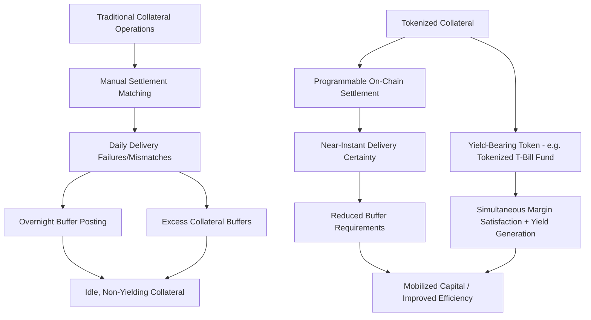
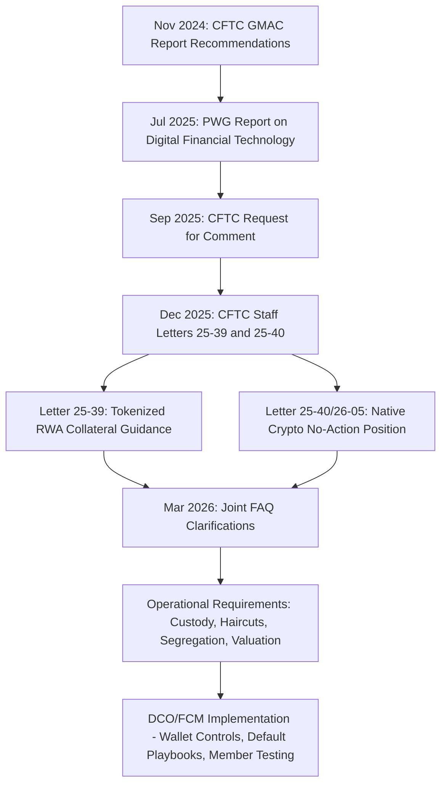
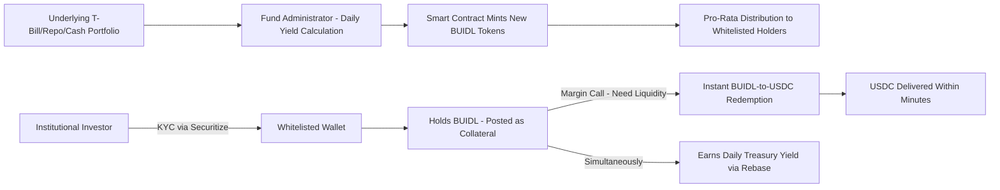
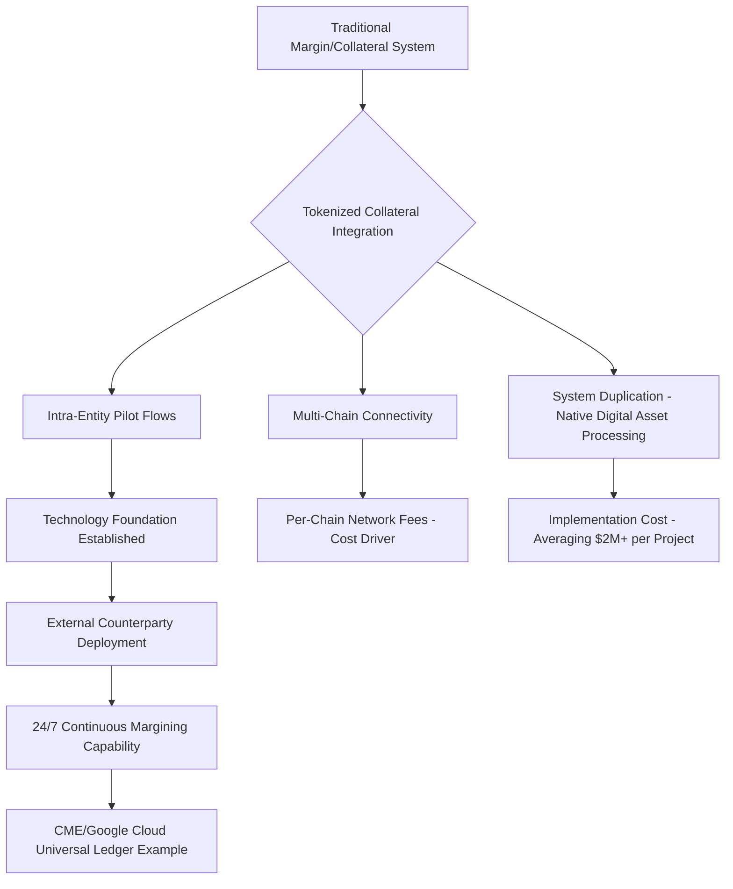

## Tokenized Collateral and Digital Asset Margining

### Overview

Tokenized collateral and digital asset margining refers to the use of blockchain-based representations of traditional financial assets — most prominently tokenized money market funds (TMMFs) and tokenized US Treasuries — alongside native crypto assets (Bitcoin, Ether, stablecoins) as eligible collateral for margining derivatives positions, both centrally cleared and bilateral/uncleared. This is one of the fastest-moving areas of derivatives market infrastructure, sitting at the convergence of traditional collateral management, blockchain settlement rails, and evolving regulatory frameworks, with 2025–2026 marking a distinct inflection point in institutional adoption and regulatory clarity.

Unlike crypto derivatives (Bitcoin/Ether futures, perpetuals, options), which concern the *underlying instrument being traded*, this topic concerns the *collateral posted to support margin obligations* on derivatives positions generally — meaning tokenized collateral can, in principle, support margin for entirely traditional (non-crypto) derivatives exposure.

### Why Tokenized Collateral Matters: The Core Problem

**Key Points**

Traditional collateral operations, particularly in derivatives markets, suffer from structural inefficiencies that tokenization is designed to address. According to a 2026 Nasdaq/ValueExchange industry survey, 70% of respondents report settlement matching and delivery issues daily, reflecting reliance on manual processes, and industry workarounds are common: 35% of firms post more than half their collateral overnight to ensure timely delivery, while the average firm maintains approximately 7% excess collateral as a buffer against potential failures. These corrective behaviors mean roughly 25% of total collateral usage earns no returns for the owner, representing a substantial capital efficiency drag across the industry. [Nasdaq](https://www.nasdaq.com/products/fintech/resources/making-the-case-for-tokenized-collateral)[Nasdaq](https://www.nasdaq.com/products/fintech/resources/making-the-case-for-tokenized-collateral)

**Key drivers of adoption**:

- **Settlement certainty**: Programmable, near-instantaneous on-chain settlement reduces the delivery failures and timing mismatches endemic to traditional collateral movement (custodian cut-off times, cross-border settlement lags).
- **Capital efficiency / dual-utility collateral**: Tokenized yield-bearing instruments (e.g., tokenized Treasury funds) allow posted collateral to simultaneously satisfy margin requirements *and* generate yield — a structural advantage over traditional cash collateral, which typically earns minimal or no return while pledged.
- **24/7 margining readiness**: As derivatives markets (particularly crypto derivatives, but increasingly traditional markets moving toward near-continuous trading) move toward round-the-clock operation, collateral infrastructure must support margin calls and collateral movement outside traditional banking hours — a capability blockchain-based settlement rails are structurally suited to provide.

Enhanced risk frameworks like ISDA SIMM 2.8 and SPAN 2 promise greater precision and cross-asset support, but they also introduce complexity, and to remain profitable, firms will have no choice but to expand their margin and collateral capabilities to accommodate these evolving standards alongside digital asset integration. [nasdaq](https://www.nasdaq.com/articles/fintech/2026-outlook-derivatives-inflection-point)

### Regulatory Framework: The 2025–2026 CFTC Guidance Wave

**Key Points**

The U.S. regulatory landscape for tokenized collateral in derivatives shifted substantially in late 2025 and early 2026, driven by the Presidential Working Group's digital asset market recommendations and the CFTC's own initiative:

- In December 2025, CFTC staff issued guidance on the use of digital assets as collateral for derivatives transactions across three letters, including CFTC Letter No. 25-39, the Tokenized Collateral Advisory, which permits the use of tokenized assets — defined as digital representations of real-world assets like US Treasuries or money market funds recorded on a blockchain — as collateral for futures and swaps transactions, subject to conditions as to eligibility, enforceability, segregation, custody, haircuts and valuation requirements and operational risks. [Norton Rose Fulbright](https://www.nortonrosefulbright.com/en/knowledge/publications/a54ee40a/review-of-cftc-guidance-on-tokenized-and-digital-asset-collateral)
- The Guidance, consistent with GMAC's recommendations, acknowledges that CFTC regulations do not require any particular technology or operational infrastructure to transfer or hold eligible collateral, stating instead that assets retain their margin eligibility so long as they satisfy applicable regulatory requirements — a technology-neutral stance treating tokenization as a settlement/representation layer rather than creating a wholly new asset class requiring bespoke rules. [Chapman and Cutler LLP](https://www.chapman.com/publication-cftc-divisions-issue-tokenized-collateral-guidance)
- A companion track addressed native crypto assets directly: CFTC Staff Letter 26-05 (successor to CFTC Staff Letter 25-40) provides a no-action position permitting futures commission merchants (FCMs) to accept certain crypto assets — payment stablecoins, bitcoin, and ether — as collateral for margin, distinct from the tokenized-real-world-asset track. [Morgan Lewis](https://www.morganlewis.com/pubs/2026/03/crypto-clarity-cftc-faqs-clarify-use-of-crypto-assets-by-registrants-and-registered-entities-part-2)
- Further operational clarity followed in Q1 2026: the CFTC's Market Participants Division and Division of Clearing and Risk jointly issued, on March 20, 2026, responses to frequently asked questions addressing how FCMs, derivatives clearing organizations, and swap dealers may use crypto assets and blockchain technologies under existing CFTC regulations, clarifying that crypto assets, including payment stablecoins, are not eligible margin collateral for uncleared swaps, while tokenized versions of otherwise eligible collateral may qualify if they confer equivalent legal and economic rights to the underlying asset. [Morgan Lewis](https://www.morganlewis.com/pubs/2026/03/crypto-clarity-cftc-faqs-clarify-use-of-crypto-assets-by-registrants-and-registered-entities-part-2)[Morgan Lewis](https://www.morganlewis.com/pubs/2026/03/crypto-clarity-cftc-faqs-clarify-use-of-crypto-assets-by-registrants-and-registered-entities-part-2)
- Implementation guidance for clearing organizations emphasized operational readiness: CFTC guidance directed firms to document and test custody/control and legal enforceability of tokenized collateral, integrate blockchain-specific failure scenarios into default management playbooks, conduct member testing, and align collateral operations with DCO requirements including wallet controls, valuation, haircuts, substitution and reconciliation. [Katten Muchin Rosenman LLP](https://katten.com/cftc-launches-digital-assets-pilot-program-for-tokenized-collateral-in-derivatives-markets)

[Inference] Because this guidance was issued via staff letters and FAQs rather than formal notice-and-comment rulemaking, the framework retains a degree of interpretive flexibility and is likely to continue evolving through subsequent staff guidance — market participants should treat the specific eligibility, haircut, and segregation conditions as subject to ongoing refinement rather than fully settled, permanent rules.

### Eligible Collateral Types

**Key Points**

- **Tokenized money market funds (TMMFs) / tokenized Treasuries**: Blockchain-based representations of shares in a fund holding short-duration government securities (T-bills, repo, cash). The dominant example is BlackRock's BUIDL fund.
- **Native crypto assets**: Bitcoin, Ether, and (per the 2026 CFTC no-action framework) certain payment stablecoins, permitted for cleared derivatives margin under specified conditions, though — per the March 2026 FAQ clarification above — generally excluded from uncleared swap margin eligibility.
- **Deposit tokens and tokenized cash**: Bank-issued tokenized representations of commercial bank money, distinct from stablecoins, increasingly explored by major exchanges and clearing venues as a settlement instrument.

Digital assets include digital payments (crypto, stablecoins, CBDC, deposit tokens) and tokenized assets, which are all orchestrated by blockchain technology, and as new regulations come into focus — driven by the GENIUS and CLARITY Acts in the U.S. and MiCA in Europe — 2026 will likely see an exponential growth in traded volume alongside new foundational market infrastructure created around those assets from a trading and collateral management perspective. [nasdaq](https://www.nasdaq.com/articles/fintech/2026-outlook-derivatives-inflection-point)

### BUIDL as the Reference Case for Tokenized Collateral Mechanics

**Key Points**

BlackRock's USD Institutional Digital Liquidity Fund (BUIDL) has become the de facto reference implementation for tokenized Treasury collateral, illustrating the typical technical and legal architecture:

- **Structure**: BUIDL is a tokenized money market fund issued by BlackRock and operated onchain through transfer agent Securitize, launched on Ethereum on March 20, 2024, with each token targeting a stable $1 value, accruing daily dividends from short-duration US Treasury bills, repo, and cash, settling peer-to-peer between approved holders. [Eco](https://eco.com/support/en/articles/15483226-what-is-buidl-blackrock-s-tokenized-treasury-fund)
- **Yield distribution mechanism**: BUIDL uses a rebase model — the token price is pinned at one dollar while the holder's token count increases to reflect accrued interest, the same general mechanism used by liquid staking tokens like Lido's stETH, though with technical differences. Every business day, the fund administrator calculates the yield earned by the underlying T-bill portfolio, converts it into a new supply of BUIDL tokens, and the smart contract distributes those tokens proportionally to all whitelisted holders. [DEXTools](https://www.dextools.io/tutorials/what-is-blackrock-buidl-tokenized-treasury-2026)[DEXTools](https://www.dextools.io/tutorials/what-is-blackrock-buidl-tokenized-treasury-2026)
- **Access control / compliance architecture**: The smart contract maintains a whitelist of approved wallet addresses controlled by Securitize, and transfers can only move between addresses that both pass the whitelist check — a design allowing the token to satisfy securities-law transferability requirements while remaining on a public blockchain, with every transaction, mint, redemption, and interest accrual visible on-chain but restricted to verified counterparties. [DEXTools](https://www.dextools.io/tutorials/what-is-blackrock-buidl-tokenized-treasury-2026)
- **Multi-chain deployment**: BUIDL launched exclusively on Ethereum but has since expanded to Polygon, Arbitrum, Optimism, and Avalanche, reflecting a broader industry pattern of multi-chain collateral deployment to reach liquidity and counterparties across different blockchain ecosystems. [Blocklr](https://blocklr.com/news/blackrock-buidl-tokenized-treasury-2b-aum/)
- **Redemption/liquidity mechanism**: BlackRock partnered with Circle to provide an instant BUIDL-to-USDC conversion facility, allowing token holders to redeem BUIDL for USDC at any time through a smart contract, receiving stablecoins within minutes rather than waiting for a traditional fund redemption to process — this instant-redemption bridge to a stablecoin is a critical liquidity feature that makes a yield-bearing token practically usable as collateral requiring rapid liquidation in a margin call scenario. [Blocklr](https://blocklr.com/news/blackrock-buidl-tokenized-treasury-2b-aum/)

### Collateral Haircuts and Risk Weighting

**Key Points**

As with traditional collateral, tokenized assets posted as margin are subject to haircuts reflecting their price volatility, liquidity, and operational risk — but tokenized collateral introduces additional haircut considerations beyond traditional asset-class risk:

- **Illustrative market practice**: Crypto.com Exchange reduced the collateral haircut rate for BUIDL from 2% to 1%, enabling institutional clients to use their assets more efficiently in trading activity, with a greater portion of deposited BUIDL contributing toward margin balance under the reduced haircut, increasing available trading capacity without requiring additional capital. This illustrates how haircuts on tokenized RWA collateral are actively evolving downward as venues gain operational confidence in the underlying infrastructure. [Crypto.com](https://crypto.com/us/product-news/exchange-buidl-haircut-reduction)
- **Dual-utility economics**: BUIDL functions as a yield-generating collateral asset within a margin framework, allowing institutional clients to maintain exposure to stable, income-generating instruments while actively trading, and improved collateral weighting allows clients to deploy the asset more effectively across cross-collateral setups, supporting derivatives positions while maintaining capital in a lower-volatility asset base. [Crypto.com](https://crypto.com/us/product-news/exchange-buidl-haircut-reduction)[Crypto.com](https://crypto.com/us/product-news/exchange-buidl-haircut-reduction)
- **Additional risk layers beyond traditional MMF haircut factors**: Smart contract risk (bugs or exploits affecting the token layer independent of the underlying asset's credit quality), issuer/transfer-agent operational risk (dependency on Securitize or an equivalent transfer agent's operational continuity), and redemption-liquidity risk (dependency on the instant-conversion facility remaining operational and adequately capitalized) — [Inference] these represent risk dimensions with no direct analog in traditional MMF collateral haircut models, and institutions are likely to apply supplementary haircut loadings or operational risk limits specifically for these factors, though standardized methodologies for doing so are still maturing industry-wide.

### DeFi and On-Chain Collateral Utility

**Key Points**

- Using tokenized collateral in DeFi protocols creates value impossible with traditional money market fund shares: an institution holding a large position in a tokenized Treasury fund can simultaneously earn the underlying Treasury yield and borrow stablecoins against that position at DeFi lending rates — a composability feature entirely absent from traditional, siloed collateral infrastructure. [Blocklr](https://blocklr.com/news/blackrock-buidl-tokenized-treasury-2b-aum/)
- This dual-utility property — collateral that simultaneously produces income — is what makes tokenized margin fundamentally different from simply moving existing assets onto new rails, collapsing the capital efficiency gap between traditional finance and on-chain markets. [Bex](https://bex.co/blog/2026/03/11/cftc-tokenized-collateral-pilot-btc-eth-derivatives-margin)
- Some perpetual futures decentralized exchanges accept tokenized Treasury funds as collateral for the same reason: the asset generates yield while sitting in margin, improving capital efficiency. [Eco](https://eco.com/support/en/articles/15254013-buidl-deep-dive-2026)

### Institutional and Exchange Infrastructure Adoption

**Key Points**

Major derivatives market infrastructure providers are actively building tokenized collateral capability:

- CME Group announced during its Q4 2025 earnings call that it will launch a tokenized-cash product in partnership with Google Cloud, built on Google Cloud's Universal Ledger technology, designed to serve as crypto-native collateral within CME clearing and enable more seamless margin posting for the exchange's growing crypto derivatives book. CME is also moving its crypto futures and options to 24/7 trading in Q2 2026, subject to regulatory approval, and round-the-clock markets combined with tokenized collateral creates a system where margin calls can be met and positions adjusted at any time, not just during traditional banking hours. [Bex](https://bex.co/blog/2026/03/11/cftc-tokenized-collateral-pilot-btc-eth-derivatives-margin)[Bex](https://bex.co/blog/2026/03/11/cftc-tokenized-collateral-pilot-btc-eth-derivatives-margin)
- Industry-wide, a Nasdaq/ValueExchange report found that 52% of global firms surveyed plan to manage live tokenized collateral by the end of 2026, with tokenized collateral entering mainstream use driven by high settlement failures and cost pressure in derivatives, and high potential for impact in both exchange-traded derivatives (ETD) and OTC markets, reducing operational drag, excess collateral, and capital inefficiency. [Nasdaq](https://www.nasdaq.com/articles/fintech/how-tokenized-collateral-will-impact-derivatives-markets-and-risk-management)
- Over 60% of North American and European respondents anticipate tokenized money market funds becoming eligible collateral by 2026, with regulatory clarity, legal definitions, and central securities depository (CSD)-level tokenization central to controlled and compliant adoption. [Nasdaq](https://www.nasdaq.com/products/fintech/resources/making-the-case-for-tokenized-collateral)
- **Implementation cost realities**: Project costs averaged $2 million in 2025 — potentially consuming up to one-third of revenue upside for smaller firms — and network connectivity fees of approximately 2 basis points per chain become prohibitive for multi-chain connectivity, while system duplication remains largely unavoidable since few traditional platforms process digital assets natively. Moving to 24/7 margining also requires expanded staffing coverage that regional institutions find cost-prohibitive — highlighting that adoption, while accelerating, carries material implementation friction. [Nasdaq](https://www.nasdaq.com/products/fintech/resources/making-the-case-for-tokenized-collateral)[Nasdaq](https://www.nasdaq.com/products/fintech/resources/making-the-case-for-tokenized-collateral)
- Large institutions are beginning with intra-entity flows to establish technology foundations before external counterparty deployment, a cautious, phased rollout pattern consistent with managing novel operational and legal risk. [Nasdaq](https://www.nasdaq.com/products/fintech/resources/making-the-case-for-tokenized-collateral)

### Market Scale Context

**Key Points**

- The tokenized real-world asset market, excluding stablecoins, reached roughly $19-36 billion in early 2026, with tokenized U.S. Treasuries alone accounting for over $8.7 billion. [Bex](https://bex.co/blog/2026/03/11/cftc-tokenized-collateral-pilot-btc-eth-derivatives-margin)
- BUIDL's growth trajectory illustrates the pace of adoption: from an initial $200 million at launch to $2 billion in assets under management by mid-March 2026, a tenfold increase in less than two years, with figures cited across 2026 sources ranging up to approximately $2.5 billion and roughly $3.0 billion by June 2026 — [Unverified] reflecting the rapidly evolving and differently-timed nature of these figures across sources, such that any specific AUM figure should be verified against current data before being relied upon for analysis. [BlackRock Tokenized Treasury Fund BUIDL Hits $2B AUM +2](https://blocklr.com/news/blackrock-buidl-tokenized-treasury-2b-aum/)
- If the CFTC pilot provides full regulatory clearance, BUIDL is emerging as the de facto tokenized collateral standard, with its march through the collateral stack already underway — including acceptance by major exchanges as off-exchange collateral. [Bex](https://bex.co/blog/2026/03/11/cftc-tokenized-collateral-pilot-btc-eth-derivatives-margin)

### Operational and Legal Risk Considerations

**Key Points**

- **Custody and control documentation**: Per CFTC guidance, institutions must document and test custody/control and legal enforceability of tokenized collateral — confirming that a security interest or equivalent legal claim over the tokenized asset is enforceable under applicable law, an area where legal frameworks for blockchain-based property rights are still maturing in many jurisdictions. [Katten Muchin Rosenman LLP](https://katten.com/cftc-launches-digital-assets-pilot-program-for-tokenized-collateral-in-derivatives-markets)
- **Default management readiness**: Integrating blockchain-specific failure scenarios into default management playbooks and conducting member testing is an explicit regulatory expectation — meaning clearing organizations must plan for scenarios such as smart contract failure, blockchain network congestion/outage, or transfer-agent operational disruption as part of standard default management procedures, not merely traditional market/credit risk scenarios. [Katten Muchin Rosenman LLP](https://katten.com/cftc-launches-digital-assets-pilot-program-for-tokenized-collateral-in-derivatives-markets)
- **Reconciliation complexity**: Aligning collateral operations with DCO requirements including wallet controls, valuation, haircuts, substitution and reconciliation requires new operational processes bridging on-chain settlement finality concepts with traditional collateral management systems' end-of-day reconciliation conventions — a genuine system integration challenge given that, as noted above, few traditional platforms process digital assets natively. [Katten Muchin Rosenman LLP](https://katten.com/cftc-launches-digital-assets-pilot-program-for-tokenized-collateral-in-derivatives-markets)

### Common Pitfalls

- **Treating tokenization as purely a technology upgrade**: Underestimating the legal work required to establish that a tokenized asset confers equivalent legal and economic rights to its underlying reference asset — a condition the CFTC's March 2026 FAQ guidance explicitly requires for margin eligibility, not merely a technical wrapper consideration.
- **Ignoring smart contract and transfer-agent operational risk in haircut methodology**: Applying traditional asset-class haircuts (e.g., standard Treasury MMF haircuts) to a tokenized equivalent without accounting for the additional smart contract, issuer-operational, and redemption-liquidity risk layers specific to the tokenized wrapper.
- **Underestimating multi-chain operational cost**: Failing to account for the compounding per-chain connectivity fees and system duplication costs when planning multi-chain tokenized collateral infrastructure, a cost driver explicitly flagged as prohibitive for smaller/regional institutions in 2026 industry surveys.
- **Assuming uniform crypto-asset eligibility across clearing and bilateral margin**: Conflating the eligibility rules for cleared derivatives margin (where certain native crypto assets have gained no-action acceptance) with uncleared swap margin (where, per the March 2026 CFTC FAQ, native crypto assets including stablecoins remain generally ineligible absent equivalent-rights tokenization).
- **Underinvesting in default management scenario planning**: Treating blockchain-specific failure modes (network outage, smart contract exploit, whitelist/transfer-agent disruption) as a technology team's concern rather than integrating them into the formal default management and business continuity planning that clearing organizations are explicitly expected to maintain.

### Related Topics

- **Crypto Futures and Perpetual Swaps** *(margining infrastructure for crypto-native derivatives)*
- **Bitcoin and Ether Options Markets** *(coin-margined vs. tokenized/USD-margined collateral considerations)*
- **ISDA SIMM and Uncleared Margin Rules (UMR) Methodology**
- **Central Clearing (CCP) Infrastructure and Default Management Frameworks**
- **Stablecoins, Deposit Tokens, and CBDCs in Derivatives Settlement**
- **Booking Models and Trade Lifecycle Systems** *(collateral/margin management system integration)*
- **Position and Risk Limit Management** *(collateral haircuts as a risk-mitigation mechanism)*
- **Smart Contract Risk and On-Chain Operational Risk Management**
- **24/7 Continuous Trading and Settlement Infrastructure Evolution**
- **GENIUS Act, CLARITY Act, and MiCA: Comparative Digital Asset Regulatory Frameworks**