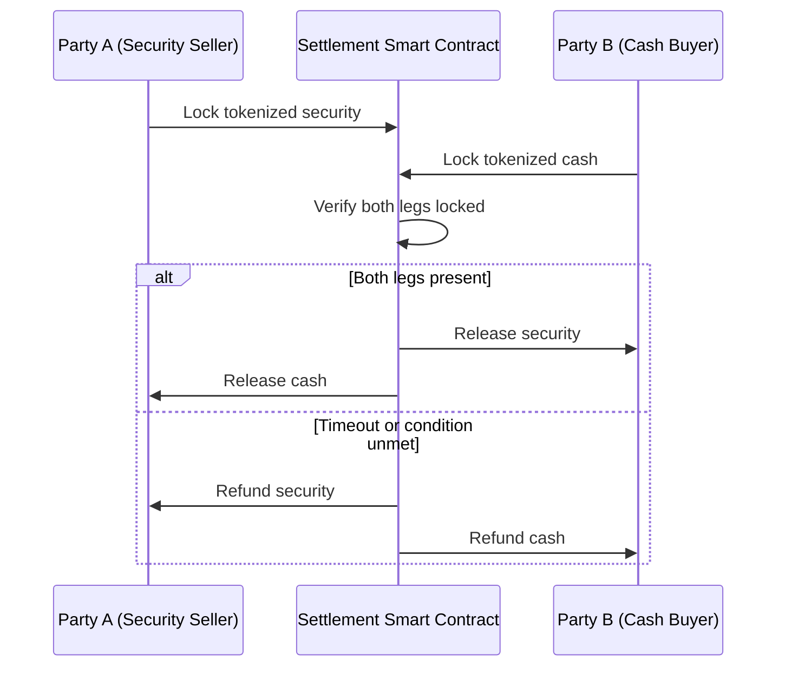

## Distributed Ledger and Atomic Settlement

### Overview

Distributed ledger technology (DLT) restructures how derivatives and structured products are recorded, transferred, and settled by replacing siloed, reconciled databases with a shared, cryptographically-verified record of ownership and state. Atomic settlement is the transactional guarantee that DLT enables: the simultaneous, indivisible exchange of two or more legs of a transaction (e.g., cash for security, or one token for another), such that either all legs complete or none do. This eliminates principal risk — the risk that one party delivers its leg of a trade while the counterparty fails to deliver theirs.

### Core Concepts

#### Distributed Ledger Fundamentals

A distributed ledger is a database replicated, shared, and synchronized across multiple nodes/participants, without a central administrator. Key properties:

- **Shared state**: All authorized participants see a consistent view of who owns what
- **Append-only history**: Records are added, not overwritten, producing an auditable chain of custody
- **Consensus mechanism**: Nodes agree on the validity and ordering of transactions (e.g., Proof of Authority for permissioned financial networks, Practical Byzantine Fault Tolerance (PBFT), or Proof of Stake for public chains)
- **Cryptographic linkage**: Each block/record references the previous one via a hash, making tampering detectable

For institutional derivatives infrastructure, **permissioned DLT** (e.g., Corda, Hyperledger Fabric, Quorum) dominates over public/permissionless chains (Ethereum mainnet), because participants must be KYC'd/known, and transaction visibility is typically restricted to relevant parties rather than globally broadcast.

| Public DLT | Permissioned DLT |
| --- | --- |
| Anyone can join as a node | Access controlled by consortium/operator |
| Full transaction transparency | Selective/private visibility |
| PoW/PoS consensus (slow, energy-intensive) | PBFT/RAFT/PoA consensus (fast, low-latency) |
| Pseudonymous participants | Identified, legally-accountable participants |
| Examples: Ethereum, Bitcoin | Examples: R3 Corda, Hyperledger Fabric |

#### Atomic Settlement Mechanics

"Atomicity" borrows its meaning from database theory (the "A" in ACID): a transaction either commits fully or reverts entirely, with no partial state possible.

**Delivery versus Payment (DvP)** is the classical settlement principle atomic settlement operationalizes on-chain. In traditional markets, DvP is achieved through intermediated clearing (CCPs, custodians) with settlement cycles of T+1 or T+2, during which counterparty exposure exists. On a DLT, DvP can be achieved natively at the protocol level.

**Mechanism — Hash Time-Locked Contracts (HTLCs):**

The canonical mechanism for atomic settlement across two independent ledgers (or one ledger with two asset classes) is the HTLC:

1. Party A generates a secret $s$ and computes hash $h = H(s)$
2. Party A locks Asset 1 in a contract on Ledger 1, releasable only to Party B if Party B reveals $s$ within time $T_1$
3. Party B locks Asset 2 in a contract on Ledger 2, releasable only to Party A if Party A reveals $s$ within time $T_2 < T_1$
4. Party A claims Asset 2 by revealing $s$ on Ledger 2 (publishing the secret)
5. Party B observes $s$ on Ledger 2 and uses it to claim Asset 1 on Ledger 1

If either party fails to act within the time window, the locked assets are refunded to their original owner via a timeout clause — no partial execution occurs.

**Mechanism — Single-Ledger Atomic Swap (smart contract escrow):**

Where both legs of a trade exist as tokens on the *same* ledger (e.g., a tokenized bond and tokenized cash/stablecoin both on the same permissioned chain), atomicity is simpler: a single smart contract function executes both transfers within one transaction. Since blockchain transactions are themselves atomic at the database level, either both transfers post or the entire transaction reverts.

### Application to Derivatives and Structured Products

#### Tokenized Collateral Management

Derivatives, especially uncleared OTC positions, require posting Initial Margin (IM) and Variation Margin (VM). Tokenizing eligible collateral (money market fund shares, government bonds, cash equivalents) allows:

- **Intraday, on-demand margin calls** settled atomically instead of batch-processed overnight
- **Reduced settlement latency risk** between a margin call and its fulfillment
- **Collateral mobility**: the same tokenized asset can move between custodians/CCPs faster, improving collateral velocity across a portfolio

#### Repo and Securities Lending

Repo transactions (a core funding mechanism for derivatives desks) benefit directly from atomic DvP: the cash leg and securities leg settle in the same instant, removing the settlement-window credit exposure that exists in traditional T+1 repo.

#### Smart Contract-Native Derivatives

Some structured products are issued as **self-executing instruments**: the payoff logic (e.g., an autocallable note's barrier check, a swap's floating-rate reset) is encoded directly in a smart contract that references an oracle-fed price feed and disburses tokenized cash automatically at each observation date, without manual booking/confirmation workflows.

#### Central Bank Digital Currency (CBDC) as the Cash Leg

For atomic DvP to eliminate *all* counterparty risk (not just operational settlement risk), the cash leg ideally settles in central bank money. Wholesale CBDC pilots (e.g., BIS Project Meridian, Project Jura, the Eurosystem's DLT trials) specifically test atomic settlement of tokenized securities against wholesale CBDC or tokenized commercial bank deposits.

### Worked Example

**Scenario**: A dealer sells a tokenized 6-month equity-linked note to a client, settling against tokenized USD (a permissioned stablecoin representing commercial bank money) on the same private Ethereum-compatible ledger.

1. Note issuance contract mints the structured note token to the dealer's wallet upon subscription confirmation
2. Client's wallet holds sufficient tokenized USD, verified via on-chain balance check
3. Client submits a settlement instruction referencing the trade ID
4. Settlement smart contract performs an atomic swap:
   - Debits client's tokenized USD balance by the notional
   - Credits dealer's tokenized USD balance
   - Debits dealer's note token balance
   - Credits client's note token balance
5. All four state changes commit within a single blockchain transaction (single block); if the client's balance is insufficient at execution time, the entire transaction reverts and no partial transfer occurs

**Key Points**

- Atomicity is enforced at the *transaction* level of the underlying ledger's execution engine, not by application-level error handling
- No custodian confirmation step is needed post-trade — settlement finality is achieved on-chain
- Settlement risk window collapses from T+1/T+2 to the ledger's block-confirmation time (sub-second to a few seconds on permissioned chains with PBFT-style consensus)

### Risks and Limitations

- **Cross-chain atomicity is harder than same-chain atomicity**: HTLCs require both ledgers to support compatible hash-locking script functionality; not all DLT platforms expose this natively
- **Oracle dependency**: for derivatives requiring external price/reference data (e.g., a barrier option's underlying price), the atomicity of settlement does not extend to the *correctness* of the oracle-fed input — an oracle manipulation or failure can trigger an atomically-correct but economically-wrong settlement
- **Legal finality vs. technical finality**: many jurisdictions have not yet fully codified that on-chain settlement finality is equivalent to legal settlement finality under existing securities law; this is an active area of regulatory development [Unverified — varies by jurisdiction and is subject to ongoing legislative change]
- **Liquidity fragmentation**: tokenized assets siloed on a specific permissioned ledger may have reduced fungibility with the same asset class held in traditional custody, unless bridging/interoperability standards are adopted
- **Consensus finality assumptions**: on probabilistic-finality chains (e.g., pre-merge Ethereum PoW), "atomic" settlement is technically subject to reorg risk until sufficient confirmations accrue; permissioned chains with deterministic finality (PBFT-family) avoid this

### Illustration — DvP Settlement Flow (svg_diagram)

<svg xmlns="http://www.w3.org/2000/svg" viewBox="0 0 760 340">
\<style\>
.box{fill:#1e293b;stroke:#38bdf8;stroke-width:1.5;}
.lbl{fill:#f1f5f9;font-family:monospace;font-size:12px;}
.title{fill:#38bdf8;font-family:monospace;font-size:13px;font-weight:bold;}
.arrow{stroke:#94a3b8;stroke-width:1.5;marker-end:url(#ah);}
.dash{stroke:#f87171;stroke-width:1.5;stroke-dasharray:4,3;marker-end:url(#ah);}
\</style\>
<text x="260" y="24" class="title">Atomic DvP Settlement (svg_diagram)</text>
<rect x="30" y="60" width="160" height="60" rx="6" class="box" />
<text x="45" y="85" class="lbl">Party A</text>
<text x="45" y="102" class="lbl">Tokenized Security</text>
<rect x="30" y="220" width="160" height="60" rx="6" class="box" />
<text x="45" y="245" class="lbl">Party B</text>
<text x="45" y="262" class="lbl">Tokenized Cash</text>
<rect x="300" y="140" width="180" height="80" rx="6" class="box" />
<text x="325" y="170" class="lbl">Settlement</text>
<text x="325" y="188" class="lbl">Smart Contract</text>
<text x="325" y="206" class="lbl">(atomic tx)</text>
<rect x="570" y="60" width="160" height="60" rx="6" class="box" />
<text x="585" y="85" class="lbl">Party B</text>
<text x="585" y="102" class="lbl">Receives Security</text>
<rect x="570" y="220" width="160" height="60" rx="6" class="box" />
<text x="585" y="245" class="lbl">Party A</text>
<text x="585" y="262" class="lbl">Receives Cash</text>
<line x1="190" y1="90" x2="300" y2="165" class="arrow" />
<line x1="190" y1="250" x2="300" y2="195" class="arrow" />
<line x1="480" y1="165" x2="570" y2="90" class="arrow" />
<line x1="480" y1="195" x2="570" y2="250" class="arrow" />

<text x="390" y="260" class="lbl" fill="`#f87171`">If either lock fails →</text>

<text x="390" y="278" class="lbl" fill="`#f87171`">full revert to A and B</text>

</svg>

**Next Steps**

- Hash Time-Locked Contracts (HTLC) — protocol-level construction and script mechanics
- Tokenized Money Market Funds and Collateral Mobility
- Wholesale CBDC and Synthetic CBDC (sCBDC) settlement models
- Smart Contract Architecture for Autocallable and Barrier Note Payoffs
- Oracle Design and Manipulation Risk in On-Chain Derivatives
- Legal Finality of DLT-Based Securities Settlement (cross-jurisdictional survey)
- Interoperability Standards (IBC, Chainlink CCIP) for Cross-Chain Derivatives Settlement