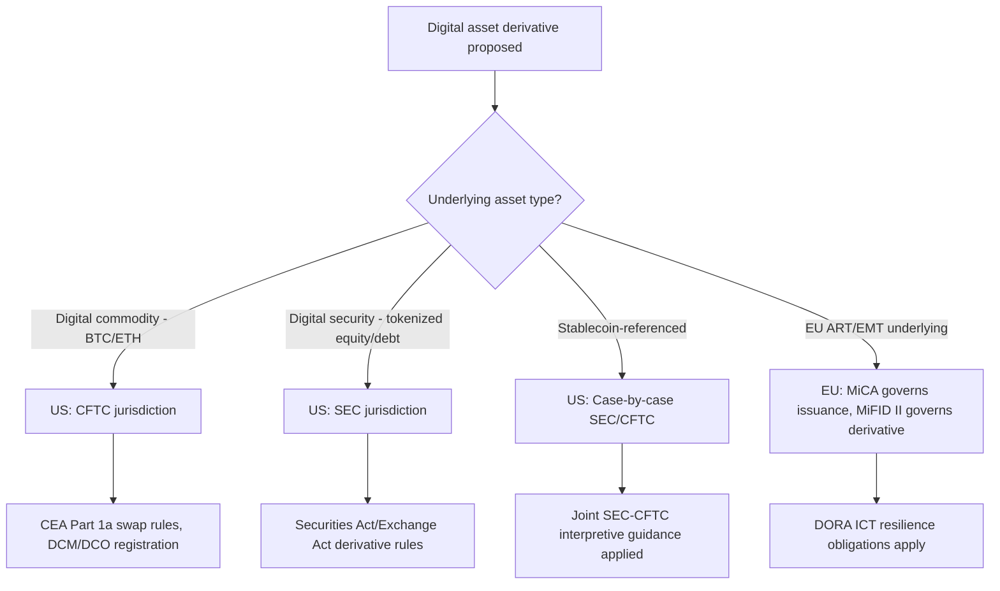

## Regulatory Frameworks for Digital Asset Derivatives

### Overview

Digital asset derivatives — futures, options, swaps, and structured products referencing cryptocurrencies, tokenized securities, or other on-chain assets — sit at the intersection of traditional derivatives law and emerging crypto-specific regulation. No single global regime governs them; instead, a patchwork of jurisdictional frameworks classify the underlying asset, determine which regulator has jurisdiction, and impose product-specific rules (margin, clearing, reporting, custody) largely by analogy to existing derivatives law. As of 2026, U.S. and EU frameworks anchor most institutional practice, with significant convergence activity underway between regulators.

### Core Regulatory Question: Asset Classification

Nearly every regulatory question for a digital asset derivative traces back to a threshold classification question: **is the underlying a security, a commodity, or something else?** This determines which regulator has primary jurisdiction and which statutory regime (securities law vs. commodities law) applies to the derivative itself.

#### United States: The CFTC/SEC Divide

The U.S. approach is bifurcated between the CFTC (commodities/derivatives) and the SEC (securities), historically producing significant jurisdictional ambiguity. This began to resolve meaningfully in 2026:

- **March 17, 2026**: The SEC and CFTC jointly issued interpretive guidance on how federal securities laws apply to crypto assets and transactions, establishing a five-part taxonomy: digital commodities (e.g., Bitcoin, Ether), digital collectibles (e.g., CryptoPunks), digital tools (e.g., ENS domain names), stablecoins, and digital securities. [Back to USA Rankings +2](https://chambers.com/content/item/7324)
- **Jurisdictional allocation** under this taxonomy: digital securities fall under SEC oversight; digital commodities, digital collectibles, and digital tools fall under CFTC oversight; stablecoins are assessed case-by-case depending on structure and use. [contentworks](https://contentworks.agency/?p=15191)
- **January 30, 2026**: The SEC and CFTC announced the joint "Project Crypto" initiative, signaling a coordinated regulatory push for digital asset markets, building on an earlier MoU covering harmonization, joint rulemaking on shared definitions, reduced friction for dually-registered entities, and a "fit-for-purpose" framework for digital assets. [jdsupra](https://jdsupra.com/topics/cryptoassets/derivatives/)[contentworks](https://contentworks.agency/?p=15191)
- **CFTC Innovation Task Force**: Announced March 24, 2026 by Chairman Michael Selig, intended to establish clear rules for innovative products and technologies in U.S. derivatives markets, working alongside the CFTC's Innovation Advisory Committee. [fia](https://www.fia.org/sites/default/files/2026-04/Isaac%20Where%20You%20Trade%20Your%20Digital%20Assets.pdf)[jdsupra](https://jdsupra.com/topics/blockchain/rulemaking-process/regulatory-reform/)
- **Digital Assets Pilot Program**: Launched December 8, 2025 by CFTC staff, providing greater regulatory certainty around digital asset collateral use. [jdsupra](https://jdsupra.com/topics/cryptoassets/derivatives/)
- **Spot crypto on regulated futures exchanges**: In December 2025, the CFTC announced listed spot cryptocurrency products would begin trading on CFTC-registered futures exchanges, with Bitnomial launching a leveraged retail spot crypto exchange under CFTC oversight — a structural shift blurring the traditional spot/derivatives regulatory line. [chambers](https://chambers.com/content/item/7324)
- **Cross-agency reporting infrastructure**: an FCM relying on relevant no-action relief must report weekly the total digital assets held in customer accounts, identifying each asset type separately. [chambers](https://chambers.com/content/item/7324)

[Inference] This bifurcated-but-harmonizing structure means a single derivatives desk trading both a Bitcoin future (CFTC) and a tokenized-equity swap (SEC-adjacent) may face two overlapping compliance regimes until the SEC/CFTC joint rulemaking on definitions and cross-agency oversight is finalized.

#### European Union: MiCA and the Derivatives Carve-Out

The EU's core crypto framework, **MiCA (Regulation (EU) 2023/1114)**, governs crypto-asset issuance and crypto-asset service providers (CASPs) but is notably **not** a derivatives-specific regime:

- MiCA applied from 30 June 2024 for asset-referenced tokens (ARTs) and e-money tokens (EMTs), and from 30 December 2024 for all other matters, including CASP authorization. [natlawreview](https://natlawreview.com/node/274230/printable/print)
- MiCA itself regulates spot crypto-asset issuance and services; **derivatives referencing crypto-assets** (futures, options, CFDs on crypto) fall instead under **MiFID II** as financial instruments, since a derivative contract is itself a MiFID financial instrument regardless of its underlying. [Inference — this follows from MiFID II's existing instrument taxonomy rather than an explicit MiCA carve-out clause]
- The European Commission launched a review of the EU's cryptoasset regime in 2026 to assess whether it remains fit for purpose, which may extend more explicit derivatives-specific provisions. [linklaters](https://techinsights.linklaters.com/tag/mica)
- **DORA (Digital Operational Resilience Act, Regulation (EU) 2022/2554)**: applies as of January 2025, layering ICT risk-management obligations — incident reporting, resilience testing, third-party ICT oversight — onto all financial entities including MiCA-licensed CASPs. For a derivatives desk running DLT-based settlement infrastructure, DORA's third-party ICT provider oversight extends directly to blockchain infrastructure providers and custody technology vendors. [unit21](https://www.unit21.ai/blog/mica-regulation-2026-faqs-what-crypto-compliance-teams-need-to-know)
- The EU's DLT Pilot Regime (part of the same 2020 Digital Finance Package as MiCA and DORA) separately permits market infrastructures to trade and settle DLT-based financial instruments, including certain derivatives, under temporary exemptions from standard MiFID/CSDR requirements — a regulatory sandbox model relevant to tokenized derivatives settlement.

### Comparative Framework Table

| Dimension | United States | European Union |
| --- | --- | --- |
| Core statute(s) | Commodity Exchange Act (CEA), Securities Act/Exchange Act | MiCA, MiFID II, DORA |
| Primary regulator(s) | CFTC (commodities/derivatives), SEC (securities) | ESMA + National Competent Authorities |
| Asset classification method | 5-part taxonomy (2026 joint interpretation) | MiCA categories (ART, EMT, other crypto-assets) + MiFID instrument tests |
| Derivatives-specific rules | CEA Part 1a swap definitions, DCM/SEF/DCO registration | MiFID II derivatives rules apply; MiCA governs the underlying |
| Cybersecurity/operational resilience | Sector-specific (varies by SRO) | DORA (harmonized, cross-sector) |
| 2026 direction of travel | Convergence via joint SEC/CFTC rulemaking, "Project Crypto" | MiCA fitness review; possible derivatives-specific extension |

### Other Major Jurisdictions (Summary)

- **United Kingdom**: FCA regulates crypto-asset derivatives under existing financial promotion and market abuse rules; retail marketing of crypto derivatives has been restricted since 2021, with institutional-only access being the norm.
- **Singapore**: MAS treats crypto derivatives under the Securities and Futures Act (SFA); licensed exchanges may list them subject to risk-based capital and disclosure requirements.
- **Hong Kong**: SFC permits crypto derivatives trading only for professional investors on licensed platforms, with retail access tightly gated.
- **Japan**: FSA regulates crypto derivatives under the Financial Instruments and Exchange Act (FIEA), applying leverage caps and requiring exchange registration.

[Unverified — jurisdiction-specific detail levels above are generalized; specific rule numbers and thresholds should be confirmed against current regulator publications, as these frameworks are subject to frequent amendment]

### Core Compliance Obligations Common Across Frameworks

Regardless of jurisdiction, a digital asset derivatives desk typically must address:

1. **Product registration/authorization** — listing the derivative on a licensed venue (DCM, MTF, licensed exchange)
2. **Counterparty classification** — retail vs. professional/institutional access restrictions
3. **Margin and clearing** — whether the product is subject to mandatory clearing through a licensed CCP/DCO, and initial/variation margin rules for uncleared positions
4. **Custody of underlying/collateral** — especially where collateral is itself a tokenized asset (see: Distributed Ledger and Atomic Settlement)
5. **Trade reporting** — swap data repositories (U.S.) or trade repositories (EU EMIR) for OTC digital asset derivatives
6. **Market abuse and manipulation surveillance** — extended to crypto reference-price manipulation (e.g., oracle manipulation risk)
7. **Operational resilience / ICT risk** — increasingly formalized (DORA in the EU; less codified but supervisorially expected in the U.S.)

### Illustration — Jurisdictional Classification Flow

### Worked Example

A U.S.-based dealer wants to launch a cash-settled futures contract referencing a tokenized real estate fund (a digital security under the 2026 taxonomy).

1. **Classification**: the tokenized fund interest is a "digital security" → SEC jurisdiction for the underlying instrument
2. **Derivative wrapper**: the futures *contract itself* may separately trigger CFTC jurisdiction under CEA definitions of a "future," creating dual-agency interest
3. **Resolution path**: under the 2026 joint interpretation and ongoing "Project Crypto" harmonization, the dealer would seek guidance on which agency's registration regime (DCM listing under CFTC vs. security-based swap execution facility under SEC) governs, and may need dual compliance until formal joint rulemaking resolves the overlap
4. **Reporting**: trade data reported to the appropriate swap/security-based swap data repository depending on final classification

**Key Points**

- Classification of the *underlying* asset is the primary determinant of jurisdiction in the U.S.; the *derivative wrapper* can independently trigger a second regulator's interest
- The EU treats the crypto-asset regime (MiCA) and the derivatives regime (MiFID II) as separate but interlocking layers, rather than a single unified crypto-derivatives statute
- 2026 has been marked by active harmonization efforts (SEC/CFTC Project Crypto, joint interpretive guidance, MiCA fitness review) rather than settled final rules — practitioners should treat this area as actively evolving
- DORA-style operational resilience requirements are increasingly relevant to derivatives desks specifically because of DLT/blockchain infrastructure dependencies (see: Distributed Ledger and Atomic Settlement)

**Next Steps**

- SEC/CFTC "Project Crypto" — detailed rulemaking timeline and expected final definitions
- MiFID II Derivatives Classification for Crypto-Referencing Instruments
- EU DLT Pilot Regime — sandbox mechanics for tokenized derivatives settlement
- Cross-Border Conflict-of-Laws Issues in Multi-Jurisdiction Digital Asset Derivatives
- Margin and Clearing Requirements for Uncleared Crypto Derivatives
- Market Abuse Surveillance for Oracle-Referenced Derivative Payoffs
- Comparative Study: FCA, MAS, SFC, and FSA Crypto Derivatives Regimes