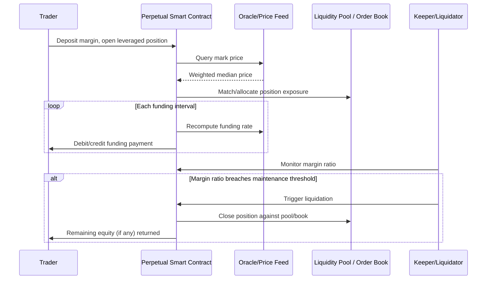

## Decentralized Finance Derivatives Protocols

### Overview

Decentralized finance (DeFi) derivatives protocols implement futures, perpetual swaps, and options as self-executing smart contracts rather than centrally-cleared instruments. Positions, margin, funding payments, and liquidations are all managed on-chain (or via hybrid off-chain/on-chain architectures), removing the traditional CCP/broker intermediary layer. By mid-2026, on-chain perpetual futures volume alone had grown to a multi-trillion-dollar cumulative scale, with the ratio of decentralized-to-centralized perpetual futures volume rising from roughly 3% to 10% during 2025.

### Core Architectural Models

DeFi derivatives protocols generally implement one of four execution/liquidity models:

#### 1. Order Book Models (On-Chain or Hybrid CLOB)

A central limit order book (CLOB) matches maker and taker orders, either fully on-chain or off-chain with on-chain settlement.

- **Hyperliquid**: runs its own Layer 1 blockchain with a fully on-chain central limit order book; matching speed is reported in the millisecond range, giving a trading experience close to a centralized exchange while keeping settlement on-chain. By mid-2026, Hyperliquid captured approximately 70% of on-chain perpetual futures volume, with over $180 billion in monthly trading volume and open interest exceeding $7 billion.
- **dYdX**: migrated from Ethereum to its own Cosmos-based application-specific blockchain (dYdX Chain) in late 2023, enabling zero gas fees for trading; validators execute order matching as part of consensus. Version 5.0 (January 2025) introduced isolated markets and isolated margin.

#### 2. Liquidity Pool / Peer-to-Pool Models

Traders take leveraged positions against a shared liquidity pool rather than against another trader's order — the pool itself is the counterparty.

- **GMX**: a decentralized spot and perpetual exchange (Arbitrum/Avalanche) supporting low swap fees and zero price-impact trades, offering up to 30x leverage directly from a self-custodial wallet, with liquidity providers earning yield by underwriting trader PnL.

#### 3. Hybrid / Dynamic AMM Models

Combine order-book-like price discovery with automated market maker liquidity provisioning to reduce slippage for large trades.

- **Vertex** (Arbitrum): hybrid matching engine combining an order book with AMM-sourced liquidity, emphasizing high capital efficiency.
- **Drift** (Solana): uses a dynamic AMM model integrated with Solana's high-throughput execution environment.

#### 4. Options-Specific Architectures

Options require additional infrastructure for strike/expiry management, implied volatility pricing, and portfolio-level margining across multi-leg positions.

- **Derive** (formerly Lyra): the most established on-chain options protocol, originally launched in 2021 on Optimism and migrated to its own OP Stack rollup ("Derive Chain") in August 2024 for dedicated throughput. Combines an order book/AMM hybrid with **Portfolio Margin** — recognizing risk-reducing hedged positions (spreads, covered calls, delta-neutral strategies) to reduce collateral requirements below what 100%-collateralized models require. Supports multi-asset collateral (USDC, ETH, wBTC, stETH) and unifies options, perpetuals, spot, and structured products under a single on-chain risk engine.

### Comparison Table

| Protocol | Chain | Model | Governance Token | Distinguishing Feature |
| --- | --- | --- | --- | --- |
| Hyperliquid | Own L1 | Fully on-chain CLOB | HYPE | Millisecond matching, ~70% market share by mid-2026 |
| dYdX v5 | Cosmos appchain | Off-chain order book, on-chain settlement | DYDX | Zero gas fees, isolated margin (v5.0) |
| GMX v2 | Arbitrum/Avalanche | Liquidity pool (peer-to-pool) | GMX | Zero price-impact trades, stable LP yields |
| Vertex | Arbitrum | Hybrid order book + AMM | VRTX | High capital efficiency |
| Drift | Solana | Dynamic AMM | DRIFT | Solana ecosystem integration, low latency |
| Derive | Derive Chain (OP Stack) | Order book + AMM hybrid | — | Portfolio margin, multi-asset collateral, options+perps+structured products |

### Key Mechanisms

#### Perpetual Swap Funding Rate

Since perpetuals have no expiry, price convergence with the spot market is maintained via a **funding rate** — a periodic payment between long and short position holders:

$$\text{Funding Rate} = \text{Premium Index} + \text{clamp}(\text{Interest Rate} - \text{Premium Index}, -0.05\%, 0.05\%)$$

When the perpetual trades above spot (positive premium), longs pay shorts, incentivizing convergence; when below spot, shorts pay longs. Hyperliquid's oracle system, for example, computes reference prices as a weighted median across Binance, OKX, Bybit, Kraken, and other major centralized venues to anchor its funding calculation and mark price against manipulation of any single venue.

#### On-Chain Liquidation Engine

Positions are automatically closed by keeper bots or protocol-native liquidators when margin falls below a maintenance threshold:

$$\text{Margin Ratio} = \frac{\text{Position Equity}}{\text{Position Notional}}$$

If Margin Ratio falls below the maintenance margin requirement, a liquidation transaction is triggered on-chain, closing the position against pool liquidity or the order book and often applying a liquidation penalty distributed to the liquidator/insurance fund.

#### Insurance Fund / Backstop

Most protocols maintain an on-chain insurance fund to absorb losses when a liquidation cannot be executed at a price sufficient to cover the position's negative equity (e.g., during extreme volatility/gapping), preventing socialized losses from immediately hitting the LP pool.

### Illustration — DeFi Perpetual Trade Lifecycle

### Worked Example — Portfolio Margin on an Options Protocol

A trader on an options protocol like Derive holds:

- Long 10 ETH call options (strike $3,000)
- Short 10 ETH call options (strike $3,500) — forming a bull call spread

Under naive 100%-collateralization, each leg would require independent margin. Under portfolio margining, the risk engine recognizes the position's bounded maximum loss (the spread width times position size) and requires collateral only sufficient to cover that bounded risk — materially reducing capital lockup versus collateralizing each leg independently.

**Key Points**

- DeFi derivatives protocols replace CCP-based clearing with on-chain smart contract logic for margin, funding, and liquidation
- Order-book models (Hyperliquid, dYdX) prioritize price discovery and CEX-like execution; pool-based models (GMX) prioritize simplicity and LP-sourced liquidity; hybrid models (Vertex, Drift) attempt to balance both
- Options-specific protocols (Derive) require materially more sophisticated on-chain risk engines to support portfolio margining and multi-leg strategies
- Oracle design is foundational risk infrastructure: funding rates, mark prices, and liquidations all depend on oracle integrity — see Distributed Ledger and Atomic Settlement for related oracle-manipulation risk
- [Inference] The continued growth of the decentralized/centralized volume ratio suggests institutional and professional trader migration toward self-custodial derivatives venues, though this trend's persistence depends on regulatory developments (see Regulatory Frameworks for Digital Asset Derivatives)

**Next Steps**

- Perpetual Swap Funding Rate Mechanics and Convergence Arbitrage
- On-Chain Oracle Design (Chainlink, Pyth) and Manipulation Resistance
- Portfolio Margining Algorithms for Multi-Leg Options Positions
- Liquidation Engine Design and Insurance Fund Sizing
- Application-Specific Blockchains (Appchains) for Derivatives Infrastructure
- MEV (Maximal Extractable Value) Risk in On-Chain Derivatives Execution
- Structured Products Built on DeFi Derivatives Primitives (e.g., covered call vaults, principal-protected notes)