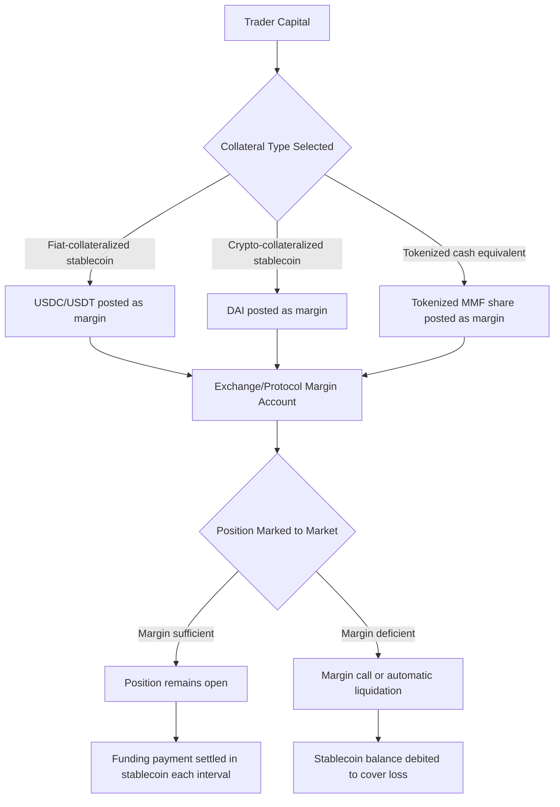

## Stablecoins and Their Role in Derivatives Markets

### Overview

Stablecoins — digital assets designed to maintain a stable value relative to a reference asset, typically the US dollar — serve as the primary settlement currency, collateral instrument, and margin asset across both centralized and decentralized derivatives markets. Their role is structurally analogous to cash or short-term government securities in traditional derivatives markets: they are the "risk-free" leg against which derivative payoffs are measured and settled. Their design (collateralization model, redemption mechanism, and issuer risk) directly determines their suitability as margin collateral.

### Stablecoin Design Taxonomy

#### Fiat-Collateralized (Off-Chain Reserve-Backed)

Each token is backed 1:1 (or near 1:1) by fiat currency or fiat-equivalent reserves (cash, short-dated Treasury bills) held by a centralized issuer.

- **Examples**: USDT (Tether), USDC (Circle)
- **Mechanism**: issuer mints tokens against deposited fiat, redeems tokens for fiat on demand (subject to issuer terms)
- **Trust model**: relies on issuer solvency, reserve attestation/audit quality, and redemption reliability
- **Derivatives relevance**: dominant collateral type on both centralized exchanges (CEXs) and DeFi perpetual/options protocols due to deep liquidity and low volatility

#### Crypto-Collateralized (On-Chain, Overcollateralized)

Backed by a basket of volatile crypto assets locked in a smart contract, over-collateralized to absorb price swings in the collateral itself.

- **Example**: DAI (MakerDAO/Sky)
- **Mechanism**: users lock crypto collateral (e.g., ETH) into a vault, mint DAI against it at a collateralization ratio typically well above 100%; if collateral value falls below a liquidation threshold, the position is automatically liquidated
- **Trust model**: relies on smart contract security, oracle price feed integrity, and sufficient collateralization buffers
- **Derivatives relevance**: used as collateral in DeFi derivatives protocols where full permissionlessness (no reliance on a centralized issuer) is prioritized over capital efficiency

#### Algorithmic / Under-Collateralized

Maintain peg via algorithmic supply expansion/contraction rather than direct collateral backing.

- **Historical example**: TerraUSD (UST) — collapsed in May 2022 when its algorithmic peg mechanism failed under stress, a widely-cited case study in stablecoin design risk
- **Derivatives relevance**: [Inference] largely avoided as derivatives margin collateral by institutional participants post-UST collapse, due to demonstrated peg-failure risk under market stress

#### Yield-Bearing / Tokenized Cash Equivalents

A related but distinct category: tokenized money market fund shares or tokenized Treasury products that pass through underlying yield to holders, increasingly used as **margin collateral** (rather than as a settlement currency) in institutional derivatives contexts.

- **Derivatives relevance**: allows a derivatives desk to post collateral that earns yield while satisfying margin requirements, rather than holding idle non-yield-bearing stablecoin balances — directly relevant to collateral optimization strategies (see Distributed Ledger and Atomic Settlement)

### Core Functions in Derivatives Markets

#### 1. Margin and Collateral Asset

On both centralized crypto derivatives exchanges and DeFi perpetual/options protocols, stablecoins are the default unit for posting initial margin and variation margin:

$$\text{Maintenance Margin} = \text{Position Notional} \times \text{Maintenance Margin Rate}$$

A trader's margin balance (typically USDT or USDC) is marked-to-market continuously; a shortfall relative to the maintenance margin threshold triggers a margin call or automatic liquidation.

#### 2. Settlement Currency for Cash-Settled Derivatives

Most crypto perpetual futures and many options contracts are **cash-settled** rather than physically-settled — at expiry or upon closing a position, PnL is paid in stablecoins rather than delivery of the underlying asset. This avoids the operational complexity of physical delivery of the reference crypto asset while preserving price exposure.

#### 3. Funding Rate Payment Medium

In perpetual swap markets, the periodic funding payment exchanged between long and short holders (see: Decentralized Finance Derivatives Protocols) is denominated and paid in the platform's base stablecoin.

#### 4. Basis and Arbitrage Trade Vehicle

The spread between a stablecoin-margined perpetual/futures price and spot price (the "basis") is a widely-traded strategy:

$$\text{Basis} = \text{Futures Price} - \text{Spot Price}$$

Cash-and-carry arbitrage strategies borrow or hold stablecoins to fund the cash leg of simultaneously longing spot and shorting the perpetual (or vice versa), capturing the funding rate or basis convergence as a source of yield.

#### 5. Bridge Between DeFi and TradFi Derivatives Infrastructure

Stablecoins function as the interoperable settlement layer connecting on-chain DeFi derivatives with traditional finance rails, particularly where a derivatives desk needs to move collateral value between a DeFi protocol and a traditional prime brokerage or bank account without a full fiat off-ramp round-trip for each transaction.

### Illustration — Stablecoin's Position in the Derivatives Collateral Stack

### Worked Example — Cash-and-Carry Basis Trade

A trader observes:

- BTC spot price: $60,000
- BTC quarterly futures price: $61,200 (contango, futures trading above spot)

1. Trader deposits $60,000 in USDC as collateral
2. Trader buys 1 BTC spot ($60,000) and simultaneously sells 1 BTC quarterly futures contract ($61,200)
3. At futures expiry, futures price converges to spot price by construction (cash-settled against spot index)
4. Trader delivers/settles the short futures position, realizing the $1,200 basis as profit, while the long spot BTC position is unwound
5. Net effect: a stablecoin-denominated, delta-neutral yield of $1,200 on $60,000 collateral, independent of BTC's price direction over the holding period

[Inference] The annualized attractiveness of this trade depends on the basis size relative to available stablecoin lending/borrowing rates elsewhere in the market — during periods of high perpetual funding rates, basis trades can meaningfully outperform stablecoin money-market yields, though this spread compresses as more capital arbitrages it away.

### Risk Considerations Specific to Derivatives Use

- **Depeg risk**: if the margin stablecoin loses its peg (temporarily or permanently), mark-to-market valuations of all positions collateralized in that stablecoin become distorted, potentially triggering cascading, economically-incorrect liquidations
- **Issuer/counterparty risk**: fiat-collateralized stablecoins carry issuer solvency and reserve-quality risk; a derivatives desk concentrating margin in a single stablecoin issuer bears concentrated counterparty exposure to that issuer
- **Redemption/liquidity risk**: during stress events, redemption queues or exchange-level withdrawal freezes can prevent timely conversion of stablecoin margin back to fiat, even if the peg itself holds
- **Regulatory classification risk**: under frameworks such as the 2026 U.S. five-part digital asset taxonomy, stablecoins are assessed case-by-case for securities/commodities classification (see: Regulatory Frameworks for Digital Asset Derivatives), which can affect which entities may legally offer stablecoin-margined derivatives to which counterparty types
- **Smart contract risk (crypto-collateralized stablecoins)**: oracle failures or smart contract exploits in the underlying collateral vault mechanism can impair the stablecoin's backing independent of market price action

**Key Points**

- Stablecoins function in crypto derivatives markets analogously to cash/T-bills in traditional derivatives markets: the reference-stable leg for margin, settlement, and funding payments
- Design category (fiat-collateralized vs. crypto-collateralized vs. algorithmic) determines the risk profile a derivatives desk inherits by using that stablecoin as collateral
- Basis and funding-rate arbitrage strategies are structurally dependent on stablecoins as the stable numeraire that isolates the trade's yield component from underlying asset price risk
- Depeg events propagate directly into derivatives markets as valuation and liquidation risk, distinct from the underlying asset's own price risk

**Next Steps**

- MakerDAO/Sky DAI Vault Mechanics and Liquidation Engine
- Stablecoin Reserve Attestation and Audit Standards
- Cash-and-Carry and Basis Trading Strategy Construction
- TerraUSD (UST) Collapse — Case Study in Algorithmic Stablecoin Failure
- Tokenized Money Market Funds as Derivatives Margin Collateral
- Cross-Margining Between Stablecoin-Denominated and Fiat-Denominated Derivatives Books
- Stablecoin Regulatory Treatment Under MiCA (E-Money Tokens) vs. US Frameworks