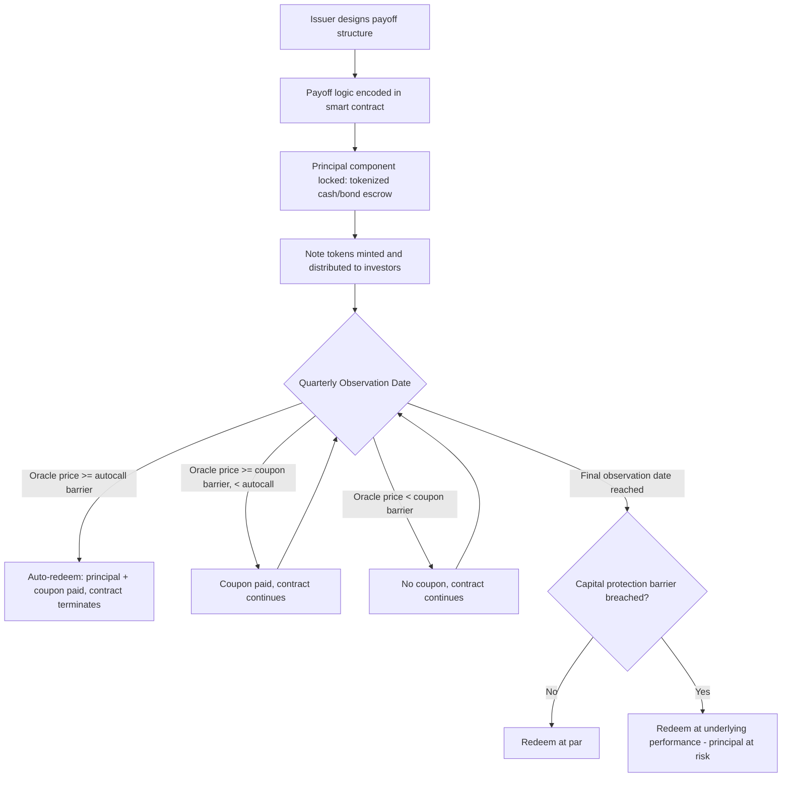

## Tokenized Structured Products


### Overview

Tokenized structured products represent traditional structured product economics — principal-protected notes, autocallables, reverse convertibles, and other payoff-engineered instruments combining a bond/deposit component with derivative overlays — as digital tokens on a distributed ledger. The payoff logic, ownership record, and often the settlement mechanism itself move from legal-document-plus-custodian-recordkeeping to smart-contract-plus-on-chain-token, while the underlying financial engineering (option replication, payoff structuring) remains unchanged from traditional structured products practice.

### Core Concept: What "Tokenization" Adds

Tokenizing a structured product does not change its payoff economics — a tokenized autocallable note has the same barrier/coupon/knock-in logic as its traditional counterpart. What changes is the operational and distributional layer:

| Dimension | Traditional Structured Product | Tokenized Structured Product |
| --- | --- | --- |
| Ownership record | Custodian/registrar ledger | On-chain token balance |
| Transfer mechanism | Settlement instruction (T+1/T+2) | On-chain transfer (near-instant) |
| Minimum investment size | Often high (institutional tranches) | Potentially fractionalized to small denominations |
| Secondary market | OTC, dealer-quoted, illiquid | Potentially DEX/AMM-tradable, though often still illiquid in practice |
| Payoff calculation | Calculation agent, manual/semi-manual | Smart contract, oracle-fed, automatic |
| Coupon/observation settlement | Manual booking per observation date | Smart contract auto-executes against oracle price feed |
| Collateral for issuer obligation | Segregated account, trust structure | Potentially on-chain escrow/vault |

### Structural Components

A tokenized structured product typically decomposes into the same building blocks as its traditional analogue, each now represented in code:

#### 1. The Fixed-Income / Principal Component

The capital-protection or fixed-coupon leg, economically equivalent to a zero-coupon bond or deposit. On-chain, this is often represented by locking tokenized cash or a tokenized bond/T-bill instrument in an escrow smart contract for the product's term.

#### 2. The Derivative Overlay

The option or option-strategy component generating the enhanced yield or leveraged/conditional payoff (e.g., a short put generating the reverse convertible's enhanced coupon, or a series of down-and-in barrier options in an autocallable). This can be:

- **Synthetically replicated on-chain**: the smart contract itself encodes the payoff formula and settles based on an oracle price feed at each observation date, without an actual separate options contract existing
- **Actually executed via a DeFi derivatives protocol**: the issuing smart contract holds a real position in a DeFi options/perpetuals protocol (see: Decentralized Finance Derivatives Protocols) to hedge or generate the payoff

#### 3. The Oracle Layer

Since the payoff depends on the underlying's price at defined observation dates (autocall dates, barrier monitoring, final valuation), a tokenized structured product is fundamentally dependent on a reliable price oracle — this is the single most consequential smart-contract-specific risk relative to a traditional structured product, where a calculation agent (a regulated, legally-accountable entity) performs this function.

#### 4. The Token/Ownership Layer

An ERC-20 (fungible, fractionalizable) or ERC-1155/similar (semi-fungible, tranche-differentiated) token representing beneficial ownership of the note's economics, transferable on-chain subject to any embedded compliance restrictions (e.g., transfer-restricted tokens requiring KYC'd wallet whitelisting for regulated securities).

### Worked Example — Tokenized Autocallable Note

**Structure**: 1-year tokenized autocallable note on Underlying $S$, autocall barrier at 100% of initial level, coupon barrier at 70%, capital protection barrier at 60% (European), quarterly observation.

**Smart contract logic (simplified pseudocode)**:



```
function checkObservation(uint observationDate) external {
    uint currentPrice = oracle.getPrice(underlyingAsset, observationDate);
    uint initialPrice = initialFixingPrice;

    if (currentPrice >= initialPrice) {
        // Autocall triggered: redeem early at par + coupon
        redeemNoteHolders(parValue + accruedCoupon);
        terminateContract();
    } else if (currentPrice >= (initialPrice * couponBarrierPct / 100)) {
        // Coupon barrier met but no autocall: pay coupon, continue
        payCouponToHolders(couponAmount);
    }
    // else: no coupon this period, continue to next observation
}

function finalRedemption() external {
    uint finalPrice = oracle.getPrice(underlyingAsset, maturityDate);
    if (finalPrice >= (initialFixingPrice * capitalProtectionBarrierPct / 100)) {
        redeemNoteHolders(parValue);
    } else {
        // Capital protection barrier breached: physical or cash delivery of underlying performance
        redeemNoteHolders(parValue * finalPrice / initialFixingPrice);
    }
}
```

At each quarterly observation, the contract autonomously checks the oracle-fed price against the encoded barriers and executes the corresponding payoff branch — no calculation agent manually determines and books the outcome.

### Illustration — Tokenized Structured Product Lifecycle



### Benefits Relative to Traditional Structured Products

- **Fractionalization**: token denomination can be far smaller than traditional structured note minimums, potentially widening the investor base
- **Settlement speed**: coupon and redemption payments execute automatically at the smart contract level rather than requiring calculation agent sign-off and custodian settlement instructions
- **Transparency**: the payoff formula and current barrier status are inspectable on-chain by any holder, rather than relying solely on issuer-provided term sheets and periodic statements
- **Composability**: a tokenized note can itself be used as collateral in a separate DeFi lending or derivatives protocol (subject to the receiving protocol's risk parameters), a form of capital efficiency largely unavailable to traditional structured products outside repo markets
- **Atomic settlement of primary issuance**: subscription proceeds and token issuance can settle atomically (see: Distributed Ledger and Atomic Settlement), reducing settlement-date operational risk

### Risks and Limitations

- **Oracle risk is the dominant new risk factor**: unlike a traditional structured product's calculation agent (a regulated, legally accountable party with dispute resolution mechanisms), an on-chain oracle's manipulation or failure can trigger an incorrect, code-executed, and potentially irreversible payoff determination
- **Smart contract risk**: bugs in the payoff logic itself (incorrect barrier comparison logic, integer overflow/rounding errors in payoff calculations) can produce economically wrong outcomes that traditional legal remediation processes are not designed to unwind cleanly
- **Legal wrapper ambiguity**: [Unverified — varies by jurisdiction] the legal enforceability of a purely on-chain payoff determination as satisfying the terms of an underlying legal note instrument is not uniformly settled; many issuers maintain a traditional legal wrapper (e.g., a note deed) alongside the token, with the token as a secondary record rather than sole legal title
- **Liquidity remains structurally limited**: tokenization does not by itself create secondary market depth — a tokenized autocallable is still a bespoke, path-dependent payoff that is inherently hard to price and trade compared to vanilla instruments, regardless of settlement rail
- **Regulatory classification**: under frameworks like the 2026 U.S. digital asset taxonomy, a tokenized structured note is very likely to be classified as a "digital security," subjecting it to full securities regulation (see: Regulatory Frameworks for Digital Asset Derivatives) — tokenization does not exempt the instrument from the disclosure, suitability, and registration obligations that would apply to its traditional equivalent

**Key Points**

- Tokenization changes the ownership, transfer, and settlement infrastructure of a structured product; it does not change the underlying payoff engineering
- The smart contract's oracle dependency is the key new risk surface relative to a traditional calculation-agent model
- Fractionalization and composability (using the token as collateral elsewhere) are the most distinctive new capabilities tokenization introduces
- Legal enforceability and regulatory classification remain live, jurisdiction-dependent questions rather than settled infrastructure

**Next Steps**

- Smart Contract Design Patterns for Barrier and Autocall Payoff Logic
- Oracle Selection and Manipulation-Resistance for Structured Product Settlement
- Legal Wrapper Design: On-Chain Token vs. Underlying Note Deed
- Composability Risk: Tokenized Notes as Collateral in Secondary DeFi Protocols
- Calculation Agent Liability vs. Smart Contract Immutability — Dispute Resolution Models
- Fractionalized Structured Product Distribution and Retail Suitability Considerations
- Comparative Study: Tokenized Structured Notes Under EU MiCA/MiFID II vs. US Digital Securities Framework