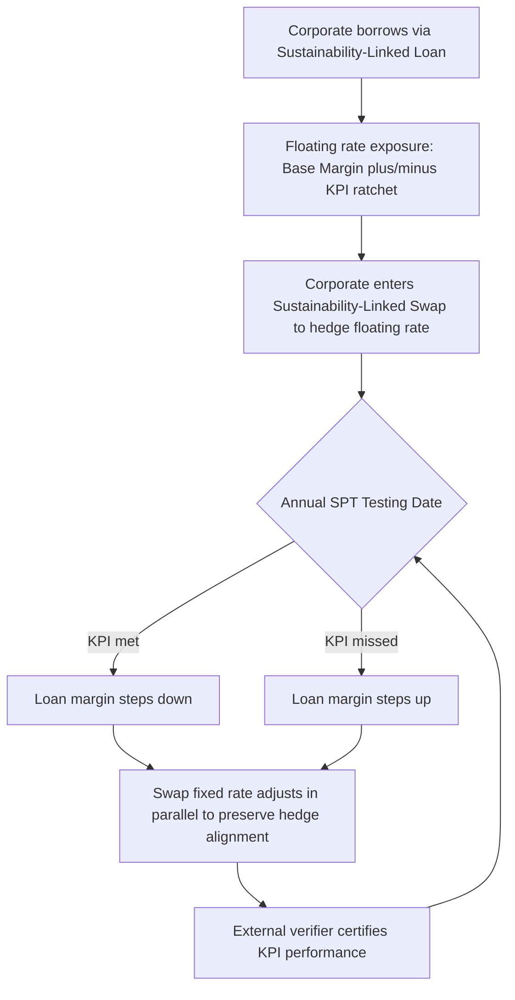

## Sustainability Linked Swaps and Loans

### Overview

Sustainability-linked instruments embed pre-agreed environmental, social, or governance (ESG) performance targets directly into the pricing mechanics of a financing or hedging instrument, rather than restricting the use of proceeds (as with green bonds/loans). A sustainability-linked swap (SLS) or sustainability-linked loan (SLL) adjusts the fixed rate, spread, or margin paid based on the borrower/counterparty's performance against defined Sustainability Performance Targets (SPTs). This structurally differs from "use-of-proceeds" ESG instruments: the capital can be used for general corporate purposes, and the ESG linkage operates purely through the pricing mechanism.

### Core Structural Components

#### 1. Key Performance Indicators (KPIs)

Quantifiable, externally verifiable metrics tied to the borrower's or counterparty's sustainability profile. Common categories:

- **Environmental**: greenhouse gas (GHG) emissions intensity or absolute reduction (Scope 1/2/3), renewable energy usage percentage, water consumption intensity
- **Social**: workforce diversity ratios, employee safety incident rates
- **Governance**: board diversity composition, ESG-linked executive compensation structures

#### 2. Sustainability Performance Targets (SPTs)

Specific, dated, and measurable thresholds against which the KPI is assessed at each testing date (commonly annual). SPTs should be **ambitious relative to a baseline/benchmark** (a "business as usual" trajectory, a sector benchmark, or a science-based target) per the Loan Market Association (LMA)/Loan Syndications and Trading Association (LSTA) Sustainability-Linked Loan Principles (SLLP) and the International Swaps and Derivatives Association's (ISDA) related guidance for the swap analogue.

#### 3. Margin/Rate Adjustment Mechanism

The pricing consequence of meeting or missing the SPT:

$$\text{Applicable Margin} = \text{Base Margin} \pm \Delta_{\text{SPT}}$$

Typically structured as a **margin ratchet**: a step-up (higher spread/rate) if the SPT is missed, and/or a step-down (lower spread/rate) if the SPT is met, applied from the testing date until the next testing date.

#### 4. External Verification

An independent third party (an ESG rating agency, an auditor, or a specialized verifier) confirms KPI performance against the SPT at each testing date, since self-reported compliance would undermine the credibility of the instrument (a central concern in "greenwashing" criticism of the sustainability-linked product category).

### Sustainability-Linked Loans (SLLs)

An SLL is a term loan or revolving credit facility whose interest margin is contractually adjusted based on SPT performance.

**Typical mechanics**:

1. Borrower and lender agree on 1–4 KPIs and corresponding SPTs at origination, often referencing a specified year-over-year trajectory
2. At each annual testing date, an external verifier assesses actual KPI performance against that year's SPT
3. The margin for the following interest period is adjusted per the pre-agreed ratchet (e.g., ±5 to ±10 basis points per KPI, subject to a cap)
4. This repeats annually through the loan's tenor

**Worked example**: A revolving credit facility with base margin of 150 bps over the reference rate, with a single KPI (Scope 1+2 GHG emissions intensity):

| Testing Date | SPT (target intensity) | Actual Performance | Margin Adjustment | Resulting Margin |
| --- | --- | --- | --- | --- |
| Year 1 | ≤ 0.85 (baseline-indexed) | 0.83 (met) | −5 bps | 145 bps |
| Year 2 | ≤ 0.75 | 0.80 (missed) | +5 bps | 155 bps |
| Year 3 | ≤ 0.65 | 0.60 (met) | −5 bps | 150 bps |

### Sustainability-Linked Swaps (SLSs)

An SLS applies the same performance-linked pricing logic to a derivative overlay — most commonly an interest rate swap (IRS) hedging a sustainability-linked loan or bond, or a standalone swap where a corporate wishes to embed ESG-linked pricing into its hedging program.

**Two principal structural approaches** (per ISDA's published guidance on sustainability-linked derivatives):

1. **Structural alignment with an underlying SLL/SLB**: the swap's fixed rate or spread mirrors the margin ratchet of the loan or bond it hedges, so the hedge accounting relationship and the economic ESG-linkage remain consistent between the funding instrument and its hedge
2. **Standalone / voluntary structure**: a corporate enters an SLS independent of any underlying loan, where the swap's fixed rate step-up/step-down is tied to the corporate's own SPT performance, sometimes with the resulting margin differential contractually directed to a charitable or ESG-related cause (a "cash-flow-linked" variant) rather than purely retained/paid between counterparties

**Key mechanical difference from SLLs**: because a swap is a two-way derivative contract (not a one-directional loan), ISDA guidance emphasizes the need for clear documentation on which counterparty bears the KPI-linked adjustment, how it interacts with existing ISDA Master Agreement credit support/close-out mechanics, and how the adjustment is calculated as an addition to or deduction from the fixed rate at each reset/testing period.

### Illustration — Sustainability-Linked Loan and Swap Interaction

### Governing Frameworks and Principles

- **LMA/LSTA/APLMA Sustainability-Linked Loan Principles (SLLP)**: the primary voluntary framework for SLL structuring, covering KPI selection, SPT calibration, reporting, and verification
- **ISDA Sustainability-Linked Derivatives guidance**: provides standardized definitions and documentation approaches for embedding SPT-linked pricing adjustments into ISDA Master Agreement-governed derivatives, addressing how the adjustment interacts with standard swap confirmation templates
- **ICMA Sustainability-Linked Bond Principles (SLBP)**: the bond-market analogue, relevant where an SLS is structured to hedge a sustainability-linked bond rather than a loan

### Risks and Criticisms

- **Greenwashing risk**: if SPTs are calibrated to targets the borrower would likely achieve regardless of the instrument (insufficiently ambitious relative to a genuine "business as usual" trajectory), the instrument functions as a marketing/reputational device without genuine performance incentive — a frequently raised criticism in market commentary on the SLL/SLS product category [Inference — the severity of this risk is instrument-specific and depends on SPT calibration quality, which varies significantly across issuances]
- **Verification quality and consistency**: unlike financial covenants (which reference standardized accounting metrics), ESG KPI verification methodologies can vary between verifiers, creating potential inconsistency in how "compliance" is assessed across similar instruments
- **Materiality of the pricing adjustment**: where the margin ratchet is small relative to the base rate (e.g., a few basis points), the economic incentive to achieve the SPT may be immaterial relative to the reputational/disclosure value of having a sustainability-linked instrument outstanding
- **Basis and hedge accounting complexity in SLS structures**: aligning a swap's SPT-linked adjustment with an underlying SLL's ratchet requires careful drafting to avoid a mismatch that could jeopardize hedge effectiveness testing under applicable hedge accounting standards (e.g., IFRS 9 or ASC 815) [Unverified — hedge accounting treatment is jurisdiction/standard-specific and requires case-by-case accounting analysis]

**Key Points**

- Sustainability-linked instruments differ fundamentally from use-of-proceeds ESG instruments (green bonds/loans): capital use is unrestricted, and the ESG linkage operates entirely through pricing
- SLLs and SLSs share the same core mechanics (KPI, SPT, margin ratchet, external verification) but differ in documentation base (LMA/LSTA loan documentation vs. ISDA Master Agreement)
- A common real-world application pairs an SLL with an SLS, structuring the swap's fixed-rate adjustment to mirror the loan's margin ratchet to preserve consistent hedge economics
- SPT calibration quality is the central determinant of whether the instrument provides genuine performance incentive or functions primarily as ESG-labeled financing

**Next Steps**

- ISDA Sustainability-Linked Derivatives Standard Documentation — clause-level analysis
- KPI Selection and SPT Calibration Methodologies (Science-Based Targets initiative alignment)
- Hedge Accounting Treatment of Sustainability-Linked Swap Adjustments (IFRS 9 / ASC 815)
- Greenwashing Litigation and Regulatory Enforcement Trends in ESG-Labeled Instruments
- Comparative Study: Sustainability-Linked Loans vs. Green Loans vs. Sustainability-Linked Bonds
- External Verification Standards and Assurance Provider Selection for SPT Testing
- Carbon Credit-Linked Derivatives as an Adjacent ESG Derivatives Category