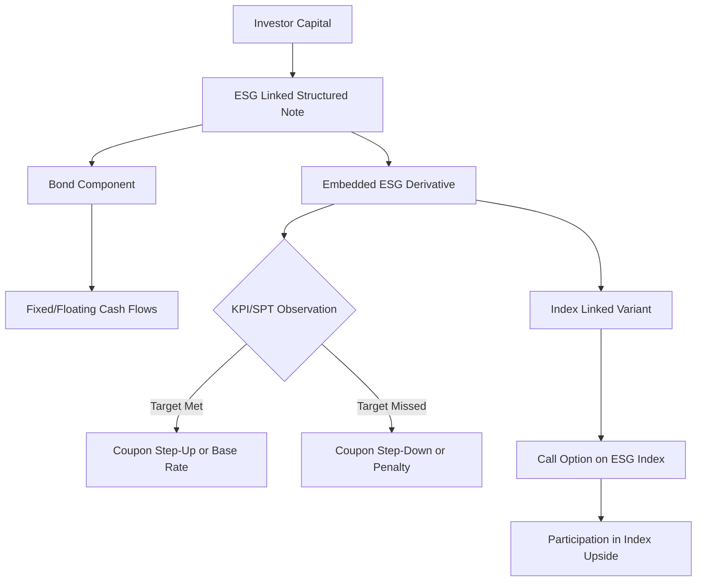

## ESG Linked Structured Notes

### Overview

ESG Linked Structured Notes are hybrid debt instruments combining a fixed income wrapper with payoff features contingent on Environmental, Social, and Governance (ESG) performance metrics. They merge structured product engineering (derivative-embedded notes) with sustainability-linked finance principles, differing fundamentally from Green Bonds in that proceeds are not necessarily ring-fenced for specific projects; instead, the coupon, redemption, or participation rate is conditioned on the achievement of predefined ESG Key Performance Indicators (KPIs) or the performance of an ESG-themed underlying.

### Core Structural Taxonomy

**Key Points**

- **Use-of-Proceeds Linked**: Capital raised is allocated to specific green/social projects, but payoff is fixed (not performance-linked). Structurally resembles a Green Bond wrapped with a derivative overlay.
- **KPI/SPT Linked (Sustainability-Linked)**: Coupon step-up/step-down or principal redemption varies based on issuer achieving Sustainability Performance Targets (SPTs), e.g., carbon intensity reduction by X% by year Y.
- **Index/Basket Linked**: Payoff tied to the performance of an ESG equity index (e.g., MSCI ESG Leaders, Euro iStoxx Climate Paris-Aligned) via embedded options, structured identically to conventional equity-linked notes but with ESG-screened underlyings.
- **Rating/Score Linked**: Redemption or coupon depends on a third-party ESG rating trajectory (e.g., Sustainalytics, MSCI ESG Ratings) of the issuer or reference entity.

### Payoff Mechanics

The most common architecture is the **Coupon Step-Up/Step-Down** structure layered onto a standard fixed-rate or floating-rate note (FRN):

$$C_t = C_{base} + \sum_{i=1}^{n} \mathbb{1}_{\{KPI_i \text{ met at } t\}} \cdot \Delta_i - \sum_{j=1}^{m} \mathbb{1}_{\{KPI_j \text{ missed at } t\}} \cdot \Delta_j$$

Where $C_t$ is the coupon paid at period $t$, $C_{base}$ is the base coupon, and $\Delta$ represents the pre-agreed penalty/bonus margin (typically 25-100 bps depending on tenor and materiality of the target).

**Embedded Derivative View**: The step-up/step-down feature is economically a binary (digital) option on the KPI outcome, sold by the investor to the issuer (in step-down structures) or purchased by the investor (in step-up structures). This can be decomposed as:

$$\text{Note}_{ESG} = \text{Vanilla Bond} + \text{Binary Option}(\text{KPI outcome})$$

For index-linked variants, the structure follows standard equity-linked note decomposition:

$$\text{Note}_{ESG} = \text{Zero-Coupon Bond} + N \cdot \text{Call Option}(S_{ESG,T}, K)$$

Where $S_{ESG,T}$ is the terminal value of the ESG index/basket and $N$ is the participation rate.

### KPI and SPT Selection Framework

**Key Points**

- KPIs must be material, core to the issuer's business, and externally verifiable (aligned with ICMA's Sustainability-Linked Bond Principles, SLBP).
- Common categories: GHG emissions (Scope 1/2/3), renewable energy capacity, water intensity, diversity metrics (e.g., % women in leadership), employee safety (LTIFR).
- SPTs are typically benchmarked against a defined baseline year and verified annually by an external auditor or second-party opinion (SPO) provider (e.g., Sustainalytics, ISS ESG, Moody's ESG Solutions).
- Trigger event timing matters: observation dates must be specified precisely, along with grace periods for late reporting or restatement risk.

### Structuring Considerations for the Issuer

**Key Points**

- **Hedging the Embedded Option**: The bank arranging the note must hedge the binary/digital risk. Since KPI-linked payoffs are not exchange-traded, this is typically an OTC bespoke hedge or, more commonly, retained on the issuer's/dealer's balance sheet as basis risk since no liquid market exists for "did the issuer hit its emissions target" derivatives.
- **Greenwashing/Reputational Risk**: Structuring desks must ensure KPI ambition is genuine (a "soft" or easily-achievable target undermines credibility and can trigger regulatory scrutiny, e.g., under EU SFDR or the EU Green Bond Standard).
- **Step-Down Asymmetry Criticism**: Structures where missing a target merely reduces the coupon owed to the issuer (rather than imposing a penalty payable to a green cause) have drawn criticism for weak incentive alignment. [Inference: market practice has shifted toward requiring penalty proceeds to fund offsets or donations to strengthen credibility, though this varies significantly by issuance and is not universal.]

### Pricing and Valuation Approach

Valuation requires decomposing the note into its constituent parts and pricing each independently:

1. **Bond Floor**: Discount the fixed/floating cash flows (assuming base coupon, no step adjustments) at the issuer's credit-adjusted discount curve.
2. **Embedded Optionality**:
   - For **binary KPI options**: model as a digital option where the "underlying" is a Bernoulli/binary outcome. Since no market-implied volatility exists for ESG KPI achievement, pricing typically relies on:
     - Historical base rates of similar issuers achieving comparable targets
     - Issuer-specific credit and operational analysis (desk-level fundamental judgment)
     - A probability-weighted expected value approach:

       $$V_{option} = e^{-rT} \left[ p \cdot \Delta_{up} - (1-p) \cdot \Delta_{down} \right]$$

       where $p$ is the estimated probability of KPI achievement.
   - For **index-linked notes**: standard Black-Scholes or local/stochastic volatility framework applies to the embedded call/put on the ESG index, identical to conventional equity-linked note pricing.
3. **Credit Spread Overlay**: Since many ESG-linked notes are senior unsecured issuer paper, CVA/DVA adjustments follow standard structured note conventions.

**[Unverified]**: Because KPI-linked binary components lack a liquid secondary market or observable implied probability curve, mark-to-market valuations for these notes can diverge meaningfully across dealers; this is a structural feature of the product class rather than a modeling error.

### Regulatory and Disclosure Framework

**Key Points**

- **ICMA Sustainability-Linked Bond Principles (SLBP)**: Voluntary framework covering five pillars — KPI selection, SPT calibration, bond characteristics, reporting, and verification.
- **EU SFDR (Sustainable Finance Disclosure Regulation)**: Governs how the note can be marketed/classified (Article 8 "light green" vs Article 9 "dark green" fund eligibility) if held within a fund wrapper.
- **EU Green Bond Standard (EuGBS)**: Applicable primarily to use-of-proceeds structures, not KPI-linked notes, since EuGBS requires Taxonomy-aligned proceeds allocation.
- **PRIIPs KID Requirement**: In the EU, retail-targeted ESG structured notes require a Key Information Document (KID) with standardized risk indicators (SRI) and performance scenarios, same as any retail structured product.

### Worked Example

**Example**

A bank issues a 5-year EUR 100mm Sustainability-Linked Note:

- Base coupon: 4.00% p.a.
- SPT: Issuer must reduce Scope 1+2 GHG emissions by 30% vs. a 2023 baseline, tested at Year 3.
- Step mechanism: If SPT met → coupon steps up to 4.00% for remaining tenor (no change, i.e., it's the "clean" path); if SPT missed → coupon steps up to 4.25% (penalty payable to noteholders as compensation, or alternatively, issuer must pay a fixed sum to a designated environmental fund).
- Payoff decomposition: Vanilla 5Y fixed coupon bond + short binary option (issuer perspective) on "target missed."
- Investor rationale: Achieves fixed income exposure while implicitly taking a view on (or hedging against) the issuer's decarbonization execution risk; a missed target results in incrementally higher yield as compensation for reduced ESG credibility of the exposure.

### Risk Considerations

**Key Points**

- **Target Recalibration Risk**: M&A activity, divestitures, or accounting restatements can alter the baseline, requiring pre-agreed adjustment mechanisms in the term sheet.
- **Verification Lag**: Annual ESG data often reported with a lag (6-12 months post fiscal year-end), creating timing mismatches with coupon payment dates.
- **Basis/Correlation Risk** (for index-linked variants): ESG index methodology changes (rebalancing, constituent exclusion criteria updates) can alter the risk profile of the embedded option over the note's life.
- **Liquidity Risk**: Secondary market liquidity for bespoke ESG-linked notes is typically thin, similar to other structured notes, widening bid-offer spreads relative to plain vanilla bonds.

### Structural Diagram

### Related Topics

- Sustainability-Linked Loans (SLL) and cross-market KPI consistency
- ICMA Sustainability-Linked Bond Principles (deep dive)
- Second-Party Opinion (SPO) providers and verification methodology
- EU Taxonomy Regulation and structured product eligibility
- Digital/Binary Option pricing under illiquid underlying assumptions
- Greenium analysis: yield differential between ESG-linked and vanilla equivalents
- Carbon-linked derivatives (EUA futures/options) as a hedging complement