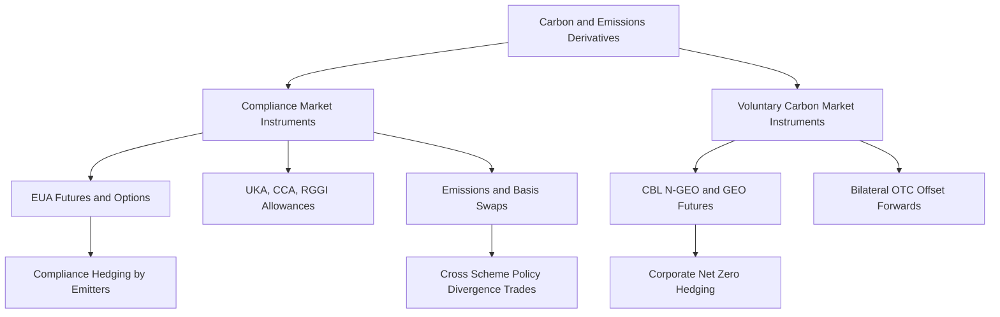

## Carbon and Emissions Derivatives

### Overview

Carbon and Emissions Derivatives are financial instruments whose underlying is a tradable emissions allowance or carbon credit — a regulatory or voluntary unit representing the right to emit one metric ton of CO2 equivalent (tCO2e). These instruments serve dual functions: compliance-driven risk management for regulated emitters under cap-and-trade schemes, and speculative/investment exposure to carbon price trajectories as a macro theme. The asset class spans exchange-traded futures/options on compliance allowances and increasingly standardized, though still fragmented, voluntary carbon market (VCM) derivatives.

### Market Structure Taxonomy

**Key Points**

- **Compliance Markets**: Government-mandated cap-and-trade schemes where regulated entities (power generators, industrials, aviation) must surrender allowances matching verified emissions. Largest examples: EU Emissions Trading System (EU ETS), UK ETS, California Cap-and-Trade (CCA), RGGI (US Northeast power sector), China National ETS.
- **Voluntary Carbon Markets (VCM)**: Non-mandatory market where corporates purchase carbon credits (offsets) generated by emissions-reduction or removal projects (reforestation, renewable energy, direct air capture) to meet voluntary net-zero commitments.
- **Underlying Instruments**:
  - EUA (EU Allowance) — EU ETS
  - UKA (UK Allowance) — UK ETS
  - CCA (California Carbon Allowance) — WCI/California
  - RGA (RGGI Allowance)
  - CORSIA-eligible units — aviation sector offsetting
  - VCS/VER (Verified Carbon Standard credits), Gold Standard credits — VCM

### Primary Derivative Instrument Types

**EUA Futures** (ICE Endex, EEX)

- Standard contract size: 1,000 tCO2e per lot
- Physically settled (delivery of allowances into the buyer's registry account) or cash-settled depending on venue/contract
- Quarterly and December expiries, liquid out to several years, with the December contract acting as the primary liquidity benchmark

**EUA Options**

- European-style, physically settled into the underlying futures contract upon exercise
- Traded on ICE Endex; standard Black-76 framework applies for pricing given futures-style underlying

**Emissions Swaps**

- OTC instruments exchanging fixed vs. floating carbon price exposure, or basis swaps between different schemes (e.g., EUA vs. UKA basis swap) to manage cross-jurisdictional exposure

**Carbon Basis Swaps**

- Manage spread risk between related but distinct instruments, e.g., EUA vs. CER (legacy Kyoto Certified Emission Reduction) basis, or December-vs-December calendar spreads across vintage years

### Pricing Framework

Carbon allowance futures pricing follows a cost-of-carry model similar to other commodity futures, but with scheme-specific supply mechanics driving the fundamental value:

$$F_{t,T} = S_t \cdot e^{(r + s - c)(T-t)}$$

Where $S_t$ is spot allowance price, $r$ is the risk-free rate, $s$ is storage/opportunity cost (typically negligible for allowances since no physical storage is required), and $c$ is any convenience yield (generally near-zero for allowances, unlike physical commodities, since there is no consumption utility — this makes carbon futures curves closer to a pure cost-of-carry relationship than agricultural or energy commodities).

**Key Points**

- Because allowances are dematerialized registry-based instruments with no storage cost or convenience yield in the traditional commodity sense, EUA futures curves tend to trade close to a flat forward curve adjusted for interest rates, absent policy-driven supply shocks.
- Options pricing typically uses Black-76 (futures-based Black-Scholes variant):

  $$C = e^{-rT}\left[F N(d_1) - K N(d_2)\right]$$

  $$d_1 = \frac{\ln(F/K) + \frac{\sigma^2}{2}T}{\sigma\sqrt{T}}, \quad d_2 = d_1 - \sigma\sqrt{T}$$
- Implied volatility surfaces for EUA options exhibit skew driven by policy-event risk (e.g., anticipated Market Stability Reserve adjustments, auction calendar announcements).

### Supply-Side Mechanics Driving Price Formation

**Key Points**

- **Cap Trajectory**: The regulator sets a declining emissions cap (Linear Reduction Factor in EU ETS, currently accelerated under the "Fit for 55" package), mechanically tightening allowance supply over time.
- **Market Stability Reserve (MSR)**: EU ETS-specific mechanism that withholds or releases allowances based on the total number in circulation (TNAC), acting as a quasi-automatic stabilizer and a key driver of medium-term price expectations.
- **Auction Calendar**: Primary issuance via periodic auctions (EEX for EU ETS); auction volume changes are a known, telegraphed supply variable that the market prices in advance.
- **Free Allocation**: Certain sectors (exposed to carbon leakage risk) receive free allowances, tapering over time as CBAM (Carbon Border Adjustment Mechanism) phases in — reducing this offsetting supply mechanism and tightening the effective market.

### Voluntary Carbon Market Derivatives

**Key Points**

- **CBL (CME-listed) contracts**: Nature-Based Global Emissions Offset (N-GEO) and Global Emissions Offset (GEO) futures — standardized, exchange-traded proxies for basket-referenced voluntary credits, providing the first liquid, exchange-cleared VCM derivative benchmark.
- **Core Carbon Principles (CCP)**: Integrity Council for the Voluntary Carbon Market (ICVCM) framework establishing quality-labeling for credits, directly impacting which credits are deliverable/eligible into standardized contracts.
- **Basis and Quality Risk**: Unlike compliance allowances, VCM credits are heterogeneous (differing by project type, vintage, methodology), so VCM derivatives carry significant basis risk between the standardized futures reference basket and any specific project's credits an end-user actually needs to retire.
- [Inference: VCM derivative liquidity remains substantially lower than compliance market instruments, and bid-offer spreads are correspondingly wider; this reflects the market's relative immaturity rather than a permanent structural feature.]

### Hedging Applications

**Key Points**

- **Compliance Hedging**: Power generators and industrials under cap-and-trade hedge forward emissions liabilities by buying EUA/UKA futures matched to projected output and emissions intensity, integrated into broader power/fuel hedging programs (the "clean dark spread" and "clean spark spread" calculations embed carbon costs directly).
- **Clean Spark Spread** (gas-fired generation margin net of carbon cost):

  $$\text{Clean Spark Spread} = P_{power} - (P_{gas} \times HR) - (P_{carbon} \times EF)$$

  Where $HR$ is heat rate and $EF$ is the emissions factor (tCO2e per MWh).
- **Corporate Net-Zero Hedging**: Corporates lock in future offset costs via VCM forwards to budget for compliance with self-declared net-zero pathways.
- **Cross-Scheme Arbitrage**: Basis swaps between EUA/UKA or EUA/CCA allow desks to express relative policy-divergence views (e.g., UK ETS cap trajectory vs. EU ETS post-Brexit divergence).

### Risk Considerations

**Key Points**

- **Policy/Regulatory Risk**: Carbon prices are acutely sensitive to legislative changes (cap revisions, new sector inclusions such as EU ETS2 covering buildings/road transport from 2027, MSR parameter changes) — this is the dominant risk factor, distinct from conventional commodity supply/demand dynamics.
- **Liquidity Concentration**: Trading volume concentrates heavily in the front December contract; longer-dated tenors and cross-scheme baskets can be materially less liquid.
- **Registry/Settlement Risk**: Physical delivery involves transfer via national/EU registries; operational and cyber risk around registry infrastructure is a recognized settlement risk distinct from typical futures clearing risk.
- **Double-Counting Risk (VCM specific)**: Ensuring a retired credit is not counted toward emissions reductions by both the buyer and the host country's NDC (Nationally Determined Contribution) under the Paris Agreement Article 6 framework remains an evolving area of market infrastructure risk.

### Structural Diagram

### Related Topics

- EU ETS Market Stability Reserve mechanics and TNAC calculation
- Carbon Border Adjustment Mechanism (CBAM) and its effect on free allocation
- Clean Dark Spread / Clean Spark Spread structuring in power derivatives
- Core Carbon Principles (CCP) and ICVCM credit labeling
- Paris Agreement Article 6.2/6.4 and corresponding adjustment mechanics
- EU ETS2 (buildings and road transport) and its projected market impact
- Weather and renewables derivatives as complementary decarbonization hedges