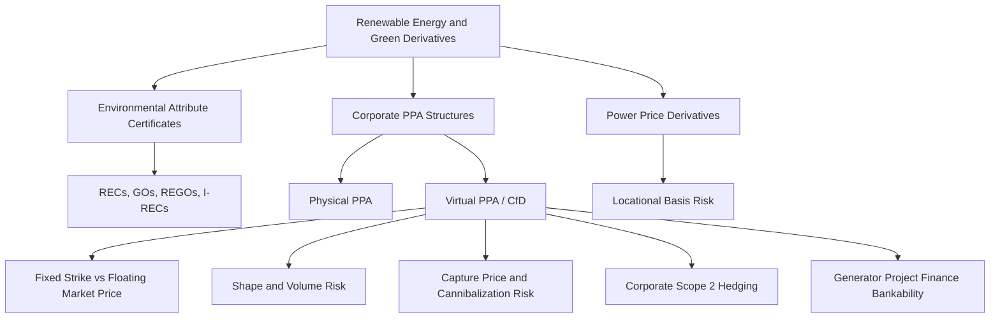

## Renewable Energy and Green Derivatives

### Overview

Renewable Energy and Green Derivatives comprise instruments used to manage price, volume, and certificate-based risk arising from renewable power generation and consumption. This spans three distinct but interconnected layers: physical/financial power price hedges tailored to intermittent generation profiles, tradable environmental attribute certificates (RECs, GOs) decoupled from the underlying electron, and structured Corporate PPA (Power Purchase Agreement) derivatives that convert variable renewable output into bankable, hedged revenue streams for developers and offtake certainty for corporates.

### Market Structure Taxonomy

**Key Points**

- **Environmental Attribute Certificates**: Tradable instruments certifying that one MWh of electricity was generated from a renewable source, separable from the physical electron itself.
  - REC (Renewable Energy Certificate) — US market
  - GO (Guarantee of Origin) — EU market
  - REGO (Renewable Energy Guarantee of Origin) — UK market
  - I-REC (International REC) — emerging markets standard
- **Power Price Derivatives**: Standard electricity futures/swaps/options, but specifically structured or overlaid to address renewable generation's shape risk (intermittency).
- **Corporate PPA Structures**: Physical or virtual (financial) agreements between a renewable generator and a corporate offtaker, frequently embedding derivative-like structures (floors, caps, collars) to manage price risk for both parties.

### Renewable Certificate Derivatives

**Key Points**

- **REC/GO Futures and Forwards**: Exchange-listed (e.g., ICE, Nasdaq) or OTC forward contracts on certificate delivery, typically vintage-specific (tied to generation year) and technology-specific (solar, wind, hydro carry different pricing due to differing perceived additionality and policy treatment).
- **Bundled vs. Unbundled Certificates**: Bundled RECs are sold together with the physical power (as in a standard renewable PPA); unbundled RECs trade as a standalone environmental commodity, allowing corporates to claim renewable usage without physically sourcing the power from that generator.
- **Compliance vs. Voluntary REC Markets**: Compliance RECs trade to satisfy state-level Renewable Portfolio Standards (RPS) in the US; voluntary RECs are purchased by corporates for sustainability reporting (Scope 2 emissions reduction under the GHG Protocol) without a regulatory mandate.
- **Pricing Drivers**: Certificate prices are a function of the supply-demand balance for a given technology/vintage/region combination, RPS compliance obligation stringency, and banking/borrowing rules that allow certificates to be used across compliance periods.

### Corporate PPA Derivative Structures

**Physical PPA**

- Direct bilateral delivery of power from generator to offtaker; offtaker takes physical settlement risk and must manage balancing/shaping costs.

**Virtual/Financial PPA (VPPA)**

- The dominant corporate renewable procurement structure globally. Structured as a **contract for differences (CfD)**:

$$\text{Settlement}_t = (P_{fixed} - P_{market,t}) \times Q_t$$

Where $P_{fixed}$ is the strike price agreed in the PPA, $P_{market,t}$ is the wholesale/reference market price at time $t$, and $Q_t$ is the actual metered generation volume. The corporate offtaker receives the RECs generated and separately continues to purchase physical power from its own retail supplier at the prevailing market rate — the VPPA settlement is purely financial.

**Key Points**

- VPPAs allow corporates to hedge renewable price exposure and claim RECs without being physically co-located with or directly off-taking power from the generator, enabling portfolio-style renewable procurement across different grids/markets.
- The generator receives price certainty (effectively selling a fixed-for-floating swap on its output), which is frequently a prerequisite for securing project financing/debt from lenders.
- **Shape Risk**: Because $Q_t$ is the actual (variable, weather-driven) generation profile rather than a fixed baseload volume, the corporate offtaker is exposed to the correlation between generation timing and market price — this is the central risk differentiator versus a standard financial swap.

### Shape and Basis Risk in Renewable Derivatives

**Key Points**

- **Volume/Shape Risk**: Wind and solar generation output is inherently variable and non-dispatchable; a PPA struck on expected annual volume will have periods of over- and under-generation relative to any flat-volume hedge, requiring the offtaker or generator to buy/sell the difference at potentially unfavorable spot prices.
- **Cannibalization Risk**: As renewable penetration increases in a given grid, high-output periods (sunny/windy hours) increasingly coincide across all renewable generators, depressing the market price precisely when output is highest — structurally eroding the realized "capture price" relative to the average wholesale price over time.
- **Capture Price / Capture Rate**: 

  $$\text{Capture Rate} = \frac{\text{Volume-Weighted Average Price Received}}{\text{Time-Weighted Average Wholesale Price}}$$

  A capture rate below 100% (increasingly common for solar in high-penetration markets) directly erodes project economics and is a key underwriting variable for PPA-linked project finance.
- **Basis Risk**: Corporate offtakers often reference a liquid regional hub price rather than the specific nodal price at the generator's location, creating locational basis risk that must be separately managed or accepted.

### Pricing Framework for VPPA/CfD Structures

The VPPA can be decomposed as a series of forward contracts (or a strip of European-style swaplets) on power price, weighted by expected generation volume in each settlement period:

$$V_{VPPA} = \sum_{i=1}^{n} e^{-r t_i} \cdot E[Q_i] \cdot (P_{fixed} - F_{i})$$

Where $F_i$ is the forward market price for period $i$ and $E[Q_i]$ is expected generation volume in that period, derived from a production forecast (P50/P90 output estimates from an independent engineer).

**Key Points**

- Because $E[Q_i]$ is itself uncertain (weather-dependent), the true instrument is closer to a volumetric/quantity-adjusting swap (a "swing"-like feature) rather than a pure fixed-notional CfD, complicating standard Black-Scholes-style valuation.
- Hedge desks typically price and risk-manage the volume uncertainty component separately from the price component, often using a weather-derivative-style or historical generation-profile overlay.
- [Inference: Given the bespoke, illiquid nature of individual project generation profiles, dealer mark-to-market on VPPA books relies heavily on proprietary shape/basis models rather than observable market quotes, and valuations can differ meaningfully across counterparties.]

### Hedging Applications

**Key Points**

- **Generator-Side**: Developers use VPPAs to convert merchant (spot-exposed) revenue into a contracted, bankable cash flow stream, a standard prerequisite for achieving project finance debt sizing at favorable leverage.
- **Corporate-Side**: Offtakers hedge rising energy costs and lock in a long-term price while generating a verifiable renewable energy claim (RE100 commitments, Scope 2 market-based accounting).
- **Cap/Floor Overlays**: Some PPA structures embed collars (cap on offtaker's downside, floor on generator's downside) rather than a pure fixed-strike CfD, trading some upside/downside in exchange for reduced tail risk for both counterparties.
- **Proxy/Index PPAs**: An emerging structure where settlement references a generation index (e.g., a regional wind/solar production index) rather than the specific project's metered output, shifting shape risk from the offtaker to the generator and simplifying the corporate's hedge accounting treatment.

### Risk Considerations

**Key Points**

- **Cannibalization/Capture Price Erosion**: As noted above, structurally worsens with rising renewable penetration in a given market — a first-order long-term risk for both generators and long-dated offtake hedges.
- **Regulatory/Market Design Risk**: Changes to RPS targets, REC eligibility rules, or wholesale market design (e.g., negative pricing rules, curtailment compensation) directly affect both certificate values and capture prices.
- **Counterparty Credit Risk**: VPPAs are typically long-dated (10-15+ years), creating extended bilateral credit exposure; corporate offtakers are increasingly required to post collateral or accept credit support annexes given the tenor.
- **Accounting Treatment**: VPPAs frequently must be assessed under hedge accounting rules (e.g., IFRS 9 "own-use" exemption or cash flow hedge designation) since they are financial derivatives referencing a non-financial (power) underlying — misclassification can introduce P&L volatility for the corporate offtaker.

### Structural Diagram

### Related Topics

- P50/P90 generation forecasting methodology and project finance underwriting
- Cannibalization effect modeling in high-renewable-penetration power markets
- Hedge accounting treatment (IFRS 9 / ASC 815) for VPPA-style CfDs
- Proxy revenue swaps and index-based PPA structures
- Battery storage co-located hedging strategies for capture price mitigation
- Weather derivatives as a complement to shape-risk hedging
- Cross-border REC/GO equivalence and international corporate procurement