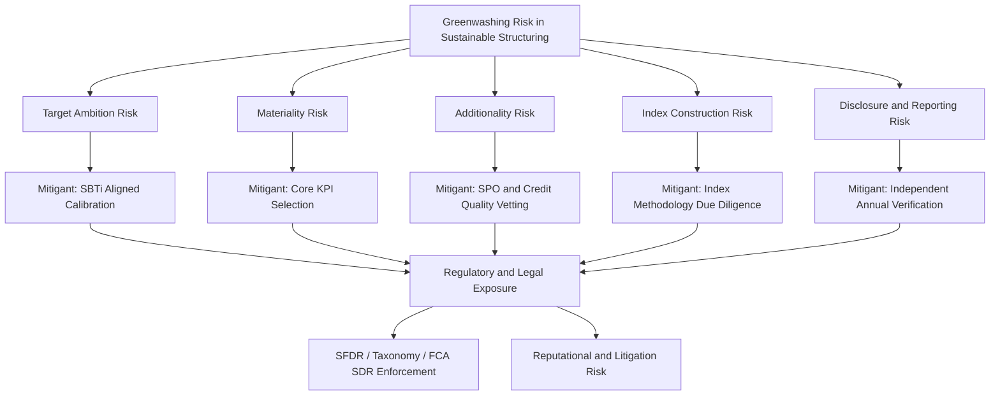

## Greenwashing Risk in Sustainable Structuring

### Overview

Greenwashing Risk in Sustainable Structuring refers to the legal, reputational, financial, and regulatory exposure arising when an ESG-labeled derivative or structured product's actual environmental/social integrity does not match its marketing claims. For a structuring desk, this risk is not merely a compliance afterthought but a first-order design consideration affecting KPI selection, disclosure drafting, hedge construction, and product approval — since greenwashing findings can trigger mis-selling claims, regulatory enforcement, index/label delisting, and forced product restructuring.

### Taxonomy of Greenwashing Risk in Structured Products

**Key Points**

- **Target Ambition Risk**: A Sustainability Performance Target (SPT) or KPI is set at a level the issuer would likely achieve regardless of the note's existence (a "business-as-usual" trajectory), making the embedded step-up/step-down feature economically meaningless while still being marketed as incentivizing decarbonization.
- **Materiality Risk**: The selected KPI is not core to the issuer's primary environmental impact (e.g., a heavy industrial issuer linking a note to office recycling rates rather than Scope 1 process emissions).
- **Additionality Risk**: For carbon-offset-referencing structures, the underlying credits do not represent emissions reductions that would not have occurred anyway (a core VCM integrity concern directly inherited by any derivative referencing those credits).
- **Index Construction Risk**: ESG-labeled equity/bond indices used as underlyings for structured notes may apply screening methodologies that are superficial (simple exclusionary screens) rather than genuinely impact-driving, creating a gap between the "ESG" label and the actual portfolio composition.
- **Asymmetric Penalty Risk**: In step-down structures, a missed target merely reduces the coupon the issuer owes (a benefit to the issuer, not a cost), rather than directing a penalty payment to an environmental cause — critics argue this misaligns incentives versus what the product's marketing implies.
- **Disclosure/Reporting Risk**: Insufficient, delayed, or unaudited KPI reporting undermines the investor's ability to verify claims, exposing the structure to retroactive greenwashing allegations even if the underlying target was genuinely ambitious.

### Regulatory Framework and Enforcement Exposure

**Key Points**

- **EU SFDR (Sustainable Finance Disclosure Regulation)**: Governs Article 8 ("promotes E/S characteristics") and Article 9 ("sustainable investment objective") fund/product classifications; misclassification or unsubstantiated claims expose the manufacturer to regulatory reclassification risk and potential enforcement.
- **EU Taxonomy Regulation**: Establishes technical screening criteria for what constitutes an "environmentally sustainable" economic activity; claims of Taxonomy-alignment that don't meet the "Do No Significant Harm" (DNSH) and minimum safeguards tests are a direct greenwashing exposure.
- **ESMA Guidelines on Fund Names**: Restricts use of ESG/sustainability-related terms in fund and product naming unless minimum portfolio thresholds of aligned assets are met.
- **UK FCA Sustainability Disclosure Requirements (SDR) and Anti-Greenwashing Rule**: Requires that sustainability-related claims be "fair, clear, and not misleading," directly enforceable against structured product marketing materials and KIDs.
- **ICMA Sustainability-Linked Bond Principles (SLBP)**: A voluntary framework, not a binding regulation, but non-conformance with its five core pillars (KPI selection, SPT calibration, bond characteristics, reporting, verification) is increasingly treated by the market as a de facto integrity benchmark, and deviation invites investor and NGO scrutiny even absent formal regulatory breach.
- [Inference: enforcement intensity and precedent are still developing across jurisdictions as of the current knowledge horizon; structuring desks should treat this as an evolving area requiring active regulatory monitoring rather than a settled framework.]

### Structuring Desk Risk Mitigation Practices

**Key Points**

- **Second-Party Opinions (SPOs)**: Independent verification (Sustainalytics, ISS ESG, Moody's ESG Solutions, S&P Global Ratings ESG Evaluation) of KPI materiality and SPT ambition prior to issuance, providing a documented due-diligence trail.
- **Baseline and Trajectory Benchmarking**: Calibrating SPTs against science-based pathways (e.g., Science Based Targets initiative, SBTi) rather than issuer-selected baselines, reducing the risk that a target is structurally easy to hit.
- **Symmetric Penalty Design**: Structuring step-down penalties to flow to a designated environmental fund or offset purchase, rather than simply reducing the issuer's own coupon obligation, to better align economic incentives with the marketed sustainability objective.
- **Legal Disclaimer Calibration**: Careful drafting of the term sheet and KID/prospectus to avoid overstating the causal impact of the note (e.g., avoiding language implying the note itself "reduces emissions" when it is, structurally, a financial incentive mechanism).
- **Independent Verification Cadence**: Contractually mandating annual third-party assurance of KPI performance data (rather than relying solely on issuer self-reporting), with pre-agreed consequences for late or qualified verification.
- **Label/Index Provider Due Diligence**: For index-linked notes, structuring desks vet the index methodology provider's screening criteria and rebalancing rules to confirm alignment with the marketed ESG claim before referencing the index as an underlying.

### Legal and Reputational Consequences

**Key Points**

- **Mis-selling/Consumer Protection Claims**: Retail or institutional investors alleging the product was marketed as more sustainable than its actual structure justified, potentially triggering compensation claims or regulatory-mandated remediation.
- **Litigation Precedent Risk**: Emerging climate-related litigation increasingly targets financial products and their marketing claims, not just corporate emitters directly — [Inference: this is a developing area of case law and its ultimate scope of application to structured products remains uncertain].
- **Reputational Contagion**: A greenwashing finding on one ESG-linked issuance can affect an issuer's or arranger's entire sustainable finance franchise, given the reputational interconnectedness of ESG-labeled product lines.
- **Delisting/Reclassification Risk**: Index providers or fund classification bodies may retroactively reclassify a product (e.g., from Article 9 to Article 8, or removal from an ESG index), triggering forced selling by index-tracking or mandate-constrained investors and associated price/liquidity impact.

### Due Diligence Checklist for New ESG-Linked Issuances

**Key Points**

- KPI is core and material to the issuer's principal business activity and environmental/social footprint
- SPT is calibrated against a credible external benchmark (science-based pathway or sector-standard trajectory) rather than an issuer-selected baseline
- Baseline year and methodology are clearly defined, auditable, and resistant to manipulation via corporate restructuring
- Verification is performed by an independent, suitably accredited third party on a pre-agreed cadence
- Penalty/bonus structure economically incentivizes genuine target achievement (symmetric consequence design)
- Disclosure documentation avoids overstated causal or impact claims
- Underlying index/credit methodology (where applicable) has been independently reviewed for screening rigor

### Structural Diagram

### Related Topics

- ICMA Sustainability-Linked Bond Principles: pillar-by-pillar compliance review
- Science Based Targets initiative (SBTi) methodology for corporate target-setting
- EU SFDR Article 8 vs Article 9 classification mechanics
- EU Taxonomy Regulation: Do No Significant Harm (DNSH) test application
- Second-Party Opinion (SPO) provider comparison and methodology differences
- Climate-related litigation trends affecting financial product design
- ESG index methodology transparency and rebalancing rule analysis