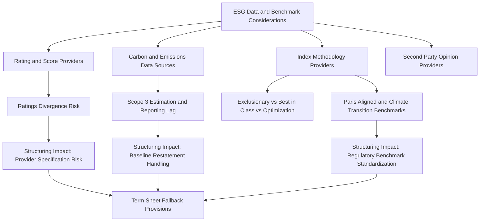

## ESG Data and Benchmark Considerations

### Overview

ESG Data and Benchmark Considerations address the infrastructure layer underpinning all ESG-linked derivatives and structured products: the data providers, scoring methodologies, and benchmark/index construction rules that determine which KPIs are trackable, which indices are investable as underlyings, and how consistently ESG performance can be measured and verified across the life of a trade. For structuring and risk desks, this is a critical dependency layer since payoff-relevant KPI observations, index rebalancing, and regulatory classification all trace back to third-party data quality and methodology choices that the desk does not control.

### ESG Data Provider Landscape

**Key Points**

- **Rating/Score Providers**: MSCI ESG Ratings, Sustainalytics (Morningstar), ISS ESG, S&P Global ESG Scores, Moody's ESG Solutions (formerly Vigeo Eiris) — each applies distinct methodologies, weightings, and industry-materiality maps, frequently producing divergent ratings for the same issuer.
- **Carbon/Emissions Data**: CDP (Carbon Disclosure Project) disclosures, issuer-reported Scope 1/2/3 data (often self-reported and unaudited at the Scope 3 level), and third-party estimation models (e.g., ISS ESG or MSCI's Scope 3 estimation for non-disclosing issuers).
- **Second-Party Opinion (SPO) Providers**: Distinct from ratings agencies — SPO providers (Sustainalytics, ISS ESG, Moody's, S&P) issue pre-issuance opinions specifically assessing whether a Sustainability-Linked Bond/Note's KPIs and SPTs conform to the ICMA SLBP framework.
- **Index Methodology Providers**: MSCI, S&P DJI, FTSE Russell, Solactive, Euro iStoxx/STOXX — construct and maintain ESG-themed indices used as structured note underlyings, each with distinct screening/tilting/optimization methodologies.

### The Ratings Divergence Problem

**Key Points**

- Academic and industry studies have documented low correlation between ESG ratings assigned to the same issuer by different providers, in contrast to credit ratings where major agencies show high correlation.
- **Divergence Drivers**:
  - **Scope divergence**: providers weight E, S, and G pillars differently, and define pillar boundaries differently (e.g., whether product safety sits under "Social" or "Governance").
  - **Measurement divergence**: even when assessing the same underlying attribute, providers use different data sources, estimation techniques for missing data, and normalization approaches.
  - **Weighting divergence**: providers apply different industry-materiality maps (following, or diverging from, frameworks like SASB) to determine which factors matter most for a given sector.
- **Structuring Implication**: For rating-linked notes (where coupon/redemption depends on an ESG rating trajectory), the choice of rating provider is itself a material structuring decision — since a downgrade under one provider's methodology may not occur under another's, the specified provider effectively defines the payoff, not merely reports on it.
- [Inference: given the persistence of this divergence across studies, structuring desks generally treat single-provider rating dependency as a designated methodology risk requiring explicit disclosure, rather than a resolvable data quality issue.]

### Benchmark and Index Construction Methodologies

**Key Points**

- **Exclusionary Screening**: Removes companies/sectors based on negative criteria (fossil fuels, controversial weapons, tobacco) — the simplest and most criticized methodology from a "genuine impact" standpoint, since it does not actively tilt toward positive performers.
- **Best-in-Class Selection**: Retains top ESG-scored issuers within each sector (rather than excluding whole sectors), preserving sector diversification versus a broad market benchmark while improving the aggregate ESG profile.
- **Optimization/Tilting**: Uses quantitative optimization to maximize ESG score improvement subject to a tracking-error constraint versus a parent index, commonly used for structured note underlyings that need to closely track a familiar benchmark (e.g., "MSCI World ESG Enhanced Focus" style indices) while offering improved ESG characteristics.
- **Paris-Aligned / Climate Transition Benchmarks (EU Climate Benchmarks Regulation)**: EU-defined categories — Climate Transition Benchmark (CTB) and Paris-Aligned Benchmark (PAB) — with minimum decarbonization trajectory and carbon intensity reduction requirements codified in regulation (PAB requires a larger initial carbon footprint reduction and steeper year-on-year decarbonization than CTB), providing a regulatorily standardized alternative to provider-proprietary methodologies.
- **Rebalancing and Methodology Change Risk**: Index provider methodology changes (reweighting ESG factor inputs, updating controversy screens) between rebalancing dates can materially shift index composition, directly affecting the mark-to-market and effective exposure of any structured note referencing that index as underlying.

### Data Quality and Availability Constraints

**Key Points**

- **Scope 3 Reporting Gaps**: Scope 3 (value chain) emissions are the largest component of total emissions for many sectors but the least consistently disclosed, forcing reliance on modeled/estimated data with materially wider error bands than directly measured Scope 1/2 data.
- **Reporting Lag**: Annual ESG/sustainability report data is typically published 6-12 months after fiscal year-end, creating an inherent lag between the KPI observation date specified in a note's term sheet and genuinely current issuer performance.
- **SME and Private Issuer Coverage Gaps**: ESG data coverage is substantially deeper for large-cap public issuers than for smaller or private entities, constraining the universe of viable reference names for KPI-linked structures outside large-cap corporate issuance.
- **Historical Data Restatement**: Issuers periodically restate prior-year emissions/ESG data (due to improved measurement methodology or corporate restructuring), creating potential retroactive impact on baseline-referenced KPI trajectories embedded in existing notes — term sheets increasingly include explicit restatement-handling provisions to address this.

### Regulatory Standardization Efforts

**Key Points**

- **EU Climate Benchmarks Regulation**: As noted above, establishes the CTB/PAB minimum standards, reducing (though not eliminating) provider-driven methodology divergence for climate-themed benchmark indices specifically.
- **EU Corporate Sustainability Reporting Directive (CSRD)**: Mandates standardized sustainability disclosure (via European Sustainability Reporting Standards, ESRS) for in-scope EU companies, intended to improve underlying data quality and comparability feeding into both ratings and direct KPI-linked structures over time.
- **ISSB (International Sustainability Standards Board) Standards**: IFRS S1/S2 global baseline disclosure standards, aiming to harmonize sustainability reporting across jurisdictions and reduce the fragmentation that currently drives much of the provider methodology divergence.
- **IOSCO ESG Ratings and Data Products Providers Recommendations**: Global securities regulator guidance calling for greater transparency in ratings methodology, though implementation and binding force vary by jurisdiction.
- [Inference: the practical convergence effect of these standardization initiatives on ratings divergence and data comparability is still emerging and not yet fully observable in the market, given the relatively recent implementation timelines involved.]

### Implications for Structuring and Risk Management

**Key Points**

- **Provider Specification Risk**: Term sheets must precisely specify not just the rating/data provider but the exact methodology version and publication date referenced, since providers periodically revise methodologies mid-cycle.
- **Fallback Provisions**: Well-structured notes include fallback language addressing provider methodology discontinuation, acquisition (e.g., historical consolidation among ESG data providers), or substantial methodology change, to avoid payoff ambiguity.
- **Basis Risk in Index-Linked Notes**: The gap between an index's stated ESG objective and its actual constituent-level holdings (driven by the specific screening/optimization methodology chosen) represents a form of basis risk between the marketed "ESG exposure" and the note's actual economic underlying.
- **Data Vendor Concentration Risk**: Heavy reliance on a small number of dominant data/ratings providers across the market creates systemic dependency; a provider-level data error or methodology flaw can propagate across many structured products simultaneously.

### Structural Diagram

### Related Topics

- SASB (Sustainability Accounting Standards Board) industry-materiality mapping
- EU Corporate Sustainability Reporting Directive (CSRD) and ESRS disclosure standards
- ISSB IFRS S1/S2 global sustainability disclosure baseline
- EU Climate Benchmarks Regulation: CTB vs PAB technical criteria comparison
- Scope 3 emissions estimation methodologies and error quantification
- Index provider consolidation trends and methodology governance
- Data vendor concentration risk and systemic dependency in ESG-linked products