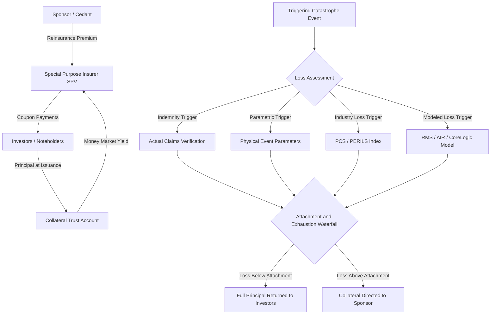

## Catastrophe Bonds and Their Structures

### Overview

Catastrophe Bonds (Cat Bonds) are Insurance-Linked Securities (ILS) that transfer low-frequency, high-severity insurance/reinsurance risk (natural catastrophes such as hurricanes, earthquakes, and increasingly pandemic or cyber risk) from a sponsor (typically an insurer or reinsurer) to capital markets investors. Structurally, a Cat Bond combines a fully-collateralized reinsurance contract with a fixed-income note, allowing investors to earn a risk premium in exchange for bearing tail risk that is largely uncorrelated with traditional financial market risk factors — a defining characteristic driving strong institutional demand for portfolio diversification.

### Core Structural Architecture

**Key Points**

- **Sponsor (Cedant)**: The insurer/reinsurer seeking risk transfer, paying a premium in exchange for protection against a defined catastrophic event.
- **Special Purpose Insurer/Vehicle (SPI/SPV)**: A bankruptcy-remote entity (typically domiciled in Bermuda, Cayman Islands, or increasingly onshore in jurisdictions like Singapore or the UK's ILS regime) that sits between the sponsor and investors, issuing the notes and entering into the reinsurance/retrocession agreement with the sponsor.
- **Investors (Noteholders)**: Institutional investors (dedicated ILS funds, pension funds, hedge funds, reinsurers themselves) who purchase the notes and effectively act as the reinsurance capacity provider.
- **Collateral Trust Account**: Investor principal is deposited into a trust and typically invested in high-quality, short-duration money market instruments (historically US Treasury money market funds), ensuring the sponsor's protection is fully collateralized regardless of the SPV's or investors' creditworthiness.
- **Trigger Mechanism**: Defines the event(s) that, if they occur and meet specified severity conditions, result in principal being paid to the sponsor (reducing or eliminating investor principal repayment) rather than returned to investors at maturity.

### Cash Flow Mechanics

$$\text{Investor Return} = \text{Collateral Yield (money market rate)} + \text{Risk Premium (spread)} - \text{Expected Loss}$$

**Key Points**

- The sponsor pays a periodic **reinsurance premium** (economically the "coupon spread" above the collateral money market yield) to the SPV, which passes it through to investors as the risk-based coupon component.
- The **collateral yield** component reflects prevailing money market rates on the trust assets and is separate from the catastrophe risk premium — in low-rate environments, investors' total coupon is smaller even if the risk spread is unchanged, and vice versa.
- Total coupon paid to investors:

  $$\text{Coupon}_t = r_{collateral,t} + \text{Spread}_{risk}$$
- If a triggering event occurs and the loss threshold is met, the SPV directs some or all of the trust collateral to the sponsor to fund the reinsurance claim, correspondingly reducing (partially or fully) the principal ultimately returned to investors at maturity.

### Trigger Type Taxonomy

**Indemnity Trigger**

- Payout based on the sponsor's actual incurred losses from the covered peril, verified via claims adjustment — closely mirrors traditional reinsurance but requires the longest claims-development/loss-verification period, extending the "tail" during which investor capital may remain locked up pending final loss determination.

**Parametric Trigger**

- Payout based on objectively measured physical event parameters (e.g., hurricane central pressure and wind speed at specified locations, earthquake magnitude and location from USGS data) compared against a pre-defined payout formula/grid — enables fast, transparent, largely dispute-free settlement, though it introduces basis risk (the parametric payout may not precisely match the sponsor's actual incurred loss).

**Industry Loss Trigger (Index-Based)**

- Payout based on aggregate industry-wide insured losses for the peril/region, as estimated by an independent index provider (e.g., PCS - Property Claims Services in the US, PERILS AG in Europe) — reduces moral hazard and speeds settlement relative to indemnity triggers, but retains basis risk against the sponsor's specific book of business.

**Modeled Loss Trigger**

- Payout determined by running actual event parameters through a third-party catastrophe model (e.g., RMS, AIR/Verisk, CoreLogic) calibrated to the sponsor's specific exposure data, blending the speed of parametric triggers with closer correlation to the sponsor's actual loss experience.

**Key Points**

- **Trigger choice trade-off**: Indemnity triggers minimize sponsor basis risk (best hedge effectiveness) but maximize settlement time and investor uncertainty; parametric/index triggers minimize settlement time and moral hazard but maximize sponsor basis risk.
- [Inference: market practice generally favors indemnity triggers for single-sponsor, single-peril transactions where precise hedge matching is prioritized, while parametric and industry-loss triggers are more common where speed of claims payment or broader investor comfort with transparency is prioritized, though the actual mix varies by cedant and market cycle.]

### Waterfall and Loss Allocation Mechanics

$$\text{Payout to Sponsor} = \min\left[\max(0, L - A), (E - A)\right]$$

Where $L$ is the (indemnity, parametric, or modeled) covered loss, $A$ is the **attachment point** (the loss level at which the bond begins to pay out), and $E$ is the **exhaustion point** (the loss level at which the bond's coverage/principal is fully exhausted).

**Key Points**

- **Attachment Probability**: The modeled annual probability that losses reach the attachment point, a primary risk metric analogous to a "probability of first loss" for the tranche.
- **Exhaustion Probability**: The modeled annual probability that losses reach full exhaustion (complete principal loss).
- **Expected Loss (EL)**: The probability-weighted average annual loss to the tranche, the primary risk metric used for relative value comparison across cat bonds (analogous to expected loss in CDO tranche analysis) and the main driver of the risk spread investors demand.
- Multiple tranches within a single cat bond program can be structured with different attachment/exhaustion points, creating a risk-return spectrum from higher-probability/lower-multiple tranches to remote/higher-multiple tranches, structurally analogous to CDO subordination (see the Insurance-Linked Securities/CDO structuring parallels).

### Pricing Framework

**Key Points**

- Unlike most derivatives, cat bond pricing does not rely on a no-arbitrage replication argument, since the underlying peril is not a traded/hedgeable financial asset; pricing instead centers on actuarial modeling combined with market-clearing risk premium levels.
- **Modeled Expected Loss** is generated via third-party catastrophe models (RMS, AIR/Verisk, CoreLogic) that simulate large numbers of synthetic catastrophe years using stochastic event generation, historical event data, and exposure-specific vulnerability/damage functions.
- **Multiple (Spread-to-EL Ratio)**:

  $$\text{Multiple} = \frac{\text{Risk Spread}}{\text{Expected Loss}}$$

  This is the primary relative-value metric in the cat bond market, analogous to a credit spread-to-default-probability ratio; multiples compress in periods of abundant ILS capital supply and expand following major loss events that reduce market capacity.
- **Model Uncertainty**: Because expected loss is itself a model output (not an observed market-implied quantity), model vintage/version differences and inherent model uncertainty around tail events are a recognized and material source of valuation and risk divergence across market participants. [Inference: given the low-frequency nature of the covered perils, historical calibration data for extreme tail scenarios remains inherently limited, which is a structural feature of catastrophe modeling rather than a specific model flaw.]

### Secondary Market and Risk Management

**Key Points**

- Cat bonds trade in an active, broker-dealer-intermediated OTC secondary market, providing liquidity generally superior to private collateralized reinsurance or industry loss warranties (ILWs), though still materially less liquid than corporate bonds.
- **Mark-to-Market Drivers**: Secondary spreads move with (a) updated seasonal/real-time catastrophe risk assessments (e.g., an active hurricane season repricing wind-exposed bonds even absent a triggering loss), (b) overall ILS market capital supply/demand, and (c) model updates from vendors that revise expected loss estimates for existing outstanding bonds.
- **Portfolio Diversification Rationale**: Cat bond returns exhibit low correlation with traditional equity/credit/rates risk factors (since hurricane/earthquake occurrence is independent of financial market cycles), which is the primary institutional investment thesis, though this decorrelation can be less clean during systemic "hard market" repricing events affecting the whole ILS asset class simultaneously.
- **Basis Risk Management for Sponsors**: Sponsors using parametric or industry-loss triggers often layer cat bonds within a broader reinsurance tower alongside traditional indemnity-based reinsurance, using the cat bond primarily for the efficiently-priced, remote layers while retaining indemnity-based traditional reinsurance for more precisely-matched lower layers.

### Structural Diagram

### Related Topics

- Attachment/exhaustion probability modeling and expected loss calculation methodology
- Industry Loss Warranties (ILWs) as an OTC alternative to cat bond issuance
- Collateralized reinsurance and sidecar structures versus cat bond capital markets format
- Catastrophe model vendor comparison (RMS, AIR/Verisk, CoreLogic) and model risk
- Cat bond secondary market spread dynamics and hard/soft market cycles
- Retrocession market structure and its interaction with cat bond capacity
- Pandemic and cyber risk cat bonds as emerging peril categories