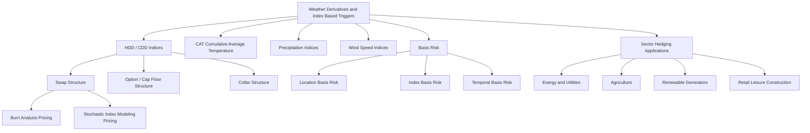

## Weather Derivatives and Index Based Triggers

### Overview

Weather Derivatives are financial contracts whose payoff depends on a specified weather index (temperature, precipitation, wind speed, snowfall) measured at a defined location over a defined period, rather than on an insurable financial loss. They allow corporates and utilities to hedge volumetric/demand risk driven by weather variability — distinct from catastrophe bonds and traditional insurance, which typically require a demonstrable insurable loss. Because payoff is index-based rather than loss-based, weather derivatives are structured and traded as pure financial derivatives (swaps, options, collars) rather than reinsurance contracts, though they share conceptual DNA with parametric ILS triggers.

### Core Index Types

**Key Points**

- **HDD (Heating Degree Days)**: Measures demand for heating; calculated daily as $\max(0, 65°F - T_{avg})$ (or an equivalent Celsius baseline, commonly 18°C) and summed over the contract period. Higher HDD accumulation implies colder-than-reference weather.
- **CDD (Cooling Degree Days)**: Measures demand for cooling; calculated as $\max(0, T_{avg} - 65°F)$, summed over the period. Higher CDD implies warmer-than-reference weather.
- **CAT (Cumulative Average Temperature)**: Used predominantly in European weather markets (e.g., for UK/European gas demand hedging), summing average daily temperatures directly rather than using a degree-day deviation from a reference baseline.
- **Precipitation Indices**: Cumulative rainfall or snowfall over a period, used by agricultural, hydropower, and construction/event-related hedgers.
- **Wind Speed/Wind Power Indices**: Cumulative wind energy production proxies, used by wind generators to hedge low-wind-resource periods (a specific application overlapping with renewable energy derivatives).

### Instrument Structures

**HDD/CDD Swaps**

$$\text{Payoff}_{swap} = (\text{Index}_{actual} - \text{Index}_{strike}) \times \text{Tick Value}$$

A linear payoff exchanging fixed index exposure for floating (actual) index outcome, typically capped at a maximum payout via a pre-agreed notional cap to bound tail exposure for both counterparties.

**HDD/CDD Options (Caps/Floors)**

$$\text{Payoff}_{call} = \max(0, \text{Index}_{actual} - K) \times \text{Tick Value}$$

$$\text{Payoff}_{put} = \max(0, K - \text{Index}_{actual}) \times \text{Tick Value}$$

Standard call/put structure on the accumulated degree-day index, purchased for a premium, capping downside to the premium paid (unlike the swap, which has open-ended bilateral exposure absent an explicit cap).

**Collars**

- Combines a long option position (protecting against adverse weather) with a short option position (financing the premium by giving up some favorable-weather upside), structured to be zero-premium or low-premium — the dominant retail/corporate hedging structure given its cost efficiency versus outright option purchase.

**Key Points**

- Exchange-traded weather derivatives (CME Group lists HDD/CDD futures and options on US and international cities) provide standardized, cleared exposure, while the bulk of notional volume, particularly for bespoke locations or index types, trades OTC.
- Contract "tick value" (dollar value per index point) is calibrated to the hedger's specific exposure sensitivity (e.g., dollars of incremental gas demand per heating degree day).

### Pricing Framework

Because weather indices are not traded assets and exhibit mean-reverting, seasonal statistical behavior rather than the geometric Brownian motion assumptions underlying standard Black-Scholes, weather derivatives pricing relies on actuarial/statistical (burn analysis) or stochastic weather-process modeling rather than risk-neutral option pricing in the conventional sense.

**Burn Analysis (Historical Simulation)**

$$\text{Fair Value} = \frac{1}{N}\sum_{i=1}^{N} \text{Payoff}(\text{Index}_i) \times e^{-rT}$$

Where $\text{Index}_i$ represents the realized index value in each of $N$ historical years (typically 20-30 years of detrended historical weather data), producing an empirical expected payoff distribution.

**Index Modeling Approach**

- Fits a stochastic process (often an Ornstein-Uhlenbeck-type mean-reverting model, or daily temperature simulation via ARMA/GARCH-style models on detrended, deseasonalized temperature series) to generate simulated index outcomes via Monte Carlo, allowing more granular scenario analysis than pure historical burn analysis and better handling of limited historical sample sizes.

**Key Points**

- **Detrending**: Historical temperature data must be detrended to account for long-term climate warming trends and urbanization effects (urban heat island bias in station data) before being used as a basis for pricing current-period contracts — a critical and non-trivial actuarial adjustment.
- **Market Price of Risk**: Since weather indices are non-tradable, there is no unique risk-neutral measure; the risk premium embedded in weather derivative pricing reflects a supply/demand-driven market price of risk determined by dealer risk appetite and hedger demand imbalances, distinct from the replication-derived risk-neutral pricing of standard financial derivatives.
- [Inference: given reliance on finite historical samples and evolving climate trends, weather derivative "fair value" estimates carry meaningfully wider model uncertainty bands than derivatives on liquid, continuously-observable financial underlyings; this is a structural feature of the asset class.]

### Basis Risk Considerations

**Key Points**

- **Location Basis Risk**: The contract references a specific weather station, which may not perfectly correlate with the hedger's actual geographically-dispersed exposure (e.g., a utility's service territory spanning multiple microclimates versus a single airport weather station reference).
- **Index Basis Risk**: The chosen index (e.g., simple CDD) may not perfectly capture the hedger's actual demand sensitivity, which could be non-linear or driven by compound factors (e.g., humidity-adjusted heat index for power demand, not pure dry-bulb temperature).
- **Temporal Basis Risk**: Contract settlement periods (monthly, seasonal) may not align precisely with the specific weather events driving the hedger's actual P&L volatility.
- Hedgers often accept basis risk as a trade-off for the standardization, liquidity, and lower transaction costs of index-based products versus a bespoke, perfectly-matched but illiquid custom structure.

### Hedging Applications by Sector

**Key Points**

- **Energy/Utilities**: The largest and original user base — hedging gas/power demand volume risk from warmer-than-expected winters (reduced heating demand) or cooler-than-expected summers (reduced cooling demand), which directly affects volumetric sales even when price risk is separately hedged.
- **Agriculture**: Precipitation and temperature derivatives hedging crop yield risk, often used alongside (or as a capital markets alternative/complement to) traditional crop insurance.
- **Renewable Energy Generators**: Wind speed and solar irradiance derivatives hedging resource variability risk, complementing the shape/volume risk hedging discussed under renewable energy derivatives more broadly.
- **Retail/Leisure/Construction**: Hedging weather-sensitive revenue (e.g., a ski resort hedging low-snowfall years, an outdoor event operator hedging rainout risk, a construction firm hedging weather-related project delay costs).
- **Insurance/Reinsurance Sector-Linked Use**: Weather derivatives are sometimes used by (re)insurers themselves to hedge aggregate weather-related claims volatility that falls below cat bond attachment thresholds, filling the "working layer" risk transfer gap below where cat bond/ILS capacity typically engages.

### Comparison to Parametric Cat Bond Triggers

**Key Points**

- Weather derivatives and parametric cat bond triggers share the conceptual foundation of index-based, objectively measurable payoff triggers, but differ in typical risk profile: weather derivatives generally hedge high-frequency, low-severity volumetric risk (a "working layer" exposure smoothing regular earnings volatility), while cat bonds hedge low-frequency, high-severity tail risk.
- Weather derivatives are typically shorter-dated (seasonal, single-season contracts) versus cat bonds' typical 3-5 year tenor, reflecting their differing risk transfer purpose (annual budget/earnings smoothing versus balance-sheet tail protection).
- Both instrument classes rely on the same core structuring principle — replacing indemnity-based loss verification with an objectively observable index — but weather derivatives trade as standard financial swaps/options while cat bonds retain a reinsurance/SPV wrapper for regulatory and capital treatment reasons specific to the sponsor's insurance business.

### Structural Diagram

### Related Topics

- Burn analysis methodology and historical data detrending techniques
- CME Group weather futures and options contract specifications
- Ornstein-Uhlenbeck and mean-reverting stochastic temperature modeling
- Parametric catastrophe bond triggers versus weather derivative structuring
- Renewable energy shape risk hedging and wind/solar resource derivatives
- Crop insurance versus agricultural weather derivative hedging trade-offs
- Market price of risk estimation in non-tradable underlying derivative pricing