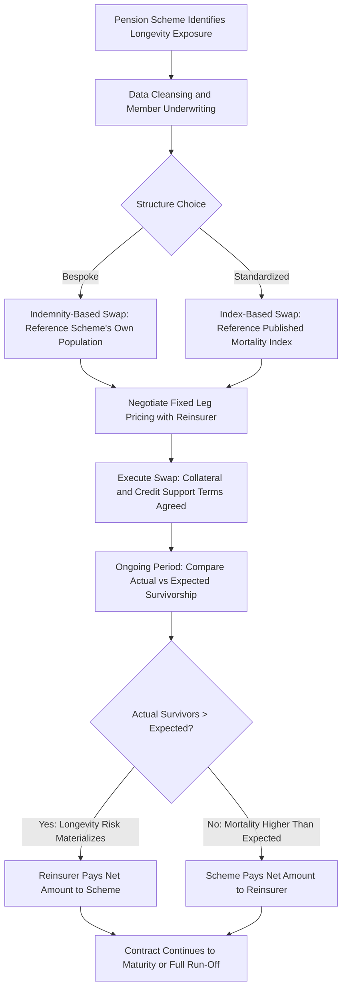

## Longevity and Mortality Swaps

### Overview

Longevity and mortality swaps are derivative contracts that transfer risk associated with the rate at which a reference population dies, relative to expectations, between two counterparties. They belong to the broader class of insurance-linked securities (ILS) and alternative risk transfer (ART) instruments, alongside catastrophe bonds, sidecars, and industry loss warranties, but are distinguished by referencing **biometric risk** (mortality/longevity) rather than property-catastrophe risk.

**Key Points**

- Longevity risk: the risk that people live longer than expected, increasing liabilities for pension funds and annuity providers
- Mortality risk: the risk that people die sooner than expected (or in higher-than-expected numbers), increasing liabilities for life insurers
- These two risks are largely mirror images, which is what makes swap structures between pension funds/annuity writers and life insurers/reinsurers economically natural
- Settlement is typically based on an index or a population's realized mortality/survival experience, not individual policyholder claims

### Underlying Risk Direction

| Risk Type | Adverse Outcome | Primary Holders |
| --- | --- | --- |
| Longevity risk | Population lives longer than priced-for | Defined-benefit pension plans, annuity writers |
| Mortality risk | Population dies sooner/more than priced-for | Life insurers, life reinsurers |

Because a pension fund is short longevity (hurt by people living longer) and a life insurer with large term-life books is often short mortality (hurt by people dying sooner), the two exposures can be netted or swapped, which underpins much of the market's structuring logic.

### Core Swap Mechanics

A longevity swap (from the perspective of the risk-hedging party, typically a pension plan or annuity provider) exchanges a series of fixed or predetermined payments for payments that track the actual, realized survivorship of a reference population.

- **Fixed leg**: the hedger pays a schedule of payments based on expected (priced-in) survivor numbers or mortality rates, agreed at inception, often with an embedded risk premium
- **Floating leg**: the counterparty (reinsurer or investment bank) pays based on the actual observed survivorship or mortality experience of the reference population each period

$$\text{Net Cash Flow}_t = N_t^{actual} - N_t^{expected}$$

where $N_t^{actual}$ is the realized number of survivors (or realized mortality rate) at time $t$ and $N_t^{expected}$ is the value implied by the pricing basis (often a projected mortality table) at inception.

For a pension buy-in-style longevity swap, the pension scheme continues to pay member benefits directly but receives a floating leg from the swap counterparty that offsets the cost of unexpectedly high survivorship, effectively converting an uncertain, long-dated liability into a fixed, known cost stream.

### Index-Based vs. Indemnity-Based Structures

#### Indemnity-Based (Bespoke) Swaps

- Payments reference the **actual experience of the hedger's own population** (e.g., a specific pension scheme's members)
- Requires detailed underwriting of the scheme's demographic composition (age, gender, socioeconomic profile, postcode-based mortality factors)
- Basis risk is minimal (the hedge closely matches the true liability) but transaction costs, underwriting effort, and bespoke legal structuring are higher
- Dominant structure in large pension buy-in/buy-out and bulk annuity longevity risk transfer

#### Index-Based (Standardized) Swaps

- Payments reference a **published national or industry mortality/longevity index** (e.g., life expectancy or survivor indices published by statistical agencies or index providers)
- Lower transaction costs, more standardized documentation, greater potential liquidity
- Introduces **basis risk**: the index population's mortality experience may diverge from the hedger's specific population (differing age/socioeconomic mix), so the hedge may not perfectly offset the actual liability
- More common in capital-markets-facing, securitized, or smaller-scale hedging programs where full bespoke underwriting is not economical

### Related Instrument: Mortality Catastrophe Bonds/Swaps

Distinct from longevity swaps, mortality catastrophe instruments (e.g., early Swiss Re "Vita" bond series structures) transfer **extreme mortality event risk** — spikes from pandemics, wars, or natural catastrophes — to capital markets investors.

- Investors receive periodic coupons funded by the sponsor (typically a life reinsurer) in exchange for principal at risk
- If a mortality index (e.g., an age/gender-weighted population mortality rate) exceeds a predefined trigger level, investor principal is reduced, with proceeds passed to the sponsor to cover excess claims
- Structurally parallel to catastrophe bonds, but with a mortality index as the trigger rather than a physical peril index (e.g., wind speed, seismic magnitude)

$$\text{Payout to Sponsor} = \max(0, \, \min(L, \, N \times \frac{I_{observed} - I_{attach}}{I_{exhaust} - I_{attach}}))$$

where $I_{observed}$ is the observed mortality index value, $I_{attach}$ and $I_{exhaust}$ are the attachment and exhaustion points, $N$ is bond principal, and $L$ is the layer limit.

### Pricing Considerations

Longevity/mortality swap pricing combines:

1. **Best-estimate mortality projection**: a base mortality table (e.g., standard actuarial tables) projected forward using a stochastic or deterministic mortality improvement model (Lee-Carter, Cairns-Blake-Dowd (CBD), or proprietary variants) to generate expected future survivor curves
2. **Risk premium / margin**: compensation to the swap seller (reinsurer) for bearing longevity trend risk, parameter uncertainty, and tail risk beyond the best estimate
3. **Basis risk discount** (index-based structures): pricing incorporates the expected divergence between index and hedger population, typically priced conservatively (wider margin) relative to bespoke indemnity structures

[Inference] Risk premia in this market are generally understood to be influenced by reinsurer capacity cycles and capital market appetite, though a standardized, universally quoted premium curve for longevity risk is not established in the way that, for example, interest rate swap curves are, given the market's relative size and bespoke nature.

### Key Risk Factors

- **Trend risk**: systematic, unanticipated shifts in long-term mortality improvement rates (e.g., faster-than-expected medical advances extending life expectancy)
- **Level/base risk**: mis-estimation of the current baseline mortality rate for the reference population at inception
- **Basis risk**: divergence between a reference index and the hedger's actual population (index-based structures only)
- **Counterparty credit risk**: given multi-decade contract tenors common in longevity swaps, counterparty default risk over the contract life is material, typically mitigated through collateral posting arrangements, credit support annexes, and, for larger deals, novation to well-capitalized reinsurers
- **Model risk**: mortality improvement projections rely on extrapolating historical trends, which carry inherent uncertainty over multi-decade horizons
- **Liquidity risk**: the longevity swap market is comparatively illiquid and thinly traded relative to mainstream derivatives markets; secondary market transfer of positions is limited

### Structuring Parties and Market Participants

- **Pension schemes / plan sponsors**: primary hedgers of longevity risk, often via buy-in or bespoke longevity swap overlays that leave assets under the scheme's control while transferring the biometric risk
- **Insurers/annuity writers**: hedge longevity risk embedded in annuity books
- **Reinsurers**: principal risk-takers on the other side of most longevity swaps, leveraging diversified mortality/longevity books across geographies and the natural offset against their mortality (life insurance) exposures
- **Investment banks**: historically structured intermediated longevity swaps, warehousing risk temporarily before passing it to reinsurers or capital markets investors
- **Capital markets investors** (in securitized mortality cat bonds): pension funds, hedge funds, and specialty ILS funds seeking uncorrelated returns, since mortality/longevity risk has low correlation with traditional financial market risk factors

### Illustrative Cash Flow Diagram: Indemnity Longevity Swap

<svg xmlns="http://www.w3.org/2000/svg" viewBox="0 0 700 320" font-family="sans-serif">
<text x="350" y="25" text-anchor="middle" font-size="16" font-weight="bold">Pension Scheme Longevity Swap Structure (svg_diagram)</text>
<rect x="40" y="120" width="160" height="70" rx="6" fill="#e8f0fe" stroke="#2166ac" stroke-width="1.5" />
<text x="120" y="150" text-anchor="middle" font-size="13" font-weight="bold">Pension Scheme</text>
<text x="120" y="168" text-anchor="middle" font-size="11">(Hedger)</text>
<rect x="500" y="120" width="160" height="70" rx="6" fill="#fdecea" stroke="#c0392b" stroke-width="1.5" />
<text x="580" y="150" text-anchor="middle" font-size="13" font-weight="bold">Reinsurer</text>
<text x="580" y="168" text-anchor="middle" font-size="11">(Risk Taker)</text>
<line x1="200" y1="140" x2="500" y2="140" stroke="#2166ac" stroke-width="2" marker-end="url(#arrow1)" />
<text x="350" y="130" text-anchor="middle" font-size="11" fill="#2166ac">Fixed Leg (Expected Payments)</text>
<line x1="500" y1="170" x2="200" y2="170" stroke="#c0392b" stroke-width="2" marker-end="url(#arrow2)" />
<text x="350" y="188" text-anchor="middle" font-size="11" fill="#c0392b">Floating Leg (Actual Survivor Payments)</text>
<rect x="270" y="230" width="160" height="55" rx="6" fill="#fff3cd" stroke="#b58105" stroke-width="1.5" />
<text x="350" y="255" text-anchor="middle" font-size="12" font-weight="bold">Pension Scheme Members</text>
<text x="350" y="272" text-anchor="middle" font-size="10">(Reference Population)</text>
<line x1="120" y1="190" x2="120" y2="260" stroke="#555" stroke-dasharray="3,3" />
<line x1="120" y1="260" x2="270" y2="260" stroke="#555" stroke-dasharray="3,3" marker-end="url(#arrow3)" />
<text x="180" y="253" text-anchor="middle" font-size="10" fill="#555">Benefit Payments</text>
</svg>

### Process Flow: Longevity Swap Lifecycle

### Worked Example

**Example**

A pension scheme has 10,000 retired members. At inception, the actuarial projection (fixed leg basis) expects 9,200 members surviving to year 10. The swap's fixed leg is set to pay the reinsurer an amount equivalent to expected survivor-linked pension payments each year, while the reinsurer pays the scheme an amount equivalent to actual survivor-linked payments.

- At year 10, actual survivors are 9,450 (250 more than expected) — longevity risk has materialized
- The reinsurer's floating-leg payment to the scheme reflects the higher actual pension payment obligation on those 250 extra survivors, offsetting the scheme's higher-than-expected benefit outlay
- If, instead, actual survivors were 8,900 (300 fewer than expected — a mortality-favorable outcome for the scheme), the net payment would flow from the scheme to the reinsurer, since the scheme's realized liability was lower than the fixed leg it agreed to pay

This illustrates the swap's function: it does not reduce the scheme's benefit payment obligations to members (those continue regardless), but it stabilizes the scheme's net funding cost by exchanging an uncertain, longevity-linked cash flow for a predictable one.

### Common Pitfalls

- Confusing "longevity swap" direction with "mortality swap" direction — the hedger and the risk taker are on opposite sides depending on which risk (living longer vs. dying sooner) is being transferred
- Underestimating basis risk in index-based structures when the hedger's population has materially different socioeconomic or geographic mortality characteristics than the reference index
- Treating multi-decade longevity swap counterparty risk as equivalent to short-tenor derivative counterparty risk — the extended tenor materially changes the collateral and credit structuring requirements
- Assuming mortality improvement trends are linear extrapolations of historical data without accounting for structural breaks (e.g., pandemic-driven excess mortality, medical breakthroughs)
- Conflating mortality catastrophe bonds (tail-risk, capital markets-distributed) with longevity swaps (trend-risk, typically bilaterally negotiated with reinsurers)

### Related Topics

- Catastrophe bonds and their trigger mechanisms (indemnity, index, parametric, modeled loss)
- Stochastic mortality models: Lee-Carter, Cairns-Blake-Dowd, and Renshaw-Haberman
- Pension buy-in and buy-out transactions versus longevity swap overlays
- Sidecar structures and collateralized reinsurance in ART
- Capital treatment of longevity risk transfer under Solvency II and risk-based capital frameworks
- Securitization structures for life settlements and extreme mortality risk