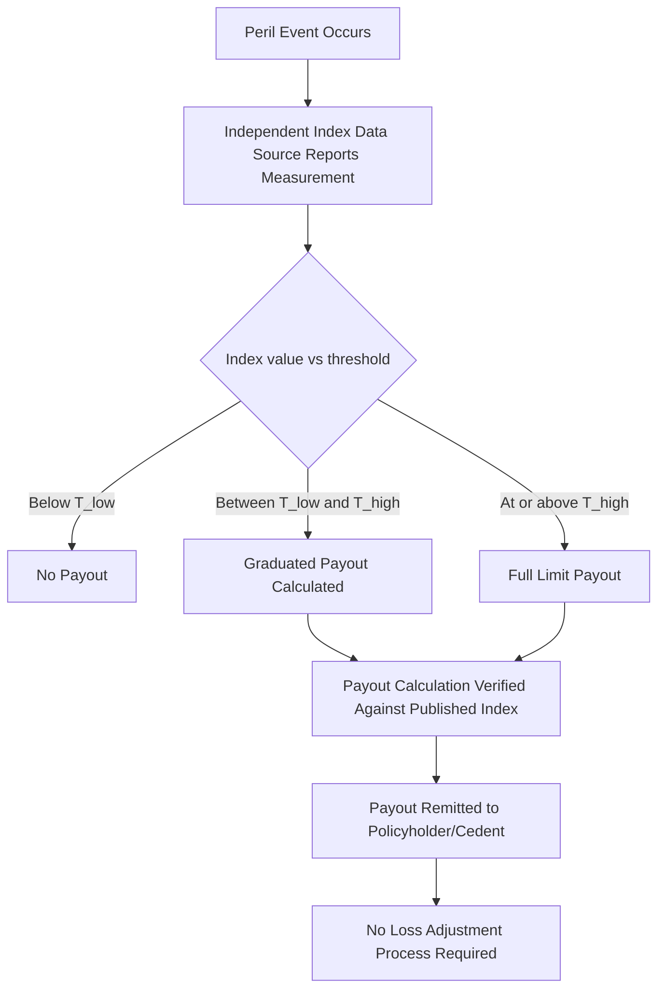

## Parametric Insurance Structures

### Overview and Definition

Parametric insurance (also called index-based or index-linked insurance) pays a predetermined amount when an objectively measurable parameter — an index — crosses a defined threshold, rather than indemnifying the policyholder's actual, adjusted loss. This contrasts with traditional indemnity insurance, where payout depends on a claims-adjustment process that measures the insured's actual financial loss.

**Key Points**

- Payout trigger is based on a physical or index parameter (e.g., wind speed, rainfall, earthquake magnitude, an industry loss index), not measured loss
- Claims settlement is fast — often days rather than months or years — because no loss adjustment is required
- The structure introduces **basis risk**: the gap between the parametric payout and the policyholder's actual economic loss
- Widely used in catastrophe risk transfer, agriculture, and increasingly in pandemic, cyber aggregation, and climate-transition risk

### Core Components of a Parametric Structure

1. **Trigger event/peril**: the physical phenomenon being measured (hurricane, earthquake, drought, flood, temperature, etc.)
2. **Index**: the specific measurable proxy for the peril (e.g., USGS ShakeMap intensity, NOAA storm track/wind speed at landfall, rainfall in mm over a defined period, an industry loss estimate from a modeling agency such as PCS or PERILS)
3. **Trigger threshold(s)**: the index value(s) at which payout begins and, often, tiers at which payout increases
4. **Payout function**: the schedule mapping index values to payout amounts — can be binary (all-or-nothing) or a graduated/linear scale
5. **Notional/limit**: the maximum payout amount, analogous to policy limit
6. **Basis risk**: the structural residual risk that the index does not perfectly correlate with actual loss

### Trigger Typologies

**Parametric Trigger Types Comparison**

| Trigger type | Basis | Example | Basis risk | Settlement speed |
| --- | --- | --- | --- | --- |
| Pure parametric | Physical measurement at defined stations/grid points | Wind speed ≥ 150 km/h at a specific weather station | Highest — localized measurement may not reflect broader damage | Fastest (days) |
| Parametric index (modeled) | Output of a physical/vendor cat model calibrated to the event | Modeled industry loss from a specific hurricane footprint | Moderate — depends on model accuracy versus actual event | Fast (days to weeks) |
| Industry loss index | Aggregated industry-wide loss estimate | PCS or PERILS industry loss estimate exceeding $X billion | Moderate — insurer's own losses may diverge from industry average | Weeks (index reporting lag) |
| Modeled loss (indemnity-adjacent) | Cedent's own exposure run through a licensed model using actual event parameters | Client's exposure data run through RMS/Verisk model post-event | Lower — closer to actual loss, but still not indemnity | Weeks |
| Indemnity (for comparison) | Actual adjusted loss | Traditional insurance claim | Lowest (near zero, by design) | Slowest (months to years) |

### Payout Function Design

**Binary (step) trigger:**

$$\text{Payout} =
\begin{cases}
0 & \text{if } I < T \\
L & \text{if } I \geq T
\end{cases}$$

where $I$ is the realized index value, $T$ is the threshold, and $L$ is the full limit.

**Linear/graduated trigger:**

$$\text{Payout} = L \times \min\left(1, \max\left(0, \frac{I - T_{low}}{T_{high} - T_{low}}\right)\right)$$

where payout scales linearly between a lower attachment index $T_{low}$ (first payout) and an upper exhaustion index $T_{high}$ (full limit).

**Multi-tier / tranche structure:**

Several discrete bands, each with an incremental payout — commonly used in sovereign and cat-bond-linked parametric covers (e.g., CCRIF SPC, African Risk Capacity) to smooth the payout curve and reduce cliff-edge basis risk versus a single binary trigger.

**Example**

A parametric hurricane cover for a Caribbean utility: index is central pressure (or maximum sustained wind speed) at closest approach within a defined radius of the insured's grid.

- Below 950 hPa central pressure at landfall within 50km: no payout
- 950-920 hPa: payout scales linearly from $0 to $20M
- Below 920 hPa: full payout of $20M

Because settlement depends only on published meteorological data (e.g., NOAA/National Hurricane Center track), payout can typically be confirmed and paid within 1-4 weeks of landfall, versus months for a traditional property claim.

### Payout Function Diagram

**Linear Parametric Payout Curve (svg_diagram)**

<svg xmlns="http://www.w3.org/2000/svg" viewBox="0 0 700 420" font-family="Arial, sans-serif" font-size="13">
<text x="350" y="28" text-anchor="middle" font-size="17" font-weight="bold">Parametric Payout Function (svg_diagram)</text>

<line x1="80" y1="350" x2="640" y2="350" stroke="#333" stroke-width="1.5" />
<line x1="80" y1="350" x2="80" y2="60" stroke="#333" stroke-width="1.5" />
<text x="360" y="385" text-anchor="middle" font-size="13">Index Value (e.g., wind speed)</text>
<text x="30" y="200" text-anchor="middle" font-size="13" transform="rotate(-90 30 200)">Payout ($)</text>

<line x1="80" y1="350" x2="250" y2="350" stroke="#2b5faa" stroke-width="3" />

<line x1="250" y1="350" x2="450" y2="90" stroke="#2b5faa" stroke-width="3" />

<line x1="450" y1="90" x2="620" y2="90" stroke="#2b5faa" stroke-width="3" />

<line x1="250" y1="350" x2="250" y2="360" stroke="#a94442" stroke-width="2" />
<text x="250" y="375" text-anchor="middle" font-size="11" fill="#a94442">T_low (attachment)</text>
<line x1="450" y1="90" x2="450" y2="360" stroke="#a94442" stroke-width="1.5" stroke-dasharray="4,3" />
<text x="450" y="375" text-anchor="middle" font-size="11" fill="#a94442">T_high (exhaustion)</text>
<line x1="80" y1="90" x2="450" y2="90" stroke="#4a7a2b" stroke-width="1" stroke-dasharray="4,3" />
<text x="70" y="86" text-anchor="end" font-size="11" fill="#4a7a2b">L (full limit)</text>

<text x="150" y="330" text-anchor="middle" font-size="11">No payout zone</text>

<text x="350" y="200" text-anchor="middle" font-size="11" transform="rotate(-55 350 200)">Linear scaling</text>

<text x="540" y="80" text-anchor="middle" font-size="11">Full payout (capped)</text>

</svg>

### Basis Risk: Sources and Mitigation

**Key Points**

- **Spatial basis risk**: the measurement point (weather station, grid cell) does not coincide with the insured asset's actual location
- **Model basis risk**: the physical/cat model underlying the index misestimates actual conditions or damage relative to the real event
- **Timing basis risk**: index measurement window does not align with the actual loss-causing period (e.g., a multi-day rainfall event straddling reporting periods)
- **Vertical basis risk**: correlation between the chosen index and the insured's actual financial loss is imperfect even absent spatial/timing issues (e.g., wind speed correlates with wind damage but not necessarily with business interruption loss)

**Mitigation approaches:**

- Denser sensor/gauge networks and higher-resolution grid-based indices (satellite-derived rainfall, gridded wind fields) instead of single-station triggers
- Multiple trigger points/weighted baskets of stations to reduce single-point-of-failure exposure
- Blended or "dual-trigger" structures combining a parametric first trigger with an indemnity confirmation layer
- Portfolio-level (rather than single-asset) parametric covers, where basis risk diversifies across a larger insured pool

### Common Application Domains

**Catastrophe/Property (Sovereign and Corporate)**

- Sovereign risk pools: CCRIF SPC (Caribbean), African Risk Capacity (ARC), Pacific Catastrophe Risk Assessment and Financing Initiative (PCRAFI) — provide rapid post-disaster liquidity to governments using tropical cyclone, earthquake, and drought/excess rainfall indices
- Corporate/utility covers: business interruption and grid-damage covers for utilities, ports, and infrastructure operators triggered by wind speed, earthquake ground motion (e.g., PGA/PGV), or storm surge height

**Agriculture**

- Weather-index crop insurance: payouts triggered by rainfall deficit/excess, temperature (growing degree days), or vegetation indices (NDVI from satellite imagery) rather than measured crop yield loss — reduces moral hazard and adverse selection versus traditional multi-peril crop insurance, at the cost of higher basis risk for individual farmers

**Emerging and Adjacent Applications**

- Pandemic/epidemic parametric triggers (e.g., case count or WHO declaration-based triggers), following interest generated by COVID-19 [Inference: uptake and structuring approaches remain relatively nascent and vary significantly by (re)insurer]
- Cyber aggregation covers using systemic-event indices
- Renewable energy production covers (wind/solar generation shortfall parametrics) supporting revenue certainty for project finance

### Parametric Trigger Confirmation Workflow

### Structuring as Insurance-Linked Securities

Parametric triggers are not exclusive to primary insurance — they are the dominant trigger mechanism in several ILS structures:

- **Parametric catastrophe bonds**: principal at risk determined by whether an index (e.g., modeled hurricane wind field intersecting a grid) breaches threshold, enabling rapid, model-driven payout determination and simplifying investor due diligence versus indemnity triggers
- **ILWs (Industry Loss Warranties)**: a close cousin, triggered by industry-wide loss estimates exceeding a threshold rather than a purely physical parameter
- **Sidecars and collateralized reinsurance** increasingly incorporate parametric or industry-loss triggers (versus pure indemnity) specifically to reduce the loss-development uncertainty and trapped-capital risk discussed in indemnity-triggered structures

### Pricing Considerations

Parametric premium is generally decomposed as:

$$\text{Premium} = \text{Expected Payout} + \text{Risk Load} + \text{Basis Risk Load} + \text{Expense Load}$$

- **Expected payout** is derived from the historical/simulated frequency and severity distribution of the index crossing each threshold tier, typically using a stochastic catastrophe model or historical index time series
- **Risk load** compensates capital providers for underwriting/tail risk, similar to indemnity products
- **Basis risk load** (sometimes implicit rather than separately priced) reflects the fact that buyers may be willing to pay less per dollar of expected payout given the residual mismatch with their actual loss — in practice this often manifests as buyer reluctance/lower demand rather than an explicit pricing line item [Inference: treatment varies substantially by market and product]

### Advantages and Limitations Summary

**Key Points — Advantages**

- Fast, objective, largely dispute-free claims settlement
- Lower administrative/loss-adjustment cost load
- Reduced moral hazard and adverse selection versus indemnity products (payout independent of policyholder's own loss-mitigation behavior post-event)
- Can be structured for perils or geographies where traditional claims infrastructure is weak or absent (a key driver of sovereign risk pool adoption)

**Key Points — Limitations**

- Basis risk means the insured may receive a payout that under- or over-states actual loss, or receive nothing despite real loss (or vice versa)
- Requires a credible, independent, timely, and tamper-resistant data source for the index — data availability/quality can constrain feasibility in some regions
- Regulatory treatment can differ from traditional insurance in some jurisdictions (parametric products may face classification questions around insurable interest given the non-indemnity payout mechanic)
- Buyer education and trust-building is often required, since the payout is decoupled from the buyer's intuitive notion of "my loss"

### Related Topics

- Catastrophe Bonds: Structuring, Triggers, and Pricing
- Industry Loss Warranties (ILWs)
- Reinsurance Sidecars and Collateralized Reinsurance
- Sovereign Catastrophe Risk Pools (CCRIF, ARC, PCRAFI)
- Weather Derivatives and Index-Based Hedging
- Catastrophe Modeling Methodologies (Vendor Models: RMS, Verisk/AIR, CoreLogic)
- Basis Risk Quantification and Hedge Effectiveness Testing
- Satellite and Remote-Sensing Data in Index Insurance