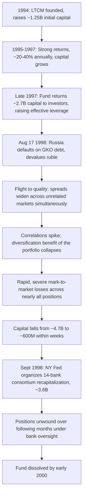

## The Collapse of Long Term Capital Management

### Overview

Long-Term Capital Management (LTCM) was a Greenwich, Connecticut-based hedge fund founded in 1994 by John Meriwether (former head of Salomon Brothers' bond arbitrage desk), with principals including Nobel laureates Myron Scholes and Robert Merton, and a team of highly credentialed traders and academics. LTCM pursued relative-value and convergence arbitrage strategies using very high leverage. Its 1998 near-collapse, following the Russian government's debt default and devaluation, forced a Federal Reserve-organized private-sector recapitalization involving fourteen major banks, and became a landmark case study in leverage risk, model risk, liquidity risk, and systemic financial contagion.

**Key Points**

- LTCM's core strategies relied on convergence trades: identifying pairs of related securities with a pricing anomaly expected to narrow over time
- Extremely high leverage (balance sheet leverage often cited around 25:1, with notional derivatives exposure far larger) magnified small pricing discrepancies into large profits — and later, large losses
- The fund's risk models assumed historical correlations and volatility relationships that broke down during the 1998 crisis
- Near-simultaneous, correlated losses across many "uncorrelated" positions overwhelmed the fund's capital in a matter of weeks

### Fund Strategy and Structure

**Core strategies:**

1. **Fixed income convergence/relative value arbitrage**: exploiting small yield spreads between related bonds expected to converge (e.g., on-the-run versus off-the-run U.S. Treasuries, which are economically similar but trade at different liquidity premiums)
2. **Swap spread trades**: positions exploiting the spread between interest rate swap rates and government bond yields
3. **Equity volatility arbitrage**: selling long-dated equity index options, betting that implied volatility (priced into the options) would exceed subsequently realized volatility
4. **Merger arbitrage and emerging market debt**: additional positions, including sovereign debt exposure (notably Russian GKOs — ruble-denominated government bonds)

**Leverage mechanics:**

Because individual convergence trades offered very small spreads (often just basis points), LTCM used substantial leverage to generate attractive returns on capital.

$$\text{Return on Equity} \approx \text{Leverage} \times \text{Spread Return} - \text{Financing Cost}$$

At its peak, LTCM's balance sheet reportedly held over $125 billion in assets against roughly $4.7 billion of equity capital — on-balance-sheet leverage near 25-to-1 — while its derivatives notional exposure (swaps, options, repos) was reported in the hundreds of billions to over $1 trillion, though notional figures substantially overstate actual economic risk. [Unverified: precise contemporaneous figures vary slightly across sources]

### The Risk Model Assumptions and Their Failure

**Key Points**

- LTCM's risk management relied heavily on historical volatility and correlation estimates, VaR (Value-at-Risk) modeling, and the assumption that convergence trades — even across different markets — had low correlation with one another
- The models implicitly assumed markets would remain liquid enough to exit positions if needed and that historical statistical relationships (correlations, spreads) were stable
- In August-September 1998, a "flight to quality" following Russia's default caused **simultaneous** widening of spreads across nearly all of LTCM's positions — assets that were historically weakly correlated became highly correlated in the crisis, exactly the tail scenario that low-probability VaR models underweighted
- Liquidity itself became a risk factor: LTCM's positions were so large relative to market depth in several instruments that its own attempted unwinding would have moved prices further against it — a dynamic sometimes described as being "too big to exit"

### Timeline of the Crisis

### Why "Uncorrelated" Trades Became Correlated

**Key Points**

- LTCM held many different convergence trades across different markets (U.S. Treasuries, European bonds, mortgage-backed securities, emerging market debt, equity volatility) that were assumed to be largely independent bets
- The August 1998 crisis triggered a broad institutional "flight to liquidity and quality": investors globally simultaneously sold less-liquid, higher-yielding assets and bought the most liquid government securities (particularly on-the-run U.S. Treasuries)
- Because LTCM's convergence trades were structurally short liquidity/short volatility (betting that liquidity premiums and volatility premiums would shrink), a systemic flight to liquidity moved nearly every position against the fund at once
- This illustrates a critical risk management lesson: correlations estimated from "normal" market periods can be a poor guide to tail-event correlations, when a common underlying driver (in this case, a systemic liquidity shock) dominates idiosyncratic factors

### Mathematical Illustration: VaR Underestimation

LTCM's risk models reportedly estimated a very low probability of the magnitude of loss experienced. A simplified illustration of why diversification benefits can evaporate:

$$\sigma_{portfolio}^2 = \sum_i w_i^2\sigma_i^2 + \sum_i\sum_{j\neq i} w_iw_j\sigma_i\sigma_j\rho_{ij}$$

If the historically estimated $\rho_{ij}$ (correlation between positions $i$ and $j$) is low or negative in normal conditions but shifts sharply toward $+1$ during a systemic shock, the actual realized portfolio volatility $\sigma_{portfolio}$ can be dramatically higher than the model's estimate — precisely what occurred as diversification benefits that the model assumed largely disappeared in August-September 1998.

### The Bailout / Recapitalization

**Key Points**

- Because LTCM's counterparties included essentially every major Wall Street bank (as swap counterparties, repo lenders, and prime brokers), regulators became concerned that a disorderly LTCM default could trigger cascading losses and a broader liquidity crisis across the financial system
- The Federal Reserve Bank of New York did not use public funds; instead, it organized and facilitated a meeting of LTCM's major bank counterparties, who agreed to jointly recapitalize the fund with approximately $3.6 billion in exchange for roughly 90% ownership, diluting the original partners
- The consortium included firms such as Goldman Sachs, Merrill Lynch, J.P. Morgan, and other major banks, each contributing a share of the new capital under Fed-facilitated coordination
- This was explicitly a **private-sector bailout facilitated by the central bank**, not a direct government/taxpayer-funded rescue — an important distinction frequently referenced in later systemic risk and "too big to fail" debates
- Positions were unwound in an orderly fashion over the following months, and the fund was formally dissolved by early 2000; the consortium ultimately did not lose money on a net basis, though this outcome was uncertain at the time of the intervention [Unverified: precise net profit/loss figures for consortium members vary by source and accounting treatment]

### Systemic Risk Transmission Channels

**LTCM Crisis Transmission Channels (svg_diagram)**

<svg xmlns="http://www.w3.org/2000/svg" viewBox="0 0 850 420" font-family="Arial, sans-serif" font-size="13">
<text x="425" y="28" text-anchor="middle" font-size="17" font-weight="bold">LTCM Crisis Transmission Channels (svg_diagram)</text>
<rect x="30" y="60" width="200" height="70" rx="8" fill="#f2dede" stroke="#a94442" stroke-width="1.5" />
<text x="130" y="90" text-anchor="middle" font-weight="bold" font-size="12">Russia Default /</text>
<text x="130" y="108" text-anchor="middle" font-size="12">Ruble Devaluation</text>
<rect x="320" y="60" width="220" height="70" rx="8" fill="#fff2cc" stroke="#b38b00" stroke-width="1.5" />
<text x="430" y="90" text-anchor="middle" font-weight="bold" font-size="12">Global Flight to</text>
<text x="430" y="108" text-anchor="middle" font-size="12">Liquidity/Quality</text>
<rect x="630" y="60" width="190" height="70" rx="8" fill="#dbe9ff" stroke="#2b5faa" stroke-width="1.5" />
<text x="725" y="90" text-anchor="middle" font-weight="bold" font-size="12">Spreads Widen</text>
<text x="725" y="108" text-anchor="middle" font-size="12">Across Markets</text>
<rect x="320" y="190" width="220" height="70" rx="8" fill="#f2dede" stroke="#a94442" stroke-width="1.5" />
<text x="430" y="220" text-anchor="middle" font-weight="bold" font-size="12">LTCM Losses Across</text>
<text x="430" y="238" text-anchor="middle" font-size="12">"Diversified" Positions</text>
<rect x="30" y="320" width="240" height="70" rx="8" fill="#e2f0d9" stroke="#4a7a2b" stroke-width="1.5" />
<text x="150" y="350" text-anchor="middle" font-weight="bold" font-size="12">Counterparty Exposure</text>
<text x="150" y="368" text-anchor="middle" font-size="12">Across Major Banks</text>
<rect x="330" y="320" width="220" height="70" rx="8" fill="#fff2cc" stroke="#b38b00" stroke-width="1.5" />
<text x="440" y="350" text-anchor="middle" font-weight="bold" font-size="12">Feared Disorderly</text>
<text x="440" y="368" text-anchor="middle" font-size="12">Unwind / Fire Sale</text>
<rect x="600" y="320" width="220" height="70" rx="8" fill="#dbe9ff" stroke="#2b5faa" stroke-width="1.5" />
<text x="710" y="350" text-anchor="middle" font-weight="bold" font-size="12">NY Fed-Facilitated</text>
<text x="710" y="368" text-anchor="middle" font-size="12">Bank Consortium Rescue</text>
<line x1="230" y1="95" x2="318" y2="95" stroke="#444" stroke-width="2" marker-end="url(#arrow3)" />
<line x1="540" y1="95" x2="628" y2="95" stroke="#444" stroke-width="2" marker-end="url(#arrow3)" />
<line x1="725" y1="130" x2="500" y2="188" stroke="#444" stroke-width="2" marker-end="url(#arrow3)" />
<line x1="430" y1="260" x2="430" y2="318" stroke="none" />
<line x1="380" y1="260" x2="200" y2="318" stroke="#444" stroke-width="2" marker-end="url(#arrow3)" />
<line x1="270" y1="355" x2="328" y2="355" stroke="#444" stroke-width="2" marker-end="url(#arrow3)" />
<line x1="550" y1="355" x2="598" y2="355" stroke="#444" stroke-width="2" marker-end="url(#arrow3)" />
</svg>

### Key Lessons for Risk Management and Derivatives Practice

**Key Points**

- **Model risk and tail correlation**: statistical relationships estimated from historical, "normal-regime" data can break down precisely when they matter most — during systemic stress, correlations across asset classes tend to converge toward 1 (sometimes summarized as "in a crisis, all correlations go to one")
- **Leverage amplification**: even small pricing anomalies can generate attractive returns under leverage, but the same leverage converts modest adverse price moves into capital-threatening losses; leverage does not just scale returns, it fundamentally changes the fund's survival probability under stress
- **Liquidity risk versus market risk**: LTCM's positions were not necessarily "wrong" in a fundamental sense (many spreads it held did eventually converge as expected), but the fund lacked sufficient capital/liquidity to survive the mark-to-market drawdown and margin calls before convergence occurred — a classic illustration of the risk of being right in the long run but insolvent in the short run
- **Position sizing relative to market depth**: LTCM's positions were large enough, relative to the liquidity of the underlying markets, that its own need to unwind became a market-moving event, creating a reflexive loop between its losses and further price deterioration
- **Counterparty concentration and systemic risk**: LTCM's extensive derivatives relationships with nearly every major bank meant its distress posed contagion risk across the financial system, foreshadowing later "too interconnected to fail" concerns raised prominently again in the 2008 financial crisis
- **Opacity and disclosure**: LTCM's counterparties and regulators reportedly had limited visibility into the fund's aggregate leverage and cross-counterparty exposures, complicating both the fund's own risk management and external assessment of systemic risk — a theme later reflected in post-crisis regulatory pushes for greater derivatives transparency (central clearing, trade reporting)

### Regulatory and Industry Aftermath

**Key Points**

- LTCM's collapse contributed to increased scrutiny of hedge fund leverage, though comprehensive hedge fund regulation did not follow immediately in the U.S.
- The episode is frequently cited in later discussions of systemic risk regulation, including debates that informed post-2008 reforms such as the Dodd-Frank Act's provisions on systemically important financial institutions, central clearing of derivatives, and margin requirements for uncleared swaps
- It remains a foundational case study in derivatives risk management curricula for illustrating model risk, leverage risk, liquidity risk, and the limitations of VaR as a sole risk metric, particularly its tendency to understate tail risk under standard historical-simulation or parametric approaches

### Related Topics

- Value-at-Risk (VaR): Methodologies and Limitations
- Convergence and Relative Value Arbitrage Strategies
- Systemic Risk and "Too Interconnected to Fail"
- The 2008 Financial Crisis and Credit Derivatives
- Central Clearing and Margin Requirements for OTC Derivatives (Dodd-Frank, EMIR)
- Liquidity Risk Management in Leveraged Portfolios
- Stress Testing and Scenario Analysis Beyond Historical VaR
- Counterparty Credit Risk and CVA (Credit Valuation Adjustment)