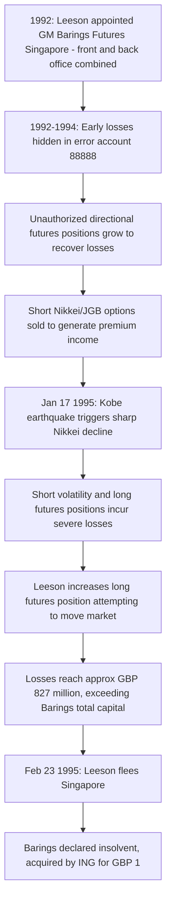

## Barings Bank and Unauthorized Trading Risk

### Overview

Barings Bank, founded in 1762 and one of Britain's oldest merchant banks, collapsed in February 1995 after Nick Leeson, a trader on its Singapore derivatives desk, accumulated unauthorized losses of approximately £827 million (roughly $1.3 billion) through unhedged futures and options positions on the Singapore International Monetary Exchange (SIMEX) and the Osaka Securities Exchange (OSE). The losses exceeded the bank's entire capital base, and Barings was declared insolvent and subsequently sold to ING for a nominal sum (£1). The case remains the canonical example of operational risk arising from a failure to segregate front-office (trading) and back-office (settlement/reconciliation) functions.

**Key Points**

- Leeson simultaneously ran both the trading desk and the settlement/back-office function in Singapore — a fundamental breach of segregation-of-duties controls
- He used a hidden internal "error account" (numbered 88888) to conceal escalating losses from unauthorized proprietary trading disguised as client-driven arbitrage
- Nominally low-risk arbitrage strategies (Nikkei 225 futures arbitrage between SIMEX and OSE) evolved into large, directional, unhedged bets
- The January 1995 Kobe earthquake triggered a sharp Nikkei 225 decline that catastrophically accelerated existing concealed losses
- The collapse illustrates operational risk, internal control failure, and inadequate risk oversight as distinct from market or credit risk

### Organizational Structure and the Core Control Failure

**Key Points**

- Leeson was appointed general manager of Barings Futures Singapore (BFS) in 1992, with responsibility for **both** trading (front office) and settlements/operations (back office) — normally strictly segregated functions in any well-controlled trading operation
- This dual role meant Leeson could execute trades, confirm them, and manage the reconciliation/settlement process for those same trades — eliminating the independent check that back-office reconciliation is designed to provide
- Head office in London reportedly relied on Singapore's own local reporting and gave limited independent scrutiny to the reported profitability of the "riskless arbitrage" desk, despite internal and external auditors flagging concerns about the concentration of authority [Unverified: exact extent and timing of internal warnings versus management response is documented with some variation across post-mortem reports, notably the Bank of England's Board of Banking Supervision inquiry]
- Barings' own risk management and internal audit processes failed to independently verify the size and nature of BFS's open positions against the funding Leeson was requesting from London

### The Trading Strategy: From Arbitrage to Speculation

**Original (legitimate) strategy:**

Switching/arbitrage between Nikkei 225 futures contracts listed on SIMEX (Singapore) and the OSE (Osaka), exploiting small, transient price discrepancies between the two exchanges for client order flow and modest proprietary positions — a genuinely low-risk activity when properly hedged and matched.

**What actually occurred:**

1. Early losses from trading errors (by junior staff) and adverse market moves were hidden in the 88888 account rather than reported to London
2. To recover losses, Leeson took increasingly large, unhedged, **directional** positions in Nikkei 225 futures and options — no longer arbitrage, but outright speculative bets on market direction
3. Leeson also sold large volumes of Nikkei 225 and Japanese Government Bond (JGB) options — particularly short straddles/strangles betting that the Nikkei would trade within a range — generating premium income that was used to offset (and disguise) mounting futures losses
4. Losses were funded by requesting additional margin capital from London, justified as needed for client trades and arbitrage margining, when in fact the funds were covering the 88888 account's mounting deficit

### The Kobe Earthquake and Final Collapse

**Key Points**

- The January 17, 1995 Kobe earthquake caused a sharp, sudden decline in the Nikkei 225 index
- Leeson's short volatility positions (options sold betting on range-bound markets) and his long futures positions (accumulated in an attempt to prop up/support the market and recover prior losses) were both severely damaged by the sharp, high-volatility decline
- In the following weeks, Leeson dramatically increased his long Nikkei futures position, apparently attempting to move the market and recover losses — a classic "doubling down" pattern often seen in concealed-loss scenarios
- By late February 1995, losses in the 88888 account totaled approximately £827 million — more than twice Barings' available capital
- Leeson fled Singapore on February 23, 1995, was later apprehended in Frankfurt, extradited to Singapore, and sentenced to six and a half years in prison for fraud
- Barings Bank was declared insolvent and acquired by the Dutch bank ING for a nominal £1, with ING assuming Barings' liabilities

### Timeline of Escalation

### Control Failure Architecture

**Segregation of Duties Failure Diagram (svg_diagram)**

<svg xmlns="http://www.w3.org/2000/svg" viewBox="0 0 850 420" font-family="Arial, sans-serif" font-size="13">
<text x="425" y="28" text-anchor="middle" font-size="17" font-weight="bold">Segregation of Duties: Intended vs. Actual (svg_diagram)</text>

<text x="220" y="60" text-anchor="middle" font-weight="bold" font-size="14">Intended Control Structure</text>

<rect x="60" y="80" width="150" height="70" rx="8" fill="`#dbe9ff`" stroke="`#2b5faa`" stroke-width="1.5" />

<text x="135" y="110" text-anchor="middle" font-weight="bold" font-size="12">Front Office</text>

<text x="135" y="128" text-anchor="middle" font-size="11">(Trading)</text>

<rect x="270" y="80" width="150" height="70" rx="8" fill="#e2f0d9" stroke="#4a7a2b" stroke-width="1.5" />
<text x="345" y="110" text-anchor="middle" font-weight="bold" font-size="12">Back Office</text>
<text x="345" y="128" text-anchor="middle" font-size="11">(Settlement/Recon)</text>
<line x1="210" y1="115" x2="268" y2="115" stroke="#444" stroke-width="1.5" stroke-dasharray="4,3" />
<text x="240" y="105" text-anchor="middle" font-size="10">Independent Check</text>

<text x="640" y="60" text-anchor="middle" font-weight="bold" font-size="14">Actual Structure at BFS</text>

<rect x="530" y="80" width="220" height="140" rx="8" fill="`#f2dede`" stroke="`#a94442`" stroke-width="2" />

<text x="640" y="115" text-anchor="middle" font-weight="bold" font-size="13">Nick Leeson</text>

<text x="640" y="140" text-anchor="middle" font-size="12">General Manager, BFS</text>

<text x="640" y="165" text-anchor="middle" font-size="12">Controls BOTH:</text>

<text x="640" y="185" text-anchor="middle" font-size="11">Trading Desk</text>

<text x="640" y="203" text-anchor="middle" font-size="11">Settlement/Back Office</text>

<rect x="530" y="260" width="220" height="60" rx="8" fill="#fff2cc" stroke="#b38b00" stroke-width="1.5" />
<text x="640" y="285" text-anchor="middle" font-weight="bold" font-size="12">Account 88888</text>
<text x="640" y="303" text-anchor="middle" font-size="11">Hidden losses, no independent visibility</text>
<line x1="640" y1="220" x2="640" y2="258" stroke="#a94442" stroke-width="2" marker-end="url(#arrow4)" />

<text x="640" y="360" text-anchor="middle" font-size="12" fill="#555">No independent check existed between trade execution and</text>

<text x="640" y="378" text-anchor="middle" font-size="12" fill="#555">confirmation/settlement — losses went unreported to London.</text>

</svg>

### Underlying Risk Concepts Illustrated

**Operational risk versus market risk**

Barings' failure was fundamentally an **operational risk** event — a control and governance failure — rather than a pure market risk event, even though the proximate cause of the final losses was adverse market movement in Nikkei futures and options. The Basel Committee's later formal inclusion of operational risk as a distinct risk category (Basel II, 1999-2004 development) was influenced in part by cases like Barings.

**Short volatility exposure**

Leeson's short straddle/strangle option positions on the Nikkei generated steady premium income under calm, range-bound market conditions but exposed the book to potentially unlimited losses in a sharp directional move — a classic **short gamma/short vega** risk profile.

$$\text{Short Straddle Payoff} = -\max(S_T - K, 0) - \max(K - S_T, 0) + 2C$$

where $S_T$ is the terminal Nikkei level, $K$ the strike, and $C$ the premium received per option leg. This payoff is capped on the upside (limited to premium received) but has substantial, effectively unbounded downside as the underlying moves sharply away from the strike in either direction — precisely what occurred following the Kobe earthquake.

**Concealment via a "plug" account**

The 88888 account functioned as an accounting plug: since Leeson controlled both trade booking and reconciliation, discrepancies between reported and actual P&L could be routed to an account excluded from standard management reporting, allowing losses to compound undetected across roughly three years.

### Key Lessons for Risk Governance

**Key Points**

- **Segregation of duties is non-negotiable**: no individual should control trade execution, confirmation, and settlement/reconciliation for the same book — this is the single most cited structural lesson from Barings
- **Independent risk oversight and reporting lines**: risk management and internal audit functions must report independently of the business unit being monitored, with authority and resources to challenge profitable-looking desks, not only unprofitable ones
- **Funding requests as a red flag**: unusually large or recurring margin funding requests from a supposedly low-risk arbitrage desk should trigger independent investigation into the underlying positions, not simply be met
- **Head office oversight of remote/overseas operations**: geographically or organizationally distant trading units require robust, independent local controls plus genuine (not merely nominal) head-office scrutiny — physical distance should not translate into reduced oversight
- **Position and exposure limits with independent enforcement**: authorized trading limits are only effective if independently monitored and enforced by a party without incentive to conceal breaches
- **"Rogue trader" narratives can obscure institutional failure**: while Leeson's individual conduct was fraudulent, the scale and duration of the losses were enabled by Barings' organizational and control failures — a theme echoed in subsequent unauthorized trading cases (e.g., Société Générale/Jérôme Kerviel in 2008, UBS/Kweku Adoboli in 2011)

### Regulatory and Industry Aftermath

**Key Points**

- The Bank of England's Board of Banking Supervision conducted a formal inquiry into Barings' collapse, publishing findings on the internal control failures
- The case is widely credited with accelerating industry and regulatory focus on operational risk as a distinct risk category, contributing to the eventual inclusion of an explicit operational risk capital charge under Basel II
- It remains a standard case study in derivatives risk management, internal audit, and corporate governance curricula for illustrating how weak internal controls — rather than sophisticated market forces alone — can destroy a centuries-old, well-capitalized institution
- Subsequent unauthorized trading scandals at other major banks (Société Générale 2008, UBS 2011, among others) have been repeatedly analyzed against the Barings template, reinforcing that segregation-of-duties failures remain a recurring, systemic vulnerability across the industry despite decades of post-Barings regulatory attention [Inference: the recurrence suggests structural/cultural risk factors beyond any single firm's specific control design]

### Related Topics

- Operational Risk under Basel II/III Frameworks
- The Collapse of Long Term Capital Management
- Société Générale and the Jérôme Kerviel Trading Loss (2008)
- UBS and the Kweku Adoboli Unauthorized Trading Loss (2011)
- Options Greeks: Gamma and Vega Risk in Short Volatility Strategies
- Internal Audit and Risk Governance Frameworks for Trading Operations
- Futures Arbitrage and Cash-and-Carry Strategies
- Segregation of Duties and Front-Office/Back-Office Control Design